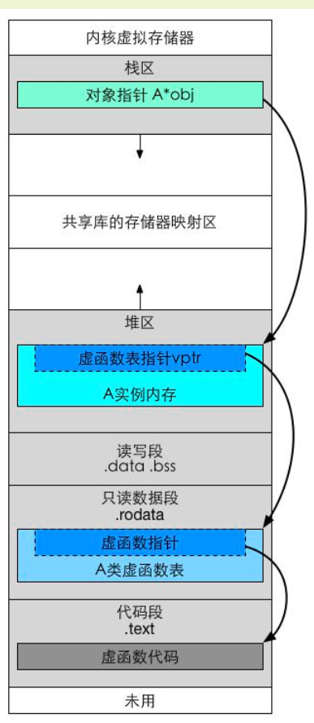
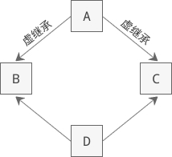
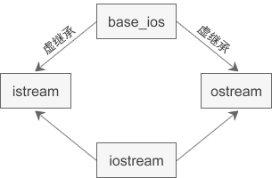
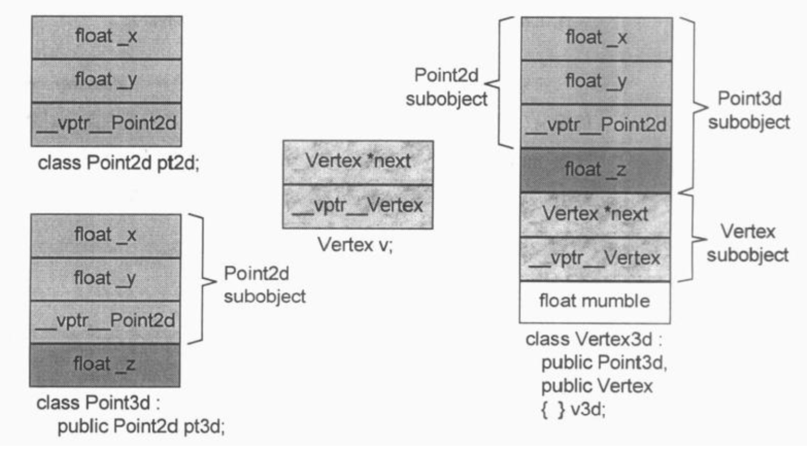
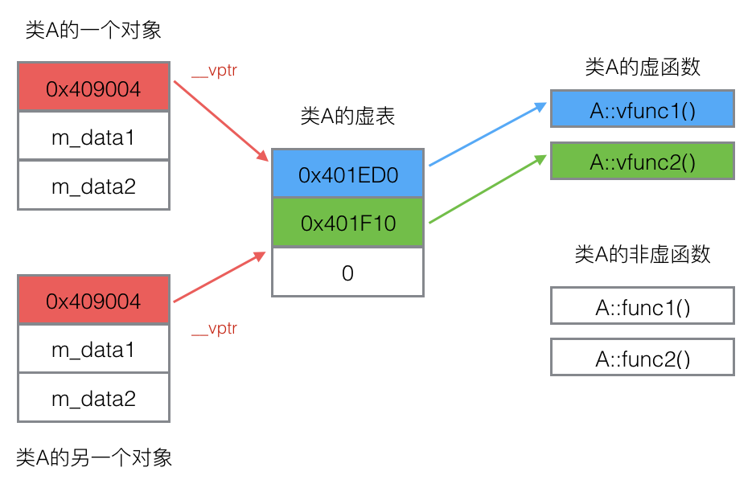
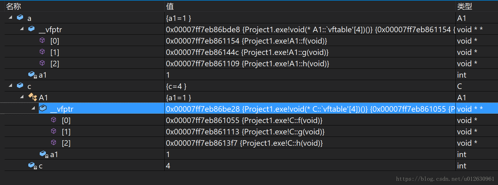

## ✅内存对齐

- 套娃模型：
  - 内存对齐遵循私有大小盒子套娃模型
  - 对齐量就是他的盒子大小
- 对齐量的计算：
  - C 的 _Alignof 和 C++ 的 alignof 可以获得类型的对齐
  - 基本类型的对齐值就是其sizeof值
  - 结构体的对齐值是其成员的最大对齐值
  - 编译器可以设置一个最大对齐值pack，类型的实际对齐值是该类型的对齐值与最大对齐值取最小值得来
  - 复合对齐取基本类型
- 对齐量的修改
  - C++11 alignas(n)说明符可以修改对齐量
  
  - #pragma pack(n)修改最大对齐量
  
    ```c++
    // 将当前的对齐大小入栈,
    // 也可以将指定大小的对齐方式入栈(第二种形式)
    #pragma pack(push)
    #pragma pack(push, n)
    
    // 将栈顶数字出栈, 并将对齐大小设置为该值.
    #pragma pack(pop)
    ```
  
    


- 不同最大对齐量下的例子

#pragma pack(4)


#pragma pack(1)


#pragma pack(2)


## ✅声明和定义

变量声明和定义区别？声明表示哪里想用，定义表示哪里有。

- 声明仅仅是把变量的声明的位置及类型提供给编译器，并不分配内存空间；定义要在定义的地方为其分配存储空间。

- 相同变量可以再多处声明（外部变量extern），但只能在一处定义。


## ✅程序分段


### 可链接格式


- .text 节 编译后的代码部分
- .rodata节： 非立即数的只读数据
  - 如 printf 格式串
  - switch跳转表等
  - const全局常量
  - #define 常量
  - 编译器会去掉重复的字符串常量，程序的每个字符串常量只有一份
  - 有些系统中rodata段是多个进程共享的，目的是为了提高空间利用率。
- .data 节：已初始化全局变量和静态成员变量，存放具体的初始值，需要占磁盘空间。
- .bss 节：未初始化全局变量和局部静态变量，默认初始值为0，.bss节中无需存放初始值，只要说明.bss中的每个变量将来在执行时占用几个字节即可，因此，.bss节实际上不占用磁盘空间，只在节头表中存在
  - 区分初始化和非初始化是为了提高效率
    - 如初始化为0的效率。
    - 空间利用率
  - 通过专门的节头表（Section header table）来说明应该为.bss节预留多大的空间
- .symtab 节：存放函数和全局变量的 （符号表）信息 ，它不包括局部变量
- .rel.text 节：.text节的重定位信息，用于重新修改代码段的指令中的地址信息
- .rel.data 节：.data节的重定位信息，用于对被模块使用或定义的全局变量进行重定位的信息
- .debug 节：调试用符号表
- strtab 节：字符串表，包括.symtab节和.debug节中的符号以及节头表中的节名。字符串表就是以null结尾的字符串序列。
- .line节：在.text节中的机器指令与原始C代码所在的行之间的映射。
- Section header table（节头表）：保存各个节的信息


ELF头：

```C++
#define EI_NIDENT    16
typedef struct elf32_hdr{
  unsigned char    e_ident[EI_NIDENT];  //开始的16个字节
  Elf32_Half    e_type;  //文件类型
  Elf32_Half    e_machine;  //运行的机器类型
  Elf32_Word    e_version;  //版本
  Elf32_Addr    e_entry;  //程序入口地址
  Elf32_Off    e_phoff;  //程序头表在文件中的偏移
  Elf32_Off    e_shoff;  //节头表在文件中的偏移
  Elf32_Word    e_flags;  //标记
  Elf32_Half    e_ehsize;  //elf文件头大小
  Elf32_Half    e_phentsize;  //程序头表项的大小
  Elf32_Half    e_phnum;  //程序头表中表项项的个数
  Elf32_Half    e_shentsize;  //节头表项大小
  Elf32_Half    e_shnum;  //节头表中表项的个数
  Elf32_Half    e_shstrndx;  //节头表的字符串节所在节头表中下标
} Elf32_Ehdr;
```


节头表：

```c++
typedef struct elf32_shdr {
  Elf32_Word    sh_name;  //节的名字，在符号表中的下标
  Elf32_Word    sh_type;  //节的类型，描述符号，代码，数据，重定位等
  Elf32_Word    sh_flags;  //读写执行标记
  Elf32_Addr    sh_addr;  //节在执行时的虚拟地址
  Elf32_Off    sh_offset;  //节在文件中的偏移量
  Elf32_Word    sh_size;  //节的大小
  Elf32_Word    sh_link;  //其它节的索引
  Elf32_Word    sh_info;  //节的其它信息
  Elf32_Word    sh_addralign;  //节对齐
  Elf32_Word    sh_entsize;  //节拥有固定大小项的大小
} Elf32_Shdr;
```


### 可执行格式

1. ELF头中字段e_entry给出执行程序时第一条指令的地址，而在可重定位文件中，此字段为0
2. 多一个程序头表，也称段头表（segment header table） ，是一个结构数组
3. 多一个.init节，用于定义_init函数，该函数用来进行可执行目标文件开始执行时的初始化工作
4. 少两个.rel节（无需重定位）


程序头表/段头表

```
typedef struct elf32_phdr{
  Elf32_Word    p_type;  //段的类型，LOAD，DYNAMIC等
  Elf32_Off    p_offset;  //段在文件中的偏移量
  Elf32_Addr    p_vaddr;  //段的物理地址
  Elf32_Addr    p_paddr;  //段的虚拟地址
  Elf32_Word    p_filesz;  //段在文件中的大小
  Elf32_Word    p_memsz;  //段在内存中的大小
  Elf32_Word    p_flags;  //读写执行标记
  Elf32_Word    p_align;  //段的对齐
} Elf32_Phdr;
```


### 被修饰量的存放位置

1. 全局变量：静态存储区
   1. 只读：必定已经初始化rodata 只读代码段
      1. 如str const
   2. 可写： 读写数据段
      1. 已经初始化.data
      2. 未初始化.bss
2. 局部变量：位于栈段
3. static：成为了物理上的全局变量，静态存储区
4. const
   1. const机制并没有在运行期有任何行为，只是编译期的行为。
   2. 全局：放在.rodata节->只读代码段
   3. 局部：栈段或立即数，意味着可以通过指针修改

## 符号链接


## ✅编译过程


### 预处理

- 展开所有的宏定义。

- 处理条件编译语句，通过是否具有某个宏来决定过滤掉哪些代码。

- 处理#include指令，将被包含的文件插入到该指令所在位置。

- 过滤掉所有注释语句。

- 添加行号和文件名标识。

- 保留所有#pragma编译器指令。

### 编译

main前后运行
	main前运行
		__attribute__((constructor)) void load_file()
{
    printf("Constructor is called.\n");
}
	main后运行
		__attribute__((destructor)) void unload_file()
{
    printf("destructor is called.\n");
}

- 词法分析。

- 语法分析。

- 语义分析。

- 中间语言生成。

- 目标代码生成与优化。

### 链接

> 将所有对符号地址的引用加以修正。

- 链接阶段主要分为两部分：

  - 合并所有“.obj”文件的段并调整段偏移和段长度（按照段的属性合并，属性可以是“可读可写”、“只读”、“可读可执行”，合并后将相同属性的组织在一个页面内，比较节省空间）
  - 符号解析
    - 其中符号解析的意思是：所有.obj符号表中对符号引用的地方都要找到该符号定义的地方。在编译阶段，有数据的地方都是0地址，有函数的额地方都是下一行指令的偏移量-4（由于指针是4字节）；可执行文件以页面对齐
    - 在进行符号解析时要注意只对global符号进行处理，对于local符号不做处理；
  - 符号写会、将符号分配的虚拟地址写回原先未分配正确地址的地方
    - 对于数据符号会存准确地址，对于函数符号，相对于存下一行指令的偏移量（从PC寄存器取地址，并且PC中下一行指令的地址）

- 静态链接

  - 制作方式：

    静态库就是对多个目标文件（.o）文件的打包，通常静态链接的包名为libxxx.a

    既然静态链接是对目标文件的打包，这里介绍些打包命令。

    ```
    gcc -c test1.c    // 生成test1.o
    gcc -c test2.c    // 生成test2.c
    ar cr libtest.a test1.o test2.o
    ```

  - 优缺点：

    - 每个程序中都拷贝一份，非常浪费内存资源
    - 装载速度快

  - 使用方式：

    - 使用静态库时加在最后的名字不是libtest.a，而是l + 静态库名。

      ```gcc -o main main.c -ltest```

- 动态链接

  - 制作

    动态链接在形式上倒是和静态链接非常相似，首先也是需要打包，打包成动态库，不过文件名格式为lib + 动态库名 + .so后缀。不过动态库的打包不需要使用ar命令，gcc就可以完成，但要注意在编译时要加上-fPIC选项，打包时加上-shared选项。

        gcc -fPIC -c test1.c 
        gcc -fPIC -c test2.c
        gcc -shared test1.o test2.o -o libtest.so

    

  - 使用
  
    - 使用动态链接的用法也和静态链接相同。
      - gcc -o main main.c -ltest
      - 仅仅像上面的步骤是没有办法正常使用库的，我们可以通过加-Lpath指定搜索库文件的目录（-L.表示当前目录），默认情况下会到环境变量LD_LIBRARY_PATH指定的目录下搜索库文件，默认情况是/usr/lib，我们可以将库文件拷贝到那个目录下再链接。
  
  - 优缺点
  
    - 节约资源、多次引用到时，内存中节约资源。
    - 局部升级、当库发生变化时，如果接口没变只需要用新的动态库替换掉就可以了
    - 执行效率低

### 加载运行

转linux内核


## ✅宏定义与条件编译

- #define的各种作用

  - 加#define DEBUG用于程序调试。

- #ifdef的作用

  - 条件编译功能if也可实现，但条件编译可以减少被编译语句，从而减少目标程序大小。
  - 可以通过加#define，并通过#ifdef来判断，将某些具体模块包括进要编译的内容。
  - 应对硬件或编译器的不同

  

- 宏定义和函数有何区别？
  
  - 宏在编译时完成替换，之后被替换的文本参与编译，相当于直接插入了代码，运行时不存在函数调用，执行起来更快；函数调用在运行时需要跳转到具体调用函数。
- 宏函数属于在结构中插入代码，没有返回值；函数调用具有返回值。
  
  - 宏函数参数没有类型，不进行类型检查；函数参数具有类型，需要检查类型。
- 宏函数不要在最后加分号。
  
- 粘合变量名

  - \#define XNAME(n)  x ## n 
  - int x1=10; 
  - XNAME(1)+=1;  //x1+=1; 

- 常用预宏定义

  ```
      __FUNTION__  获取当前函数名 
      __LINE__ 获取当前代码行号 
      __FILE__ 获取当前文件名 
      __DATE__ 获取当前日期 
      __TIME__ 获取当前时间
      __STDC_VERSION__
  ```

### 宏定义的坑

宏函数注意事项

- 分号吞噬do{…}while(0)
- 递归引用 只展开一次
- 交叉引用 只展开一次


## ✅C/C++内存管理

### glibc内存管理


#### 相关系统调用

> brk、sbrk、mmap、munmap 

此处简单介绍，详细请见linux内核。

```c++
#include <unistd.h>
int brk(void *addr);			//直接设置堆顶位置
void *sbrk(intptr_t increment);	//推进堆顶
```


#### C分配器

> malloc源码请见glibc的glibc/malloc/malloc.c/_int_malloc
>
> https://blog.csdn.net/Plus_RE/article/details/80211488?utm_source=distribute.pc_relevant.none-task


在性能与内存使用率上TCMalloc是领先很多的。Glibc的Ptmalloc在内存回收方面做得不太好。


在标准C库中，提供了malloc/free函数分配释放内存，这两个函数底层是由brk、mmap、，munmap这些系统调用实现的。


在64位系统中，malloc(0)的有效内存大小为24，32位中为12,准确的说是至少是这么多，并且这些内存是可以用的


**malloc()实现：**

```
/**内存控制块数据结构，用于管理所有的内存块
* is_available: 标志着该块是否可用。1表示可用，0表示不可用
* size: 该块的大小
**/
struct mem_control_block {
    int is_available;
    int size;
};

/**在实现malloc时要用到linux下的全局变量
*managed_memory_start：该指针指向进程的堆底，也就是堆中的第一个内存块
*last_valid_address：该指针指向进程的堆顶，也就是堆中最后一个内存块的末地址
**/
void *managed_memory_start;
void *last_valid_address;

/**malloc()功能是动态的分配一块满足参数要求的内存块
*numbytes：该参数表明要申请多大的内存空间
*返回值：函数执行结束后将返回满足参数要求的内存块首地址，要是没有分配成功则返回NULL
**/
void *malloc(size_t numbytes) {
    //游标，指向当前的内存块
    void *current_location;
    //保存当前内存块的内存控制结构
    struct mem_control_block *current_location_mcb;
    //保存满足条件的内存块的地址用于函数返回
    void *memory_location;
    memory_location = NULL;
    //计算内存块的实际大小，也就是函数参数指定的大小+内存控制块的大小
    numbytes = numbytes + sizeof(struct mem_control_block);
    //利用全局变量得到堆中的第一个内存块的地址
    current_location = managed_memory_start;

    //对堆中的内存块进行遍历，找合适的内存块
    while (current_location != last_valid_address) //检查是否遍历到堆顶了
    {
        //取得当前内存块的内存控制结构
        current_location_mcb = (struct mem_control_block*)current_location;
        //判断该块是否可用
        if (current_location_mcb->is_available)
            //检查该块大小是否满足
            if (current_location_mcb->size >= numbytes)
            {
                //满足的块将其标志为不可用
                current_location_mcb->is_available = 0;
                //得到该块的地址，结束遍历
                memory_location = current_location;
                break;
            }
        //取得下一个内存块
        current_location = current_location + current_location_mcb->size;
    }

    //在堆中已有的内存块中没有找到满足条件的内存块时执行下面的函数
    if (!memory_location)
    {
        //向操作系统申请新的内存块
        if (sbrk(numbytes) == -1)
            return NULL;//申请失败，说明系统没有可用内存
        memory_location = last_valid_address;
        last_valid_address = last_valid_address + numbytes;
        current_location_mcb = (struct mem_control_block)memory_location;
        current_location_mcb->is_available = 0;
        current_location_mcb->size = numbytes;
    }
    //到此已经得到所要的内存块，现在要做的是越过内存控制块返回内存块的首地址
    memory_location = memory_location + sizeof(struct mem_control_block);
    return memory_location;
}
```

**free()实现：**

```
/**free()功能是将参数指向的内存块进行释放
*firstbyte：要释放的内存块首地址
*返回值：空
**/
void free(void *firstbyte)
{
    struct mem_control_block *mcb;
    //取得该块的内存控制块的首地址
    mcb = firstbyte - sizeof(struct mem_control_block);
    //将该块标志设为可用
    mcb->is_available = 1;
    return;
}
```


malloc用于在堆上分配空间, 一般 malloc 实际申请的内存比用户请求的内存要大


对于已经从操作系统取得的内存, malloc 将其组织为一个**空闲链表**(元素不一定是空闲的).

链表元素为一块内存, 内存开始为上一块和下一块内存的地址, 另外是一个标志位, 记录此块内存是否已经被程序使用, 其余就是程序可以使用的空间.


当进程调用 malloc 时, 就在这个链表中搜索可用的内存空间, 第一次遇到可用的并且空间大于申请空间的时就将其分配给进程, 返回对应的地址.


如果分配后还剩余部分空间, 就将其拆分为另一个内存块, 加入到链表中, 并更新原来内存块的记录


当搜索整个链表都没有发现可用块时, 就调用 brk/sbrk 以从操作系统获取内存, 并将其加入到空闲链表中. 或者在空闲链表中合并相邻空闲块.


实际 malloc 的实现可能更加复杂, 例如使用内存池, 位图等.


delete和delete[]区别？

- delete只会调用一次析构函数。

- delete[]会调用数组中每个元素的析构函数。

malloc和new的区别？

1. malloc和free是标准库函数，支持覆盖；
2. new和delete是运算符，支持重载。
3. malloc仅仅分配内存空间，free仅仅回收空间，不具备调用构造函数和析构函数功能，用malloc分配空间存储类的对象存在风险；
4. new和delete除了分配回收功能外，还会调用构造函数和析构函数。
5. malloc和free返回的是void类型指针（必须进行类型转换）
6. new和delete返回的是具体类型指针。


### C++内存管理

#### new和delete的实现

gcc源码中说"虽然纯C没有malloc函数，但我们找不到别的办法实现new。"

看源码：gcc/libstdc++-v3/libsupc++/new_op.cc

```c++
// A freestanding C runtime may not provide "malloc" -- but there is no
// other reasonable way to implement "operator new".
extern "C" void *malloc (std::size_t);
```


obj* o = (obj*)malloc(sizeof(obj));
new (o) obj();


```cpp
	//分配1个A类型空间
	A *pa = (A *)malloc(sizeof(A));
	new(pa)A(1);   //调用构造函数
	pa->~A();      //调用析构函数
	free(pa);
```

这其实是因为编译器用相差的这4个字节用来保存一个东西——**对象个数，即**AA* p = new AA[10] 中的‘10’。这也就不难解释 为什么在delete[] 的时候，不用传给它对象个数。

​                

delete[] 删除时，将new[] **返回的地址再往前移4个字节**便可以拿到要析构的对象个数了。


#### STL内存管理

参见STL部分


## ✅运行顺序与序列点

1. 初始化列表运行顺序
   1. 成员初始化的顺序和它们在类定义中出现的顺序一致，构造函数初始值列表中的前后位置不会影响实际的初始化顺序。

2. <<流运算符顺序
3. 序列点
   1. ; , ? `&&`和`||`序列点
   2. 两个序列点之间的执行顺序是任意的
   3. 也就是`cout<<A++<<A--<<A++;` 是两个序列点之间的语句，执行顺序任意

## ✅基本类型

1. char和double的字节，以及在内存的分布是怎样

   1. 字节长度：VS与GCC测试均如此，int在各个架构均为4字节 

      |    类型     | 32位 | 64位 |
      | :---------: | :--: | :--: |
      |    char     |  1   |  1   |
      |    short    |  2   |  2   |
      |     int     |  4   |  4   |
      |    float    |  4   |  4   |
      |   double    |  8   |  8   |
      | long double |  12  |  16  |
      |    long     |  4   |  4   |
      |  long long  |  8   |  8   |
      |    int*     |  4   |  8   |

      

   1. 数据分布转 `内存对齐`

1. 零值比较？

   1. bool类型：if(flag)
   1. int类型：if(flag == 0)
   1. 指针类型：if(flag == null)
   1. float类型：if((flag >= -0.000001) && (flag <= 0. 000001))


## ✅独立关键词

1.  extern
   
   1. 一个文件内声明外部变量
   
   2. 在任一个文件中定义外部变量，而在另一文件中用extern对Num作“外部变量声明”
   
   3. C++由于支持重载，函数修饰还包含了函数的参数。而C语言不支持重载，函数名只是函数名。因此C++和C语言混合链接时，需要使用`extern "C"`声明，保证能互相调用。
   
   4. 具体包括下面的两种情况：
   
         1. 函数定义在C编译单元中，于C++中引用。
   
               ```c++
               // C++ source code
               extern "C"{
               	int open(const char *pathname, int flags); 
               }
               int main(){
               	int fd = open("test.txt", 0);
               }
               ```
   
            
   
         2. 函数定义在C++编译单元中，于C中引用。
   
            ```c++
            // C++ source code
            extern "C" void handler(int){
              std::cout<<"Callback invoked\n";
            }
            ```
   
   注意，当块中出现类成员声明和类函数声明时，即使声明了 extern "C"，仍然会被作为 extern "C++"。
   
2. volatile

   1. 不进行优化
   2. 每次用到这个变量的值的时候都要去重新读取这个变量的值，而不是读寄存器内的备份。
   3. 多线程中被几个任务共享的变量需要定义为volatile类型。

3. static
   1. 作用是什么？在C和C++中有何区别？
   2. static可以修饰局部变量（静态局部变量）、全局变量（静态全局变量）和函数，被修饰的变量存储位置在静态区。对于静态局部变量，相对于一般局部变量其生命周期长，直到程序运行结束而非函数调用结束，且只在第一次被调用时定义；对于静态全局变量，相对于全局变量其可见范围被缩小，只能在本文件中可见；修饰函数时作用和修饰全局变量相同，都是为了限定访问域。
   3. C++的static除了上述两种用途，还可以修饰类成员（静态成员变量和静态成员函数），静态成员变量和静态成员函数不属于任何一个对象，是所有类实例所共有。
   4. static的数据记忆性可以满足函数在不同调用期的通信，也可以满足同一个类的多个实例间的通信。
   5. 未初始化时，static变量默认值为0。

4. inline
   1. 宏定义和内联函数(inline)区别？
      2. 在使用时，宏只做简单字符串替换（编译前）。而内联函数可以进行参数类型检查（编译时），且具有返回值。
      2. 内联函数本身是函数，强调函数特性，具有重载等功能。
      3. 内联函数可以作为某个类的成员函数，这样可以使用类的保护成员和私有成员。而当一个表达式涉及到类保护成员或私有成员时，宏就不能实现了。
   5. 一般类内声明普通形式 类外定义inline
   6. C++不接受inline请求的情况:
      函数内部包含for,while,或do-while循环结构;
      函数内部包含静态变量.
      函数是递归的
      函数返回类型不是void，并且函数体中不存在return语句。
      函数包含switch或goto语句。
      什么时候使用inline函数
      仅当函数体内包含常量开销O(1)的简单语句才使用inline关键字修饰成员函数

5. C99 (C++不支持 restrict)
   1. 所有修改该指针所指向内存中内容的操作都必须通过该指针来修改, 而不能通过其它途径(其它变量或指针)来修改
   2. 这样做的好处是,能帮助编译器进行更好的优化代码,生成更有效率的汇编代码。
   3. 现在程序员用restrict修饰一个指针，意思就是“只要这个指针活着，我保证这个指针独享这片内存，没有‘别人’可以修改这个指针指向的这片内存，所有修改都得通过这个指针来”。由于这个指针的生命周期是已知的，编译器可以放心大胆地把这片内存中前若干字节用寄存器cache起来。

6. strlen和sizeof区别？sizeof(type or expr), sizeof expression:

   1. sizeof是运算符，并不是函数，结果在编译时得到而非运行中获得；strlen是字符处理的库函数。
   2. sizeof参数可以是任何数据的类型或者数据（sizeof参数不退化）；strlen的参数只能是字符指针且结尾是'\0'的字符串。
   3. **因为sizeof值在编译时确定，所以不能用来得到动态分配（运行时分配）存储空间的大小。**

7. const 在编译时与运行时均有操作。

   1.  全局变量
      1.  如果是充当着一个值替换，那么就不分配内存空间，采用立即数。
      2.  当对这个const全局变量取地址或者使用extern，会分配到.rodata节只读代码段，不可修改。
   2.  局部变量 栈或立即数
      1.  对于基础数据类型，const int a = 10这种，不分配内存
      2.  当对其取地址时，会分配内存
      3.  用一个变量初始化const变量，如果const int a = b,那么也是会给a分配内存。
      4.  对于自定数据类型，比如类对象，会分配栈段。
   3.  c中const默认为外部连接，c++中const默认为内部连接.
      1.  当c语言两个文件中都有const int a的时候，编译器会报重定义的错误。而在c++中，则不会，因为c++中的const默认是内部连接的。
      2.  如果想让c++中的const具有外部连接，必须显示声明为: extern const int a = 10。
   4.  宏定义和const区别？
       1.  宏替换发生在编译阶段之前，属于文本插入替换；const作用发生于编译过程中。
       2.  宏不检查类型；const会检查数据类型。
       3.  宏定义的数据没有分配内存空间，只是插入替换掉；const定义的变量只是值不能改变，但可能分配内存空间。
   5.  修饰指针
       1.  const int a;定义常量类型a。
       2.  int const a;定义常量类型a。
       3.  const int *a; a为指向const int型变量的指针，
       4.  int *const a; const a为指向int型变量的指针，
   6.  修饰成员函数：不能修改对对象的成员 
   7.  修饰函数返回值：返回值只能被赋值给加const修饰的同类型指针。例如：

8. typedef

   1. 宏定义和typedef区别？
      1. 宏主要用于定义常量及书写复杂的内容；typedef主要用于定义类型别名。
      2. 宏替换发生在编译阶段之前，属于文本插入替换；typedef是编译的一部分。
      3. 宏不检查类型；typedef会检查数据类型。
      4. 宏不是语句，不在在最后加分号；typedef是语句，要加分号标识结束。
      5. 注意typedef char * p_char和#define p_char char *区别巨大
         1. **同时定义多个变量的时候有区别**，主要区别在于这种使用方式：
            `String_t a,b;` `String_d c,d;`
            a，b，c 都是char *类型，而d为char类型

9. static的各种用途

   1. 类中声明静态成员，类的所有对象共用此成员
      1. 一般需要在类外初始化, 除了下面几种情况
      2. inline static: 可以在类内初始化
      3. const static: 可以在类内初始化
      4. constexpr static LiteralType: 必须在类内初始化
   2. 函数中声明静态局部变量
      1. 声明静态局部变量.变量在第一次调用该语句时被初始化, 以后经过该语句时不再初始化。
      2. 类似于有定义域的全局变量
      3.  C++11 开始, 这是线程安全的. 如果没有给定初始值, 会进行零初始化或调用默认构造函数。
   3. 文件中声明静态全局变量
      1. 表示该变量只在本文件内可见, 即使其他文件声明了该变量 链接时也无法找到他
   4. 文件中声明静态函数

10. this

       1.  this是传递给成员函数的const参数，只不过是编译器自己添加的
       2.  C++关键字this，C++类的实例方法中能否写delete this，这种情况的使用场景
              1.  可以，只delete this之后所有对象特有的内容（成员变量和虚函数）都不能用了，但是普通函数还是可以使用。状态模式需要使用delete this。
       3.  当对象是常量, 或通过常引用调用函数, 或函数被声明为 const 时, this 指针被隐式声明为 const ClassName * const this。因此不能修改对象成员, 对于前两者, 不能调用对象的非 const 函数。
       4.  this 是一个右值, 因此不能取 this 的地址.

11. constexpr 必须编译阶段初始化

    1. 用于指明函数/表达式/变量的值在编译时就能确定下来.

    2. 用于修饰类的数据成员时, 隐式声明数据成员为 const.

    3. const int a = 20;//编译阶段初始化； 

       std::string s("abcdef"); 

       const auto b = s.length();//length()的返回值 size_type; //运行阶段初始化； 

12. mutable const函数里的变量也可被修改。

13. switch

    1. 使用造表法和二分查表法进行跳转

14. goto

    1. goto不要跳过定义和初始化变量
    2. goto后面如果是局部的变量，可以用花括号括起来构成一个局部域，就安全了。
    3. POD类型可以先声明再定义，但这是无意义的。

## ✅类型转换

静态动态const和重编译四种，这个定义到处都是，这里就不写了

### 隐式类型转换

1. - 一个表达式中同时含有无符号整型和有符号整型时, 有符号整型会被提升到无符号整型,
     此时如果有符号数为负数, 就会带来错误, 因为它提升后的值为原来的值(负数)加上无符号类型的最大值再加一.

     ```
     int i1 = -42;
     unsigned int i2 = 10;
      
     // equal
     cout<<(i1 + i2)<<' '<<(std::numeric_limits<unsigned int>::max() - 42 + 1 + 10)<<endl;
     ```

     

   - 计算表达式中, char, unsigned char, signed char, short, unsigned short 等类型的变量,
     只要其值能出现在 int 中, 都会被转换为 int, 即使表达式中没有 int. 这被称为 *integer promotion*.
     其原因是转换为 int 后往往会带来更高的效率, 体积更小的可执行文件.

     ```
     short` `sval;
     char` `cval;
     sval + cval; ``// sval 和 cval 都会被先转换为 int.
     ```

   - 数组转换成指针: 大多数情况下都会自动转换, 除了:

     - 数组被作为 decltype 的参数,
     - 数组作为取地址符(&), sizeof 和 typeid 等运算符的运算对象. 对数组取地址得到的值等于数组首地址,
       但是类型是 type (*) [n], 即加一之后指向数组后的地址.
     - 用数组初始化一个数组的引用.

     ```
     int` `arr[10];
     decltype(arr) arr2; ``// int [10]
     sizeof` `arr; ``// 40
     auto p = &arr; ``// == &arr[0]
     ++p; ``// point to &arr[10]
     ```

2. 异常安全


### 显示类型转换

> 括号转换是C风格的类型转换，C++的转换要高级一些

1. static_cast	静态类型转换。 可以将子类(引用/指针)转换为父类(引用/指针), 不能向下转换.
2. reinterpreter_cast	重新解释类型转换。
3. dynamic_cast	子类和父类之间的多态类型转换。
   1. 只能用于指针或引用, 会进行**运行时检查**, 转换指针失败时返回 nullptr,
      转换引用失败时抛出 std::bad_cast 异常. 这是他区别于 static_cast 的地方.
4. const_cast	属性转换，用于改变对象的 const/volatile.

C++中的const又玩出了新花样#include <iostream>
using namespace std;

int main(){
    const int n = 100;
    int *p = const_cast<int*>(&n);
    *p = 234;
    cout<<"n = "<<n<<endl;
    cout<<"*p = "<<*p<<endl;

    return 0;

}

## ✅异常处理

1. 异常处理一链三表
   1. 栈回退链：进行溯源
   2. 栈回退表：进行对象析构
   3. try表：进行catch表定位
   4. catch表：寻找相应catch块
2. 步骤：
   1. 编译时
      1. throw关键词被处理为__CxxRTThrowExp函数
      2. 这个函数包含了一个结构体，结构体包含指向throw后面对象的指针
   2. 运行到该“throw”函数时，该函数从栈回退链中找到异常结构体、”异常号“、prev指针；异常结构体找到栈回退表、try表；`try表+异常号` 找到catch表；最终完成抛出>捕获>回退；


## ✅调用约定

1. 写法：定义和声明都要写调用约定

2. 约定作用

   1. 函数参数压栈顺序
   2. 调用者还是被调用者把参数弹出
   3. 函数修饰名(必须为重载函数和一些特殊的函数（如构造函数和析构函数）指定名字装饰)

3. 函数调用的一般过程

   1. 先将调用者（A）的堆栈的基址（ebp）入栈，以保存之前任务的信息。
   2. 然后将调用者（A）的栈顶指针（esp）的值赋给ebp，作为新的基址（即被调用者B的栈底）。
   3. 然后在这个基址（被调用者B的栈底）上开辟（一般用sub指令）相应的空间用作被调用者B的栈空间。
   4. 函数B返回后，从当前栈帧的ebp即恢复为调用者A的栈顶（esp），使栈顶恢复函数B被调用前的位置；然后调用者A再从恢复后的栈顶可弹出之前的ebp值（可以这么做是因为这个值在函数调用前一步被压入堆栈）。这样，ebp和esp就都恢复了调用函数B前的位置，也就是栈恢复函数B调用前的状态。
      

4. 约定种类

   

   |      | __cdecl                                   | __stdcall            | __fastcall                                                   |
   | ---- | ----------------------------------------- | -------------------- | ------------------------------------------------------------ |
   | 英   | C Declaration                             | Standard Call        | fast call                                                    |
   | 场合 | C/C++、MFC的默认方式; 可变参数的时候使用; | Win API              | 要求速度快                                                   |
   | 参传 | 左<-右                                    | 左<-右               | 左边开始两个不大于4字节（DWORD）的参数分别放在ECX和EDX，其余的参左<-右 |
   | 清栈 | 调用者清理                                | 被调用函数清理       | 被调用函数清理                                               |
   | 修饰 | _functionname                             | _functionname@number | @functionname@number                                         |


前四个整型参数将被传入寄存器中。整数值将被传入 RCX、RDX、R8 和 R9 中（按从左至右的顺序）。前四个参数及后面的参


## ✅指针和引用


```c++
int p[10];			//p是数组，含10个int
int* p[10];			//p是数组，含10个int*
int* p=new int[10];	//p是指针，指向int
int (*p)[10];		//p是指针，指向int[10]
```


1. 引用只是别名，不占用具体存储空间，只有声明没有定义；指针时具体变量，需要占用存储空间。
2. 引用在声明时必须初始化为另一变量；指针声明和定义可以分开，可以先只声明指针变量而不初始化，等用到时再指向具体变量。
3. 引用一旦初始化之后就不可以再改变（变量可以被引用为多次，但引用只能作为一个变量引用）；指针变量可以重新指向别的变量。
4. 不存在指向空值的引用，必须有具体实体；但是存在指向空值的指针。空指针相关

- 什么是常引用？

  - 常引用可以理解为常量指针
  - 形式为const typename & refname = varname。
  - 常引用下，原变量的值可以通过原名修改，不会被别名所修改。

- a和&a有什么区别？

      int a[10];
      int (*p)[10] = &a;

  - a是数组名，是数组首元素地址，+1表示地址值加上一个int类型的大小，如果a的值是0x00000001，加1操作后变为0x00000005。*(a + 1) = a[1]。

  - &a是数组的指针，其类型为int (*)[10]（就是前面提到的数组指针），其加1时，系统会认为是数组首地址加上整个数组的偏移（10个int型变量），值为数组a尾元素后一个元素的地址。

  - 若(int *)p ，此时输出 *p时，其值为a[0]的值，因为被转为int *类型，解引用时按照int类型大小来读取。

- 数组名和指针（这里为指向数组首元素的指针）区别？

  - 二者均可参与加减运算。

  - 数组名可视作常指针无自增、自减等操作。

  - 当数组名当做形参传递给调用函数后，就失去了原有特性，退化成一般指针，多了自增、自减操作，但sizeof运算符不能再得到原数组的大小了。

- 野指针(空悬指针)

  - 指向垃圾内存的指针。
- 指针变量未及时初始化 => 定义指针变量及时初始化，要么置空。
  
  - 指针free或delete之后没有及时置空 => 释放操作后立即置空。

## RAII


##  面向对象

### 对象模型



### 构造与析构顺序

1. 构造顺序
   1. 虚基类
   2. 基类
   3. 虚指针
   4. 成员类
   5. 自己
2. 析构顺序
   1. 自己
   2. 成员
   3. 徐指针
   4. 基类
   5. 徐激烈


### 虚继承

- 为了解决菱形继承导致的**二义性问题**, 并节省存储空间.
- 在派生类中只保留一份间接基类的成员。
- 继承方式前面加上 virtual 关键字就是虚继承
-  [Java](http://c.biancheng.net/java/)、[C#](http://c.biancheng.net/csharp/)、[PHP](http://c.biancheng.net/php/) 等，都不支持多继承。



### 虚函数

- 纯虚函数
  - 仍然可以定义, 但是不能在类内定义. 可以在子类对象中通过类名加限定符的方式调用之.
  - 当想要使类成为接口，有没有什么好的纯虚函数，就可以将析构函数指定为纯虚函数，但是必须在类外提供其定义.
- 当父类虚函数不是纯虚函数时, 子类仍然可以将其声明为纯虚函数.
- 不能在抽象类的构造函数和析构函数中调用纯虚函数, 不论该函数是否有定义.
- 即使是抽象类, 当其作为基类时, 子类的构造函数也会调用其构造函数.
- 

- 只能用于非静态成员函数, virtual 关键字只能出现在类内的函数声明/定义中, 不能出现在类外的成员函数定义中.

- 父类函数为 virtual 时, 子类函数如果具有相同的

  - 函数名
  - 参数列表(不包括返回值类型, 但是要求返回值类型要么相同, 要么是 **covariant** 的)
  - const 类型
  - 引用类型

  那么在子类中函数也是虚函数(即使没有声明为 virtual).

  covariant 一般用于: 父类和子类的虚函数返回值类型同时是引用/指针, 分别为 Tb*, Td*(或 Tb&, Td&),
  并且 Tb 是 Td 的基类, 并且后者的 cv 标记符不能多于前者的. 总之, 后者可以隐式转换为前者.

- 尽量将基类析构函数声明为虚函数, 保证对象能被正确析构.

- 父类和子类的虚函数不必具有相同的访问级别.

- 可以用 final 关键字来禁止子类重写 virtual 函数, final 放在函数声明头部的最后.

- 可以用 override 关键字表明重写父类 virtual 函数, 如果声明不满足重写条件, 则会报错.

- 构造函数, 复制构造函数, 静态函数不能是虚函数.

- 在构造函数或析构函数中调用虚函数时, 只会调用在构造函数所属类层次可见的函数,
  即使构造函数所属类是其他类的父类. 因为此时这些子类的构造函数还没有被调用, 也就不存在.

- 当存在多个继承分支时, 如果通过其他分支获取基类(即两个分支都继承了该基类)对象, 并访问虚函数, 行为是 UB.未定义*行为*undefined behavior

- 当虚函数的参数存在默认参数值时, 其值是在编译期决定的, 即由对象的静态类型决定.
  当基类虚函数定义了默认参数值时, 如果通过基类引用/指针访问子类虚函数, 使用的是默认参数值是基类定义的.
  另外, 如果基类虚函数定义了默认参数值, 而子类重写该函数时没有定义默认参数值, 那么通过子类直接调用虚函数就是违法行为.

  ```
  struct` `base
  {
    ``virtual` `void` `f(``int` `a = 1);
    ``virtual` `void` `g(``int` `a = 2);
  };
  struct` `derived: base
  {
    ``void` `f(``int` `a = 11) override;
    ``void` `g(``int` `a) override;
  };
  ```

  ```
  derived d;
  base &b = d;
  b.f(); ``// a = 1;
  b.g(); ``// a = 2;
  d.f(); ``// a = 11;
  d.g(); ``// illegal, need parameter.
  ```

###

1. 虚函数的使用

   1. ```c++
      virtual void display();//虚函数
      virtual void display()=0;//纯虚函数 抽象类
      ```

   2. 基类不需要实现纯虚函数的函数体

   3. 子类必须覆盖并实现纯虚函数的函数体

   4. 拥有纯虚函数的类被称为抽象类（C++接口）

2. 虚函数作用

   1. 使未被修改的基类函数可以调用被修改过的派生类函数
   2. 在使用**指向子类对象的基类指针，并调用子类中的覆盖函数**时，如果该函数不是虚函数，那么将调用基类中的该函数；如果该函数是虚函数，则会调用子类中的该函数。有些函数是需要框架来调用，并且API需要传入基类指针类型的参数。而使用虚函数就可以，将指向子类对象的基类指针来作为参数传入API，让API能够通过基类指针，来调用我们自定义的子类函数。这就是多态性的真正体现。

3. 虚函数的实现原理

   1. 隐藏成员中保存了一个指向函数地址数组的指针，称为虚表指针（vptr），这种数组成为虚函数表（virtual function table, vtbl），即，**每个类使用一个虚函数表，每个类对象用一个虚表指针。**如果派生类重写了基类的虚方法，该派生类的基类的虚函数表将保存重写的虚函数的地址，而不是基类的虚函数地址。
   2. 对象将增加一个存储地址的空间（32位系统为4字节，64位为8字节）。
   3. 每个类编译器都创建一个虚函数地址表
   4.  对每个函数调用都需要增加在表中查找地址的操作。

4. 构造函数和析构函数可以是虚函数吗？

   1. 构造不可以
   2. 析构可以，因为需要析构子类
   3. 
   4. 








- 复合->adapter
  - 构造 先内后外
  - 析构 先外后内
- 继承
- 委托 指针复合
  - 

怎么理解重载与重写

重载：是指同一可访问区内被声明的几个具有不同参数列（参数的类型，个数，顺序不同）的同名函数，根据参数列表确定调用哪个函数，不能重载函数返回类型。

隐藏：是指派生类的函数屏蔽了与其同名的基类函数，注意只要同名函数，不管参数列表是否相同，基类函数都会被隐藏。

重写(覆盖)：是指派生类中存在重新定义的函数。其函数名，参数列表，返回值类型，所有都必须同基类中被重写的函数一致。只有函数体不同（花括号内），派生类调用时会调用派生类的重写函数，不会调用被重写函数。重写的基类中被重写的函数必须有virtual修饰。


怎么认为一个类是线程安全？线程安全的定义是什么？

不变或不可并行访问。


线程安全是编程中的术语，指某个函数、函数库在**并发**环境中被调用时，能够正确地处理**多个线程**之间的**共享变量**，使程序功能正确完成。

2. 


哪些运算符不能重载

- .成员访问运算符
- .\* ->成员指针访问运算符
- ::域运算符
- sizeof长度运算符
- ?:条件运算符
- \# 预处理符号

结构体和类的区别？

- 结构体的默认限定符是public；类是private。
- ~~结构体不可以继承，类可以。~~ C++中结构体也可以继承。


如果父类有一个虚函数叫func_A,子类也实现这个函数，在子类的构造函数当中去调用这个func_A，运行的是谁的实现？ 

- 

- 

- 

  \19. 虚函数指针和构造函数体那个先被构造？ 

  \20. c++运行构造函数的时候虚函数表被构造出来了么？ 

  \21. 在普通的函数当中调用虚函数和在构造函数当中调用虚函数有什么区别？ 

一个类可能会有父类和子类那么这些信息在对象当中是如何排版的呢？ 

new一个对象的时候该对象在内存当中是怎么布局的？ 

 是先构造父类的虚表指针还是先构造父类的成员？ 

  \14. 虚表指针是什么时候设进去的？ 

  \15. 在构造函数当中一部分是初始化列表一部分是在花括弧里面，你能说一下这些的顺序是什么么？差别是什么 和this指针的顺序 

  \16. 初始化列表的写法和顺序有没有什么关系？


 描述一下，子类构造的时候，整个构造的过程，先怎么样，再怎么样，说清楚 

子类在调用构造函数的时候 父类的构造过程 

现在假设有一个程序，编译好的，编译没有错误，但是运行的时候报错，报的错是你正在调用一个纯虚函数，请问这里面导致这个错误的原因可能是什么？ 根据c++内部原理推理这个问题 

  \3. c++语言的多态你是怎么理解的？设计意义？？ 

  \4. 总结概括一下多态是在做什么？？(大佬高屋建瓴的给我总结了一番) 

  \16. 成员变量，虚函数表在哪个位置？ 

多态你是怎么理解的？设计意义？？ 


1. 面向对象三大特性？

   - 封装性：数据和代码捆绑在一起，避免外界干扰和不确定性访问。

   - 继承性：让某种类型对象获得另一个类型对象的属性和方法。

   - 多态性：同一事物表现出不同事物的能力，即向不同对象发送同一消息，不同的对象在接收时会产生不同的行为（重载实现编译时多态，虚函数实现运行时多态）。

2. public/protected/private的区别？

   - public的变量和函数在类的内部外部都可以访问。

   - protected的变量和函数只能在类的内部和其派生类中访问。

   - private修饰的元素只能在类内访问。

3. 对象存储空间？

   - 非静态成员的数据类型大小之和。

   - 编译器加入的额外成员变量（如指向虚函数表的指针）。

   - 为了边缘对齐优化加入的padding。

4. C++空类有哪些成员函数?

   - 首先，空类大小为1字节。

   - 默认函数有：
     - 构造函数

     - 析构函数

     - 拷贝构造函数

     - 赋值运算符

5. 构造函数能否为虚函数，析构函数呢？

   - 析构函数：
     - 析构函数可以为虚函数，并且一般情况下基类析构函数要定义为虚函数。

     - 只有在基类析构函数定义为虚函数时，调用操作符delete销毁指向对象的基类指针时，才能准确调用派生类的析构函数（从该级向上按序调用虚函数），才能准确销毁数据。

     - 析构函数可以是纯虚函数，含有纯虚函数的类是抽象类，此时不能被实例化。但派生类中可以根据自身需求重新改写基类中的纯虚函数。

   - 构造函数：
     - 构造函数不能定义为虚函数。在构造函数中可以调用虚函数，不过此时调用的是正在构造的类中的虚函数，而不是子类的虚函数，因为此时子类尚未构造好。

6. 构造函数调用顺序，析构函数呢？

   - 调用所有虚基类的构造函数，顺序为从左到右，从最深到最浅

   - 基类的构造函数：如果有多个基类，先调用纵向上最上层基类构造函数，如果横向继承了多个类，调用顺序为派生表从左到右顺序。

   - 如果该对象需要虚函数指针(vptr)，则该指针会被设置从而指向对应的虚函数表(vtbl)。

   - 成员类对象的构造函数：如果类的变量中包含其他类（类的组合），需要在调用本类构造函数前先调用成员类对象的构造函数，调用顺序遵照在类中被声明的顺序。

   - 派生类的构造函数。

   - 析构函数与之相反。

7. 拷贝构造函数中深拷贝和浅拷贝区别？

   - 深拷贝时，当被拷贝对象存在动态分配的存储空间时，需要先动态申请一块存储空间，然后逐字节拷贝内容。

   - 浅拷贝仅仅是拷贝指针字面值。

   - 当使用浅拷贝时，如果原来的对象调用析构函数释放掉指针所指向的数据，则会产生空悬指针。因为所指向的内存空间已经被释放了。

8. 拷贝构造函数和赋值运算符重载的区别？

   - 拷贝构造函数是函数，赋值运算符是运算符重载。

   - 拷贝构造函数会生成新的类对象，赋值运算符不能。

   - 拷贝构造函数是直接构造一个新的类对象，所以在初始化对象前不需要检查源对象和新建对象是否相同；赋值运算符需要上述操作并提供两套不同的复制策略，另外赋值运算符中如果原来的对象有内存分配则需要先把内存释放掉。

   - 形参传递是调用拷贝构造函数（调用的被赋值对象的拷贝构造函数），但并不是所有出现"="的地方都是使用赋值运算符，如下：

         Student s;
         Student s1 = s;    // 调用拷贝构造函数
         Student s2;
         s2 = s;    // 赋值运算符操作

   **注：类中有指针变量时要重写析构函数、拷贝构造函数和赋值运算符**

9. 虚函数和纯虚函数区别？

   - 虚函数是为了实现动态编联产生的，目的是通过基类类型的指针指向不同对象时，自动调用相应的、和基类同名的函数（使用同一种调用形式，既能调用派生类又能调用基类的同名函数）。虚函数需要在基类中加上virtual修饰符修饰，因为virtual会被隐式继承，所以子类中相同函数都是虚函数。当一个成员函数被声明为虚函数之后，其派生类中同名函数自动成为虚函数，在派生类中重新定义此函数时要求函数名、返回值类型、参数个数和类型全部与基类函数相同。

   - 纯虚函数只是相当于一个接口名，但含有纯虚函数的类不能够实例化。

10. 覆盖、重载和隐藏的区别？

     - 覆盖是派生类中重新定义的函数，其函数名、参数列表（个数、类型和顺序）、返回值类型和父类完全相同，只有函数体有区别。派生类虽然继承了基类的同名函数，但用派生类对象调用该函数时会根据对象类型调用相应的函数。覆盖只能发生在类的成员函数中。

     - 隐藏是指派生类函数屏蔽了与其同名的函数，这里仅要求基类和派生类函数同名即可。其他状态同覆盖。可以说隐藏比覆盖涵盖的范围更宽泛，毕竟参数不加限定。

     - 重载是具有相同函数名但参数列表不同（个数、类型或顺序）的两个函数（不关心返回值），当调用函数时根据传递的参数列表来确定具体调用哪个函数。重载可以是同一个类的成员函数也可以是类外函数。

11. 在main执行之前执行的代码可能是什么？

    - 全局对象的构造函数。

12. 哪几种情况必须用到初始化成员列表？

    - 初始化一个const成员。

    - 初始化一个reference成员。

    - 调用一个基类的构造函数，而该函数有一组参数。

    - 调用一个数据成员对象的构造函数，而该函数有一组参数。

13. 什么是虚指针？

    - 虚指针或虚函数指针是虚函数的实现细节。

    - 虚指针指向虚表结构。

14. 重载和函数模板的区别？

    - 重载需要多个函数，这些函数彼此之间函数名相同，但参数列表中参数数量和类型不同。在区分各个重载函数时我们并不关心函数体。

    - 模板函数是一个通用函数，函数的类型和形参不直接指定而用虚拟类型来代表。但只适用于参个数相同而类型不同的函数。

15. this指针是什么？

    - this指针是类的指针，指向对象的首地址。

    - this指针只能在成员函数中使用，在全局函数、静态成员函数中都不能用this。

    - this指针只有在成员函数中才有定义，且存储位置会因编译器不同有不同存储位置。

16. 类模板是什么？

    - 用于解决多个功能相同、数据类型不同的类需要重复定义的问题。

    - 在建立类时候使用template及任意类型标识符T，之后在建立类对象时，会指定实际的类型，这样才会是一个实际的对象。

    - 类模板是对一批仅数据成员类型不同的类的抽象，只要为这一批类创建一个类模板，即给出一套程序代码，就可以用来生成具体的类。

17. 构造函数和析构函数调用时机？

    - 全局范围中的对象：构造函数在所有函数调用之前执行，在主函数执行完调用析构函数。

    - 局部自动对象：建立对象时调用构造函数，离开作用域时调用析构函数。

    - 动态分配的对象：建立对象时调用构造函数，调用释放时调用析构函数。

    - 静态局部变量对象：建立时调用一次构造函数，主函数结束时调用析构函数。

- 复制构造函数参数为什么不能是值, 必须是引用? 可以是非const, 那么为什么一般定义成const?

  当参数定义为值类型时, 将参数传递到复制构造函数中需要一次复制, 又会调用复制构造函数,
  这样会导致无限地递归调用. 因此C++规定复制构造函数参数必须是引用.

  定义成const引用有下面几个原因:

  1. 复制一个对象时, 按照语义不应该修改原对象. 即使做一些计数类的操作, 也应该将这些成员声明为mutable.
  2. 当原对象是const类型时, 如果不将参数定义为const, 就无法复制该对象.
  3. 如果不将参数定义为const, 就无法复制一个临时对象. 临时对象是一个右值, 非常量引用无法绑定到右值.

- 用C++实现单例模式

  Lazy Singleton(懒汉模式): 单例实例在第一次使用时才进行初始化, 称为延迟初始化.

  // legal since C++11
  // Init of static local variable is UB in multithread-enviroment before C++11.
  class Singleton
  {
  private:
      Singleton()
      {
          // ...
      }
  public:
      Singleton(const Singleton&) = delete;
      Singleton& operator = (const Singleton&) = delete;
      static Singleton& instance()
      {
          static Singleton instance;
          return instance;
      }
  };

  // 使用
  auto &s = Singletion::instance();

  Eager Singleton(饿汉模式): 在使用实例前就初始化.

  

  ```
  class` `Singleton
  {
  private``:
    ``Singleton()
    ``{
      ``// ...
    ``}
    ``static` `Singleton ins;
  public``:
    ``Singleton(``const` `&Singleton) = ``delete``;
    ``Singleton& operator = (``const` `Singleton&) = ``delete``;
    ``static` `Singleton& instance()
    ``{
      ``return` `ins;
    ``}
  };
  ```

  ```
  Singleton Singleton::ins;
  ```

  ```
  // 使用
  auto &s = Singleton::instance();
  ```

- 构造函数工作的过程

  首先初始化父类(直接父类和虚基类), 再初始化非静态数据成员, 最后执行构造函数的函数体.

  1. 如果当前构造函数是属于实际对象类型的, 就调用虚基类的构造函数.
     当有多个虚基类时, 按照类声明中虚基类的出现顺序从左到右调用构造函数.

  2. 初始化直接基类, 如果有多个, 按照当前类的继承声明, 从左到右的顺序初始化.

  3. 初始化虚表指针(vptr).

  4. 初始化非静态的数据成员, 按照成员在类中的定义顺序初始化.

  5. 执行构造函数的函数体.

     下面几点需要注意:

  6. 当虚基类/直接基类/非静态数据成员的部分或全部没有出现在初始化列表中时, 编译器仍然会按照上面的顺序初始化对象,
     并对那些没有出现在初始化列表中的数据成员采用默认初始化(如果类对象没有默认构造函数, 就会报错).
     (是的, 虚基类和直接基类也可以出现在构造函数初始化列表中)

  7. 对于有虚基类的情况, 即使没有出现菱形继承的情况, 也会先初始化虚基类.

  8. 当有多个虚基类时, 虚基类有时候并不是当前类的直接基类, 这时候顺序判断是: 看当前类的继承列表,
     从左到右检查该类是否有虚基类, 如果有就执行其构造函数(该虚基类也会执行其基类的构造函数, 并且虚基类的基类以后不会再次被构造).
     简而言而, 顺序是从左到右, 深度优先. 如果把当前类看做多叉树的根, 直接父类就是子节点(注意是父类作为子节点),
     子节点按照继承声明顺序从左到右排列. 初始化虚基类的顺序就是中序遍历的过程. 唯一的区别是,
     这里中序遍历的时候, 如果遇到了虚基类, 就不再继续向下遍历, 而是直接调用其构造函数, 由其构造函数负责其他子节点的初始化.

  9. 对虚基类的初始化要求"**当前构造函数是属于实际对象类型的**", 这是因为构造时会调用其他构造函数,
     例如父类的, 成员类对象的. 在调用父类的构造函数过程中, 我们不需要再次调用虚基类的构造函数.
     对于成员对象, 由于和当前类没有继承关系, 也就不存在这个问题, 其构造过程由其自己的构造函数决定.

  10. 注意vptr在初始化完基类之后就被设置. 因此在构造函数中调用虚函数时, 实际调用的是当前对象类型对应的虚函数,
      而不一定是我们想要的实际类型对应的虚函数. 因为C++根据vptr决定虚函数的调用. 析构函数中同样如此.

  11. 由于vptr在构造数据成员之前被初始化, 因此初始化列表中可以使用虚函数.

- 析构函数工作的过程

  和构造函数的执行顺序正好相反, 不过没有处理vptr的步骤.

  1. 执行析构函数函数体
  2. 对非静态数据成员调用析构函数
  3. 对直接父类调用析构函数
  4. 对虚基类调用析构函数

- 为什么不能根据返回值类型进行函数重载?

  因为在调用函数时无法显式地提供函数返回值类型, 这就导致编译器不能进行重载决议. 即使有时候会将函数返回值赋予某些变量,
  但是有时候程序员也不会保存函数的返回值, 仅仅是直接调用函数.

### 三种继承方式

继承方式的作用不是限制父类成员在子类中的访问权限(这是由父类中的成员权限声明决定的), 而是规定了外部对象通过子类访问父类成员时的权限.
在子类中, 可以访问父类的 public 成员和 protected 成员. 父类成员继承到子类后的权限为:

- public 继承: 保持不变.
- protected 继承: 父类的 public 成员在子类中变为 protected, 其余不变.
- private 继承: 全部变为 private, 通过子类对象, 不能访问父类的任一成员.

### 数据成员

- 在类中给定数据成员的初始值时, 只能使用 = 或 花括号, 不能使用小括号, 因为当括号为空时无法区分是变量初始化还是函数声明.
- 类中的非静态的引用成员, 常量成员, 无默认构造函数的类类型对象: 必须在类中给出初值, 或在构造函数初始化列表中初始化.
- 类中的静态数据成员不能在类内给定初值, 必须在类外定义赋值, **例外是**静态常量或constexpr可以在类内赋值.

### 函数成员

- 类成员函数可以基于 const 重载, 例如:

  ```
  class` `A
  {
  public``:
    ``void` `f() ``const` `{}
    ``void` `f() {}
  }
  ```

- 重载与作用域

  > 名字查找发生在类型检查之前.

  在局部作用域定义的函数/变量会隐藏定义在外部的同名函数, 注意函数的多个重载类型都会被隐藏.

- 一般情况下, 函数和函数指针可以混用, 但是当函数返回一个函数指针时, 不能替换成返回一个函数.
  decltype(func) 得到的是函数类型, 不是函数指针类型.


默认初始化**

析构函数一定是虚函数吗？什么情况下是虚函数？不是虚函数会发生什么问题？

假如父类派生一个子类，子类只增加了一个int成员变量，父类的析构函数不是虚函数，父类的指针指向了子类的对象，析构时那么会不会发生内存泄漏？

1. 问虚函数调用是怎么实现的。动态绑定发生时是怎么调用到子类的函数。多继承的子类有几个虚函数表。虚函数这个部分我看了应该不下十遍了。学C++应该都会仔细看过这个部分我就不详细说了。
2. 怎么理解多态？我说多态就是通过实现继承让程序可以在运行时决定被调用的方法是哪一个。虽然这个问题我上次面另外一家也被问过，但我还是没有准备这个答案，所以实际说得比较乱。不过还好听对面的语气他好像也还算满意，意思是表达出来了。他说你就举个例子吧。我就举例子说比如有个职员类，它有个发工资方法，现在再实现它的两个子类经理类和普通员工类，它们各自有不同的发工资方法。然后在程序执行时就可以用一个职员类的指针指向经理类或者普通员工类对象，然后用这个父类指针调用发工资就会触发动态绑定，调用到指向对象自己的方法。（虽然回答重点是突出多态的思想就行，但是事后想想要是举的例子是英雄类，子类是战士和法师，方法是攻击就更完美了。职员发工资太无聊了）
3. 深拷贝与浅拷贝
4. 析构函数可以是虚函数？为什么
5. 类静态变量的初始化
6. 虚函数指针的初始化过程
7. c++多态实现
8. c语言如何实现c++对象以及私有成员
9. 基于对象编程和面向对象编程的区别
10. 对象的生命周期，类的生命周期要清晰
11. 值语义和对象语义，这个决定了你如何写好一个C++类
12. RAII，这个很重要，是C++的核心，很多学习了C++的人都不知道RAII
13. 对象内存布局，然后讲下对象的死亡过程？
14. 构造函数
15. c++虚函数原理
16. C++
17. 析构函数
18. 拷贝构造
19. 抽象方法和类方法的区别，static的抽象方法可以吗？
20. 访问限定符 public、private、protected
21. 深拷贝和浅拷贝
22. 友元函数
23. 继承、虚继承
24. 钻石继承问题
25. 同名覆盖问题
26. 虚函数表
27. 虚指针
28. 虚函数、纯虚函数
29. 接口
30. 多态
31. 重写


### 拷贝构造函数

1. 拷贝控制的三五法则
   1. 移动构造函数
   2. 移动赋值运算符
   3. 拷贝构造函数
   4. 赋值运算符
   5. 析构函数
2. C++中是有规定的，在下面的这些情况下，编译器不会自动创建默认赋值操作符：
   1. 类中包含const或volatile类型的非静态数据成员
     2. 类中包含一个非静态的数据成员，并且其类型是不能赋值的(例如引用)。
     3. 被继承的基类中不能使用赋值操作符(例如基类中包含引用类型的成员)。


## 模板

模板当中对类型操作的思考


# 新标准话题

## C++11

> 关键词：性能、智能、线程安全

### STL的新特性

- **语法糖：**nullptr, auto自动类型推导，范围for循环，初始化列表, lambda表达式等
- **右值引用和移动语义**：移动拷贝构造函数
- **智能指针**：shared  weak unique
- **C++11多线程编程：**thread库及其相配套的同步原语mutex，lock_guard, condition_variable, 以及异步std::furture


### 新关键词

1. auto
2. decltype

auto和decltype是基于模板推导实现的.

decltype decltype 得到变量或表达式的类型, 但是不会计算表达式. 注意:

```
int a, *b = &a, &c = a ;
decltype(a)   d; // int
decltype((a)) e; // int&, 这是一个表达式, 变量被这样使用时, 结果永远是引用.
decltype(*b)  f; // int&, 因为这是一个表达式, 解引用得到的是左值.
decltype(c)   g; // int&，
decltype(a+0) h; // 类型是 int.
```


###  [*右值引用*、移动语义和完美转发](https://www.baidu.com/link?url=TeKU0_X2KOr4TNA7xHsqnZV0VKIbtDUq_Xx0StO-gs7qC1U6SBgflSLfWRTplutk&wd=&eqid=f79cf87600470e2b000000035e50d3e7)

第一个问题就是临时对象非必要的昂贵的拷贝操作

第二个问题是在模板函数中如何按照参数的实际类型进行转发。

通过引入右值引用，很好的解决了这两个问题，改进了程序性能


某些情况下，移动语义是置空指针的浅拷贝。

比如vector\<string\>   它移emplace不需要修改string包含的内存，而push需要修改string包含的的内存

```cpp
std::string s0 = "hello";
std::string str = s0 + " world.";
```

这里，s0 + " world." 这个表达式是个右值，因为它的结果是个临时对象，那么 str 对象的构造函数在 C++11 之前调用的是传统的 Copy Ctor，而在 C++11 中，会优先调用 Move Ctor。


对于基本数据类型，移动并不会节约资源

**引用底层是用const指针实现的，分配额外的内存空间**。 

准确地说

```cpp
int b=0;


```

这种情况等同于

```cpp
int b=0;
int &a=b;
int *const lambda=&b;

//  *lambda == a
```


```c++
#include <iostream>
using namespace std;

class A {
public:
    int x;
    A(int x) : x(x)
    {
        cout << "Constructor" << endl;
    }
    A(A& a) : x(a.x)
    {
        cout << "Copy Constructor" << endl;
    }
    A& operator=(A& a)
    {
        x = a.x;
        cout << "Copy Assignment operator" << endl;
        return *this;
    }
    A(A&& a) : x(a.x)
    {
        cout << "Move Constructor" << endl;
    }
    A& operator=(A&& a)
    {
        x = a.x;
        cout << "Move Assignment operator" << endl;
        return *this;
    }
};

A GetA()
{
    return A(1);
}

A&& MoveA()
{
    return A(1);
}

int main()
{
    cout << "-------------------------1-------------------------" << endl;
    A a(1);  // 调用构造函数
    cout << "-------------------------2-------------------------" << endl;
    A b = a; // 创建新对象b，使用a初始化b，因此调用拷贝构造函数。
    cout << "-------------------------3-------------------------" << endl;
    A c(a); // 创建新对象c，使用a初始化c，因此调用拷贝构造函数。
    cout << "-------------------------4-------------------------" << endl;
    b = a; // 使用a的值更新对象b，因为不需要创建新对象，所以调用拷贝赋值运算符。
    cout << "-------------------------5-------------------------" << endl;
    A d = A(1); //创建新对象d，使用临时对象A(1)初始化d，由于临时对象是一个右值，所以调用移动构造函数。
    cout << "-------------------------6-------------------------" << endl;
    A e = std::move(a); //创建新对象e，使用a的值初始化e，但调用std::move(a)将左值a转化为右值，所以调用移动构造函数。
    cout << "--！！！！！！！-----------7-------------------------" << endl;
    A f = GetA(); // 创建新对象f，使用GetA()函数返回的临时对象初始化f，由于临时对象是右值，所以调用移动构造函数。值得注意的是，这里调用了两次移动构造函数。第一次是GetA()返回前，A(1)移动构造了一个临时对象。第二次是临时对象移动构造f。
    cout << "--！！！！！！！---8-------------------------" << endl;
    A&& g = MoveA(); // 没有创建新对象，也不更新任何对象，只是将MoveA()的返回值绑定到右值引用g。因此不调用构造函数，也不调用赋值运算符。
    cout << "-------------------------9-------------------------" << endl;
    d = A(1); // 使用临时对象A(1)更新d，因为不需要创建新对象，所以调用移动赋值运算符。
    

}
```


### 二、const引用

### Lambda表达式

Lambda的捕获表达式

引用折叠原则

c++11原子变量介绍

移动拷贝？

c++ 的 push_back 还有另一个插入方式是什么？有什么区别

各种STL和C++的一些坑，比如迭代器遍历过程中如何删除元素、std::list的size接口的复杂度居然是O(N)（C++11已经修正）等等

C++11新特性auto的用法

1. 
2. 
3. 

移动语义

智能指针，现代C++编程几乎不太可能出现delete语句，内存泄漏的问题真的很少会出现


- 右值和左值引用成员函数

  可以通过引用限定符来限制成员函数只能用于左值或右值对象, 方法是在成员函数的声明和定义中加上 & 或 && 符号,
  位置与 const 成员函数中 const 的位置相同. 当引用限定符应用于 const 成员函数时, 必须放在 const 之后.
  注意: 如果一个成员函数有引用限定符, 则有相同参数列表的所有版本都必须有引用限定符, 此属性可参与重载.
  不带引用限定符的函数可用于左值和右值.

- 

- **std::move**和**std::forward**的实现

## C++17

### 关键词

1. auto可以推断更多

```
auto x1 = { 1, 2 }; //推断出std::initializer_list<int>类型
auto x2 = { 1, 2.0 }; //错误：类型不统一，无法推断
auto x3{ 1, 2 }; //错误：auto的聚合初始化只能一个元素
auto x4 = { 3 }; //推断出std::initializer_list<int>类型
auto x5{ 3 }; //推断出int类型
```

2. inline可用于变量

```
inline int num = 0;//避免“重定义”错误
```

### 语法

1. 折叠表达式 在可变模板参数解包时支持自定义解包顺序

```
/*支持+ - * / % ^ & | = < > << >> += -= *= /= %= ^= &= |= <<= >>= == != <= >= && || , .* ->**/
 return (arg + ...);
```

2. 结构化绑定 可以像python、matlab那样返回多个参数，需要使用auto关键词

```
/*
 * 例子：多值返回
 */
struct S{
    double num1;
    long num2;
};
 
S foo(){
    double result1 = 1.1;
    long result2 = 1;
    return {result1, result2};//返回结构体S对象
};
 
int main(){
    auto [num1, num2] = foo();//自动推导num1为double，num2为long
    return 0;
}

```

条件分支语句初始化 在switch中可以初始化变量？

3. 聚合初始化 大括号初始化更进一步，可以嵌套大括号进行嵌套初始化

```
struct MyStruct1{
    int a;
    int b;
};
struct MyStruct2{
    int a;
    MyStruct1 ms;
};
int main(){
    MyStruct2 e{{}, {1, 2}};
    return 0;
}
```

4. 嵌套命名空间 简化命名空间的写法

```
//传统写法
namespace A{
    namespace B{
        namespace C{
 
        };
    };
};
//新写法
namespace A::B::C{
 
};
```

5. 模板参数自动推导

```

```

### 属性

1. 返回值未接受警告

```
[[nodiscard]] C func3() { return C(); }

    func3();//warning: ignoring return value

```


## C++20

### 协程


### ranges

```
std::sort(v.begin(), v.end());
>>>
std::sort(v);
```
### modules

```
    import std.vector; // #include <vector>
    import std.string; // #include <string>
    import std.iostream; // #include <iostream>
    import std.iterator; // #include <iterator >
    int main() {
        using namespace std;
        vector<string> v = {
            "Socrates", "Plato", "Descartes", "Kant", "Bacon"
        };
        copy(begin(v), end(v), ostream_iterator<string>(cout, "\n"));
    }
```

### 反射 注意是编译期间反射

```cpp
编译期反射我们能得到什么呢？我们可以得到很多很多关于类型和对象的元信息

```

# 错题精解


牛客网基础题总结。


## <span id = "prog">编程语言(C++)</span>

#### [Q 1](http://www.cnblogs.com/skynet/p/3343726.html) : 

    题目：
        以下代码：
        class ClassA{
        public:
            virtual ~ClassA(){};
            virtual void FunctionA(){};
        };
        class ClassB{
        public:
            virtual void FunctionB(){};
        };
        class ClassC:public ClassA, public ClassB{
            public:
        };
        ClassC Object;
        ClassA* pA = &Object;
        ClassB* pB = &Object;
        ClassC* pC = &Object;
        关于pA,pB,pC的取值,下面的描述中正确的是:
    
    答案:
        pA和pB不相同
    
    解答:
        考察多继承且有虚函数情况下C++存储对象模型。
        1. 多继承按继承顺序组织对象模型，有虚函数时低地址包含指向虚函数表的指针。
        2. 对象Object的存储模型：类A虚函数表指针(ptrA) | 类A数据 | 类B虚函数表指针(ptrB) | 类B数据 | 类C数据。
        3. 子类的虚函数被放到了第一个基类的虚函数表最后（ptrA指向的虚函数表结构：类A虚函数 | 类C虚函数）。
        4. 有虚函数的继承，对象地址为指向虚函数表的指针的地址，即pC = &Object = &ptrA。
        6. pC = pA = &ptrA = &Object，(pC = pA) < pB。

#### [Q 2](http://www.cnblogs.com/qlwy/archive/2011/08/25/2153584.html) :

    题目：
        下列程序的输出结果：
        #include <iostream>
        using namespace std;
        class A{
        public:
            void print(){
                cout << "A:print()";
            }
        };
        class B:private A{
        public:
            void print(){
              cout << "B:print()";
            }
        };
        class C:public B{
        public:
           void print(){
                A::print();
            }
        };
        int main(){
            C b;
            b.print();
        }
    
    答案:
        编译出错
    
    解答:
        考察C++继承问题。
        1. 类B私有继承类A。
        2. 私有继承：类A的公有成员和保护成员都作为类B的私有成员，并且不能被类B的子类（如类C）所访问。

#### [Q 3](http://www.cnblogs.com/motadou/archive/2009/01/17/1558438.html) :

    题目：
        下面两个结构体：
        struct One{
            double d;
            char c;
            int i;
        }
        struct Two{
            char c;
            double d;
            int i;
        }
        在#pragma pack(4)和#pragma pack(8)的情况下，结构体的大小分别是：
    
    答案:
        16，16
        16，24
    
    解答:
        考察结构体对齐。
        1. 4字节对齐：Struct One[8 + (1 + 3(pading)) + 4], struct Two[(1 + 3(pading)) + 8 + 4]。
        2. 8字节对齐：Struct One[8 + (1 + 3(pading) + 4)], struct Two[(1 + 7(pading)) + 8 + (4 + 4(pading))]。
        3. 一句话总结：按序存储，装得下尽量装，装不下换一行。

#### [Q 4](http://blog.csdn.net/dgyanyong/article/details/21268469) :

    题目：
        下列代码的输出为：
        #include "iostream"
        #include "vector"
        using namespace std;
        int main(void)
        {
            vector<int>array;
            array.push_back(100);
            array.push_back(300);
            array.push_back(300);
            array.push_back(500);
            vector<int>::iterator itor;
            for(itor = array.begin(); itor != array.end(); itor++){
                if(*itor == 300){
                    itor = array.erase(itor);
                }
            }
            for(itor = array.begin(); itor != array.end(); itor++){
                cout << *itor << " ";
            }
            return 0;
        }
    
    答案:
        100
        300
        500
    
    解答:
        考察STL中erase和迭代器问题。
        1. erase返回值是一个迭代器，指向删除元素下一个元素。
        2. 删除第一个300时返回指向下一个300的迭代器，在循环体又被再加了一次，跳过了第二个300。

#### Q 5 :

    题目：
        下面程序的输出是什么？
        int main(void)
        {
            int a[5] = {1, 2, 3, 4, 5};
            int *ptr = (int *)(&a + 1);
            printf("%d,%d", *(a + 1), *(ptr - 1));
            return 0;
        }
    
    答案:
        2
        5
    
    解答:
        1. a表示数组首元素的地址，对a的所有操作均是以一个元素为单位的。
        2. &a表示整个数组的地址，对&a的所有操作均是以一个数组为单位的。
        3. ptr类型为int *，所有对ptr的所有操作均是以int大小为单位进行的。
        4. (int *)(&a + 1)表示指向a数组最后一个元素后一个字节的int类型指针，*(ptr - 1)表示向前移动一个int类型的数据的位置。
        5. 所有指针类型操作先看右侧是以什么为单位，之后再转换为左侧定义的单位。

#### Q 6* :

    题目：
        32位机上根据下面的代码，问哪些说法是正确的？
        signed char a = 0xe0;
        unsigned int b = a;
        unsigned char c = a;
    
    答案:
        b的十六进制表示是：0xffffffe0
    
    解答:
        考察有符号数和无符号数之间的转换。
        1. a : 1110 0000。
        2. 扩展问题：
            长 -> 短：低位对齐，按位复制。
            短 -> 长：符号位扩展。
        3. 精度提升：
            两个变量运算，表示范围小的变量精度达的变量提升（signed -> unsigned）。

#### Q 7 :

    题目：
        下列代码的输出为：
        int* pint = 0;
        pint += 6;
        cout << pint << endl;
    
    答案:
        24
    
    解答:
        考察指针运算。
        1. 变量pint为指向int类型的指针，这里“+1”表示地址加4（pint值加4）。
        2. 变量pint初值为0，pint + 6后pint的值变为24。

#### Q 8 :

    题目：
        如果两段内存重叠，用memcpy函数可能会导致行为未定义。而memmove函数能够避免这种问题，下面是一种实现方式，请补充代码。
        #include <iostream>
        using namespace std;
        void* memmove(void* str1, const void* str2, size_t n)
        {
            char* pStr1 = (char*) str1;
            const char* pStr2 = (const char*)str2;
            if( ){
                for(size_t i = 0;i != n; ++i){
                    *(pStr1++) = *(pStr2++);
                }
            }
            else{
                pStr1 += n - 1;
                pStr2 += n - 1;
                for(size_t i = 0; i != n; ++i){
                    *(pStr1--) = *(pStr2--);
                }
            }
            return ( );
        }
    
    答案:
        pStr1 < pStr2
        str1
    
    解答:
        1. 逐字符自动不存在内存覆盖问题。

#### Q 9 :

    题目：
        设x、y、t均为int型变量，则执行语句：t = 3; x = y = 2; t = x++ || ++y; 后，变量t和y的值分别为：
    
    答案:
        t = 1
        y = 2
    
    解答:
        考察逻辑短路和运算符优先级。
        1*. =的优先级最低，t = (x++ || ++y) = 1。
        2. x++和++y为或关系，因为x++的值非0，所以++y不执行，y不变。

#### Q 10 :

    题目：
        指出下面程序哪里可能有问题？
        class CBuffer
        {
            char * m_pBuffer;
            int m_size;
        public:
            CBuffer(){
                m_pBuffer = NULL;
            }
            ~CBuffer(){
                Free();
            }
            void Allocte(int size) (1) {
                m_size = size;
                m_pBuffer = new char[size];
            }
        private:
            void Free(){
                if(m_pBuffer! = NULL) (2){
                    delete[] m_pBuffer;
                    m_pBuffer = NULL;
                }
            }
        public:
            void SaveString(const char* pText) const (3){
                strcpy(m_pBuffer, pText); (4)
            }
            char* GetBuffer() const{
                return m_pBuffer;
            }
        };
        void main (int argc, char* argv[])
        {
            CBuffer buffer1;
            buffer1.SaveString("Microsoft");
            printf(buffer1.GetBuffer());
        }
    
    答案:
        1
        3
        4
    
    解答:
        考察动态分配空间等周边细节处理。
        1. 分配内存时, 未检测m_pBuffer是否为空, 容易造成内存泄露。
        2. 常成员函数不应该对数据成员做出修改, 虽然可以修改指针数据成员指向的数据, 但原则上不应该这么做。
        3*. 字符串拷贝时, 未检测是否有足够空间, 可能造成程序崩溃。

#### [Q 11](http://blog.csdn.net/candyliuxj/article/details/6307814) :

    题目：
        某32位系统下, C++程序，请计算sizeof 的值：
        char str[] = "http://www.xxxxx.com";
        char *p = str;
        int n = 10;
        sizeof(str) = (1);
        sizeof(p) = (2;
        sizeof(n) = (3);
        void Foo(char str[100]){
            sizeof(str) = (4);
        }
        void *p = malloc(100);
        sizeof(p) = (5);
    
    答案:
        21
        4
        4
        4
        4
    
    解答:
        考察sizeof返回值。
        1. 具体类型，返回该类型所占的空间大小。
        2. 对象，返回对象的实际占用空间大小。
        3. 数组，返回编译时分配的数组空间大小（数组名 ≠ 指针）。作为参数时数组退化为指针。
        4. 指针，返回存储该指针所用的空间大小。
        5. 函数，返回函数的返回类型所占的空间大小。函数的返回类型不能是void。
        6. 上题中(2)(4)(5)均为指针。

#### [Q 12*](http://blog.csdn.net/heyabo/article/details/8745942) :

    题目：
        在C++中，
        const int i = 0;
        int *j = (int *) &i;
        *j = 1;
        printf("%d, %d", i, *j);
        输出是多少？
    
    答案:
        0
        1
    
    解答:
        考察C++常量折叠。
        1. const变量放在编译器的符号表中，计算时编译器直接从表中取值，省去了访问内存的时间，从而达到了优化。
        2. 结论，const变量通过取地址方式可以修改该地址存储的数据值，但不能修改常量的值。

#### Q 13 :

    题目：
        下列代码的输出为：
        class parent{
        public:
            virtual void output();
        };
        void parent::output(){
            printf("parent!");
        }
        class son : public parent{
        public:
            virtual void output();
        };
        void son::output(){
            printf("son!");
        }
        son s;
        memset(&s, 0, sizeof(s));
        parent& p = s;
        p.output();
    
    答案:
        没有输出结果，程序运行出错。
    
    解答:
        考察memset和虚函数指针。
        1. 虚函数表地址被清空。

#### Q 14 :

    题目：
        有哪几种情况只能用intialization list而不能用assignment？
    
    答案*:
        当类中含有const成员变量；基类无默认构造函数时，有参的构造函数都需要初始化表；当类中含有reference成员变量。
    
    解答:
        1. 见答案。

#### [Q 15](http://blog.csdn.net/yby4769250/article/details/7294696) :

    题目：
        对以下数据结构中data的处理方式描述正确的是：
        struct Node{
            int size;
            char data[0];
        };
    
    答案:
        编译器会认为这就是一个长度为0的数组,而且会支持对于数组data的越界访问。
    
    解答:
        考察柔性数组。
        1*. 柔性数组，作为占位符放在结构体末尾，使得结构体的大小动态可变，在声明结构体变量的时候可根据需要动态分配内存。
        2. 长度为0的数组并不占用空间，因为数组名本身不占空间，它只是一个偏移量， 数组名这个符号本身代表了一个不可修改的地址常量。
        3. 常用于网络通信中构造不定长数据包，不会浪费空间浪费网络流量。

#### Q 16 :

    题目：
        给定3个int类型的正整数x，y，z，对如下4组表达式判断正确的选项：
        int a1 = x + y - z; int a2 = x - z + y;
        int b1 = x * y / z; int b2 = x / z * y;
        int c1 = x << y >> z; int c2 = x >> z << y ;
        int d1 = x & y | z; int d2 = x | z & y;
    
    答案:
        a1一定等于a2
    
    解答:
        考察对变量运算原理的了解。
        1. 加减操作虽然可能出现溢出，但相同操作数的不同顺序只是中间结果不同，最终结果相同。
        2. int类型做除法可能会造成截断，比如3/2 = 1。
        3. 移位运算可能会丢弃超出的位数。有符号数二进制数1111 1111，先左移2位再右移三位为1111 1111，反之1111 1100。

#### Q 17 : 

    题目：
        若有以下定义和语句：
        char s1[] = "12345", *s2 = "1234";
        printf("%d\n", strlen(strcpy(s1, s2)));
        则输出结果是：
    
    答案:
        4
    
    解答:
        考察strcpy和strlen。
        1. 首先strlen得到的是'\0'之前的字符长度。
        2. strcpy将s2指向的字符串'1234\0'全部拷贝到s1指向位置并覆盖其'12345'部分。

#### Q 18 :

    题目：
        以下函数用法正确的个数是：
        void test1(){
            unsigned char array[MAX_CHAR + 1], i;
            for(i = 0;i <= MAX_CHAR; i++){
                array[i] = i;
            }
        }
    
        char *test2(){
            char p[] = "hello world";
            return p;
        }
        char *p = test2();
    
        void test3(){
            char str[10];
            str++;
            *str = '0';
        }
    
    答案:
        0
    
    解答:
        考察数组名和指针区别。
        1. i的范围有可能超过unsigned char范围。
        2. 这里char p[] = "hello world"是数组，该数组是临时变量，函数结束后不能继续使用。
        3. 如果为char *p = "hello world"，这里p是指针并指向常量区字串，虽然p会被销毁，但字符串仍然在，就不会出问题。
        4. 这里str是数组名，数组名是常量，不可以自增，正确的操作是char *p = str; p++; *p = '0'。

#### Q 19 :

    题目：
        假设在一个32位little endian的机器上运行下面的程序，结果是多少？
        #include <stdio.h>
        int main(){
            long long a = 1, b = 2, c = 3;
            printf("%d %d %d\n", a, b, c);
            return 0;
        }
    
    答案:
        1
        0
        2
    
    解答:
        考察小端法及printf输出控制符。
        1. long long占8字节。
        2. 小端表示，低字节在低位，最低4字节为1，接下来四字节为高位部分的0，再接下来4字节为第二个数低位的2。
        3. printf的控制符相当于分配好待打印容器大小，这里"%d %d %d"就分配了12字节，分别装入三个8字节元素，只装入一半。

#### Q 20 :

    题目：
        请选择下列程序的运行结果:
        #include<iostream>
        using namespace std;
        class B0{
        public:
            virtual void display(){
                cout << "B0::display0" << endl;
            }
        };
        class B1:public B0{
        public:
            void display(){
                cout << "B1::display0" << endl;
            }
        };
        class D1: public B1{
        public:
            void display(){
                cout << "D1::display0" << endl;
            }
        };
        void fun(B0 ptr){
            ptr.display();
        }
        int main(){
            B0 b0;
            B1 b1;
            D1 d1;
            fun(b0);
            fun(b1);
            fun(d1);
        }
    
    答案:
        B0::display0
        B0::display0
        B0::display0
    解答:
        1. 这里传递的是对象本身而非指针，对象被直接转为基类对象，调用基类的函数。
        2. 如果要实现虚函数动态绑定需要将B0 ptr改为B0* ptr，ptr->display()。
        3. 对象的形参传递需要先使用拷贝构造函数（默认）生成B0类型的临时变量，只拷贝基类部分数据（只有指向基类虚函数表的虚函数指针）。

#### Q 21 :

    题目：
        i的初始值为0，i++在两个线程里面分别执行100次，能得到最大值是()，最小值是()。
    
    答案:
        200
        2
    
    解答:
        考察多线程操作同一未上锁变量。
        1. 每次都准确加1，结果为最大，200。
        2. 结果为2时步骤：
            a取内存0到寄存器，b取内存0到寄存器；
            a执行99次并写入内存，内存值为99；
            b执行1次并写入内存，内存值被覆盖为1；
            a取内存1到寄存器，b取内存1到寄存器；
            b执行99次并写入内存，内存值为100；
            a执行1次，写入内存，覆盖之前的100，值为2。
        3. 每次计算过程必须是先从内存取数然后计算，之后再重新写入内存。但对各个线程而言，取数和计算中间可以被另一个线程打断。

#### Q 22 :

    题目：
        char fun(char x, char y){
            if(x)
                return(y);
        }
        int main(){
            int a = '0', b = '1', c = '2';
            printf("%c\n", fun(fun(a, b), fun(b, c)));
        }
    
    答案:
        2
    
    解答:
        1. 均为字符，非布尔值的0，所以每次返回后者。

#### Q 23 :

    题目：
        当一个类A中没有声明任何成员变量与成员函数,这时sizeof(A)的值是多少？
    
    答案:
        1
    
    解答:
        1. 一个空类对象的大小是1byte。这是被编译器安插进去的一个字节，这样就使得这个空类的两个实例得以在内存中配置独一无二的地址。

#### Q 24 :

    题目：
        有以下程序：
        #include<stdio.h>
        #include<stdlib.h>
        void fun(int *pl, int *p2, int *s){
            s = (int*)calloc(1, sizeof(int));
            *s = *pl + *p2;
            free(s);
        }
        int main(){
            int a[2] = {1, 2}, b[2] = {40, 50}, *q = a;
            fun(a, b, q);
            printf("%d\n", *q);
        }
    
    答案:
        1
    
    解答:
        考察形参不改变变量值问题。
        1. p是指针变量，但是是值传递，其值(指向数组a首元素的地址)并没有改变。
        2. 通过解引用*p才是数组a的地址，才能改变数组a的值。

#### [Q 25*](http://www.cnblogs.com/klcf0220/p/6889122.htmls) :

    题目：
        在32位操作系统gcc编译器环境下，下面程序的运行结果为：
        #include <iostream>
        using namespace std;
        class A{
        public:
            int b;
            char c;
            virtual void print(){
                cout << "this is father’s fuction! " << endl;
            }
        };
        class B: A{
        public:
            virtual void print(){
                cout << "this is children’s fuction! " << endl;
            }
        };
        int main(int argc, char * argv[]){
            cout << sizeof(A) << " " << sizeof(B) << endl;
            return 0;
        }
    
    答案:
        12
        12
    
    解答:
        考察结构体对齐及虚继承和虚函数继承的区别。
        1. A的大小包括本身的虚函数指针及定义的变量。
        2. B的大小包括本身的虚函数指针和继承自A的变量b和c。
        3. 如果是虚继承，则B的大小会增加4字节，增加的内容为指向虚继承的指针。

#### Q 26 :

    题目：
        有如下语句序列：
        char str[10]；
        cin >> str；
        当从键盘输入"I love this game"时，str中的字符串是:
    
    答案:
        I
    解答:
        1*. cin遇空格，结束输入。

#### Q 27 :

    题目：
        阅读下面代码，程序会打印出来的值是：
        #include <stdio.h>
        void f(char** p){
            *p += 2;
        }
        int main(){
            char *a[] = {"123", "abc", "456"}, **p;
            p = a;
            f(p);
            printf("%s\r\n", *p);
        }
    
    答案:
        3
    
    解答:
        1. p的类型为char **，(*P)的类型为char *。
        2. p原本指向字符串"123"。
        3. *p是char *类型的，*p + 2表示指向第一个字符串第三个字符。
        4. p是char **类型的，p + 2表示只想第三个字符串，*(p + 2) = "456"。
        5. p的值是*p的地址，虽然p是形参本身值未变，但*p的值在调用函数中被改变。

#### [Q 28](http://www.cnblogs.com/skynet/archive/2010/09/05/1818636.html) :

    题目：
        下列对函数double add(int a, int b)进行重载，正确的是：
    
    答案:
        int add(int a, int b, int c)
        int add(double a, double b)
        double add(double a, double b)
    
    解答:
        考察重载概念。
        1. 在使用重载时只能通过相同的方法名，不同的参数形式实现。
        2. 不同参数形式包括：
            参数类型不同（至少有一个）
            参数个数不同
            *如果同时在类中，对于函数名相同的const函数和非const函数能够构成重载
        3. 编译器区分重载函数是通过“返回类型 + 函数名 + 参数列表”重新改写函数名还区分重载函数的，但返回值类型在C++中并不作为重载标记。

#### Q 29 :

    题目：
        在linux gcc下，关于以下代码，正确的是：
        std::string& test_str(){
            std::string str = "test";
            return str;
        }
        int main(){
            std::string& str_ref = test_str();
            std::cout << str_ref << std::endl;
            return 0;
        }
    
    答案:
        编译警告
        返回局部变量的引用,运行时出现未知错误
        把代码里的&都去掉之后,程序可以正常运行
    
    解答:
        考察调用函数返回值和变量生命周期问题。
        1. 返回值为局部变量时可以正确运行。
        2. 返回值为指针时，看指针指向的变量实体定义的位置，如果是定义在栈上的变量则会出错，指向静态区则不会有问题。
        3. 引用返回的是局部变量本身，而不是复制一份再返回，所以结果难以预料。
        4. 如果去掉&，string类会调用复制构造函数，形同局部变量返回，可以正常运行。

#### Q 30 :

    题目：
        下面有关继承、多态、组合的描述，说法错误的是：
    
    答案:
        继承可以使用现有类的所有功能，并在无需重新编写原来的类的情况下对这些功能进行扩展
        覆盖是指不同的函数使用相同的函数名，但是函数的参数个数或类型不同
    
    解答:
        考察继承、多态概念。
        1. 父类只有非private的部分才能被子类继承访问。
        2. 重载（overload）：函数名相同 、函数参数不同、 必须位于同一个域（类）中。
        3. 覆盖（override）：函数名相同 、函数参数相同、 分别位于派生类和基类中（虚函数）。

#### Q 31 :

    题目：
        分析一下这段程序的输出：
        #include<iostream>
        using namespace std;
        class B{
        public:
            B(){
                cout << "default constructor" << " ";
            }
            ~B(){
                cout << "destructed" << " ";
            }
            B(int i):data(i){
                cout << "constructed by parameter" << data << " ";
            }
        private:
            int data;
        };
        B Play(B b){
            return b;
        }
        int main(int argc, char *argv[]){
            B temp = Play(5);
            return 0;
        }
    
    答案:
        constructed by parameter5
        destructed
        destructed
    
    解答:
        考察赋值运算顺序以及拷贝构造函数。
        1. B temp = Play(5)从右向左执行。
        2. 先将"5"转为形式参数B的类型，之后调用B(int i)打印"constructed by parameter"。
        3. B temp调用B的默认浅拷贝构造函数，完成赋值，由于拷贝构造函数没有输出，所以没有打印东西。
        4. Play()生命周期结束后，b析构打印"destructed"。
        5. main()生命周期结束后，temp析构打印"destructed"。

#### Q 32 :

    题目：
        int i=10, j=10, k=3;
        k*=i+j;
        k最后的值是？
    
    答案:
        60
    
    解答:
        考察运算符优先级。
        1. +优先级高于*=，等价于k = k * (i +j)。

#### Q 33 :

    题目：
        #include命令的功能是：
    
    答案:
        在命令处插入一个文本文件
    
    解答:
        1. "#include"在命令处插入，插入文本过程为预处理过程。

#### Q 34 :

    题目：
        有一个类A，其数据成员如下：
        class A {
        private:
            int a;
        public:
            const int b;
            float* &c;
            static const char* d;
            static double* e;
        };
        则构造函数中，成员变量一定要通过初始化列表来初始化的是：
    
    答案:
        b
        c
    
    解答:
        考察构造函数初始化列表的使用。
        1. 构造函数中，成员变量一定要通过初始化列表来初始化的有以下几种情况：
            const常量成员：因为常量只能在初始化，不能赋值，所以必须放在初始化列表中。
            引用类型：引用必须在定义的时候初始化，并且不能重新赋值，所以也要写在初始化列表中。
            没有默认构造函数的类类型：因为使用初始化列表可以不必调用默认构造函数来初始化，而是直接调用拷贝构造函数。

#### Q 35 :

    题目：
        在一个64位的操作系统中定义如下结构体：
        struct st_task{
            uint16_t id;
            uint32_t value;
            uint64_t timestamp;
        };
        同时定义fool函数如下：
        void fool(){
            st_task task = {};
            uint64_t a = 0x00010001;
            memcpy(&task, &a, sizeof(uint64_t));
            printf("%11u, %11u, %11u", task.id, task.value, task.timestamp);
        }
        上述fool()程序的执行结果为：
    
    答案:
        1
        0
        0
    
    解答:
        考察结构体对齐。
        1. 假设低地址在低位，最低16 bits被赋给低16位的id变量。
        2. 接下来16 bits的0x0001部分被赋值给了pading部分，没有被使用。
        3. value和timestamp均未被赋值。

#### Q 36 :

    题目：
        在32位系统中：
        char arr[] = {4, 3, 9, 9, 2, 0, 1, 5};
        char *str = arr;
        sizeof(arr) = (1);
        sizeof(str) = (2);
        strlen(str) = (3);
    答案:
        8；4；5
    
    解答:
        考察指针和数组名使用sizeof时区别及转义字符。
        1. 数字0对应'\0'。
        2. strlen求字符串长到'\0'前。

#### Q 37 :

    题目：
        下面代码输出什么：
        #include<stdio.h>
        int main( ){
            unsigned int a = 6;
            int b = -20;
            (a + b > 6) ? printf(">6") : printf("<=6");
            return 0;
        }
    
    答案:
        >6
    
    解答:
        考察强制类型转换。
        1. 必须先明确：int与unsigned相加，int -> unsigned int。
        2. int b = -20，首位位"1"，用无符号型表示是非常大的正整数。

#### Q 38 :

    题目：
        对于下面的C语言声明描述正确的一项是:
        char (*p)[16]
    
    答案:
        p是指向长度为16的字符数组的指针
    
    解答:
        考察运算符优先级。
        1. p先和那个运算符结合就是什么。
        2. char *p[16]：p是一个包含16个元素的Char型指针数组，[]优于*，p[]先结合，是数组。
        3. char (*p)[16]：p是一个指针，指向一个包含16个元素的char数组，由于()出现，先和*结合，是指针。

#### [Q 39](http://blog.csdn.net/crystal_avast/article/details/7678704) :

    题目：
        下面程序输出结果是什么：
        #include<iostream>
        using namespace std;
        class A{
        public:
            A(char *s){
                cout << s << endl;
            }
            ~A(){}
        };
        class B:virtual public A{
        public:
            B(char *s1, char*s2):A(s1){
                cout << s2 << endl;
            }
        };
        class C:virtual public A{
        public:
            C(char *s1, char*s2):A(s1){
                cout << s2 << endl;
            }
        };
        class D:public B, public C{
        public:
            D(char *s1, char *s2, char *s3, char *s4):B(s1, s2), C(s1, s3), A(s1){
                cout << s4 << endl;
            }
        };
        int main() {
            D *p = new D("class A", "class B", "class C", "class D");
            delete p;
            return 0;
        }
    
    答案:
        class A
        class B
        class C
        class D
    
    解答:
        考察虚继承的继承顺序。
        1. class B, class C为虚继承。
        2. 虚继承（class 派生类:virtual 继承方式 基类名）：从不同的路径继承过来的同名数据成员在内存中就只有一个拷贝。
        3. 继承顺序：
            执行基类构造函数，多个基类的构造函数按照被继承的顺序构造。
            执行成员对象的构造函数，多个成员对象的构造函数按照声明的顺序构造。
            执行派生类自己的构造函数。
        4. 要执行D构造函数必须先执行参数列表，欲构造B, C必须先构造A，其B, C虚继承A，所以只要执行一次构造函数。

#### Q 40 :

    题目：
        如下程序段：
        char a[] = "xyz", b[] = {'x', 'y', 'z'};
        if(strlen(a) > strlen(b))
            printf("a > b\n");
        else
            printf("a <= b\n");
        则程序输出：
    
    答案:
        a<=b
    
    解答:
        考察对strlen实现的理解。
        1. strlen函数判断字符串长仅仅是通过字符串末的'\0'（字符0）来确定。
        2. 数组b为标识具体'\0'位置，所以使用strlen结果至少大于等于3。

#### Q 41 :

    题目：
        执行以下语句，输出结果为：
        char *p1 = "hello";
        char *p2 = "world";
        char *p3 = "a piece of cake";
        char *str[] = {p1, p2, p3};
        printf("%c", *(str[0] + 1));
    
    答案:
        e
    
    解答:
        考察指针、指针函数及其操作。
        1. str是指针数组，每个元素都是指针。str[0]代表的是char *类型指针p1。
        2. p1是char *类型，只想字符串"hello"，所以这里“+1”代表以字符为单位，结果为'e'。

#### [Q 42](http://www.cnblogs.com/lizhenghn/p/3630405.html) :

    题目：
        以下表达式那些会被编译器禁止：
        int a = 248, b = 4;
        int const c = 21;
        const int *d = &a;
        int *const e = &b;
        int const * const f = &a;
    
    答案:
        *c = 32
        *d = 43
        e = &a
        f = 0x321f
    
    解答:
        考察指针常量、常量指针。
        1. 区分是指针的值不会变还是指针指向的变量值不会变。
        2. 方法：
            如果 const 位于 * 的左侧，则 const 就是用来修饰指针所指向的变量，即指针指向为常量。
            如果 const 位于 * 的右侧， const 就是修饰指针本身，即指针本身是常量。
        3. 方法使用：
            int const c -> 变量c的值不可改变。
            const int *d -> const在*左（离指针远），修饰指向的变量 -> 指针d指向的变量不可变。
            int *const e-> const在*右（例指针近），修饰指针 -> 指针e的值不可变。
            int const * const f -> 有左有右 -> 值和指针均不可变。

#### Q 43 :

    题目：
        以下描述正确的是：
    
    答案:
        虚函数不能是内联函数
        父类的析构函数是非虚的，但是子类的析构函数是虚的，delete子类对象指针会调用父类的析构函数
    
    解答:
        1. 虚函数不能是内联函数（编译时展开，必须有实体），不能是静态函数（属于自身类，不属于对象，而虚函数要求有实体），不能是构造函数（尚未建立虚函数表）。
        2. delete子类对象是一定会调用父类的析构函数的先调用子类的析构函数然后调用父类的析构函数。

#### Q 44 :

    题目：
        class Base{
        public:
            Base(){
                Init();
            }
            virtual void Init(){
                printf("Base Init\n");
            }
            void func(){
                printf("Base func\n");
            }
        };
        class Derived: public Base{
        public:
            virtual void Init(){
                printf("Derived Init\n");
            }
            void func(){
                printf("Derived func\n");
            }
        };
        int main(){
            Derived d;
            ((Base *)&d)->func();
            return 0;
        }
    
    答案：
        Base Init
        Base func
    
    解答：
        考察虚函数。
        1. 类Derived继承自Base，先调用基类构造函数Base()，再调用基类的init()，输出Base Init。
            构造子类对象，基类中不会调用子类的虚函数：
                基类构造函数 -> 子类构造函数
                子类还没有构造，还没有初始化，属于未初始化对象
                基类不会去调用子类虚函数（哪怕子类中确实声明为虚函数）
        2. 虽然 ((Base *)&d)->func()是虚函数调用的样子，但func()跟本没有被定义为虚函数，基类指针访问基类的func()。

#### Q 45 :

    题目：
        采用多路复用I/O监听3个套接字的数据时，如果套接字描述符分别是：5,17,19,则：
        select(int maxfd, struct fd_set* rdset, NULL, NULL)
        中的maxfd应取为：
    
    答案:
        20
    
    解答:
         1. maxfd是三个套接字描述符中最大数字加上1。

#### Q 46 :

    题目：
     
        下面的说法那个正确：
        #define NUMA 10000000
        #define NUMB 1000
        int a[NUMA], b[NUMB];
        void pa(){
            int i, j;
            for(i = 0; i < NUMB; ++i)
                for(j = 0; j < NUMA; ++j)
                    ++a[j];
        }
        void pb(){
            int i, j;
            for(i = 0; i < NUMA; ++i)
                for(j = 0; j < NUMB; ++j)
                    ++b[j];
        }
    
    答案:
        pb比pa快
    
    解答:
        1. 二维数组操作时，因为缓存的原因，外层放小循环，内层放大循环效率高。
        2. 个人觉得这题是因为在给大数组赋值时会发生缺页，而小数组赋值不会，所以pb比较快。

#### Q 47 :

    题目：
        看以下代码：
        class A{
        public:
            ~A();
        };
        A::~A(){
            printf("delete A");
        }
        class B : public A{
        public:
            ~B();
        };
        B::~B(){
            printf("delete B");
        }
    
        请问执行以下代码的输出是：
        A *pa = new B();
        delete pa;
    
    答案:
        delete A
    
    解答:
        考察虚析构函数。
        1. 若B *pb = new B()，则本题会同时输出delete A和delete B。
        2. 但如果delete的是一个指向派生类的基类指针，则需要虚构造函数。
        3. 这里基类没有定义虚析构函数，属未定义行为。

#### Q 48 :

    题目：
        下面程序输出结果为？
        #include<iostream.h>
        #define SUB(X,Y) (X)*Y
        int main(){
            int a = 3, b = 4;
            cout << SUB（a++, ++b);
            return 0;
        }
    
    答案：
        15
    
    解答：
        考察宏定义命令和自加运算。
        1. SUB(3++, ++4) = (3++) * ++4 = 3 * 5 =15
        2. 3++是否有括号并不影响，后置自增变量值在本条语句结束前（分号之前）均不改变。
        3. 前置自增值在本条语句内立即改变且自增优先级高于*。

#### Q 49 :

    题目：
        以下代码输出结果为：
        int main(){
            int a[2][5] = {{1, 2, 3, 4, 5}, {6, 7, 8, 9, 10}};
            int *ptr = (int *)(&a + 1);
            printf("%d\n", *(ptr - 3));
        }
    
    答案：
        8
    
    解答：
        考察指针运算。
        1. 首先需要明确a为二维数组，其类型是int **。
        2. 此时对a进行加1操作，操作的单位的每个一维数组。
        3. &a的单位可以理解为int ***，对其操作单位是整个二维数组。
        4. ptr = (int *)(&a + 1)指向的是二维数组后一个单元。
        5. 进行输出操作时，&a + 1被强制转换为int *类型，按四字节读取。
        6. ptr - 3从数组末尾回退3个int大小，指向数字8。

#### Q 50 :

    题目：
        在一台主流配置的PC机上，调用f(35)所需的时间大概是：
        int f(int x){
            int s = 0;
            while(x-- > 0)
                s += f(x);
            return max(s, 1);
        }
    
    答案：
        几分钟
    
    解答：
        考察递归时间复杂度。
        1.   O(f(n)) = O(f(n - 1)) + O(f(n - 2)) + ... + O(f(0))
           = 2*O(f(n - 2)) + 2*(O(f(n - 3)) + ... + 2*O(f(0))
           = 2^35*O(f(0))

#### Q 51 :

    题目：
        以下代码执行后，val的值是：
        unsigned long val = 0;
        char a = 0x48;
        char b = 0x52;
        val = b << 8 | a;
    
    答案：
        21064
    
    解答：
        考察默认类型转换和移位运算及优先级。
        1. 移位运算>>优先级高于|，val = (b << 8) | a;
        2. 类型转换：
            运算前转换：
                char/short -> int
                float -> double
                这里的b << 8计算时先需要把char转为int（b << 8 = 0x00005200, a = 0x00000048）
            运算中转换：
                int -> long -> unsigned -> double
        3. val = 0x00005248 =  21064

#### Q 52 :

    题目：
        下列说法错误的有：
    
    答案：
        在类方法中可用this来调用本类的类方法。
        在类方法中只能调用本类中的类方法。
        在类方法中绝对不能调用实例方法。
    
    解答：
        1. 成员方法又称为实例方法，静态方法又称为类方法。
        2. 类方法（静态方法）不属于特定的类，没有this指针。
        3. 可以通过类名作用域的方式调用ClassName::fun()。
        4. 类中申请一个类对象或者参数传递一个对象或者指针都可以调用实例方法。

#### Q 53 :

    题目：
        typedef struct{
            char flag[3];
            short value;
        }sampleStruct;
        union{
            char flag[3];
            short value;
        }sampleUnion;
        假设sizeof(char)=1，sizeof(short)=2
        那么sizeof(sampleStruct) = () 
            sizeof(sampleUnion) = ()
    
    答案：
        6
        4
    
    解答：
        考察结构体、联合体大小及对齐问题。
        1. union：sizeof的取值不仅考虑sizeof最大的成员，还要考虑对齐字节。
        2. 注：如果结构体内类型的最大字节小于系统位数对应的字节，那么按类型的最大字节对齐。所以本题结构体按2字节对齐。

#### Q 54 :

    题目：
        以下程序的输出结果为：
        #include "stdio.h"
        int func(int x, int y){
            return (x + y);
        }
        int main(){
            int a = 1, b = 2, c = 3, d = 4, e = 5;
            printf(" %d\n", func((a + b, b + c, c + a), (d, e)));
            return 0;
        }
    
    答案：
        9
    
    解答：
        考察逗号运算符。
        1. 逗号表达式的结果是其最右边表达式的值。
        2. (a + b, b + c, c + a)取最右边的值c + a = 4，(d, e)取最右边的值e = 5。

#### Q 55 :

    题目：
        当参数*x=1, *y=1, *z=1时，下列不可能是函数add的返回值的：
        int add(int *x, int *y, int *z){
            *x += *x;
            *y += *x;
            *z += *y;
            return *z;
        }
    
    答案：
        7
    
    解答：
        1. 此题考虑x, y, z是否可能指向同一个变量。
        2. 可能情况：
            x, y, z指向同一区域：8
            x, y指向同一区域：5
            x, z指向同一区域：5
            y, z指向同一区域：6
            x, y, z指向不同区域：4

#### Q 56 :

    题目：
        以下涉及到内存管理的代码段中，有错误的是：
    
    答案：
        1. int *a = new int(12);
           free(a);
        2. int *ip = static_cast<int*>(malloc(sizeof(int)));
           *ip = 10;
           delete ip;
        3. int *ip = new int(12);
           for(int i = 0; i < 12; ++i)
               ip[i] = i;
           delete []ip;
    
    解答：
        考察动态内存分配与释放。
        1. malloc和free，new和delete配套使用。
        2. int *ip = new int(12)：动态分配一个int类型变量并赋值为12，ip指向这个变量。
        3. int *ip = new int[12]，表示分配大小为12的int类型数组，ip指向这个数组。

#### Q 57 :

    题目：
        关于内联函数正确的是：
    
    答案：
        在所有类说明中内部定义的成员函数都是内联函数
    
    解答：
        考察内联函数。
        1. 见答案。
        2. 使用内联函数的地方会在编译阶段用内联函数体替换掉。

#### Q 58 :

    题目：
        以下函数中，和其他函数不属于一类的是：
    
    答案：
        pwrite
    
    解答：
        考察系统调用和库函数。
        1. 常见文件系统的系统函数：
            fcntl 文件控制
            open 打开文件
            creat 创建新文件
            close 关闭文件描述字
            read 读文件
            write 写文件
            read 从文件读入数据到缓冲数组中
            write 将缓冲数组里的数据写入文件
            pread 对文件随机读
            pwrite 对文件随机写

#### Q 59 :

    题目：
        std::vector::iterator重载了下面哪些运算符：
    
    答案：
        ++
        ==
        *
    
    解答：
        考察迭代器基本概念。
        1. ++和--用于迭代器以后移动。
        2. ==用于判断迭代器是否相等。
        3. *用于对迭代器指向的变量的引用。

#### Q 60 :

    题目：
        请问func(2012,2102)的结果是：
        int fuc(int m,int n){
            if(m%n == 0)
                return n；
            else
                return fuc(n,   m%n)；
        }
    
    答案：
        2
    
    解答：
        考察辗转相除法。
        1. 辗转相除法求两个数的最大公约数。

#### Q 61 :

    题目：
        class Eye{
            public:
            void Look(void);
        };
        现在希望定义一个Head类，也想实现Look的功能，应该使用()方法，实现代码重用。
    
    答案：
        组合
    
    解答：
        考察组合和继承的使用场景。
        1. 继承是细化的继承公共的，被继承的基类是抽象出的公共部分。
        2. 组合就是在定义类时直接在新类中以原有类的对象作为数据成员。
        3. 继承是派生类对基类的扩展和包含，组合是原有类被包含，这里Eye应该被包含在Head内。
        4. 优先使用对象组合，而不是继承。

#### Q 62 :

    题目：
        设m和n都是int类型，那么以下for循环语句：
        for(m = 0, n = -1; n = 0; m++, n++)
            n++;
    
    答案：
        循环体一次也不执行
    
    解答：
        1. 见答案。

#### Q 63 :

    题目：
        #pragma pack(2)
        class BU{
            int number;
            union UBffer{
                char buffer[13];
                int number;
            }ubuf;
            void foo(){}
            typedef char*(*f)(void*);
            enum{hdd,ssd,blueray}disk;
        }bu;
    
    答案：
        22
    
    解答：
        考察结构体、联合体、枚举大小综合题。
        1. pack(2)，所以int num和union大小分别为4和14没有疑问。
        2. 其他部分：
            void foo(){}：0。
            typedef char*(*f)(void*)：0。
            enum{hdd,ssd,blueray}disk：4。
            无虚函数，不存在虚函数指针的4字节。
        3. 枚举类型的sizeof值都是4。

#### Q 64 :

    题目：
        设变量已正确定义，以下不能统计出一行中输入字符个数（不包含回车符）的程序段是：
    
    答案：
        int n = 0;
        for(ch = getchar(); ch != '\n'; n++);
    
    解答：
        1. 对于for循环，其初始条件只执行一次，因此ch只从输入流中取一个字符，之后就再不会取字符，因此会死循环。
        2. int n = 0; while(getchar() != '\n') n++;和int n = 0; while(ch = getchar() != '\n') n++;均可。

#### Q 65 :

    题目：
        假设下面的函数foo会被多线程调用，那么让i、j、k三个变量哪些因为线程间共享访问需要加锁保护:
        int i = 0;
        void foo(){
            static int j = 0;
            int k = 0;
            i++;
            j++;
            k++;
        }
    
    答案：
        i和j
    
    解答：
        考察多线程情况下数据加锁问题。
        1. 多线程调用时要进行保护时，主要是针对全局变量和静态变量（无论局部或全局）的，函数内的局部变量不会受到影响。
        2. i是全局变量，j是静态局部变量。

#### Q 66 :

    题目：
        在C++面向对象编程语言中，以下阐述不正确的是：
    
    答案：
        接口中可以用虚方法
        接口中可以包含已经实现的方法
    
    解答：
        考察C++抽象类。
        1. 接口是一个概念，它在C++中用抽象类来实现。
        2. 抽象类必须是纯虚函数。

#### [Q 67](http://www.cnblogs.com/wangguchangqing/p/6141743.html) :

    题目：
        #include<iostream>
        using namespace std;
        class MyClass{
        public:
            MyClass(int i = 0){
                cout << i;
            }
            MyClass(const MyClass &x){
                cout << 2;
            }
            MyClass &operator=(const MyClass &x){
                cout << 3;
                return *this;
            }
            ~MyClass(){
                cout << 4;
            }
        };
        int main(){
            MyClass obj1(1), obj2(2);
            MyClass obj3 = obj1;
            return 0;
        }
        运行时的输出结果是：
    
    答案：
        122444
    
    解答：
        考察拷贝构造函数和赋值运算符的区别。
        1. 前两个1和2没有疑问，最后三个析构输出4也没有疑问。
        2. C MyClass obj3 = obj1;
            若obj3还不存在，调用拷贝构造函数输出2。
            若obj3存在，obj3 = obj，则调用赋值运算符重载函数。

#### Q 68 :

    题目：
        有以下程序:
        #include < stdio.h >
        int main(){
            char a[5][10] ={"one", "two", "three", "four", "five"};
            int i, j;
            char t;
            for (i = 0; i < 2; i++){
                for(j = i + 1; j < 5; j++ ){
                    if(a[i][0] > a[j][0]){
                        t = a[i][0];
                        a[i][0] = a[j][0];
                        a[j][0] = t;
                    }
                }
            }
            puts(a[1]);
        }
    
    答案：
        fwo
    
    解答：
        1. 对五个字符串首字母进行冒泡排序。

#### Q 69 :

    题目：
        两个等价线程并发的执行下列程序，a为全局变量，初始为0，假设printf、++、--操作都是原子性的，则输出肯定不是哪个：
    
    答案：
        0
        1
    
    解答：
        考察多线程并发结果。

#### Q 70 :

    题目：
        在32位机器上，设有以下说明和定义：
        typedef union{
            long i;
            int k[5];
            char c;
        }DATE;
        struct data{
            int cat;
            DATE cow;
            double dog;
        }too;
        DATE max;
        则sizeof(struct data) + sizeof(max)的执行结果是：
    
    答案：
        52
    
    解答：
        1. 联合体大小为20。
        2. 如果最大的基本元素小于等于机器位宽，按照最大基本元素大小对齐，否则按照机器字长对齐，此处对齐单位为4字节。

#### [Q 71](http://blog.csdn.net/sunxx1986/article/details/6619144) :

    题目：
        若PAT是一个类，则程序运行时，语句“PAT(*ad)[3];”调用PAT的构造函数的次数是：
    
    答案：
        0
    
    解答：
        考察数组指针。
        1. PAT *at[3]表示指针数组，本质是数组，数组元素是指向PAT的指针，数组大小为3。
        2. PAT(*ad)[3]表示数组指针，本质是指针，但该指针指向的是一个数组且数组大小为3。
        3. 同理，int *fun()是指针函数，int (*fun)()是函数指针。
        4. 这里并未构造PAT对象。

#### [Q 72](http://blog.csdn.net/zerocboy/article/details/51638828) :

    题目：
        下面有关volatile说法正确的有：
    
    答案：
        当读取一个变量时，为提高存取速度，编译器优化时有时会先把变量读取到一个寄存器中，以后再取变量值时，就直接从寄存器中取值
        优化器在用到volatile变量时必须每次都小心地重新读取这个变量的值，而不是使用保存在寄存器里的备份
        volatile适用于多线程应用中被几个任务共享的变量
    
    解答：
        考察volatile关键字修饰的变量。
        1. volatile作用是避免编译器优化，它是随时会变的。和const不矛盾，被const修饰的变量只是在当前作用范围无法修改，但是可能被其它程序修改。
        2. const volatile int i = 0; 表示：任何对i的直接修改都是错误的，但是i可能被意外情况修改掉。

#### Q 73 :

    题目：
        C++中32位单精度浮点数能表示的十进制有效数字是多少位：
    
    答案：
        7
    
    解答：
        考察浮点数表示。
        1. float浮点数含有1bit符号位，8bit阶码，23bit位尾数，加上隐藏位的1，实际可直接表示的数在2^24以内。
        2. float可以表示的十进制有效数字7位，double为16位。

#### Q 74 :

    题目：
        下列关于赋值运算符“=”重载的叙述中，正确的是：
    
    答案：
        赋值运算符只能作为类的成员函数重载
    
    解答：
        1. 不能被重载的运算符：
            ::  ,  *  .  ?  :
        2. 必须作为成员函数重载的运算符：
            =  []  ()  ->

#### Q 75 :

    题目：
        函数fun的声明为int fun(int *p[4]),以下哪个变量可以作为fun的合法参数：
    
    答案：
        int **a
    
    解答：
        1. 函数参数为指针数组，数组大小为4。
        2. 

#### Q 76 :

    题目：
        char* getmemory(void){
            char p[] = "hello world";
            return p;
        }
        void test(void){
            char *str = NULL;
            str = getmemory();
            printf(str);
        }
        请问运行Test函数会有什么样的结果
    
    答案：
        输出乱码
    
    解答：
        1. p是数组，是局部变量。
        2. 数组p的生命周期仅存在于getmemory函数中。
        3. 返回的指针指向的数据已经在调用结束后被销毁，输出乱码。
        4. 可以通过编译，只不过结果非预期。

#### [Q 77](http://www.cnblogs.com/always-chang/p/6107437.html) :

    题目：
        关于浅复制和深复制的说法，下列说法正确的是：
    
    答案：
        浅层复制：只复制指向对象的指针，而不复制引用对象本身。
        深层复制：复制引用对象本身。
        如果是深拷贝，修改一个对象不会影响到另外一个对象。
    
    解答：
        考察深拷贝和浅拷贝。
        1. 对象里有指针时，浅拷贝只拷贝指针字面值，并不拷贝指针指向的内容。
        2. 深拷贝会重新分配一块空间，并把被拷贝对象中指向的数据逐一复制过去。
        3. 对象中有指针时，使用深拷贝。
        4. 因为拷贝者和被拷贝里的指针指向同一区域，所以任意一个对数据的修改都会影响到另一个。

#### Q 78 :

    题目：
        STL中的一级容器有：
    
    答案：
        vector, deque, list
    
    解答：
        考察STL容器概念。
        1. STL中一级容器是容器元素本身是基本类型，非组合类型。

#### Q 79 :

    题目：
        程序出错在什么阶段：
        int main(void){
            http://www.taobao.com
            cout << "welcome to taobao" << endl;
        }
    
    答案：
        正常运行
    
    解答：
        这题有毒。
        1. //后面被当做注释了。
        2. http本身是label。

#### Q 80 :

    题目：
        有如下程序段：
        class A{
            int _a;
        public:
            A(int a): _a(a){}
            friend int f1(A &);
            friend int f2(const A &);
            friend int f3(A);
            friend int f4(const A);
        };
    
    答案：
        f1(0)
    
    解答：

#### Q 81 :

    题目：
        下面叙述错误的是：
         char acX[] = "abc";
         char acY[] = {'a', 'b', 'c'};
         char *szX = "abc";
         char *szY = "abc";
    
    答案：
        szX的内容修改后，szY的内容也会被更改
    
    解答：
        考察常量区字符串。
        1. szX和szY的值（指向的位置）相同。
        2. szX和szY指向的"abc"定义在常量区，不可以修改。

#### Q 82 :

    题目：
        以下程序输出结果是：
        class A{
            public:
            virtual void func(int val = 1){
                std::cout << "A->" << val << std::endl;
            }
            virtual void test(){
                func();
            }
        };
        class B : public A{
            public:
                void func(int val = 0){
                    std::cout << "B->" << val << std::endl;
                }
        };
        int main(int argc ,char* argv[]){
            B*p = new B;
            p->test();
            return 0;
        }
    
    答案：
        B->1
    
    解答：
        1. 由于B类中没有覆盖（重写）基类中的虚函数test，指向派生类B的指针p调用继承自基类的函数test。
        2. test函数中继续调用虚函数func，因为虚函数执行动态绑定，p此时的动态类型为B*，因此执行的是B类中的func，输出"B->"。
        3. 缺省参数值是静态绑定，即此时val的值使用的是基类A中的缺省参数值，其值在编译阶段已经绑定，值为1。
        4. 结论：
            virtual函数是动态绑定，而缺省参数值却是静态绑定。
            绝不重新定义继承而来的缺省参数值。

#### Q 82 :

    题目：
        以下程序输出结果是：
        class A{
            public:
            virtual void func(int val = 1){
                std::cout << "A->" << val << std::endl;
            }
            virtual void test(){
                func();
            }
        };
        class B : public A{
            public:
                void func(int val = 0){
                    std::cout << "B->" << val << std::endl;
                }
        };
        int main(int argc ,char* argv[]){
            B*p = new B;
            p->test();
            return 0;
        }
    
    答案：
        B->1
    
    解答：
        1. 由于B类中没有覆盖（重写）基类中的虚函数test，指向派生类B的指针p调用继承自基类的函数test。
        2. test函数中继续调用虚函数func，因为虚函数执行动态绑定，p此时的动态类型为B*，因此执行的是B类中的func，输出"B->"。
        3. 缺省参数值是静态绑定，即此时val的值使用的是基类A中的缺省参数值，其值在编译阶段已经绑定，值为1。
        4. 结论：
            virtual函数是动态绑定，而缺省参数值却是静态绑定。
            绝不重新定义继承而来的缺省参数值。

---

## <span id = "prog">其他</span>

### 数据结构与算法

### 计算机网络

### 操作系统

#### Q 1 :

    题目：
        一次I/O操作的结束，有可能导致：
    
    答案：
        一个进程由睡眠变就绪
    
    解答：
        1. 独占设备：
            进程间互斥的访问这类设备，设备一旦被分配给某个进程，便由该进程独占。I/O操作后自然只有这个进程由等待进入就绪。
        2. 共享设备：
            一段时间内允许多个进程同时访问的设备。对I/O设备的访问是并发，而不是并行。一次I/O操作的结束，只是其对应的进程I/O操作的结束，只会唤醒这一个进程。

#### Q 2 :

    题目：
    
        在多道程序系统中，系统的现有空闲可用资源能否满足后备作业J的资源要求，是选择作业J进入内存的必要条件。
    
    答案：
        错
    
    解答：
        进入内存不一定有全部的资源。

#### Q 3 :

    题目：
        对进程和线程的描述，以下错误的是：
    
    答案：
        父进程里的所有线程共享相同的地址空间，父进程的所有子进程共享相同的地址空间
        改变进程里面主线程的状态会影响其他线程的行为，改变父进程的状态不会影响其他子进程
        多线程会引起死锁，而多进程则不会
    
    解答：
        1. 子进程拥有独立的地址空间。
        2. 多进程也会死锁。

#### Q 4 :

    题目：
        在下列说法中，哪个是错误的：
    
    答案：
        若进程A和进程B在临界段上互斥，那么当进程A处于该临界段时，它不能被进程B中断
        虚拟存储管理中的抖动(thrashing)现象是指页面置换(page replacement)时用于换页的时间远多于执行程序的时间


    解答：
        1. A进程是可以被B进程中断的，只是B不能进入临界区。
        2. 页面抖动现象是由于分配给进程的内存空间过小 + 不合理的置换算法导致的。

#### Q 5 :

    题目：
        关于读写锁的描述，以下正确的是：
    
    答案：
        读写锁在读加锁的状态下，可用进行读共享
    
    解答：
        1. 写加锁状态时，其他进行写操作线程会阻塞。
        2. 写锁就是防止其他进程读或写. 读锁就是防止在读的时候有写进程进入。

#### Q 6 :

    题目：
        采用可重定位分区分配方式：
    
    答案：
        解决了碎片问题
    
    解答：
        1. 通过移动内存中作业的位置，把原来多个分散的小分区拼接成一个大分区的方法称为拼接或紧凑。

#### Q 7 :

    题目：
        若一个用户进程通过read 系统调用读取一个磁盘文件中的数据，则下列关于此过程的叙述中，正确的是：
        Ⅰ. 若该文件的数据不在内存中，则该进程进入睡眠等待状态
        Ⅱ. 请求read系统调用会导致CPU从用户态切换到核心态
        Ⅲ. read系统调用的参数应包含文件的名称
    
    答案：
        Ⅰ & Ⅱ
    
    解答：
        1. 通过移动内存中作业的位置，把原来多个分散的小分区拼接成一个大分区的方法称为拼接或紧凑。
        2. open系统调用应该包含文件的名称，read只是包含输入流。

#### Q 8 :

    题目：
        在Bash中，以下哪些说法是正确的：
    
    答案：
        $?表示前一个命令的返回值
        $#表示参数的数量
    
    解答：
        1. $# 是传给脚本的参数个数
        2. $0 是脚本本身的名字
        3. $1 是传递给该shell脚本的第一个参数
        4. $2 是传递给该shell脚本的第二个参数$@ 是传给脚本的所有参数的列表
        5. $* 是以一个单字符串显示所有向脚本传递的参数，与位置变量不同，参数可超过9个
        6. $$ 是脚本运行的当前进程ID号$? 是显示最后命令的退出状态，0表示没有错误，其他表示有错误

#### Q 9 :

    题目：
        下列关于线程调度的叙述中，错误的是：
    
    答案：
        调用线程的yeild()方法，只会使与当前线程相同优先级的线程获得运行机会
        具有相同优先级的多个线程的调度一定是分时的
    
    解答：
    
        1. yeild()使当前线程进入就绪队列，给相同优先级或者高优先级线程机会。
        2. slssp()方法会给其他任何线程提供运行的机会，不论优先级高低均可以。

#### Q 10 :

    题目：
        在存储管理中，采用覆盖与交换技术的目的是:
    
    答案：
        减少程序占用的主存空间
    
    解答：
        1. 覆盖技术的实现是把程序划分为若干个功能上相对独立的程序段，按照其自身的逻辑结构使那些不会同时运行的程序段共享同一块内存区域。程序段先保存在磁盘上，当有关程序的前一部分执行结束后，把后续程序段调入内存，覆盖前面的程序段。 
        2. 在分时系统中，用户的进程比内存能容纳的数量更多，系统将那些不再运行的进程或某一部分调出内存，暂时放在外存上的一个后备存储区，通常称为交换区，当需要运行这些进程时，再将它们装入内存。

#### Q 11 :

    题目：
        下面有关线程的说法错误的是：
    
    答案：
        每个线程有自己独立的地址空间
        线程包含CPU现场，可以独立执行程序
    
    解答：
        1. 在多线程中，多个线程共享一个进程中的地址空间。
        2. 线程是CPU调度的最小单位，但不能独立执行程序。

#### Q 12 :

    题目：
        关于子进程和父进程的说法，下面哪一个是正确的：
    
    答案：
        一个进程可以没有父进程或子进程
    
    解答：
        1. init进程就没有父进程。

#### Q 13 :

    题目：
        下面关于软连接的描述，正确的是：
    
    答案：
        软链接也叫符号链接
        如果原始文件被删除，所有指向它的软链接也都被破坏
        软链接指明了原始文件的位置，用户需要对原始文件的位置有访问权限才可以使用
    
    解答：
        1. 软链接克服了硬链接的不足，没有任何文件系统的限制，任何用户可以创建指向目录的符号链接。因而现在更为广泛使用，它具有更大的灵活性，甚至可以跨越不同机器、不同网络对文件进行链接。


# 题目

|   Chapter 1   |   Chapter 2   | Chapter 3  |
| :-----------: | :-----------: | :--------: |
| [Tencent](#t) | [NetEase](#n) | [360](360) |

## <span id = "t">Tencent</span>

### 模拟1

Q1 :

​    

Q2 :

    题目：
        下列关于一个类的静态成员的描述中，不正确的是：
        A. 该类的对象共享其静态成员变量的值
        B. 静态成员变量可被该类的所有方法访问
        C. 该类的静态方法能访问该类的静态成员变量
        D. 该类的静态数据成员变量的值不可修改
    
    答案：
        D
    
    解答：
        1. 类的静态成员和对象无关，和类相关，一个类的所有实例共享同一个静态成员。
        2. 静态成员函数不能调用非静态成员。
        3. 非静态成员函数可以调用静态成员。
        4. 静态成员变量必须初始化，且可以修改。

Q3 :

    题目：
        C++将父类的析构函数定义为虚函数，下列正确的是哪个：
        A. 释放父类指针时能正确释放子类对象
        B. 释放子类指针时能正确释放父类对象
        C. 这样做是错误的
        D. 以上全错
    
    答案：
        A
    
    解答：
        1. 基类通常应定义一个虚析构函数，以确保能正确执行析构函数。
        2. 基类指针指向派生类对象，若基类析构函数未声明为虚函数，则只会调用基类析构函数。
        3. 基类声明为虚函数，释放指向派生类对象的基类指针时会先调用派生类析构函数，之后调用基类析构函数。

Q4 :

    题目：
        下列哪一个不属于关系数据库的特点：
        A. 数据冗余度小
        B. 数据独立性高
        C. 数据共享性好
        D. 多用户访问
    
    答案：
        D
    
    解答：
        1. 数据库存在的一个目的就是统一管理数据，减少数据冗余度。
        2. 数据独立性，指数据和其管理软件独立，以及数据及其结构的独立。
        3. 数据库就是为了方便用户之间共享数据。
        4. 数据库中存在锁机制，如果多用户访问可能导致数据不一致等。

Q5 :

    题目：
        typedef char *String_t和#define String_d char *这两句在使用上有什么区别？
    
    答案：
        1. typedef char *String_t定义了一个新的类型别名，有类型检查，更安全。发生在编译阶段。
        2. #define String_d char *仅仅是做字符串替换，无类型检查。发生在预编译阶段。
        3. 用法区别：String_t a, b;
                    String_d c, d; -> char *c, d;
                    a, b ,c是char*类型，而d为char类型。

Q6 :

    题目：
        void Func(char str_arg[2]){
            int m = sizeof(str_arg);
            int n = strlen(str_arg);
            printf("%d\n", m);
            printf("%d\n", n);
        }
        int main(void){
            char str[]="Hello";
            Func(str);
        }
        输出结果为：
    
    答案：
        4，5
        1. str为定义在main函数中的数组。
        2. 数组作为参数传递给函数会退化为指针。
        3. sizeof(指针变量) = 指针变量大小，strlen(指针变量) = 指针所指向的字符串长（遇'\0'停止）。

Q7 :

    题目：
        给定一个字符串,求出其最长的重复子串。
    
    答案：

---

### 模拟2

Q1 :

    题目：
        Internet物理地址和IP地址转换采用什么协议？
    
    答案：
        1. MAC地址 -> IP地址：ARP协议。
        2. IP地址 -> MAC地址：RARP协议。

[Q2](http://blog.csdn.net/lanchengxiaoxiao/article/details/7880276) :

    题目：
        static有什么用途？
    
    答案：
        1. 修饰变量：
            静态局部变量：只定义一次，程序运行期间一直存在，作用于局限于定义的函数内。多线程中需要加锁保护。
            静态全局变量：程序运行期间一直存在，作用域为定义它的源文件。
        2. 修饰函数：
            一个被声明为静态的函数只可被这一模块内的其它函数调用。

Q3 :

    题目：
        引用与指针有什么区别？
    
    答案：
        1. 指针是个实体，指针的内容是变量地址。引用只是变量别名。
        2. 指针可以指向新的变量地址。引用只能在定义时被初始化一次，之后不可变。
        3. 指针可以为空。引用不能为空。
        4. 指针可以用const修饰，引用不能用const修饰。
        5. 获取变量值指针需要解引用。引用不需要解引用。
        6. 指针变量需要分配实际内存空间。引用不需要分配内存空间，本身不是变量。
        7. 指针的sizeof得到的是指针变量的大小。引用得到的是实际变量的大小。
        8. 指针变量++是地址值的增加。引用的++是实际变量值得增加。

Q4 :

    题目：
        全局变量和局部变量在内存中是否有区别？如果有，是什么区别？
    
    答案：
        1. 作用域：
            全局变量：具有全局作用域，只需要定义在一个源文件中就可以在所有源文件中使用。不包含变量定义的文件引用时要用extern声明。
            局部变量：具有局部作用域，只在函数运行期间存在，函数结束后就被销毁。
        2. 生存周期：
            全局变量：定义在静态区，与静态变量存储在一起，伴随程序整个生命周期。
            局部变量：定义在栈上，函数结束后释放。

Q5 :

    题目：
        什么是平衡二叉树？
    
    答案：
        1. 空树或者左右两棵子树高度差绝对值小于1，且子树递归满足此定义。
        2. 最小平衡二叉树节点公式：F(n) = F(n - 1) + F(n - 2) + 1。

Q6 :

    题目：
        堆栈溢出一般是由什么原因导致的？
    
    答案：
        1. 循环的递归调用（每次递归都需要压栈）。
        2. 大数据结构的局部变量。

Q7 :

    题目：
        什么函数不能声明为虚函数？
    
    答案：
        1. 构造函数。虚函数主要针对对象而言，而构造函数是在对象创建之前。
        2. 内联函数。不能再运行中动态确定其位置。
        3. 静态成员函数。全局通用，不受限于具体对象。

Q8 :

    题目：
       写出floatx与“零值”比较的if语句。
    
    答案：
        1. if (fabs(x) < 0.00001f)

Q9 :

    题目：
        不能做switch()的参数类型是？
    
    答案：
        1. 只能是char，int，enum。
        2. 不能是bool，long，string，float，double。

Q10 :

    题目：
        用户输入M、N值，从1至N开始顺序循环数数，每数到M输出该数值，直至全部输出。写出C程序。
    
    答案：

---

### 模拟3

Q1 :

    题目：
        写出下列代码的输出内容：
        int inc(int a){
            return(++a);
        }
        int multi(int*a, int*b, int*c){
            return(*c = *a**b);
        }
        typedef int(FUNC1)(int in);
        typedef int(FUNC2)(int*, int*, int*);
        void show(FUNC2 fun, int arg1, int*arg2){
            FUNC1 *p = &inc;
            int temp = p(arg1);
            fun(&temp, &arg1, arg2);
            printf("%d\n", *arg2);
        }
        int main(){
            int a;
            show(multi, 10, &a);
            return 0;
        }
    
    答案：
        110

Q2 :

    题目：
        如何引用一个已经定义过的全局变量?
    
    答案：
        1. 用extern重新声明已经在别的模块中定义的全局变量，如果写错变量名将会在链接阶段报错。
        2. 引用定义了该全局变量的头文件，如果拼写错误会在编译阶段报错。

Q3 :

    题目：
        语句for(; 1; )有什么问题？它是什么意思？
    
    答案：
        1. 一直循环执行。
        2. 此处如果中间是0，则一次不执行。

Q4 :

    题目：
        static全局变量与普通的全局变量有什么区别？static局部变量和普通局部变量有什么区别？static函数与普通函数有什么区别？
    
    答案：
        1. static全局变量仅能在定义的源文件中使用，全局变量可以在所有源文件中使用。
        2. static局部变量定义于静态区，生命周期为程序整个运行阶段，多次调用函数只定义一次。局部变量定义于栈，调用函数退出即销毁，多次调用多次分配。
        3. static函数只能在定义的源文件中使用。普通函数可以在头文件中声明，包含该头文件的源文件均可调用该函数。

Q5 :

    题目：
        请找出下面代码中的所有错误：
        #include<string.h>
        int main(){
            char*src = "hello,world";
            char* dest = NULL;
            int len = strlen(src);
            dest = (char*)malloc(len); (1)
            char* d = dest;
            char* s = src[len]; (2)
            while(len-- != 0) (3)
                d++ = s--; (4)
            printf("%s", dest);
            return 0;
        }
    
    答案：
        1. 分配的空间要为len + 1，用于存放'\0'。
        2. s = &src[len]这里是取地址。
        3. 改为while(len-- >= 0)。
        4. 改为*d++ = *s--。

Q6 :

    题目：
        搜索引擎的日志要记录所有查询串，有一千万条查询，不重复的不超过三百万，要统计最热门的10条查询。
        条件：串内存<1G，字符串长0-255。
        给出主要解决思路，算法及其复杂度分析。
    
    答案：
        1. 面对的问题有：
            (1)1G内存不够一次性装入所有数据？
            (2)如何去统计每个记录出现次数？
            (3)如何快速得到前十的记录？
        2. 解决方式：
            (1)255约2^8，一百万约2^20，即一百万记录约256MB，一千万约2.6GB。分多次处理。
            (2)利用hash统计，定义map，key为string类型日志，value为日志出现次数。
            (3)利用大根堆，取top 10，复杂度O(nlogn)。
        3. 新问题：
            如何划分数据？如何归并结果？
        4. 方案：
            (1)哈希表常驻内存，大小(255 +4) * 3 * 1000000，约800MB。
            (2)分13（200MB * 13 = 2.6GB）次调入日志数据，每次取200MB数据进行hash。

---

### 模拟4

Q1 :

    题目：
        考虑函数原型void hello(int a, int b = 7, char* pszC = "*")，下面的函数调用中，属于不合法调用的是：
        A. hello(5);
        B. hello(5, 8);
        C. hello(6, "#");
        D. hello(0, 0, "#");
    
    答案：
        C 
    
    解答：
        1. 参数从左往右依次赋值。
        2. 有默认值时，调用函数参数缺失时使用默认值。
        3. 参数中字符串会转为指向字符串的指针。

Q2 :

    题目：
        下列程序的运行结果为：
        #include<iostream>
        using namespace std;
        void main(){
            int a = 2;
            int b = ++a;
            cout << a / 6 << endl;
        }
        A. 0.5
        B. 0
        C. 0.7
        D. 0.666666
    
    答案：
        B
    
    解答：
        1. 这里的6仅仅是整型数，所以和a进行操作时不存在精度提升。
        2. a的值进过++a之后变为3，3 / 6 = 0。

Q3 :

    题目：
        #define ADD(x, y) x + y
        int m = 3;
        m += m * ADD(m, m);
        m的值为多少：
        A. 15
        B. 12
        C. 18
        D. 58
    
    答案：
        A
    
    解答：
        1. 原式 = m + [m * m + m] = 3 + [3 * 3 + 3] = 15
        2. 有+=时先算右边部分。
        3. 除非出现++m，否则在同一条语句内，变量值不会改变。

Q4 :

    题目：
        下面哪种情况下，B不能隐式转换为A?
        A. class B:public A{}
        B. class A:public B{}
        C. class B{operator A();}
        D. class A{A(const B&);}
    
    答案：
        B
    
    解答：
        1. 派生类 -> 基类，向上级转换是隐式的，只需要丢弃多余的部分即可，反之基类没有多余的空间存放B独有的变量。
        2. C是隐式类型转换操作符。
        3. D是拷贝构造函数进行隐式转化。

Q5 :

    题目：
        假设你在编写一个使用多线程技术的程序，当程序中止运行时，需要怎样一个机制来安全有效的中止所有的线程?
    
    答案：
        1. 主线程检查是否有子线程在运行。
        2. 若有则发起线程退出操作(quit)。
        3. wait线程完全停止，delete线程对象。
        4. 等待所有线程结束(发出finish信号)，才退出程序。

Q6 :

    题目：
        从程序健壮性进行分析，下面的FillUserInfo函数和main函数分别存在什么问题?
        #define MAX_NAME_LEN 20
        struct USERINFO{
            int nAge;
            char szName[MAX_NAME_LEN];
        };
        void FillUserInfo(USERINFO *parUserInfo){
            stu::cout << "请输入用户的个数:";
            int nCount = 0;
            std::cin >> nCount;
            for (int i = 0; i < nCount; i++){
                std::cout << "请输入年龄:";
                std::cin >> parUserInfo[i]->nAge;
                std::string strName;
                std::cout << "请输入姓名:";
                std::cin >> strName;
                strcpy(parUserInfo[i].szName, strName.c_str());
            }
        }
        int main(int argc, char *argv[]){
            USERINFO arUserInfos[100] = {0};
            FillUserInfo(arUserInfos);
            printf("The first name is:");
            printf(arUserInfos[0].szName);
            printf("\n");
            return 0;
        }
    
    答案：

---

### 模拟5

Q1 :

    题目：
        设某种二叉树有如下特点：每个结点要么是叶子结点，要么有2棵子树。假如一棵这样的二叉树中有m（m > 0）个叶子结点，那么该二叉树上的结点总数为：
        A. 2m + 1
        B. 2m - 1
        C. 2(m - 1)
        D. 2m
    
    答案：
        B
    
    解答：
        1. 关键考点： 
            (1)叶子节点数 = 度为2的节点数 + 1
            (2)树的度 = 所有节点度的和
            (3)树的节点数 = 树的度 + 1
        2. 计算步骤：
            (1)度为2的节点数 = m - 1
            (2)树的度 = m * 0 + 0 * 0 + (m - 1) * 2 = 2m - 2
            (3)树的节点数 = (2m - 2) + 1 = 2m - 1

Q2 :

    题目：
        中断响应时间是指：
        A. 从中断处理开始到中断处理结束所用的时间
        B. 从发出中断请求到中断处理结束所用的时间
        C. 从发出中断请求到进入中断处理所用的时间
        D. 从中断处理结束到再次中断请求的时间
    
    答案：
        C
    
    解答：
        见答案。

Q3 :

    题目：
        试写出“背包题目”的非递归解法。
    
    答案：

---

### 模拟6

Q1 :

    题目：
        下推自动识别机的语言是：
        A. 0型语言
        B. 1型语言
        C. 2型语言
        D. 3型语言
    
    答案：
        C 
    
    解答：
        1. 0型文法产生的语言称为0型语言。
        2. 1型文法产生的语言称为1型语言，也称作上下文有关语言。
        3. 2型文法产生的语言称为2型语言，也称作上下文无关语言。
        4. 3型文法产生的语言称为3型语言，也称作正规语言。

Q2 :

    题目：
        浏览器访问某页面，HTTP协议返回状态码为403时表示：
        A. 找不到该页面
        B. 禁止访问
        C. 内部服务器访问
        D. 服务器繁忙
    
    答案：
        B 
    
    解答：
        1. 100-199，指定客服端相应的某些动作
        2. 200-299，表示请求成功
        3. 300-399，用于已经移动的文件并且包含在定位头信息中指定
        4. 400-499，客服端错误
        5. 500-599，服务端错误

Q3 :

    题目：
        递归函数最终会结束，那么这个函数一定：
        A. 使用了局部变量
        B. 有一个分支不调用自身
        C. 使用了全局变量或者使用了一个或多个参数
        D. 没有循环调用
    
    答案：
        B
    
    解答：
        1. 分支不调用自身即函数出口。

Q4 :

    题目：
        编译过程中，语法分析器的任务是：
        A. 分析单词是怎样构成的
        B. 分析单词串是如何构成语言和说明的
        C. 分析语句和说明是如何构成程序的
        D. 分析程序的结构
    
    答案：
        B, C, D
    
    解答：
        1. 词法分析：词法分析是编译过程的第一个阶段。这个阶段的任务是从左到右的读取每个字符，然后根据构词规则识别单词。词法分析可以用lex等工具自动生成。
        2. 语法分析：语法分析是编译过程的一个逻辑阶段。语法分析在词法分析的基础上，将单词序列组合成各类语法短语，如“程序”，“语句”，“表达式”等等。语法分析程序判断程序在结构上是否正确。
        3. 语义分析：属于逻辑阶段。对源程序进行上下文有关性质的审查，类型检查。如赋值语句左右端类型匹配问题。

Q5 :

    题目：
        进程进入等待状态有哪几种方式:
        A. CPU调度给优先级更高的线程
        B. 阻塞的线程获得资源或者信号
        C. 在时间片轮转的情况下，如果时间片到了
        D. 获得spinlock未果
    
    答案：
        D
    
    解答：
        1. A和C均是由从运行态转为就绪状态。
        2. B是由阻塞状态转为就绪状态。
        3. 自旋锁（spinlock）是一种保护临界区最常见的技术。在同一时刻只能有一个进程获得自旋锁，其他企图获得自旋锁的任何进程将一直进行尝试。

Q6 :

    题目：
        同一进程下的线程可以共享以下：
        A. stack
        B. data section
        C. register set
        D. file fd
    
    答案：
        B, D
    
    解答：
        1. 线程共享的内容包括：
            进程代码段
            进程的公有数据
            进程打开的文件描述符
            信号的处理器
            进程的当前目录
            进程用户ID与进程组ID
        2. 线程独有的内容包括：
            线程ID
            寄存器组的值
            线程的堆栈
            错误返回码
            线程的信号屏蔽码

Q7 :

    题目：
        设计模式中，属于结构型模式的有哪些：
        A. 状态模式
        B. 装饰模式
        C. 代理模式
        D. 观察者模式
    
    答案：
        B, C
    
    解答：
        1. 创建型模式：
            单例模式
            抽象工厂模式
            建造者模式
            工厂模式
            原型模式
        2. 结构型模式：
            适配器模式
            桥接模式
            装饰模式
            组合模式
            外观模式
            享元模式
            代理模式
        3. 行为型模式：
            模版方法模式
            命令模式
            迭代器模式
            观察者模式
            中介者模式
            备忘录模式
            解释器模式
            状态模式
            策略模式
            职责链模式
            访问者模式

Q8 :

    题目：
        Unix系统中，哪些可以用于进程间的通信：
        A. Socket
        B. 共享内存
        C. 消息队列
        D. 信号量
    
    答案：
        A, B，C，D
    
    解答：
        1. Linux进程间通信：管道、信号、消息队列、共享内存、信号量、套接字。
        2. Linux线程间通信：互斥量、信号量、条件变量。
        3. Windows进程间通信：管道、消息队列、共享内存、信号量、套接字。
        3. Windows线程间通信：互斥量、信号量、临界区、事件。

Q9 :

    题目：
        设t是给定的一棵二叉树，下面的递归程序count(t)用于求得：
        typedef struct node{
            int data;
            struct node *lchild, *rchild;
        }node;
        int N2, NL, NR, N0;
        void count(node *t){
            if (t->lchild != NULL)
                if (t->rchild != NULL) N2++;
                else NL++;
            else if(t->rchild != NULL)
                NR++;
            else N0++;
            if(t->lchild != NULL)
                count(t->lchild);
            if(t->rchild != NULL)
                count(t->rchild);
        }
    答案：

Q10 :

    题目：
        请设计一个排队系统，能够让每个进入队伍的用户都能看到自己在队列中所处的位置和变化，队伍可能随时有人加入和退出；当有人退出影响到用户的位置排名时需要及时反馈到用户。
    
    答案：

Q11 :

    题目：
        A、B两个整数集合，设计一个算法求他们的交集，尽可能的高效。
    
    答案：

---

### 模拟6

Q1 : 

    题目：
        如何减少换页错误：
        A. 进程倾向于占用CPU
        B. 访问局部性（locality of reference）满足进程要求
        C. 进程倾向于占用I/O
        D. 使用基于最短剩余时间（shortest remaining time）的调度机制
    
    答案：
        B
    
    解答：
        1. 换页错误又称缺页错误，当一个程序试图访问没有映射到物理内存的地方时，就会出现缺页错误。
        2. 减少缺页发生的方法：
            增加作业分配的内存块数。
            增加页面大小。
            页面替换算法。
            程序满足局部性原理。

Q2 : 

    题目：
        有1000亿条记录，每条记录由url,ip,时间组成，设计一个系统能够快速查询以下内容。
        1. 给定url和时间段（精确到分钟）统计url的访问次数。
        2. 给定ip和时间段（精确到分钟）统计ip的访问次数。
    
    答案：

Q3 : 

    题目：
    
        给定一个包含了用户query的日志文件，对于输入的任意一个字符串s，输出以s为前缀的在日志中出现频率最高的前10条query。
        至少有26台机器，每个机器存储以26个字母开头的query日志文件（机器1以a字母开头的，机器2以b字母开头……）。
        各机器维护一张哈希表，每条query在哈希表中存放其地址（哈希地址为链式的），并对其进行排序，按频率由高到低进行排序。
        当用户进行搜索时，可以很快定位到某台机器，并根据哈希表，返回出现频率最高的前10条query。
    
        提示：
        1. 可以预处理日志。
        2. 假设query超过10亿条，每个query不超过50字节。
        3. 考虑在大查询量的情况下如何实现分布式服务。
    
    答案：

---

### 模拟7

Q1 :

    题目：
        下列哪些http方法对于服务端和用户端一定是安全的？
        A. GET
        B. HEAD
        C. TRACE
        D. OPTION
        E. POST
    
    答案：
        C 
    
    解答：

Q2 :

    题目：
        一个系统，提供多个http协议的接口，返回的结果Y有json格式和jsonp格式。Json的格式为{"code":100,"msg":"aaa"}，为了保证该协议变更之后更好的应用到多个接口，为了保证修改协议不影响到原先逻辑的代码，以下哪些设计模式是需要的?协议的变更指的是日后可能返回xml格式，或者是根据需求统一对返回的消息进行过滤。
        A. Aadapter
        B. factory method
        C. proxy
        D. decorator
        E. composite
    
    答案：
        A, B, D
    
    解答：

---

### 模拟8

Q1 :

    题目：
        在数据库系统中，产生不一致的根本原因是：
        A. 数据存储量太大
        B. 没有严格保护数据
        C. 未对数据进行完整性控制
        D. .数据冗余
    
    答案：


    解答：

Q2 :

    题目：
        请问下面的程序一共输出多少个“-”？
        int main(void){
            int i;
            for(i = 0; i < 2; i++){
                fork();
                printf("-");
            }
            return 0;
        }
        A. 2
        B. 4
        C. 6
        D. 8
    
    答案：


    解答：

Q3 :

    题目：
        请问下面的程序一共输出多少个“-”？为什么？
        #include <stdio.h>
        #include <sys/types.h>
        #include <unistd.h> 
        int main(void){
            int i;
            for (i = 0; i < 2; i++){
                fork();
                printf("-\n");
            }
            return 0;
        }
        A. 4
        B. 5
        C. 6
        D. 8
    
    答案：


    解答：

Q4 :

    题目：
    
        A.
        B.
        C.
        D.
    
    答案：


    解答：

Q5 :

    题目：
    
        A.
        B.
        C.
        D.
    
    答案：


    解答：

---

## <span id = "n">NetEase</span>

---

## <span id = "360">360</span>

大学


瓦的小汽车

# STL

善用std::bind和std::function

## 线程相关

### thread

### mutex


### promise


### 内存序(memory order)？？？

存在的问题:

1. 编译器为了提高程序效率, 可能会将用户的指令重新排序. CPU也存在乱序执行的情况. 而在多线程背景下,
   这样的乱序可能引发错误. 因此, 如果是一个没有锁保护的变量访问, 可能由于指令乱序导致错误.
2. 在多线程中, 多个线程共享同一个变量时, 一个线程对变量的写可能无法立刻在另一个线程可见, 这也会导致两个线程出现不一致的情况.
   这个问题比较令人迷惑, 表面上看, 多个CPU可以拥有自己的缓存, 可以分别缓存同一变量, 分别对缓存进行操作时就会出现不一致.
   但是实际上CPU会有**缓存一致性机**制来避免此问题.

为此, C++提供**内存序**类来解决此问题, 他可以用来指明一个原子操作周围的普通指令(非原子)如何被排序,
例如不能将某个指令后的命令重排到该指令之前. 对于原子操作, 我们可以分为几类(不严格的分类):

- load operation: 原子地读取数据
- store operation: 原子地写入数据
- read-modify-write(RMW) operation: 原子地读取并写入数据, 读取和写入中间可能还包括比较原始数据的操作.

有下面几种内存序, 可以在进行原子操作时指定对应的内存序:

- memory_order_relaxed: 用于 load/store operation. 不做限制, 允许任何的指令乱序.
- memory_order_comsume: 用于 load operation. 在本线程中, 该指令后的依赖于对应变量的操作不允许重排到该指令前.
  这一般只会影响到编译器的优化.
- memory_order_acquire: 用于 load operation. 在本线程中, 该指令后的读写操作(包括对其他变量的?)不会被重排到该指令前.
  其他线程对该变量的写会立即同步到本线程.
- memory_order_release: 用于 store operation. 在本线程中, 该指令前的读写操作(包括对其他变量的?)不会被重排到该指令后.
  本线程对该变量的写会立即同步到那些对该变量使用了 acquire 和 consume 的线程中.
- memory_order_acq_rel: 用于 read-modify-write operation. 在本线程中,
  该指令后的读写操作(包括对其他变量的?)不会被重排到该指令前, 该指令前的读写操作(包括对其他变量的?)不会被重排到该指令后.
- memory_order_seq_cst: 可用于所有操作, 保证满足 acquire 和 release, 并且保证对于所有线程,
  观察到的对数据的修改都是一致的.

从系统角度来说, 上面的限制可以分为**优化屏障**和**内存屏障**. 在 linux 部分对此详述.


thread 类用于创建一个线程, 对象一建立线程就开始运行. 传递给构造函数的是要运行的函数和传递给函数的参数,
一个要注意的问题是如果函数形参是引用, 需要用 std::ref(var) 来传递引用.

mutex 类表示互斥锁, shared_mutex 表示共享锁.

std::lock, std::try_lock 函数用于两个或两个以上的锁. 前者可以避免死锁. 当发生异常时, 二者会保证释放已lock的锁.

lock_guard 模板类是 RAII 的代表, 使用时用一个锁变量(如mutex)来构造它, 析构时析构函数为自动释放锁,
避免了忘记释放锁导致的问题. 如下所示:

```
std::mutex m;
void f()
{
    std::lock_guard<std::mutex> lg(m); // call m.lock() in constructor.
    // do some job;
    // ...
} // call m.unlock() in lock_guard's destructor
```

unique_lock 实现了对锁的 RAII, 并且允许将锁的拥有权转移到其他 unique_lock 变量. 并且允许更加精细的对锁的操作, 如下:

```
std::mutex m1, m2;
void f0()
{
    // 在构造函数中用 lock 获取锁, 等价于 lock_guard.
    std::unique_lock<std::mutex> ul1(m1);
    std::unique_lock<std::mutex> ul2(m2);
} // 析构函数释放锁.
void f1()
{
    // defer_lock 表示不获取锁, 由后面的其他语句获取锁.
    std::unique_lock<std::mutex> ul1(m1, std::defer_lock);
    std::unique_lock<std::mutex> ul2(m2, std::defer_lock);
    std::lock(m1, m2);
} // 析构函数释放锁.
void f2()
{
    // try_to_lock 表示在构造函数中用 try_to_lock 获取锁.
    std::unique_lock<std::mutex> ul1(m1, std::try_to_lock);
    std::unique_lock<std::mutex> ul2(m2, std::try_to_lock);
    std::lock(m1, m2);
} // 析构函数释放锁.
void f1()
{
    std::lock(m1, m2);
    // adopt_lock 表示假定线程已经获得了锁, 不再在构造函数中获取锁.
    std::unique_lock<std::mutex> ul1(m1, std::adopt_lock);
    std::unique_lock<std::mutex> ul2(m2, std::adopt_lock);
} // 析构函数释放锁.
```

call_once 函数结合 once_flag 实现保证可调用对象只会被调用一次. 如下:

```
std::once_flag flag;
 
void f(int i1, int i2);
 
std::call_once(flag, f, i1, i2);
```

condition_variable 表示条件变量类. 使用方式如下:

```
std::mutex m;
std::condition_variable cv;
 
void reader()
{
    m.lock();
    cv.wait(lk, callable); // 表示当调用 callable() 为 true 时才会返回.
 
    // process ...
 
    m.unlock();
}
 
void writer()
{
    m.lock();
 
    // process ...
 
    m.unlock();
    cv.notify_one();
}
```


promise 类用于线程之间的通信, 创建者将该类型的变量传递给线程函数, 当线程设置该变量的值时, 会通知创建者, 从而获取值.
其中还需要结合 future 类. 如下所示, 还可以将promise保存的对象类型设为 void 来实现线程和创建者间的同步.

```
void worker(std::promise<std::string> work_promise){
    // process ...
    work_promise.set_value(str);
}
 
std::promise<std::string> work_promise;
std::thread t(worker, work_promise);
std::future<string> work_future = work_promise.get_future();
 
work_future.wait(); // blocked until worker call set_value.
work_future.get();  // return value set by worker.
```

原子操作. 用 atomic 类包装数据, 支持整型, 指针, bool类型.


1. 容器
   1. \<array>
   2. \<bitset>
   3. \<deque>
   4. <forward_list>
   5. \<list>
   6. \<map\>
   7. \<queue\>
   8. \<set\>
   9. \<stack\>
   10. \<unordered_map\>
   11. \<unordered_set\>
   12. \<vector\>
2. 迭代器
   1. \<iterator\>
3. 算法
   1. \<algorithm\>
4. 仿函数
   1. \<functional\>
5. 输入输出
   1. \<iostream>
   2. \<fstream>
   3. \<sstream>
6. 多线程
   1. \<atomic\>
   2. \<condition_variable\>
   3. \<future\>
   4. \<mutex\>
   5. \<thread\>
7. 内存分配
8. 移动语义

STL内容虽然看起来很多，单独成书都不是问题（《STL源码剖析》），但从实际使用状况来看，我认为只需要知道以下几点就可以了：

- 怎么用？

  各种STL基本的增删改查怎么使用。每种容器都提供了很多操作，但实际增删改查我们通常只需要掌握透彻一种方式即可。有些功能只是出于通用性考虑才存在的，但对于相应的STL这些操作完全可以忽略。所以我对STL使用的看法是，不需要花太多时间去了解所有功能，只要掌握最基本的即可，要把精力放在对需求的了解并选择适合的数据结构。

- 怎么实现？

  本身STL就是封装了我们常用的数据结构，所以最先需要了解每种数据结构的特性。而且了解实现方式对我们能够准确、高效使用STL打下了基础。

- 如何避免错误？

  在第二阶段了解了STL的实现之后，我们已经可以很清楚地知道他们底层使用的是什么数据结构以及该数据结构做什么操作比较高效。但还有一点需要注意的就是怎么才能用对他们，避免一些未知的错误，比如迭代器失效问题。

**string**


**vector**

用法：

        定义：
            vector<T> vec;
    
        插入元素：
            vec.push_back(element);
            vec.insert(iterator, element);
    
        删除元素：
            vec.pop_back();
            vec.erase(iterator);
    
        修改元素：
            vec[position] = element;
    
        遍历容器：
            for(auto it = vec.begin(); it != vec.end(); ++it) {......}
    
        其他：
            vec.empty();    //判断是否空
            vec.size();    // 实际元素
            vec.capacity();    // 容器容量
            vec.begin();    // 获得首迭代器
            vec.end();    // 获得尾迭代器
            vec.clear();    // 清空

实现：

[模拟Vector实现](https://github.com/linw7/Skill-Tree/blob/master/code/my_vector.cpp)

- 线性表，数组实现。
  - 支持随机访问。

  - 插入删除操作需要大量移动数据。

- 需要连续的物理存储空间。

- 每当大小不够时，重新分配内存（*2），并复制原内容。

错误避免：

- - 

**map**

用法：

        定义：
            map<T_key, T_value> mymap;
    
        插入元素：
            mymap.insert(pair<T_key, T_value>(key, value));    // 同key不插入
            mymap.insert(map<T_key, T_value>::value_type(key, value));    // 同key不插入
            mymap[key] = value;    // 同key覆盖
    
        删除元素：
            mymap.erase(key);    // 按值删
            mymap.erase(iterator);    // 按迭代器删
    
        修改元素：
            mymap[key] = new_value;
    
        遍历容器：
              for(auto it = mymap.begin(); it != mymap.end(); ++it) {
                cout << it->first << " => " << it->second << '\n';
              }

实现：

[RBTree实现](https://github.com/linw7/Skill-Tree/tree/master/code/RBTree)

- 树状结构，RBTree实现。
  - 插入删除不需要数据复制。

  - 操作复杂度仅跟树高有关。

- RBTree本身也是二叉排序树的一种，key值有序，且唯一。
  - 必须保证key可排序。

基于红黑树实现的map结构（实际上是map, set, multimap，multiset底层均是红黑树），不仅增删数据时不需要移动数据，其所有操作都可以在O(logn)时间范围内完成。另外，基于红黑树的map在通过迭代器遍历时，得到的是key按序排列后的结果，这点特性在很多操作中非常方便。

面试时候现场写红黑树代码的概率几乎为0，但是红黑树一些基本概念还是需要掌握的。

1. 它是二叉排序树（继承二叉排序树特显）：

   - 若左子树不空，则左子树上所有结点的值均小于或等于它的根结点的值。

   - 若右子树不空，则右子树上所有结点的值均大于或等于它的根结点的值。

   - 左、右子树也分别为二叉排序树。

2. 它满足如下几点要求：

   - 树中所有节点非红即黑。

   - 根节点必为黑节点。

   - 红节点的子节点必为黑（黑节点子节点可为黑）。

   - 从根到NULL的任何路径上黑结点数相同。

3. 查找时间一定可以控制在O(logn)。

4. 红黑树的节点定义如下：

   ```C++
   enum Color {
       RED = 0,
       BLACK = 1
   };
   struct RBTreeNode {
       struct RBTreeNode*left, *right, *parent;
       int key;
       int data;
       Color color;
   };
   ```

   所以对红黑树的操作需要满足两点：1.满足二叉排序树的要求；2.满足红黑树自身要求。通常在找到节点通过和根节点比较找到插入位置之后，还需要结合红黑树自身限制条件对子树进行左旋和右旋。

相比于AVL树，红黑树平衡性要稍微差一些，不过创建红黑树时所需的旋转操作也会少很多。相比于最简单的BST，BST最差情况下查找的时间复杂度会上升至O(n)，而红黑树最坏情况下查找效率依旧是O(logn)。所以说红黑树之所以能够在STL及Linux内核中被广泛应用就是因为其折中了两种方案，既减少了树高，又减少了建树时旋转的次数。

从红黑树的定义来看，红黑树从根到NULL的每条路径拥有相同的黑节点数（假设为n），所以最短的路径长度为n（全为黑节点情况）。因为红节点不能连续出现，所以路径最长的情况就是插入最多的红色节点，在黑节点数一致的情况下，最可观的情况就是黑红黑红排列......最长路径不会大于2n，这里路径长就是树高。


STL function有个特点，他的接口都是iterator,但是在用的时候传入容器的iterator或者说传入数据的指针都可以work这个背后的机理是什么？ 

## 容器

### vector

- 底层结构：数组, iterator 实际上是指针.
- 空间管理：大小为当前空间的两倍
- 插入删除可能导致引用和迭代器失效(不论是在哪里插入)

### priority_queue

priority_queue 默认基于 vector, 并通过 algorithm 提供的 make_heap, push_heap, pop_heap, sort_heap 来维护,
默认是大顶堆.

### deque

- 采用固定大小的数组(array)来实现的, 并用一个数组(map)记录每个 array 的起始地址.
  前者用来保存实际数据, 后者用来保存 array 的地址.
- 其迭代器要保存 4 个指针, 分别指向当前在 map 的位置, array 的首, 尾, 元素在 array 的当前位置.
- 通过下标访问一个元素时需要两次指针解引用.
- 在首尾插入/删除元素时不会导致旧的迭代器和引用失效, 在中间插入/删除会导致该位置之前或之后的迭代器和引用失效.
  之前/之后取决于前面的元素少还是后面的元素少, 这与实现有关, 最好不要依赖于此.
- deque 的扩张涉及两个数据结构: 固定大小的 array 和记录 array 的 map.

### list

- 用双向循环链表实现的, 并用一个空的节点来表示 end(), 因此 ++end() 得到的是头结点(与实现有关).
- 插入删除操作不会影响旧的迭代器和引用.

### forward_list

- 最简单的单链表实现, 基本不会带来任何额外的负担, 不支持 size(), push_back()等.
- 用空指针表示 end(), 因此对 end() 的结果进行 ++ 操作会使得程序崩溃.
- 插入删除操作不会影响旧的迭代器和引用.

### stack, queue, 

- stack 和 queue 默认基于 deque, 可以由用户显式声明使用其他的合法容器, 如 stack 可以用 vector 实现.
  queue 可以用 list 实现.
- 

### map, multimap, set, multiset

- 底层用红黑树实现.
- 对于 multimap/multiset, key 相同时, 后插入的在遍历时出现在后面.

### unordered

unordered_map、unordered_multimap, unordered_set, unordered_multiset

- 用哈希函数实现, 一般用**链地址法**处理冲突.
- 维护一个 bucket, 每个哈希值相同的元素都保存在同一 bucket 下. bucket 实际上是一个数组指针,
  指针指向链表头部, 链表记录了实际的数据.

#### 碰撞冲突处理方法

- 线性探测: 哈希函数计算出来的位置如果被占用, 就从此位置开始不断向后搜索空闲位置, 直到遇到空闲位置或遇到重复元素或回到开始位置.
- 二次探测: 基于线性探测, 但是搜索下一个可用位置时不是查看下一个位置, 而是查看后面的第 i*i 个位置, i 为搜索次数.
- 链地址法/开链法: 为每个位置维护一个 list, 所有 hash 值相同的元素都存储到此链表中.


## 迭代器

### 迭代器失效问题


- 插入元素
  - 尾后插入：size < capacity时，首迭代器不失效尾迭代实现（未重新分配空间），size == capacity时，所有迭代器均失效（需要重新分配空间）。

  - 中间插入：size < capacity时，首迭代器不失效但插入元素之后所有迭代器失效，size == capacity时，所有迭代器均失效。

- 删除元素
  - 尾后删除：只有尾迭代失效。

  - 中间删除：删除位置之后所有迭代失效。


## 仿函数

### 函数指针、函数对象、仿函数比较

比直接使用函数指针更安全

functor

bind


## 配接器


## 分配器

1. 简述C++STL内存管理
   1. 

设计时需要考虑的问题：

- 从堆区申请内存空间
- 考虑多线程
- 考虑内存不足时的应对措施
- 考虑大量小区块可能造成的内存碎片问题

SGI使用了双层配置器，以分别处理大内存请求和小内存请求，以避免内存碎片问题。
代码通过检查是否定义了 __USE_MALLOC 来决定是否使用二级配置器。

- 当没有定义 __USE_MALLOC 时，使用一级配置器。一级配置器使用 malloc、realloc、free 函数执行实际的内存申请和释放，
  并实现了 new-handler 用于允许用户设置内存不足时的处理函数。
- 否则，使用二级配置器处理用户请求。二级配置器主要用于处理对小内存块的请求，如果发现用户请求的内存块大于128bytes，
  就会将工作转交到一级配置器。

下面主要介绍二级配置器如何处理对小内存块(<= 128bytes)的请求。这涉及两个部分：free_list和内存池。
free_list保存了不同的固定大小的内存块，内存块大小分别是 8bytes、16bytes、...、128bytes，总计16种。
数据结构如下所示：

```
int Align = 8;
int MaxBytes = 128;
int NFreeLists = MaxBytes/Align; // 16
 
// 注意这种数据结构，内存管理者使用next指针，用于形成一个链表。
// 对于用户，管理者按照用户请求分配空间，用户就可以使用 client_data 作为空间起始地址，申请大小即为内存大小。

union obj{
    union obj *next;
    char client_data[1];
};
 
// 用一个数组维护每种内存块链表的起始地址，free_list 元素的下标与内存块大小一一对应。
// 内存块同样用 union obj 来表示，当其在链表中时，表示没有被用户使用，其 next 成员就指向下一个空闲内存块。
// 值得一提的是这里我们没有用额外的空间记录空闲内存，而是直接利用空闲内存来记录，这增大了空闲的利用率，但是这是以固定内存块大小为代价的。
// 当分配给用户时，我们可以直接将链表首部指向的整块内存分配给用户。

obj * volatile free_list[NFreeLists];
```

当响应用户的小内存块请求时，首先将其转换为能满足需求的最小的固定内存块大小，再以此为用户分配内存。过程为：

1. 如果 free_list 中对应固定块的链表不为空，直接将其分配给用户，并更新 free_list。
2. 否则重新填充 free_list，填充成功就返回对应内存给用户，否则返回 NULL。

下面详细介绍填充 free_list 的过程，主要是获取内存，默认是填充20个内存块：

1. 如果内存池空间足够满足20个内存块，直接取得空间。
2. 否则，如果内存池空间可以满足 k(0 < k < 20) 个内存块，返回可用的 k 个内存块。
3. 将内存池空间分配给其他的较小的内存块链表。
4. 从堆中申请空间，补充内存池。一般申请的空间比需要的空间多。
5. 申请成功，则递归调用自身，继续分配。
6. 申请失败，从 free_list 中更大内存块链表中寻找可用内存。如果找到，将其分配到内存池，再递归调用自身。
   如果没有找到，就调用一级空间配置器，由其调用 new-handler 处理空间不足的情况/抛出异常。

## 算法

### std::sort

gcc\libstdc++-v3\include\bits\stl_algo.h

：当数据很大时先用quicksort，当递归超过一定深度时改用heapsort，最后每个子序列元素个数达到16时改用insertionsort

要求传入支持随机访问的迭代器, 因此只有 vector 和 deque 能使std::sort。C++11之前标准规定平均复杂度为 O(NlogN)。C++11开始规定最坏时间复杂度为 O(NlogN)。

底层采用了 introspective sorting(内省式排序), 这种算法综合使用快排, 堆排序, 插入排序三种算法.

- 在数据量很大时采用正常的快速排序, 此时效率为O(NlogN), 快排的划分值取首尾和中间三个数的中间值.
- 一旦分段后的数据量小于某个阈值, 就改用插入排序, 因为此时这个分段是基本有序的, 这时效率可达O(N),
  也避免了递归带来的代价.
- 在递归过程中, 如果递归层次过深, 分割行为有恶化倾向时, 它能够自动侦测出来, 使用堆排序来处理.
  在此情况下, 使其效率维持在堆排序的O(NlogN), 但这又比一开始使用堆排序好.

#### STL sort 函数实现详解

前几天阿里电话一面，被问到`STL`中`sort`函数的实现。以前没有仔细探究过，听人说是快速排序，于是回答说用快速排序实现的，但听电话另一端面试官的声音，感觉不对劲，知道自己回答错了。这几天特意看了一下，在此记录。

------

##### 函数声明

```c++
#include <algorithm>
 
template< class RandomIt >
void sort( RandomIt first, RandomIt last );
 
template< class RandomIt, class Compare >
void sort( RandomIt first, RandomIt last, Compare comp );
```

使用方法非常简单，`STL`提供了两种调用方式，一种是使用默认的`<`操作符比较，一种可以自定义比较函数。可是为什么它通常比我们自己写的排序要快那么多呢？

------

##### 实现原理

原来，`STL`中的`sort`并非只是普通的快速排序，除了对普通的**快速排序**进行优化，它还结合了**插入排序**和**堆排序**。根据不同的数量级别以及不同情况，能自动选用合适的排序方法。当数据量较大时采用快速排序，分段**递归**。一旦分段后的数据量小于某个阀值，为避免递归调用带来过大的额外负荷，便会改用插入排序。而如果递归层次过深，有出现最坏情况的倾向，还会改用堆排序。

##### 普通的快速排序

普通快速排序算法可以叙述如下，假设S代表需要被排序的数据序列：

1. 如果`S`中的元素只有0个或1个，结束。
2. 取`S`中的任何一个元素作为枢轴`pivot`。
3. 将`S`分割为`L`、`R`两端，使`L`内的元素都小于等于`pivot`，`R`内的元素都大于等于`pivot`。
4. 对`L`、`R`递归执行上述过程。

快速排序最关键的地方在于枢轴的选择，最坏的情况发生在分割时产生了一个空的区间，这样就完全没有达到分割的效果。`STL`采用的做法称为`median-of-three`，即取整个序列的首、尾、中央三个地方的元素，以其中值作为枢轴。

分割的方法通常采用两个迭代器`head`和`tail`，`head`从头端往尾端移动，`tail`从尾端往头端移动，当`head`遇到大于等于`pivot`的元素就停下来，`tail`遇到小于等于`pivot`的元素也停下来，若`head`迭代器仍然小于`tail`迭代器，即两者没有交叉，则互换元素，然后继续进行相同的动作，向中间逼近，直到两个迭代器交叉，结束一次分割。

```c++
  template <typename _RandomAccessIterator, typename _Compare>
  _GLIBCXX20_CONSTEXPR inline void __sort(_RandomAccessIterator __first, _RandomAccessIterator __last,
                                          _Compare __comp) {
    if (__first != __last) {
      std::__introsort_loop(__first,
                            __last,
                            std::__lg(__last - __first) * 2,
                            __comp);
      std::__final_insertion_sort(__first, __last, __comp);
    }
  }

```


##### 内省式排序 Introsort

不当的枢轴选择，导致不当的分割，会使快速排序恶化为 O(n2)。David R.Musser于1996年提出一种混合式排序算法：`Introspective Sorting`（内省式排序），简称`IntroSort`，其行为大部分与上面所说的`median-of-three Quick Sort`完全相同，但是当分割行为有恶化为二次方的倾向时，能够自我侦测，转而改用堆排序，使效率维持在堆排序的 O(nlgn)，又比一开始就使用堆排序来得好。

------

##### 代码分析

下面是完整的`GNU STL sort()`源码（使用默认`<`操作符版）

```c++
  template <typename _RandomAccessIterator, typename _Compare>
  _GLIBCXX20_CONSTEXPR inline void __sort(_RandomAccessIterator __first, 	
                                          _RandomAccessIterator __last,
                                          _Compare __comp) {
    if (__first != __last) {
      std::__introsort_loop(__first,
                            __last,
                            std::__lg(__last - __first) * 2,
                            __comp);
      std::__final_insertion_sort(__first, __last, __comp);
    }
  }
```

其中，`__introsort_loop`便是上面介绍的内省式排序，其第三个参数中所调用的函数`__lg()`便是用来控制分割恶化情况，代码如下：

```c++3
template <class Size>
inline Size __lg(Size n) {
    Size k;
    for (k = 0; n > 1; n >>= 1) ++k;
    return k;
}
```

即求`lg(n)`（取下整），意味着快速排序的递归调用最多 2*lg(n) 层。

内省式排序算法如下：

```c++
  /// This is a helper function for the sort routine.
  template <typename _RandomAccessIterator, typename _Size, typename _Compare>
  _GLIBCXX20_CONSTEXPR void
  __introsort_loop(_RandomAccessIterator __first,
                   _RandomAccessIterator __last,
                   _Size __depth_limit,
                   _Compare __comp) {
    while (__last - __first > int(_S_threshold)) {
      if (__depth_limit == 0) {
        std::__partial_sort(__first, __last, __last, __comp);
        return;
      }
      --__depth_limit;
      _RandomAccessIterator __cut = 
          std::__unguarded_partition_pivot(__first, __last, __comp);
      std::__introsort_loop(__cut, __last, __depth_limit, __comp);
      __last = __cut;
    }
  }
```

1. 首先判断元素规模是否大于阀值`_S_threshold`，`_S_threshold`是一个常整形的全局变量，值为16，表示

   1. 若元素规模小于等于16，则结束内省式排序算法，返回`sort`函数，改用插入排序。

      1. ```C++
         /**
          *  @doctodo
          *  This controls some aspect of the sort routines.
          */
         enum { _S_threshold = 16 };
         ```

      2. 

   2. 若元素规模大于`_S_threshold`

      1. 则判断递归调用深度是否超过限制。若已经到达最大限制层次的递归调用，则改用堆排序。代码中的`partial_sort`即用堆排序实现。

         1. 

         ```C++
           template <typename _RandomAccessIterator, typename _Compare>
           _GLIBCXX20_CONSTEXPR inline void
           __partial_sort(_RandomAccessIterator __first,
                          _RandomAccessIterator __middle,
                          _RandomAccessIterator __last,
                          _Compare __comp) {
             std::__heap_select(__first, __middle, __last, __comp);
             std::__sort_heap(__first, __middle, __comp);
           }
         ```

      2. 若没有超过递归调用深度，则调用函数`__unguarded_partition_pivot`对当前元素做一趟快速排序，并返回枢轴位置。`__unguarded_partition()`函数采用的便是上面所讲的使用两个迭代器的方法，代码如下：

         1. 

         ```C++
           /// This is a helper function...
           template <typename _RandomAccessIterator, typename _Compare>
           _GLIBCXX20_CONSTEXPR inline _RandomAccessIterator
           __unguarded_partition_pivot(_RandomAccessIterator __first,
                                       _RandomAccessIterator __last,
                                       _Compare __comp) {
             _RandomAccessIterator __mid = __first + (__last - __first) / 2;
             std::__move_median_to_first(__first, __first + 1, __mid, __last - 1, __comp);
             return std::__unguarded_partition(__first + 1, __last, __first, __comp);
           }
         ```

         1. 

         ```C++
           /// This is a helper function...
           template <typename _RandomAccessIterator, typename _Compare>
           _GLIBCXX20_CONSTEXPR
               _RandomAccessIterator
               __unguarded_partition(_RandomAccessIterator __first,
                                     _RandomAccessIterator __last,
                                     _RandomAccessIterator __pivot, 
                                     _Compare __comp) {
             while (true) {
               while (__comp(__first, __pivot)) ++__first;
               --__last;
               while (__comp(__pivot, __last)) --__last;
               if (!(__first < __last)) return __first;
               std::iter_swap(__first, __last);
               ++__first;
             }
           }
         ```

      3. 

2. 经过一趟快速排序后，再递归对右半部分调用内省式排序算法。然后回到while循环，对左半部分进行排序。源码写法和我们一般的写法不同，但原理是一样的，需要注意。

递归上述过程，直到元素规模小于`_S_threshold`，然后返回`sort`函数，对整个元素序列调用一次插入排序，此时序列中的元素已基本有序，所以插入排序也很快。至此，整个`sort`函数运行结束。

### std::copy

函数尽可能使用 memmove, 不可行时检查是否是 random iterator, 若是则采用 for 计数循环来复制,
最后才会采用迭代器循环复制.

- 首先通过重载为标量类型特化了 copy 函数, 采用 memmove(允许原区间与目的区间有交叉) 实现.
- 然后检查迭代器类型, 根据迭代器类型重载, 实现不同的复制.
- 如果源是 input iterator, 用迭代器循环赋值来实现. 如果是 random iterator, 可以直接计算元素个数,
  用 for 计数循环赋值来实现.

目的迭代器不可以在原迭代器区间之内, 这种情况应该使用 copy_backward.

### std::rotate

针对不同类型的迭代器, 有不同的实现.

- forward_iterator: 将左边的元素不断向右移动(与右边的元素交换). 需要 O(N) 次交换.
- bidirectional_iterator: 分别 reverse 左边和右边的元素, 再 reverse 整个区间. 需要 O(N) 次交换.
- random access iterator: 可以利用 memmove 来加速, 例如当左侧只有一个元素时, 可将该元素暂存,
  右边元素左移即可. 另一种优化方式是"跳转左移", 首先对左边的每个元素, 其位置应该放置的元素都是确定的,
  因此可以先保存该元素, 找到应该放置在此处的元素(例如左边的第i个位置, 应该放置的是右边第i个位置的元素).
  然后跳转到该位置, 找到应该放置在此位置的元素, 每一步都跨越 k (k 为左侧长度)个元素.

### std::permutation

寻找一个序列的下一个排列, 此排列是大于当前排列的最小排列. 原理是:
从后向前找到以最后一个元素结尾的最长的非递减序列, 设为 [ii, end), 并从此区域找到最小的并且大于 *(ii-1) 的元素 *j,
并交换 ii-1 和 j, 这样就能保证这样的排列比当前排列大, 然后再 reverse [ii, end) 即可.


## 智能指针


1. auto_ptr 析构同时析构内容

   1. ```c++
      auto_ptr< string> ps (new string ("I reigned lonely as a cloud.”）;
      auto_ptr<string> vocation; 
      vocaticn = ps;
      //退出时，两个指针都会析构，内容也会被析构两次，造成错误
      ```

      

2. unique_ptr 

   1. unique_ptr 则禁止了拷贝语义，但提供了移动语义

   2. 任何时刻只能有一个unique_ptr持有某对象

   3. ```c++
      auto ptra=make_unique<string>("abc");
      auto ptrb=std::move(ptra);
      
      //智能指针的创建  
      unique_ptr<int> u_i; 	//创建空智能指针
      u_i.reset(new int(3)); 	//绑定动态对象  
      unique_ptr<int> u_i2(new int(4));//创建时指定动态对象
      unique_ptr<T,D> u(d);	//创建空 unique_ptr，执行类型为 T 的对象，用类型为 D 的对象 d 来替代默认的删除器 delete
      
      //所有权的变化  
      int *p_i = u_i2.release();	//释放所有权  
      unique_ptr<string> u_s(new string("abc"));  
      unique_ptr<string> u_s2 = std::move(u_s); //所有权转移(通过移动语义)，u_s所有权转移后，变成“空指针” 
      u_s2.reset(u_s.release());	//所有权转移，老指针失去所有权，新指针的老内容自动释放
      u_s2=nullptr;//显式销毁所指对象，同时智能指针变为空指针。与u_s2.reset()等价
      ```

   4. unique_ptr在STL中跟原始指针一样有效，且效率高

      1. ```c++
         //方式一：
         vector<unique_ptr<string>> vs { new string{“Doug”}, new string{“Adams”} };  
         
         //方式二：
         vector<unique_ptr<string>>v;  
         unique_ptr<string> p1(new string("abc"));  
         
         ```

   5. 管理动态数组，因为 unique_ptr 有 unique_ptr<X[]> 重载版本，销毁动态对象时调用 delete[]。

      ```C++
      unique_ptr<int[]> p (new int[3]{1,2,3});  
      p[0] = 0;// 重载了operator[]
      ```

   6. unique_ptr不可复制，不可作为值传递

   7. 用move转移所有权，被转移的ptr失去对象控制权

   8. 通过构造函数指定

   9. 通过 reset 方法重新指定

   10. 通过 release 方法释放所有权

   11. 通过移动语义转移所有权

   12. 基于 unique_ptr 的安全性和扩充的功能，unique_ptr 成功的将 auto_ptr 取而代之。

3. shared_ptr

   1. 除了包括一个所拥有对象的指针外，还必须包括一个引用计数代理对象的指针；

   2. 循环引用，指针析构但堆上不析构，堆上引用者另一个指针，都已大家都不析构

   3. 不能管理数组，因为默认删除器是delete，需要在自己构造删除器

   4. 模拟实现

   5. ```c++
      //模板类作为友元时要先有声明
      template <typename T> class SmartPtr;
         
      //辅助类
      template <typename T> class RefPtr{
      private:
          //该类成员访问权限全部为private，因为不想让用户直接使用该类
          friend class SmartPtr<T>;//定义智能指针类为友元，因为智能指针类需要直接操纵辅助类
          
          //构造函数的参数为基础对象的指针
          RefPtr(T *ptr) :p(ptr), count(1) { }
          
          //析构函数
          ~RefPtr() { delete p; }
          //引用计数
          int count;   
          
          //基础对象指针
          T *p;                                                      
      };
      
      //智能指针类
      template <typename T> class SmartPtr{
      public:
          SmartPtr(T *ptr) 
              :rp(new RefPtr<T>(ptr)) { }      //构造函数
          SmartPtr(const SmartPtr<T> &sp) 
              :rp(sp.rp) { ++rp->count; }  //复制构造函数
          SmartPtr& operator=(const SmartPtr<T>& rhs){//重载赋值操作符
              ++rhs.rp->count;        //首先将右操作数引用计数加1，
              if (--rp->count == 0)   //然后将引用计数减1，可以应对自赋值
                  delete rp;
              rp = rhs.rp;
              return *this;
          }
      
          T & operator *(){return *(rp->p);}//重载*操作符  
          T* operator ->(){return rp->p;}//重载->操作符  
          ~SmartPtr(){
              if (--rp->count == 0) 
                  //当引用计数减为0时，删除辅助类对象指针，从而删除基础对象
                  delete rp;
              else{
      	        cout << "还有" << rp->count << "个指针指向基础对象" << endl;
      	    }
          }
      private:
          RefPtr<T> *rp;  //辅助类对象指针
      };
      ```

   6. ```c++
      int main(){
      	//定义一个基础对象类指针
          int* ia = new int(10);
          {
              SmartPtr<int> sptr1(ia);
              cout <<"sptr1:"<<*sptr1<<endl;
              {
                  SmartPtr<int> sptr2(sptr1); 
                  cout <<"sptr2:"<<*sptr2<<endl;
      			*sptr2=5;
                  {
                      SmartPtr<int> sptr3=sptr1; 
                      cout <<"sptr3:"<<*sptr3<<endl;
                  }
              }
          }
          //此时count=0；pa对象被delete掉
          cout << *ia << endl;
          return 0;
      }
      ```

      

   7. 

      

4. weak_ptr

   1. 配合shared_ptr 这要求我们有使用智能指针的意识，全用weak，跟不用有什么区别

   2. ```c++
      #include <stdio.h>
      #include <memory>
      class A;
      class B;
      typedef std::tr1::shared_ptr<A> APtr;
      typedef std::tr1::weak_ptr<B> BPtr;  //这里改成weak_ptr
      
      class A {
      public:
        BPtr bptr;
        ~A () {
          printf ("A destructed\n");
        }
      };
      
      class B {
      public:
        APtr aptr;
        ~B () {
          printf ("B destructed\n");
        }
      };
      
      void test()
      {
      	std::shared_ptr<A> ap(new A());
      	std::shared_ptr<B> bp(new B());
      
      	ap->bptr = bp;
      	bp->aptr = ap;
      }
      
      int main () 
      {
      	test();
      	return 0;
      }
      //我们不能通过weak_ptr直接访问对象的方法，比如B对象中有一个方法print(),我们不能这样访问，pa->pb_->print(); 英文pb_是一个weak_ptr，应该先把它转化为shared_ptr,如：shared_ptr<B> p = pa->pb_.lock();    p->print();
      ```

      


STL 源码：**对于 STL 中的容器剖析，常见容器有 list、vector、stack、queue、map 等，考察自动扩容的原理、map 的底层实现（RBtree），源码是必须手动至少剖析一遍的。

1. 

   对于迭代器、空间配置器的理解，比如：一级空间配置器、二级空间配置器的运用场合分别是什么？一二级空间配置器的本质是什么，如何用内存池去管理？所存在的问题又有哪些，源码又是如何实现的等等，这些问题都需要去思考。

   1、**C++ 进阶：**函数模板、类模板，C++ 中对于异常的处理，对于继承和多态底层的理解，对于 virtual 底层的理解等。

2. 

   对于 C++ 中 boost 库八大智能指针的掌握与理解，其核心是理解并且剖析过相应的源码， <scoped_ptr/shared_ptr/weak_ptr> 这三个是最核心的智能指针，**理解清楚智能指针的本质是，内存的申请与释放全部交给了对象管理，以避免人为疏忽，造成内存泄露。**

智能指针

- shared_ptr, weak_ptr

  - use_count 方法是线程安全的, 并且资源管理是线程安全的, 也就是说多线程环境下能保证资源被安全释放.
    但是资源访问不是安全的, 因此多线程访问资源时仍然需要同步.

  - 两个智能指针内部最主要的两个数据成员如下(这里和下面提到的数据成员不一定是类内直接定义的, 有的是在父类内),
    分别是一个指向对应数据的指针和一个计数器, 计数器并不直接保存之所以不是指针是为了保证在复制时能更新计数器.

    ```
    element_type* _M_ptr;               // pointer to data
    __shared_count<_Lp> _M_refcount;    // counter in shared_ptr
    __weak_count<_Lp>  _M_refcount;     // counter in weak_ptr
    ```

    两种计数器都将对方声明为友元, 这样就能直接用一方来初始化另一方. 二者内部数据成员相同, 如下:

    ```
    _Sp_counted_base<_Lp>* _M_pi;
    ```

    ```
    template``<_Lock_policy _Lp = __default_lock_policy>
    class` `_Sp_counted_base: ``public` `_Mutex_base<_Lp>
    {
      ``/*
       ``* 相关函数等
       ``*/
      ``_Atomic_word _M_use_count; ``// #shared, 记录shared_ptr指针个数
      ``_Atomic_word _M_weak_count; ``// #weak + (#shared != 0), 记录weak_ptr指针个数
    };
    ```

    这个指针指向真正的计数器. 其内部有两个数据成员, 分别记录 shared_ptr 和 weak_ptr 指针的个数.
    对这两个值的改变是原子的, 也就保证了 use_count 方法的原子性.

- enable_shared_from_this

  - 当需要在类内部通过 this 指针构造 shared_ptr 时, 需要让类继承 enable_shared_from_this 类,
    然后通过 shared_from_this 来构造 shared_ptr.

  - 注意, 当使用继承了 enable_shared_from_this 的类时, 最好不要直接构造对象(静态/动态),
    而应该通过智能指针来访问和管理类对象. 也就是说, 当我们调用成员函数, 并在函数中通过 this 构造 shared_ptr 时,
    对象已经被其他 shared_ptr 管理着.

  - 其实现方法是: enable_shared_from_this 类中定义了 weak_ptr, 当 shared_ptr 管理一个对象时,
    会先检查他是否继承自 enable_shared_from_this. 如果是的话, 就会初始化这个 weak_ptr(指针及引用计数).
    其后调用 shared_from_this 时就通过此 weak_ptr 来构造 shared_ptr.

  - shared_ptr循环引用

    当两个对象中都包含对方的智能指针时, 产生循环引用, 因此无法释放资源.
    下面的代码中, p1 先销毁, 此时发现其管理对象的引用是2, 因此不会调用析构函数来销毁对象, p2 销毁时同理.
    最终两个对象都没有被释放, 造成内存泄漏.

    ```
    struct` `A
    {
      ``shared_ptr p;
    };
    shared_ptr p1(``new` `A), p2(``new` `A);
    p1->p = p2;
    p2->p = p1;
    ```

    ```
    // 还可以自指, 同样会造成资源无法释放
    shared_pt p3(``new` `A);
    p3->p = p3;
    ```

- 


 