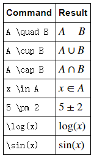
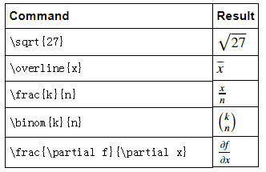
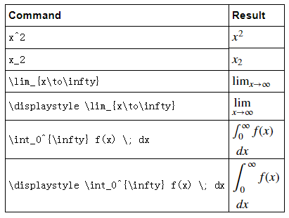
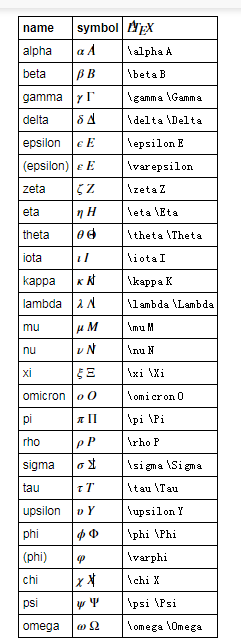

Latex数学公式

latex是一种排版语言，本文所讲的latex仅仅是整个latex语言中的数学公式部分。

# Latex公式如何插入到markdown文件中

1. 使用 `$$…内容…$$`进行独立一行的公式插入
   $$
   2^{1+n}
   $$
   
2. 使用 `$…内容…$` 进行行内公式插入$2^{1+n}$

# 公式细节

> 摘自[Latex 数学公式使用入门](https://www.cnblogs.com/klchang/p/9277354.html)

Latex 数学公式命令中，数学符号都使用**反斜杠（backslash, '\'）**转义英文缩略词 , 一些简单的数学符号命令:

其使用**大括号（curly braces, '{}'）**传入额外的输入 :

**下划线（underscore，'_'）**和**脱字符（caret,'^'）**在 Latex 数学公式中，有特殊的用法。

注：使用 \displaystyle，可以使内置的数学公式获得更大的字体和更多的垂直空间。

**希腊字母表**

**参考资料**

1. Some examples of using ( \LaTeX ) in R Markdown documents. http://www.calvin.edu/~rpruim/courses/m343/F12/RStudio/LatexExamples.html
2. LaTeX/Mathematics. https://en.wikibooks.org/wiki/LaTeX/Mathematics