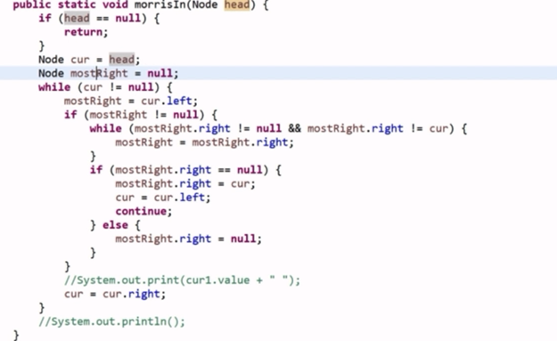

# 海量数据处理相关问题

1. 海量数据判重
2. 海量数据top k
3. 海量数据排序 

原则1：数据总大小远远大于内存，则使用哈希函数将所有数据分段，分批处理。

原则2：单个数据大小远大于内存，则使用哈希函数将大文件压缩为小文件


### 海量数据判断重复

有海量整数（整数范围有限），给出一整数，看这个整数是否出现过。

或：海量QQ号，判断一个QQ号是否出现过。

>采用bitset，每个数字占用其数字大小位置的比特，出现置1，再次出现时因为已经置1，就知道这个数字重复了。


如果判断一个数字（或QQ）是否出现n次怎么办？

> 让每个数字占用log2n比特，多个比特位表示出现次数。


有海量字符串，如何判断一个字符串是否出现在这海量字符串中？

或：海量url黑名单，如何判断一个url是否出现在黑名单中

或：字符串去重

> 采用布隆过滤器，布隆过滤器能够以极小的空间开销解决海量数据判重问题，但是会有一定的误判概率。它主要用在网页黑名单系统、垃圾邮件过滤系统、爬虫的网址判重系统。
>
> 1. 对每个url采用k个哈希函数计算出k个m大小哈希值，在bitset中将这k个点都设置为1。
> 2. 对于新url也采用k个哈希函数取哈希值，若他们所在的bit都是1，则判定这个url出现过。
> 3. 若两个不同的url得出的k个哈希值相同，则他们会被判定为相同；
> 4. 若多个字符串将一个url的k个哈希值在bitset中的位置全部覆盖，则判定这个url出现过。
> 5. 增大k与m可以降低误判率，但是会提高空间复杂度。

数据太多，分散在多个机器中存储怎么办？

> 在可以在存储时就用特定哈希取模函数将数据分配到不同机器中，在查询时先用哈希取模函数找到目标元素所在的机器，再在相应机器上进行海量数据处理。


若有40亿单位的bitset，需要400-500mb空间


### 海量数据取top k

有大量单词存储在文本文档中，文档10G，内存2G，找出出现频率最高的100个单词。

或：海量日志数据，提取出某日访问百度次数最多的那个IP。（一个IP就是一个单词）

> 首先是个有缺陷的办法：
>
> 1. 将数据分5批
> 2. 对每一批取频率前100个（单独一批的数据量小，可以通过普通的哈希表计数实现统计）
> 3. 得到500个高频单词，取其中最高的100个
>
> 上面方法的缺陷在于它默认同一个单词不会分散出现在多个批次中，如果一个单词在每个批次中词频都是第101名但合起来词频高。因为在每个批次中他都不能入选，那在最终结果中也就没有他了。
>
> 1. 所以应当首先对数据进行**哈希取模分批**，使得相同的单词一定被分配到相同批次中。
> 2. 每一批取词频前100个
> 3. 得到500个高频单词，取其中最高的100个
>
> 注：数据量远超内存大小 和 数据在多台电脑中 的处理方式是一样的。

对于少量数据的topk，也即不需要分批次的topk，可以采用快速选择第k个元素的等价办法取得前k个元素。

### 海量数据排序（也即外排序）

有海量数据，无法一次读取到内存中，对他们进行排序。

> 1. 先分批
> 2. 再分别排序
> 3. 最后合并

若为海量IP，可以取IP地址的字节序。


### 公共数据

两批海量数据集A,B，问A，B中哪些数据是公共的

> 1. 采取布隆过滤器，存在误判，需要跟面试官说明
> 2. 哈希分批后哈希表判重


Trie树的应用;


常见问题：
①Top K问题：分治+Trie树/Hash_map+小顶堆。采用Hash(x)%M将原文件分割成小文件，如果小文件太大则继续Hash分割，直至可以放入内存。

②重复问题：BitMap位图 或 Bloom Filter布隆过滤器 或 Hash_set集合。每个元素对应一个bit处理。

③排序问题：外排序 或 BitMap位图。分割文件+文件内排序+文件之间归并。

 

Top K问题：

1. 有一个1G大小的一个文件，里面每一行是一个词，词的大小不超过16字节，内存限制大小是1M。返回频数最高的100个词。

①分治：顺序读文件，对每个词x取Hash(x)%2000，按照该值存到2000个小文件中。每个文件是500k左右。如果有文件超过了1M则继续分割。O(N)

②Trie树/Hash_map：字符串用Trie树最好。对每个小文件，统计其中出现的词频。O(N)*(平均字符长度),长度一般是常数，也就是O(N). 

③小顶堆：用容量为100的小顶堆，以频率为value值插入，取每个文件现频率最大的100个词，把这100个词及相应的频率存入文件。最差O（N）*lg(100)，也就是O（N）.注：2,3步骤合起来需要一轮磁盘存取过程。存入文件的个数可以缩减一下，因为主要开销在磁盘读取上，减少文件读取次数，可以在每个文件存取最大容量的字符数量，比如这道题1*（M/16字节字符串长度+频率（int）8字节）的数存到一个文件中。比如20000个词存在一个文件中，可以缩减到10个文件。这样最后一步只需要读取10次就可以了。

④归并：将得到的10个文件里面的数进行归并，取前100个词。注：我觉得其实不需要多路归并，因为只需要找top100的数，归并排序首先是nlgn的复杂度，第二是频繁的磁盘存取，这里最好是还是在内存建立容量为100的小顶堆，依次读文件，遍历每个文件中的元素更新小顶堆，这样只需10次存取，并且时间复杂度是nlog100,也就是O（n）的。

注释：为什么说用Trie树好，我之前一直没想明白，因为网上说Trie树是空间换时间，而这道题是空间敏感呀的。总结了一下，其实是两点我没想明白：

1.字符串会通过一个hash算法（BKDRHash，APHash，DJBHash，JSHash，RSHash，SDBMHash，可以自己看一下，基本就是按位来进行hash的）映射为一个正整数然后对应到hash表中的一个位置，表中记录的value值是次数，这样统计次数只需要将字符串hash一下找到对应位置把次数+1就行了。如果这样的话hash中是不是不用存储字符串本身？如果不存储字符串本身，那应该是比较省空间的。而且效率的话因为Tire树找到一个字符串也是要按位置比较一遍，所以效率差不多呀。但是，其实字符串的hash是要存储字符串本身的，不管是开放地址法还是散列表法，都无法做到不冲突。除非桶个数是字符串的所有情况26^16，那是肯定空间不够的，因此hash表中必须存着字符串的值，也就是key值。字符串本身，那么hash在空间上肯定是定比不过Trie树的，因为Trie树对公共前缀只存储一次。

2.为什么说Trie树是空间换时间呢，我觉得网上这么说不甚合理，这句话其实是相对于二叉查找树来说的，之所以效率高，是因为二叉查找树每次查找都要比较大小，并且因为度为2，查找深度很大，比较次数也多，因此效率差。而Trie树是按位进行hash的，比如26个字母组成的字符串，每次找对应位的字符-‘a’就是位置了。而且度是26，查找深度就是字符串位数，查找起来效率自然就很快。但是为啥说是空间换时间，是因为字符串的Trie树若想存储所有的可能字符串，比如16位，一个点要对应下一位26种情况，也就是26个分支，也得26^16个位置，所以空间是很大的。但是Trie树的话可以采用依次插入的，不需要每个点记录26个点，而是只存在有值的分支，Trie树节点只要存频率次数，插入的流程就是挨个位子找分支，没有就新建，有就次数+1就行了。因此空间上很省，因为重复前缀就统计一次，而效率很高，O(length)。

2. 海量日志数据，提取出某日访问百度次数最多的那个IP。注：跟上一题一致，甚至更简单，不需要考虑trie树。

①分治：IP是32位，共有232个IP。访问该日的日志，将IP取出来，采用Hash，比如模1000，把所有IP存入1000个小文件。

②Hash_map：统计每个小文件中出现频率最大的IP，记录其频率。

③小顶堆：这里用一个变量即可。在这1000个小文件各自最大频率的IP中，然后直接找出频率最大的IP。

 

3. 海量数据分布在100台电脑中，想个办法高效统计出这批数据的TOP10。注：主要不同点在于分布式

分析：虽然数据已经是分布的，但是如果直接求各自的Top10然后合并的话，可能忽略一种情况，即有一个数据在每台机器的频率都是第11，但是总数可能属于Top10。所以应该先把100台机器中相同的数据整合到相同的机器，然后再求各自的Top10并合并。

①分治：顺序读每台机器上的数据，按照Hash(x)%100重新分布到100台机器内。接下来变成了单机的topk问题。单台机器内的文件如果太大，可以继续Hash分割成小文件。

②Hash_map：统计每台机器上数据的频率。

③小顶堆：采用容量为10的小顶堆，统计每台机器上的Top10。然后把这100台机器上的TOP10组合起来，共1000个数据，再用小顶堆求出TOP10。

 

4. 一个文本文件，大约有一万行，每行一个词，要求统计出其中最频繁出现的前10个词，请给出思想，给出时间复杂度分析。 注：文件大小不需要分割文件

①分治：一万行不算多，不用分割文件。

②Trie树：统计每个词出现的次数，时间复杂度是O(n*le)  (le表示单词的平准长度)。

③小顶堆：容量为10的小顶堆，找出词频最多的前10个词，时间复杂度是O(n*lg10)  (lg10表示堆的高度)。

总的时间复杂度是 O(n*le)与O(n*lg10)中较大的那一个。

 

5. 一个文本文件，找出前10个经常出现的词，但这次文件比较长，说是上亿行或十亿行，总之无法一次读入内存，问最优解。

比上一题多一次分割。分割成可以一次读入内存的大小。

①分治：顺序读文件，将文件Hash分割成小文件，求小文件里的词频。

②③同上。

 

6. 100w个数中找出最大的100个数。

方法1：用容量为100的小顶堆查找。复杂度为O(100w * lg100)。小根堆是最好的方法。

方法2：采用快速排序的思想，每次分割之后只考虑比标兵值大的那一部分，直到大的部分在比100多且不能分割的时候，采用传统排序算法排序，取前100个。复杂度为O(100w*100)。

方法3：局部淘汰法。取前100个元素并排序，然后依次扫描剩余的元素，插入到排好序的序列中，并淘汰最小值。复杂度为O(100w * lg100)  (lg100为二分查找的复杂度)。

 

重复问题：

1. 给定a、b两个文件，各存放50亿个url，每个url各占64字节，内存限制是4G，让你找出a、b文件共同的url？

分析：每个文件的大小约为5G×64=320G，远远大于内存大小。考虑采取分而治之的方法。

方法1：

①分治：遍历文件a，对每个url求Hash%1000，根据值将url分别存储到1000个小文件中，每个小文件约为300M。文件b采用同样hash策略分到1000个小文件中。上述两组小文件中，只有相同编号的小文件才可能有相同元素。

②Hash_set：读取a组中一个小文件的url存储到hash_set中，然后遍历b组中相同编号小文件的每个url，查看是否在刚才构建的hash_set中。如果存在，则存到输出文件里。

方法2：

如果允许有一定的错误率，可以使用Bloom filter，使用位数组，4G内存大概可以表示340亿bit。将其中一个文件中的url使用Bloom filter映射为这340亿bit，然后挨个读取另外一个文件的url，检查是否在Bloom filter中。如果是，那么该url应该是共同的url（注意会有一定的错误率）。

注： bloom filter被用来检测一个元素是不是集合中的一个成员。如果检测结果为是，该元素不一定在集合中；但如果检测结果为否，该元素一定不在集合中。主要思路是：将一个元素映射到一个 m 长度的阵列上，使用 k 个哈希 函数对应 k 个点，如果所有点都是 1 的话，那么元素在集合内，如果有 0 的话，元素则不在集合内。 错误率：如何根据输入元素个数n，确定位数组m的大小及hash函数个数k，k=(ln2)*(m/n)时错误率最小，为f = (1 – e-kn/m)k 。

 

2. 在2.5亿个整数中找出不重复的整数，内存不足以容纳这2.5亿个整数。

分析：2.5亿个整数大概是954MB，也不是很大。当然可以更节省内存。整数一共2^32个数.每个数用2bit的话，需要1GB。也就是

方法1：

采用2-Bitmap，每个数分配2bit，00表示不存在，01表示出现一次，10表示多次，11无意义。共需内存60MB左右。然后扫描这2.5亿个整数，查看Bitmap中相对应位，如果是00变01，01变10，10保持不变。所描完后，查看Bitmap，把对应位是01的整数输出。

注：感觉这个方法不对呀，bitmap要统计所有的整数值，2*3^32是需要1GB内存呀，不是60MB, 954MB都存不下怎么存1GB?? 得到结论，bitmap统计整数存在性起码得有1G的内存。也就是说少于268435456个数不如直接hash，消耗的内存反而更小！

方案2：

分治法，Hash分割成小文件处理。注意hash保证了每个文件中的元素一定不会在其他文件中存在。利用Hash_set，在小文件中找出不重复的整数，再进行归并。

方案3：

或者，我觉得可以将整个整数域划的bitmap根据内存大小分成可以几个文件，比如划分四个文件，这样的话0-1*2^30在一个范围，，……，3*2^30-4*2^30在一个文件中，内存只要保证250M大小即可。整数需要放在对应的bitmap里面的对应位置，这里位置使用的是相对偏移量（value-首元素大小）。跟方案2相比分割的 方法不一样，以及每个小文件可以使用bitmap方法，所以更快一些。只是不知道有没有这种分割。

 

3. 一个文件包含40亿个整数，找出不包含的一个整数。分别用1GB内存和10MB内存处理。

1GB内存： 

①Bitmap：对于32位的整数，共有232个，每个数对应一个bit，共需0.5GB内存。遍历文件，将每个数对应的bit位置1。最后查找0bit位即可。

10MB内存： 10MB = 8 × 107bit

①分治：将所有整数分段，每1M个数对应一个小文件，共4000个小文件。注意计算机能表示的所有整数有4G个。

②Hash_set：对每个小文件，遍历并加入Hash_set，最后如果set的size小于1M，则有不存在的数。利用Bitmap查找该数。

注：计算机能表示的整数个数一共有4G个，整数域hash分割成10M一个文件，，一共分割成400个小文件，每个小文件判断不存在的数，再把这些数全都归并起来。磁盘IO次数越少越好！！所以不明白为啥1M对应一个小文件，而不取最大的10M。

 

4. 有10亿个URL，每个URL对应一个非常大的网页，怎样检测重复的网页？

分析：不同的URL可能对应相同的网页，所以要对网页求Hash。1G个URL+哈希值，总量为几十G，单机内存无法处理。

①分治：根据Hash%1000，将URL和网页的哈希值分割到1000个小文件中，注意：重复的网页必定在同一个小文件中。

②Hash_set：顺序读取每个文件，将Hash值加入集合，如果已存在则为重复网页。 

 

排序问题：

1. 有10个文件，每个文件1G，每个文件的每一行存放的都是用户的query，每个文件的query都可能重复。要求按照query的频度排序。

方法1： 

①分治：顺序读10个文件，按照Hash(query)%10的结果将query写入到另外10个文件。新生成的每个文件大小为1G左右(假设hash函数是随机的)。

②Hash_map：找一台内存为2G左右的机器，用Hash_map(query, query_count)来统计次数。

③内排序：利用快速/堆/归并排序，按照次数进行排序。将排序好的query和对应的query_count输出到文件中，得到10个排好序的文件。

④多路归并：将这10个文件进行归并排序。

方案2：

一般query的总量是有限的，只是重复的次数比较多。对于所有的query，一次性就可能加入到内存。这样就可以采用Trie树/Hash_map等直接统计每个query出现的次数，然后按次数做快速/堆/归并排序就可以了

方案3：

与方案1类似，在做完Hash分割后，将多个文件采用分布式的架构来处理（比如MapReduce），最后再进行合并。

 

2. 一共有N个机器，每个机器上有N个数。每个机器最多存O(N)个数并对它们操作。如何找到这N^2个数的中位数？

方法1： 32位的整数一共有232个

①分治：把0到232-1的整数划分成N段，每段包含232/N个整数。扫描每个机器上的N个数，把属于第一段的数放到第一个机器上，属于第二段的数放到第二个机器上，依此类推。 (如果有数据扎堆的现象，导致数据规模并未缩小，则继续分割)

②找中位数的机器：依次统计每个机器上数的个数并累加，直到找到第k个机器，加上其次数则累加值大于或等于N2/2，不加则累加值小于N2/2。

③找中位数：设累加值为x，那么中位数排在第k台机器所有数中第N2/2-x位。对这台机器的数排序，并找出第N2/2-x个数，即为所求的中位数。

复杂度是O(N2)。

方法2：

①内排序：先对每台机器上的数进行排序。

②多路归并：将这N台机器上的数归并起来得到最终的排序。找到第N2/2个数即是中位数。

复杂度是O(N2*lgN)。
————————————————
版权声明：本文为CSDN博主「jollysoul」的原创文章，遵循 CC 4.0 BY-SA 版权协议，转载请附上原文出处链接及本声明。
原文链接：https://blog.csdn.net/juzihongle1/article/details/70212243

题目
问题一：现有海量日志数据，要提取出某日访问百度次数最多的那个IP(可以将题干简化，假设日志中仅包含IP数据，也就是说待处理的文件中包含且仅包含全部的访问IP，但内存空间有限，不能全部加载，假设只有512MB)

解决方案：

这是一道典型的分治思想的题目，这种问题处理起来套路比较固定，对于大部分的数据量比较大的前提的问题而言，分治都是一个可选的解决方案，但不一定是最优的，解决方法基本划分为三步走：

第一：如何有效的划分数据

第二：如何在子集上解决问题

第三：如何合并结果
1
2
3
4
5


那么对于本问题就显得比较明显了：

首先解决如何划分，由于IP地地址范围从000.000.000.000~255.255.255.255共有2^32个大约4GB，那么我们可以通过取模的方式进行划分，直接将四段数据相连就得到一个IP对应的数字A，再对A模1024(模数取多少可以自己指定，保证每个小文件能被放到内存就好)，这样大文件被划分成小文件了，并且相同的IP一定被划分到相同的文件中。

其次解决每个小文件中TOP1的问题：
这里可以用很多方式进行处理，比如你可以构造自己的HashMap,key为IP，value为当前出现次数，最后找到value最大的Key即为当前文件中出现次数最多的IP。

最后要解决结果合并问题：

这里直接将1024个子文件的统计结果进行比较就好，不用排序，直接选择最大的一个就好。

注意：这里第二步是影响效率的地方，读者可以想想如何优化这里的Wordcount，可以用trie树等

问题二：有一个1G大小的一个文件，里面每一行是一个词，词的大小不超过16字节，内存限制大小是1M。返回频数最高的100个词。

解决方案：细心的读者可以发现这个和第一个问题应该没有太大别，区别就在于第一个问题是Top1，这个问题是TOP100。

那么对于这个问题，主要考虑的是如何划分(每个文件要小于1M)，这里可以考虑划分为2028份。

对于第二步可以考虑用堆排序
即常用的TopN手段。

第三部就是更为常见的归并排序

问题三：给定a、b两个文件，各存放50亿个url，每个url各占64字节，内存限制是4G，让你找出a、b文件共同的url？

解决方案：这种题目，我首先想到的就是布隆过滤器(BloomFilter)
当然使用布隆过滤器存在一定的错误率，所以面试者可以和面试官进行进一步的沟通，看是否允许有一定的错误率。

如果使用布隆过滤器，那么问题就很好办了，4G的内存足以容纳300多亿的bit，所以足够处理了，先将a文件中的url都放入布隆过滤器，之后遍历b文件，对每个url都询问布隆过滤器看其是否已经存在，如果存在，则此条URL输入结果文件。

关于布隆过滤器使用空间和错误率的关系可以看这篇博文

第二种方案就是采用更为通用的但对于这个问题效率较低的分治思想，对a,b进行分片，a,b文件大小都大约320G，那么每个文件都切分成1G的320个小文件。

lista->{a1,a2,a3...a320}

listb->{b1,b2,b3...b320}
1
2
3
伪代码如下：

resultlist = []
for tmpfile in lista:
    for infile in listb:
        for url in tmpfile:
            if url in infile:
                resultlist.add(url)
1
2
3
4
5
6
当然这个在实现的时候可以进一步优化，首先可以并行处理(这里只用了2G内存，所以至少可以2个线程并行)

其次，可以对a中URL进行小部分判重处理，如果之前已经有了，
就不必处理。

问题四:有10个文件，每个文件1G，每个文件的每一行存放的都是用户的query，每个文件的query都可能重复。要求你按照query的频度排序。

解决方案：这种题又是典型的wordcount问题，首先这种题不用说都是内存有限制(最好问问面试官，内存限制是多少)。如果没内存限制直接一个trie树就搞定了(因为一般来说query的重复都比较多)。

如果内存限制比较大，那么可以尝试屡试不爽的分治方法。但在使用之前需要先对原来的文件进行一下处理通过hash(url)%A，这里A只分成多少分，这里可以也取10,就是将原来的10个文件转为新的10个文件，如果内存限制比较大，那么这个A可以根据内存大小调整，要让1G/A <= 内存大小。

接下来就是要对每个小文件进行统计，可以用hashmap(url,count)，也可以用trie树。

之后采用归并排序的方法得到最终结果。

问题五：怎么在海量数据中找出重复次数最多的一个？

解决方案：如果看了前面四个题目，这里相信读者应该已经会自己解决了。

使用屡试不爽的分治思路，先划分成小文件，之后分别统计，之后再选取max,读者可以思考如何优化小文件内的处理方法。

问题六:在2.5亿个整数中找出不重复的整数，注，内存不足以容纳这2.5亿个整数。

解决方案：首先对于这种问题基本上都可以采用分治的思想，先进行划分后进行单独处理，最后进行结果合并。但对于这道题目显然分治思想比较牵强，效率不高。

那么再审视一下这个题目，其只需要找到不重复的整数，无需什么排序，而且又限定在整数，那么显然可以考虑位集的思想。
2.5亿个整数，显然可以用一个250M的位集表示。

一个位集可以表示如下：


但简单的位集只能表示存在与否，因为每个bit表示一个整数，1个bit只能表示两种情况，但在本题目中不但需要表示存在性，还需要表示是否多次出现，即需要寻找出现次数>=2，那么至少需要两个bit才能表示这种情况，00->不出现，01->出现一次，10->出现至少2次，这样就能统计出那些数据出现重复。

总结一下就是本题目可以用位集的变形，每个数用2个bit表示，那么总共需要250M*2b = 500Mb的内存，完全满足题目，而且效率还是o(n)。

问题七:一个文本文件，大约有一万行，每行一个词，要求统计出其中最频繁出现的前10个词，请给出思想，给出时间复杂度分析。

解决方案：分治思想这里就简要阐述一下，可以利用trie树进行词频统计，之后采用TopN的解决方法，关于排序的问题可以看这篇博文

堆排序的时间复杂度是n(longk),n是数据集合大小，k是topK中的k,那么复杂度是max(n*len(e),nlogk),其中len(e)表示字符串平均大小。

这里想讲一下另一种稍显技巧的方法，即用变形的位集表示，由于题目中只有1w的数据，那么一个词最多出现1w词，那么用18个bit就可以表示最多出现的次数，说道这里读者可以回顾一下第六个题目了，其实和题目六很相似的，这里每个数字用18个bit表示，那么剩下的问题就是解决如何将每个词转化为1~10000的数字，这里读者可以自行YY或者自行搜索，方法有很多。关键的问题是要想到可以用这种方式来解决，那么复杂度显然就是o(n)

问题八:给40亿个不重复的unsigned int的整数，没排过序的，然后再给一个数，如何快速判断这个数是否在那40亿个数当中？
（PS：腾讯面试题）

解决方案：这个题目限定的比较明确了，整数、不重复，那么理所当然可以用bitMap的思想去解决了。

申请一个40亿的bit数组，初始化为0，遍历数据集合，有的占位1，给定待验证的数据，直接看相应位置的是1还是0即可。

当然有人可能觉得40亿的bit内存装不下啊，那怎么办，当然可以分治了，写到N个文件中总可以了吧，根据待验证的数，直接查找相应的文件，在相应的文件中查看是1还是0。

比如分成1W份，被分割的文件按下标存储：

file1,file2,file3 ... file10000
1
那么相当于每个文件存储4Mb的位，待验证的数据为a,那么目标文件的index为

index*400000<=a<=(index+1)*400000
1
求出index，再在file(index)中查找。

问题九:上千万或上亿数据（有重复），统计其中出现次数最多的前N个数据。

解决方案：典型的TopN问题，请参考前面的问答题。

问题十: 搜索引擎会通过日志文件把用户每次检索使用的所有检索串都记录下来，每个查询串的长度为1-255字节。假设目前有一千万个记录（这些查询串的重复度比较高，虽然总数是1千万，但如果除去重复后，不超过3百万个。一个查询串的重复度越高，说明查询它的用户越多，也就是越热门），请统计出最热门的10个查询串，要求使用的内存不能超过1G。

解决方案：典型的TopN问题，请参考前面的问题的答案，可以考虑使用分治的思想。

总结:处理海量数据问题的四板斧
1.分治
基本上处理海量数据的问题，分治思想都是能够解决的，只不过一般情况下不会是最优方案，但可以作为一个baseline，可以逐渐优化子问题来达到一个较优解。传统的归并排序就是分治思想，涉及到大量无法加载到内存的文件、排序等问题都可以用这个方法解决。

适用场景:数据量大无法加载到内存

技能链接:归并排序

2.哈希(Hash)
个人感觉Hash是最为粗暴的一种方式，但粗暴却高效，唯一的缺点是耗内存，需要将数据全部载入内存。

适用场景:快速查找，需要总数据量可以放入内存

3.bit(位集或BitMap)
位集这种思想其实简约而不简单，有很多扩展和技巧。比如多位表示一个数据(能够表示存在和数量问题)，BloomFilter(布隆过滤器就是一个典型的扩展)，在实际工作中应用场景很多，比如消息过滤等，读者需要掌握，但对于布隆过滤器使用有一些误区和不清楚的地方，读者可以看下面这篇博客避免这些性能上的误区。

适用场景：可进行数据的快速查找，判重

技能链接:布隆过滤器使用的性能误区

4.堆(Heap)
堆排序是一种比较通用的TopN问题解决方案，能够满足绝大部分的求最值的问题，读者需要掌握堆的基本操作和思想。

适用场景:处理海量数据中TopN的问题(最大或最小)，要求N不大，使得堆可以放入内存

技能链接:排序算法-Heap排序
————————————————
版权声明：本文为CSDN博主「Jerry_xl」的原创文章，遵循 CC 4.0 BY-SA 版权协议，转载请附上原文出处链接及本声明。
原文链接：https://blog.csdn.net/hitxueliang/article/details/52153476


1. 

2. 算法与手撕代码**

   1. 嗯，来道基本的动态规划吧，钱币问题

   2. 链表有无环判断

   3. 实现一个单例模式

   4. 给一个字符串判断单词数

   5. 开方算法

   6. 青蛙跳台阶

   7. 常用排序(快排和归并要写吐)

   8. 反转链表

   9. 两个链表，寻找公共节点

   10. 查找字符串中不重复的最长子串

   11. LRU

   12. 手写求树的深度的代码

   13. 手写生产者消费者

   14. 编程实现string类

   15. 两个数组A,B，A有的B都有，求B-A；

   16. 输入一个字符串，输出它的全排列

   17. 统计完全二叉树多少个节点

   18. memcpy实现

   19. 每次面试前抽30min把自己分类好内容看一遍

   20. 作者：大梦想家豪哥
       链接：https://www.nowcoder.com/discuss/365559?form=sx21
       来源：牛客网

       假设数组 A 和 B 都是有序的，并且 A 有足够多余的空间可以合并 B。要求不使用额外的空间，把 B 合并进 A 并保证最终的数组有序。
        例如： A = {-3, 5, INVALID_NUM, 7, INVALID_NUM, 10, INVALID_NUM, 11, INVALID_NUM}，B = {-1, 2, 6, 12}
        最后：A = {-3, -1, 2, 5, 6, 7, 10, 11, 12}

   21. 给你一棵二叉树，它的根为 root 。请你删除 1 条边，使二叉树分裂成两棵子树，且它们子树和的乘积尽可能大，返回最大的乘积。二面最后一题是对树暴搜一遍保存所有节点的子树和，删边就遍历所有节点，用根节点的子树和减去当前节点的子树和，再乘上当前节点子树和吗

   22. 36进制正整数加法，不允许把36进制数字整体转为10进制数字，计算出10进制累加结果再转回为36进制

   23. 最长回文子串

       直接让我先写暴力解，没问马拉车。。写完暴力解的时候想说优化的事情结果就问下一题了。

   24. 地图上有若干个点，怎样得到某个点到达某个点的所有的换乘路线

       ​	这题我是没咋明白，感觉信息有点少，就问是不是单源最短路径问题，迪杰斯特拉算法。。。然后问到最后面试官给了一个详细的情景：如果两个点之间是不可达的各自在一个不相联通的环内怎么告诉用户不可达

   25. 算法题;

       给你一个字符串，字符串当中是一段c语言的代码和注释，注释只有/* */这样的可以嵌套，不包含//

       1.请返回去除所有注释的代码

       2.如果代码当中的/*和*/可以不完全匹配如何告知出现错误

   26. 给你一个2G的电脑 10G的文本 文本有1k行的字符串，要求输出所有互为逆序的字符串的组合

       最后问我 实习时间 想不想去北京实习

   27. 作者：邱天乐
       链接：https://www.nowcoder.com/discuss/180931?form=sx21
       来源：牛客网

       

       ## 顺子

       第一题是给定一副手牌（A、2-10、J、Q、K，可重复），五张以上连续为顺子，最高连到K。问这副手牌有多少可能的顺子。（同样数字不同花色算不同的顺子）这道题我先卡在读入。输入有数字有字符，数字又有二位数。读char也不是读int也不是。最后只能cin.get逐位读然后空格与空格之间为读入的牌然后再做识别。读入之后就还算简单，各位自己思考吧。

       ## 编码转换

       第二题是现有一个大整数，以字符串读入然后做转换。先将这个大数从低位开始每三位分一组，高位补0，然后转为二进制。转为二进制后每五位一组，同样高位补零。五位二进制可以表示范围是0-31，那么就将这些二进制数对应地转成0-9、A-V。然后输出。这个其实就是大数转32进制，中间的转二进制是迷惑人的。实现不难。

       ## 充电池

       第三题是沙雕科学家搞发明，弄了n个不同容量的电池，然后用导线给电池充电。他只有一个功率输出口，接在特定一个电池上，然后其余电池都用单向导线连接，形成一个有向无环图。现在开始给电池充电，每个电池充满后才会向后方输出电能。输出电能会平均分到它屁股上的所有导线。如果一个电池充满了屁股上又没有导线，它接收到的电能就浪费了。问过多久才能充满所有电池。这个题我一开始以为很简单，实际写才发现很复杂。因为每个电池头顶可以接收多个导线，所以一个电池接收到的功率会多次变动。我大概有个思路，但最后时间不够就放弃了。

   28. 作者：邱天乐
       链接：https://www.nowcoder.com/discuss/180931?form=sx21
       来源：牛客网

       接下来一个算法题，给一个英语句子，每个单词用空格隔开，怎么将这些单词按倒转的顺序输出。
       我第一反应当然是栈啊。用cin逐个单词读入压栈再逐个pop出来。他说这可以，但如果不能用额外的容器呢？
       我想了想说那用一个临时的char数组，从后向前遍历将字符插到临时的char数组的头部，遍历到空格就输出临时数组并清空。他说那你这个临时数组要声明多大？如果我这个字符串有3个G呢？
       不让用临时那就是本地转换咯。万幸还是让我想出个办法，先将整个字符串倒转，再逐个单词倒回来。他听上去不知道是否满意这个方案，不过也没有继续问下去了。

   29. 

3. **大数问题**

   > 大数问题通常的套路是**hash,分治，布隆，bitmap**，如果推荐的话还是上面数据结构相关资料.当然如果能了解下比如**hdfs文件系统，mapreduce，spark/flink流式计算**最佳哈

   1. 有200亿qq，但实际只有25亿用户，找到重复的qq
   2. 25亿qq占用内存多大
   3. 1-100万，计算找出所有的质数（计算密集型任务），用单线程与多线程怎么处理
   4. 1个G的文件写程序，从A机器发送到B机器，怎么发？
   5. 100G的文本，每行80k还是80字符，提示用多个机器，多进程，多线程，求出重复最多的行。一个机器内存8G，计算每个机器大概分多少？能读取100G的文本吗？找重复率前十的文本
   6. 三个有序的序列，查找公共的部分，第一次我说用哈希表，他说序列太大，空间复杂度要低点，我说了二分查找，他问三个序列查找的顺序和时间复杂度。（时间复杂度为N*logN *logN）
   7. 100WURL，如何存储
   8. 10台服务器，100w用户，如何进行负载均衡，如何有个服务器挂掉了咋办
   9. 10000个数据查找最小的100个？时间复杂度？
   10. 场景题：QQ的服务器会保存登录用户的QQ号，只要有登录，文件里面就会有记录，现在需要统计哪些QQ号登录过，怎么做？（先说了分治用小文件，他说除了这个了，我说bit数组，他就问需要多大内存？）
   11. 10台服务器每台一亿url，找出最多的前100条

先手撸算法题：

CanTransform：
如hit->hat，hat->cat，cat->fat。但是不能单步从hit->hog。设计算法判断给定输入能否在字典范围内经过任意次步骤完整转换。


**一个二叉树上求两个节点之间路径长度的最大值，说出具体的思路。**

6.算法题，一个数组，找出第k大的数


作者：大梦想家豪哥
链接：https://www.nowcoder.com/discuss/365559?form=sx21
来源：牛客网

假设数组 A 和 B 都是有序的，并且 A 有足够多余的空间可以合并 B。要求不使用额外的空间，把 B 合并进 A 并保证最终的数组有序。
 例如： A = {-3, 5, INVALID_NUM, 7, INVALID_NUM, 10, INVALID_NUM, 11, INVALID_NUM}，B = {-1, 2, 6, 12}
 最后：A = {-3, -1, 2, 5, 6, 7, 10, 11, 12}

代码部分让我说了下单次买卖股票最大利润问题的思路，轻松加愉快

变形版本的正则字符匹配(?和*)，暴力版本的复杂度说错了，但是动态规划的版本的代码算是写出来了

- 之字形打印二叉树(剑指offer原题)
- k路归并有序链表(前面时间花太多，只说了思路)
- 简单实现一个LRU (双向链表+哈希表)

如何判断两个字符串是否是Anagram(组成字符相同但是顺序不同)，马上写出了一个用数组模拟哈希表的方法。

数组中盛最多水的问题，Leetcode原题。之前虽然做过，但是思路一时间想不起来，然后就一直跟面试官探讨，说自己对题目的理解，说暴力的方法，说初步的思考方向。面试官也给了我很多提示，最终想到了用双指针的解法，并在A4纸上实现了。

判断一个字符串是否有重复元素，easy.

给我一个迭代器和一个数k，迭代器只有next一个接口，现在让我将后面的k个元素删除，只保留前面的

写了一个二维数组，用二分的思想来解决这个问


华为实习生招聘有统一的笔试，用的牛客网平台，难度都很小，不过其中有一题是要用Dijkstra算法，当场写出来还是遇到了一些坎坷。


怎样可以得到在这个圆上的均匀随机点，

一个游戏场景题，一个活动有10人报名，需要将其分成2组（每组5人），每个人有门派和伤害属性，问如何分配使得每个队的门派尽可能平均、且两队总伤害尽可能接近；


换硬币动态规划

，两个字符串大数相加

对于小数还有没有别的方法，我说还可以直接把小数当整数对待，相加完成之后算出小数点的位置，再插入到字符串中就好了

概率题，掷一个骰子n次，每次掷完骰子后，可以选择立即停止、以当前骰子的值作为结果，或忽略当前骰子的值，继续掷骰子，问用什么策略可以得到最大的数。该根据后面还有多少次没有掷来计算后面掷骰子会超过当前值的概率，概率大于50%就应该继续掷，


判断镜像二叉树（LeetCode 101），这题我早有准备。首先画了个镜像二叉树跟面试官确认了我没有理解错题意，然后就很顺畅地开始写了，一口气写完之后就让面试官来检查了。面试官首先问为什么我的传入参数是用`a`和`b`表示两个树的，我答为了简单起见，然后面试官说可不可以用`left`和`right`来表示两个树（递归结构，这里指左子树和右子树），我答不可以，因为第一个参数不一定一直是`left`、第二个参数也不一定一直是`right`，如果用`left`和`right`反而会让人误解，面试官表示赞同。

LeetCode上的原题——通配符匹配（LeetCode 44）

惊喜的是我拿到了微软的sp

雷火&盘古的核心岗位为“研发工程师”，要求本科高校。

如果坚持想要调换工作地点，可能需要按秋招流程重新来一遍。

而刷题的主战场集中在三月初到六月底，这段时间几乎是有空就刷题，490+刷了400题左右

然后是逻辑题，第一题很常见的甲乙丙丁每个人过桥分别要1 2 5 10分钟，只有一个手电筒，然后一次最多过两个，问最短过桥时间，问我见过吗，我实话说见过，然后把答案一说，就又给我换了一道，140 克盐，2g，7g 砝码，一个天平，称 3 次分成 50 和 90，也比较简单，我想了一下就回答了。


**一个印有网易logo的纸杯怎么测试，**


# 牛客进阶

## KMP算法加速字符串对比


前面最长前缀与最长后缀

1. s1包不包含s2，求s2的每个位置的信息，
2. 对比到头，对齐最长后缀的位置，（认为前面的位置都不匹配字符串）
3. 没有最长前缀，将1下一个位置和2的开头开始对比333


## BFPRT算法TOP-K

排序：O(nlogn)

分区：O(logn) 

BFPRTO(n)无法避免O(n2)


步骤：

1. 五个一组O1
2. 组内排序ON
3. 每个组中位数拿出来构成新数组n/5长度ON
4. 递归调用BFPRT算法找中位数ON
5. 向左右作为子


## 最大最小值差的子数组

O(n2)

子数组的数量

1. 暴力方法 两个for循环加一个判断n3
2. 最优：O(n)
   1. 定理：
      1. 任何子数组达标，他的子数组也达标
      2. 不达标的子数组也不达标
   2. 方法：
      1. 移左
         1. 移右判不达标
         2. 计算结果
   3. 
   4.  
3. 

## 单调栈

找到数组中每个元素的左右第一个更大数

力争做到有序从大到小入栈

5436

5进栈

4入栈

3入栈

6大，弹3,6比3大，3下面的4比他大

6大，弹4,6比4大，5比4大；


入玩，单独清理栈，所有数的右边都没有更大数

相等放在一起

（技术密集的项目，而不是业务密集，根据新技术造项目，大肆宣传技术，一个人要多无聊才问你业务）

（面试技巧，想什么别闭嘴，喃喃自语，太社会了）

（面试官最讨厌闷头想。）


### 从数组构造最大树

1. 构造大根堆
2. 单调栈
   1. 每个数找到左右最近更大数
   2. 没有更大则为根
   3. 有一个
   4. 都有，挂在小的那个底下。


### 求最大子矩阵大小

数组累加

O(n*m)

嵌套的最大直方图矩形大小

每层进行累加计算。


### 最大直方图矩形大小

元素值单调递增的关系存放，保存每个元素**最近更小值**的位置，位置之差


最近更小值，单调栈从小到大


### 环形山

环形山，

相邻可看

不相邻，中间没有更高值

问能相互看见的有多少对


找到每个点左右跟高点，

从第一个最大值开始遍历

单调递减


每种高度的要出来，CK2+K*2


处理剩余：

倒数第二条记录需要考虑最后一条的数量


## 莫里斯Morris遍历

时间O(n)，空间O(1)的二叉树遍历方式

197x

利用二叉树末尾空指针




```
Node cur = head;
while (cur != null) {
    System.out.println(cur.val);
    if (没有左子) {
    	//先序点
        cur = cur.right;
    } else {
        找到左子的最右子
        if (最右无) {
        	//先序点
        	设置最右之右
        	前往左子
        } else {
        	前往右子
        	//逆序打印右边界
        }
    }
    //中序点
}
```


1. 当前节点，没有左子，则向右移动，cur=cur->right
2. 有左孩子，左子树最右节点，记为mostright
   1. 右孩子空，让其指向cur，cur**向左**移动
   2. 右孩子指向cur，让其指向空，cur右移


逆序打印右边界：逆转链表


## 摩天大楼轮廓

(左，右，高)

输出这些大楼的轮廓


解答：

**构建数组**

每个楼处理为两个上下的线

(左高上)

(右高下)

**遍历筛选**

根据三元组第一个元素排序


```c++
class Solution {
public:
    vector<vector<int>> getSkyline(vector<vector<int>>& buildings) {
        vector<pair<int,int>> h;
        multiset<int> m;
        vector<vector<int>> res;

        //1、将每一个建筑分成“两个部分”，
        //例如:[2,9,10]可以转换成[2，-10][9,10]，我们用负值来表示左边界
        for(const auto& b:buildings){
            h.push_back({b[0], -b[2]});
            h.push_back({b[1], b[2]});
        }

        //2、根据x值对分段进行排序
        sort(h.begin(),h.end());
        int prev = 0, cur = 0;
        m.insert(0);

        //3、遍历
        for (auto i:h){
            if (i.second < 0) m.insert(-i.second);  //左端点，高度入堆
            else m.erase(m.find(i.second));         //右端点，高度出堆
            cur = *m.rbegin();                      //当前最大高度高度
            if (cur != prev) {                      // 最大高度变化表示这是一个转折点
                res.push_back({i.first, cur});      //添加坐标
                prev = cur;                         //更新最大高度
            }
        }
        return res;
    }
};
```


## 固定累加和最长子数组

字串，必须以xx结尾的情况下....


如何求以i为结尾的累加和最长子数组


sum=累加和

   


### 奇偶数目相等最长子数组DP算法


### 求子数组最大异或和

### 异或和为零最大分隔子数组


## 进阶五 二叉树

> 递归思想，左树搜索信息，右树搜索信息，整合信息  消息体

### 判断一棵二叉树是否是搜索二叉树
### 判断一棵二叉树是否是完全二叉树  

### 判断一棵树是否是平衡二叉树  

### 求一棵二叉树上的最远距离  

### 公司晚会活跃值


