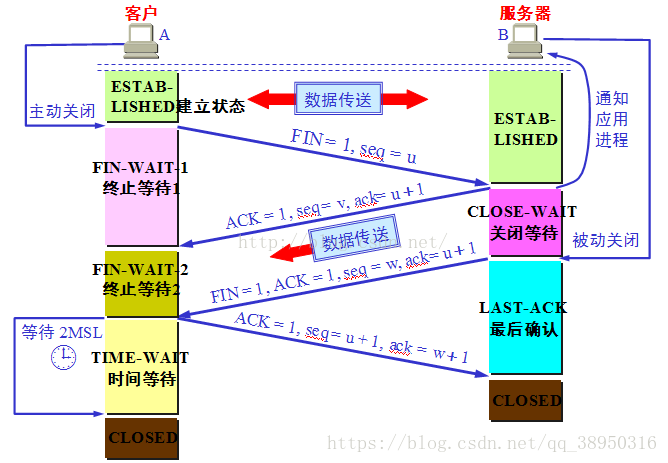
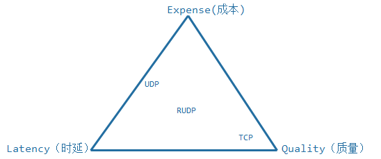

交换机与路由器的区别

交换机工作于数据链路层，能识别 MAC 地址，根据 MAC 地址转发链路层数据帧。具有自学机制来维护 IP 地址与 MAC 地址的映射。

路由器位于网络层，能识别 IP 地址并根据 IP 地址转发分组。维护着路由表，根据路由表选择最佳路线。

 


# 各种层次结构


OSI 七层模型和 TCP/IP 四层体系结构


网桥、ARP、IP、ICMP、TCP、UDP、DNS、DHCP


## TCP

计算机网络.assets


## IP

IP 数据报格式如下图所示，它是由 IP 首部与数据组成的。 IP 首部长度通常为 20 字节。如果含有选项字段， IP 首部长度将会大于 20 字节，但不会超过 60 字节。

 

 

1. 版本/首长/服务/总长 乘 4 可得到用字节表示的长度，所以 IP 首部长度为 20～60 个字节。 该字段表示首部加上数据的长度。

2. 标识/分片标志/整体偏移量

   1. 第 1 位保留；

      第 2 位为不分片标志，表示此数据包不可以被分片；

      第 3 位为更多分片标志，表示在分片包之后还有分片。

3. TTL/高层协议/首部校验和

   1. 经过路由器的跳数计算的。通常生存时间的值是 32、 64、 128。IGMP是1，表示不能跳出路由器

4. 源IP

5. 目的IP


### 路由协议-内部网关协议(用于AS内部)

#### RIP协议

RIP协议使用两个子网之间经过的子网数来作为距离, 相邻子网距离为1, 称为跳数.

相邻路由器交换路由选择信息, 其中包含了路由器自身已知的到其他路由器的跳数.
路由器根据接收到的路由选择信息更新**转发表**. 转发表包含目的子网, 下一跳路由, 到目的子网的跳数.

#### OSPF协议

工作在网络层, 依赖IP.

和全局的所有路由器交换信息, 用得到的信息构建链路状态数据库, 用Dijkstra算法计算最短路径, 生成路由表.
详细过程为:

1. 路由器和直接相连的路由器交互, 发送Hello报文, 建立邻居关系.
2. 路由器根据和直接相连的路由器间的链路构建**链路状态广播(LSA)**, LSA记录了所有相邻的路由器及其表示, 链路类型, 带宽等.
3. 路由器将自己的LSA发送给所有邻居, 接收到LSA的路由器也会将LSA发送给其他邻居节点.(组播)
   最终一个区域中的所有路由器都可以得到区域的完整拓扑, 并基于此来构建链路状态数据库.
4. 根据链路状态数据库, 路由器采用Dijkstra算法计算出一棵以自己为根的最短路径树, 并生成路由表.

OSPF运行在一个**自治域(AS)**中, 并允许将一个自治域划分为多个区域, 其中必须有一个是骨干域,
其他的称为非骨干域, 每个非骨干域都必须与骨干域相连(直接或间接).
根据路由器接口所在区域的不同, 一个路由器可以有三种角色.

- *区域内部路由器*: 所有接口都在区域之中;
- *区域边界路由器(ABR)*: 用于连接非骨干区域和骨干区域, 即有的接口处于非骨干区域, 有的接口处于骨干区域,
  前者可以有多个处于不同非骨干区域的.
- *自治域边界路由器(ASBR)*: 用于连接当前AS与其他AS.

#### IS-IS协议

工作在网络层.

与OSPF的不同点:

- 虽然将AS划分为多个区域, 但是区域的边界在链路, OSPF的区域边界在区域边界路由器(ABR).
  进而OSPF中每条链路只属于一个区域, 而IS-IS中每台路由器只属于一个区域.
- 在区域内采用最短路径优先来计算路径, 在区域间用距离向量来计算路径.

IS-IS协议同样将AS划分为多个区域, 区域之间通过链路(OSPF是路由器)相连.
IS-IS中路由器分为三种:

- level 1 路由器: 作用于区域内, 没有直接连接到其他区域的链路. 负责收集区域内的路径信息.
- level 1-2 路由器: 有直接连接到其他区域的链路, 负责收集区域间的路径信息.
- level 2 路由器: 作用于区域外, 负责收集区域内和区域间的路径信息. 类似OSPF中的ABR.(?)

### 路由协议-外部网关协议(用于AS之间)

#### BGP协议

BGP路由基于前缀, 采用路由聚合策略, AS之间通过网关路由器交换信息.

### 路由转发过程

- 路由表包含下面的信息: 目的ip, 子网掩码, 下一条ip, 标志, 接口等. 使用最长前缀匹配算法来寻找下一跳.
- 最长前缀匹配算法: 在表中搜索所有条目, 记录掩码运算后匹配的条目, 并选择最匹配(即掩码最长)的条目进行转发.
  如果不存在匹配条目, 就返回ICMP报文, 指明"主机不可达". 存在有多个最匹配条目的情况, 此时可以直接选择第一个,
  也可以利用此来实现负载均衡, 拆分流量等.

## DHCP协议

使得主机可以自动获取ip地址. 步骤如下:

1. DHCP服务器发现: 新到主机广播**DHCP发现报文**(ip数据包), 并且设置源地址为 0.0.0.0, 并设置 xid(标记此次会话).
2. DHCP服务器提供: 收到**DHCP发现报文**的DHCP服务器会广播回复**DHCP提供报文**, 其中包含对应 xid,
   提供给客户的ip地址, 子网掩码, ip地址租用期.
3. DHCP请求: 新到的主机从若干个**DHCP提供报文**提供的ip地址中挑选一个, 并对该DHCP服务器发送一个**DHCP请求报文**,
   回显配置参数.
4. DHCP ACK: 服务器用**DHCP ACK报文**对请求报文进行响应, 证实客户要求的参数.

客户一旦收到 ACK, 交互就完成了. 并且还有机制使得用户可以延长租约.

## NAT协议

路由器保存一张NAT转换表, 记录局域网客户 ip:port 到广域网的 ip:port 的映射, 对向外的报文替换源地址和端口,
对向内的报文替换目的地址和端口. 注意这还需要重新计算校验码.

## ICMP协议

建立在IP协议之上.

**ping**程序基于ICMP协议, 探测方发送一个 ICMP 请求数据包, 目的端如果没有屏蔽ICMP报文, 就会回复一个ICMP应答数据包.

**traceroute**基于TTL的规则, 可以采用ICMP实现, 也可以采用UDP实现. 下面是基于UDP的实现介绍.
首先设置TTL=1(在IP协议的头部), 这样到第一跳时, TTL减一之后就为0, 路由器就会返回不可达错误.
其后不断使TTL加 1, 直到到达指定目的地. 这样就能得到主机之间的路径.
并且, 程序使用的端口号大于30000, 到达目的主机后, 由于不存在这个端口, 同样会产生不可达错误,
并返回ICMP不可达给源主机. 这样源主机就知道到达了目的主机.
在基于ICMP的实现中中间路径的获取同样基于TTL的原理, 确认到达目的则是依据目的的ICMP回复.

## HTTP协议

### 特点

http是无状态协议, 不保存关于客户的任何信息.

可以采用持续连接和非持续连接两种方式. http默认采用带流水线的持续连接.

- 持续连接: 每一次http请求/响应都经过相同的tcp连接. 一般如果一条tcp连接经过一定时间(可配置)仍未使用,
  http服务器就会关闭该链接.
- 非持续连接: 每一次http请求/响应经过不同的tcp连接.

- 

下面介绍 **post 和 put 的区别**. 二者相同点是都需要指定一个 URI, 包含一个资源实体, 用于向服务端提交资源.
对于 post, URI被作为目录, 资源会被放置在该目录下(要求目录已经存在, 否则会返回错误), 资源的名字由服务端决定.
对于 put, URI 就是资源在服务端的完整路径.
因此, 当多次调用同一 post 方法时, 同一资源会在同一目录下保存多份, 每个资源被分配不同的名字, 因此 post 不是幂等的.
而多次调用同一 put 时, 新的请求的资源实体会覆盖已保存资源(虽然两个资源是相同的). 因此 put 是幂等的.

**条件Get**: 用于节省带宽, 降低负载. 用户发起get请求时, 发现本地有资源的缓存, 就设置 If-Modified-Since 字段,
后面指明时间, 如果服务器发现该时间之后对应资源没有改变, 就告知请求者, 并且不返回资源, 请求者就可以直接加载本地的资源.

## DNS协议

dns协议的作用:

- 域名解析
- 主机别名
- 邮件服务器别名
- 负载均衡

dns服务器层次:

- 根域名服务器
- 顶级域服务器
- 权威dns服务器
- 本地dns服务器

dns 解析过程分为递归查询和迭代查询两种, 实际中是二者结合使用, 从终端用户看来是递归查询,
而根域名服务器和顶级域服务器都是迭代查询.

- 递归查询: 当dns服务器无法获得ip时, 将请求转发到下一级, 再将下一级的请求转发给请求者.
- 迭代查询: 由dns服务器先向根域名服务器发起查询, 根据回复, dns服务器再向下一级dns服务器发起查询, 直到获得ip.

本地dns服务器可以缓存常用主机名到ip的映射, 以加快dns解析. 但是缓存不能太长, 因为 dns 的映射不是永久的.

在浏览器中输入URL时的解析过程:

1. 浏览器检查自身的DNS缓存, 没有则调用对应接***由操作系统进行解析.
2. 操作系统先检查hosts文件是否有该映射, 有则返回.
3. 向本地指定的dns服务器发起查询, 等待返回.
4. 本地dns服务器检查缓存和本地记录, 如果没有就进行递归查询.

## HTTPS协议

握手过程:

1. Client Hello: 客户端向服务器发送消息. 其中包含一个客户端生成的随机数(val1).
2. Server Hello: 服务器相应客户端的请求. 其中包含一个服务器生成的随机数(val2)和服务器的证书.
3. 客户端请求: 客户端验证证书之后, 从证书中取出服务器的公钥, 并回复服务器.
   其中包含一个用公钥加密过的随机数(val3), 并通知服务端握手结束.
4. 服务器回应: 服务器通过私钥解密随机数(val3), 并用三个随机数生成一个对称秘钥, 之后的数据都会有此密钥加密,
   并通知握手结束.(此时客户端也知道了三个随机数, 也就可以生成对称秘钥)

### Cookie和Session

用于识别用户的身份，Cookie保存在客户端，Session保存在服务器端。

## ARP协议

网络层的ARP协议工作原理

　　网络层的ARP协议完成了IP地址与物理地址的映射。首先，每台主机都会在自己的ARP缓冲区中建立一个ARP列表，以表示IP地址和MAC地址的对应关系。当源主机需要将一个数据包要发送到目的主机时，会首先检查自己ARP列表中是否存在该IP地址对应的MAC地址：如果有，就直接将数据包发送到这个MAC地址；如果没有，就向本地网段发起一个ARP请求的广播包，查询此目的主机对应的MAC地址。此ARP请求数据包里包括源主机的IP地址、硬件地址、以及目的主机的IP地址。网络中所有的主机收到这个ARP请求后，会检查数据包中的目的IP是否和自己的IP地址一致。如果不相同就忽略此数据包；如果相同，该主机首先将发送端的MAC地址和IP地址添加到自己的ARP列表中，如果ARP表中已经存在该IP的信息，则将其覆盖，然后给源主机发送一个ARP响应数据包，告诉对方自己是它需要查找的MAC地址；源主机收到这个ARP响应数据包后，将得到的目的主机的IP地址和MAC地址添加到自己的ARP列表中，并利用此信息开始数据的传输。如果源主机一直没有收到ARP响应数据包，表示ARP查询失败。

用于发现子网中主机的MAC地址. 过程为:

- 主机广播请求指定 ip 的 mac 地址, 该请求被封装为一个链路层数据帧.
- 子网上的主机收到后, 检查自身ip地址是否等于请求中的ip地址, 若等于, 就向请求主机发送回复.
- 主机收到回复后, 更新arp表.

## 常见问题

### 访问一个网址的过程

1. dns解析.
2. 发起TCP连接.
3. 向指定服务器发起HTTP请求. 服务器可能会进行反向代理, 将请求转发到其他服务器进行处理.
4. 浏览器获取到返回结果后, 进行渲染. 如果是**非持续连接**, 就会关闭TCP连接.
5. 某些资源可能需要再次发起HTTP请求, 过程同上.


1. ★★★ 各层协议的作用，以及 TCP/IP 协议的特点。
2. ★★☆ 以太网的特点，以及帧结构。
3. ★★☆ 集线器、交换机、路由器的作用，以及所属的网络层。
4. ★★☆ IP 数据数据报常见字段的作用。
5. ★☆☆ ARP 协议的作用，以及维护 ARP 缓存的过程。
6. ★★☆ ICMP 报文种类以及作用；和 IP 数据报的关系；Ping 和 Traceroute 的具体原理。
7. ★★★ 可靠传输原理，并设计可靠 UDP 协议。
8. ★★☆ TCP 拥塞控制的作用，理解具体原理。
9. ★★☆ DNS 的端口号；TCP 还是 UDP；作为缓存、负载均衡。

### 五层协议

- 应用层: 为特定的应用传输数据. HTTP, SMTP, DNS
- 传输层: 实现进程到进程之间的通信. TCP/UDP 协议
- 网络层: 实现主机到主机之间的通信. IP, ICMP, ARP, OSPF协议.
- 链路层: 为同一链路的主机提供服务. PPP协议, MAC协议
- 物理层: 在传输媒体上传输比特流, 尽可能为数据链路层屏蔽不同通信设备的差异. RJ45, IEEE802.3协议.

# TCP

```
题目：
    随着IP网络的发展，为了节省可分配的注册IP地址，有一些地址被拿出来用于私有IP地址，以下不属于私有IP地址范围的是：
    A. 10.6.207.84
    B. 172.23.30.28
    C. 172.32.50.80
    D. 192.168.1.100

答案：
    C

解答：
    1. 私有IP地址共有三个范围段：
        A: 10.0.0.0~10.255.255.255，即10.0.0.0/8。
        B: 172.16.0.0~172.31.255.255，即172.16.0.0/12。
        C: 192.168.0.0~192.168.255.255，即192.168.0.0/16。
    2. 私有IP在公网上不能使用，但在内网内可以通过NAT技术分配给具体设备，节省IP地址。
```


## TCP优雅关闭连接 shutdown()


close()/close[socket](http://c.biancheng.net/socket/)() 函数意味着完全断开连接，即不能发送数据也不能接收数据，这种“生硬”的方式有时候会显得不太“优雅”。


主机A发送完数据后，单方面调用 close()/closesocket() 断开连接，之后主机A、B都不能再接受对方传输的数据。实际上，是完全无法调用与数据收发有关的函数。


一般情况下这不会有问题，但有些特殊时刻，需要只断开一条数据传输通道，而保留另一条。

使用 shutdown() 函数可以达到这个目的，它的原型为：

```c++
int shutdown(int sock, int howto);  //Linux
int shutdown(SOCKET s, int howto);  //Windows
```

sock 为需要断开的套接字，howto 为断开方式。


howto 在 Linux 下有以下取值：

- SHUT_RD：断开输入流。套接字无法接收数据（即使输入缓冲区收到数据也被抹去），无法调用输入相关函数。
- SHUT_WR：断开输出流。**发送FIN**，套接字无法发送数据，但如果输出缓冲区中还有未传输的数据，则将传递到目标主机。
- SHUT_RDWR：同时断开 I/O 流。相当于分两次调用 shutdown()，其中一次以 SHUT_RD 为参数，另一次以 SHUT_WR 为参数。


howto 在 Windows 下有以下取值：

- SD_RECEIVE：关闭接收操作，也就是断开输入流。
- SD_SEND：关闭发送操作，也就是断开输出流。
- SD_BOTH：同时关闭接收和发送操作。


至于什么时候需要调用 shutdown() 函数，下节我们会以文件传输为例进行讲解。


close()/closesocket()和shutdown()的区别

确切地说，close() / closesocket() 用来关闭套接字，将套接字描述符（或句柄）从内存清除，之后再也不能使用该套接字，与C语言中的 fclose() 类似。应用程序关闭套接字后，与该套接字相关的连接和缓存也失去了意义，TCP协议会自动触发关闭连接的操作。

shutdown() 用来关闭连接，而不是套接字，不管调用多少次 shutdown()，套接字依然存在，直到调用 close() / closesocket() 将套接字从内存清除。

调用 close()/closesocket() 关闭套接字时，或调用 shutdown() 关闭输出流时，都会向对方发送 FIN 包。FIN 包表示数据传输完毕，计算机收到 FIN 包就知道不会再有数据传送过来了。

默认情况下，close()/closesocket() 会立即向网络中发送FIN包，不管输出缓冲区中是否还有数据，而shutdown() 会等输出缓冲区中的数据传输完毕再发送FIN包。也就意味着，调用 close()/closesocket() 将丢失输出缓冲区中的数据，而调用 shutdown() 不会。


TIME_WAIT(2MSL)

\1. 确保最后一个确认报文段能够到达。如果 B 没收到 A 发送来的确认报文段，那么就会重新发送连接释放请求报文段，A 等待一段时间就是为了处理这种情况的发生。

\2. 可能存在“已失效的连接请求报文段”，为了防止这种报文段出现在本次连接之外，需要等待一段时间。防止串话。

TCP 滑动窗口

 

TCP 可靠传输

1、确认和重传：接收方收到报文就会确认，发送方发送一段时间后没有收到确认就重传。

2、数据校验

3、数据合理分片和排序：

　　UDP：IP数据报大于1500字节,大于MTU.这个时候发送方IP层就需要分片(fragmentation).把数据报分成若干片,使每一片都小于MTU.而接收方IP层则需要进行数据报的重组.这样就会多做许多事情,而更严重的是,由于UDP的特性,当某一片数据传送中丢失时,接收方便无法重组数据报.将导致丢弃整个UDP数据报.

　　tcp会按MTU合理分片，接收方会缓存未按序到达的数据，重新排序后再交给应用层。

4、流量控制：当接收方来不及处理发送方的数据，能提示发送方降低发送的速率，防止包丢失。

5、拥塞控制：当网络拥塞时，减少数据的发送。

 

TCP 流量控制

流量控制是为了控制发送方发送速率，保证接收方来得及接收。

接收方发送的确认报文中的窗口字段可以用来控制发送方窗口大小，从而影响发送方的发送速率。例如将窗口字段设置为 0，则发送方不能发送数据。

TCP 拥塞控制


ssthresh：处理拥塞时参照的一个参数。例子中初始值为16，后来变为12。

当cwnd> ssthresh，cwnd以慢开始的方法指数增长；

当cwnd< ssthresh，cwnd以拥塞避免的方法线性增长。

 

快重传：收到3个同样的确认就立刻重传，不等到超时；

快恢复：cwnd不是从1重新开始。

 

网络编程一般步骤

· TCP：

o 服务端：socket -> bind -> listen -> accept -> recv/send -> close。

o 客户端：socket -> connect -> send/recv -> close。

· UDP：

o 服务端：socket -> bind -> recvfrom/sendto -> close。

o 客户端：socket -> sendto/recvfrom -> close。

 

TCP和UDP区别

TCP面向连接（三次握手），通信前需要先建立连接；UDP面向无连接，通信前不需要连接。

TCP通过序号、重传、流量控制、拥塞控制实现可靠传输；UDP不保障可靠传输，尽最大努力交付。

TCP面向字节流传输，因此可以被分割并在接收端重组；UDP面向数据报传输。

 

TCP为什么不是两次握手而是三次

如果仅两次连接可能出现一种情况：客户端发送完连接报文（第一次握手）后由于网络不好，延时很久后报文到达服务端，服务端接收到报文后向客户端发起连接（第二次握手）。此时客户端会认定此报文为失效报文，但在两次握手情况下服务端会认为已经建立起了连接，服务端会一直等待客户端发送数据，但因为客户端会认为服务端第二次握手的回复是对失效请求的回复，不会去处理。这就造成了服务端一直等待客户端数据的情况，浪费资源。

 

TCP为什么挥手是四次而不是三次

TCP是全双工的，它允许两个方向的数据传输被独立关闭。当主动发起关闭的一方关闭连接之后，TCP进入半关闭状态，此时主动方可以只关闭输出流。

之所以不是三次而是四次主要是因为被动关闭方将"对主动关闭报文的确认"和"关闭连接"两个操作分两次进行。

对主动关闭报文的确认是为了快速告知主动关闭方，此关闭连接报文已经收到。此时被动方不立即关闭连接是为了将缓冲中剩下的数据从输出流发回主动关闭方（主动方接收到数据后同样要进行确认），因此要把"确认关闭"和"关闭连接"分两次进行。

 

1. ISO七层模型中表示层和会话层功能是什么？

   - 表示层：图像、视频编码解，数据加密。

   - 会话层：建立会话，如session认证、断点续传。

2. 描述TCP头部？

   - 序号（32bit）：传输方向上字节流的字节编号。初始时序号会被设置一个随机的初始值（ISN），之后每次发送数据时，序号值 = ISN + 数据在整个字节流中的偏移。假设A -> B且ISN = 1024，第一段数据512字节已经到B，则第二段数据发送时序号为1024 + 512。用于解决网络包乱序问题。

   - 确认号（32bit）：接收方对发送方TCP报文段的响应，其值是收到的序号值 + 1。

   - 首部长（4bit）：标识首部有多少个4字节 * 首部长，最大为15，即60字节。

   - 标志位（6bit）：
     - URG：标志紧急指针是否有效。

     - ACK：标志确认号是否有效（确认报文段）。用于解决丢包问题。

     - PSH：提示接收端立即从缓冲读走数据。

     - RST：表示要求对方重新建立连接（复位报文段）。

     - SYN：表示请求建立一个连接（连接报文段）。

     - FIN：表示关闭连接（断开报文段）。

   - 窗口（16bit）：接收窗口。用于告知对方（发送方）本方的缓冲还能接收多少字节数据。用于解决流控。

   - 校验和（16bit）：接收端用CRC检验整个报文段有无损坏。

3. 三次握手过程？

   - 第一次：客户端发含SYN位，SEQ_NUM = S的包到服务器。（客 -> SYN_SEND）

   - 第二次：服务器发含ACK，SYN位且ACK_NUM = S + 1，SEQ_NUM = P的包到客户机。（服 -> SYN_RECV）

   - 第三次：客户机发送含ACK位，ACK_NUM = P + 1的包到服务器。（客 -> ESTABLISH，服 -> ESTABLISH）

4. 四次挥手过程？

   - 第一次：客户机发含FIN位，SEQ = Q的包到服务器。（客 -> FIN_WAIT_1）

   - 第二次：服务器发送含ACK且ACK_NUM = Q + 1的包到服务器。（服 -> CLOSE_WAIT，客 -> FIN_WAIT_2）
     - 此处有等待

   - 第三次：服务器发送含FIN且SEQ_NUM = R的包到客户机。（服 -> LAST_ACK，客 -> TIME_WAIT）
     - 此处有等待

   - 第四次：客户机发送最后一个含有ACK位且ACK_NUM = R + 1的包到客户机。（服 -> CLOSED）

5. 为什么握手是三次，挥手是四次？

   - 对于握手：握手只需要确认双方通信时的初始化序号，保证通信不会乱序。（第三次握手必要性：假设服务端的确认丢失，连接并未断开，客户机超时重发连接请求，这样服务器会对同一个客户机保持多个连接，造成资源浪费。）

   - 对于挥手：TCP是双工的，所以发送方和接收方都需要FIN和ACK。只不过有一方是被动的，所以看上去就成了4次挥手。

6. TCP连接状态？

   - CLOSED：初始状态。

   - LISTEN：服务器处于监听状态。

   - SYN_SEND：客户端socket执行CONNECT连接，发送SYN包，进入此状态。

   - SYN_RECV：服务端收到SYN包并发送服务端SYN包，进入此状态。

   - ESTABLISH：表示连接建立。客户端发送了最后一个ACK包后进入此状态，服务端接收到ACK包后进入此状态。

   - FIN_WAIT_1：终止连接的一方（通常是客户机）发送了FIN报文后进入。等待对方FIN。

   - CLOSE_WAIT：（假设服务器）接收到客户机FIN包之后等待关闭的阶段。在接收到对方的FIN包之后，自然是需要立即回复ACK包的，表示已经知道断开请求。但是本方是否立即断开连接（发送FIN包）取决于是否还有数据需要发送给客户端，若有，则在发送FIN包之前均为此状态。

   - FIN_WAIT_2：此时是半连接状态，即有一方要求关闭连接，等待另一方关闭。客户端接收到服务器的ACK包，但并没有立即接收到服务端的FIN包，进入FIN_WAIT_2状态。

   - LAST_ACK：服务端发动最后的FIN包，等待最后的客户端ACK响应，进入此状态。

   - TIME_WAIT：客户端收到服务端的FIN包，并立即发出ACK包做最后的确认，在此之后的2MSL时间称为TIME_WAIT状态。

7. 解释FIN_WAIT_2，CLOSE_WAIT状态和TIME_WAIT状态？

   - FIN_WAIT_2：
     - 半关闭状态。

     - 发送断开请求一方还有接收数据能力，但已经没有发送数据能力。

   - CLOSE_WAIT状态：
     - 被动关闭连接一方接收到FIN包会立即回应ACK包表示已接收到断开请求。

     - 被动关闭连接一方如果还有剩余数据要发送就会进入CLOSED_WAIT状态。

   - TIME_WAIT状态：
     - 又叫2MSL等待状态。

     - 如果客户端直接进入CLOSED状态，如果服务端没有接收到最后一次ACK包会在超时之后重新再发FIN包，此时因为客户端已经CLOSED，所以服务端就不会收到ACK而是收到RST。所以TIME_WAIT状态目的是防止最后一次握手数据没有到达对方而触发重传FIN准备的。

     - 在2MSL时间内，同一个socket不能再被使用，否则有可能会和旧连接数据混淆（如果新连接和旧连接的socket相同的话）。

8. 解释RTO，RTT和超时重传？

   - 超时重传：发送端发送报文后若长时间未收到确认的报文则需要重发该报文。可能有以下几种情况：

     - 发送的数据没能到达接收端，所以对方没有响应。

     - 接收端接收到数据，但是ACK报文在返回过程中丢失。

     - 接收端拒绝或丢弃数据。

   - RTO：从上一次发送数据，因为长期没有收到ACK响应，到下一次重发之间的时间。就是重传间隔。
     - 通常每次重传RTO是前一次重传间隔的两倍，计量单位通常是RTT。例：1RTT，2RTT，4RTT，8RTT......

     - 重传次数到达上限之后停止重传。

   - RTT：数据从发送到接收到对方响应之间的时间间隔，即数据报在网络中一个往返用时。大小不稳定。

9. 流量控制原理？

   - 目的是接收方通过TCP头窗口字段告知发送方本方可接收的最大数据量，用以解决发送速率过快导致接收方不能接收的问题。所以流量控制是点对点控制。

   - TCP是双工协议，双方可以同时通信，所以发送方接收方各自维护一个发送窗和接收窗。

     - 发送窗：用来限制发送方可以发送的数据大小，其中发送窗口的大小由接收端返回的TCP报文段中窗口字段来控制，接收方通过此字段告知发送方自己的缓冲（受系统、硬件等限制）大小。

     - 接收窗：用来标记可以接收的数据大小。

   - TCP是流数据，发送出去的数据流可以被分为以下四部分：已发送且被确认部分 | 已发送未被确认部分 | 未发送但可发送部分 | 不可发送部分，其中发送窗 = 已发送未确认部分 + 未发但可发送部分。接收到的数据流可分为：已接收 | 未接收但准备接收 | 未接收不准备接收。接收窗 = 未接收但准备接收部分。

   - 发送窗内数据只有当接收到接收端某段发送数据的ACK响应时才移动发送窗，左边缘紧贴刚被确认的数据。接收窗也只有接收到数据且最左侧连续时才移动接收窗口。

10. 拥塞控制原理？

    - 拥塞控制目的是防止数据被过多注网络中导致网络资源（路由器、交换机等）过载。因为拥塞控制涉及网络链路全局，所以属于全局控制。控制拥塞使用拥塞窗口。

    - TCP拥塞控制算法：
      - 慢开始 & 拥塞避免：先试探网络拥塞程度再逐渐增大拥塞窗口。每次收到确认后拥塞窗口翻倍，直到达到阀值ssthresh，这部分是慢开始过程。达到阀值后每次以一个MSS为单位增长拥塞窗口大小，当发生拥塞（超时未收到确认），将阀值减为原先一半，继续执行线性增加，这个过程为拥塞避免。

      - 快速重传 & 快速恢复：略。

      - 最终拥塞窗口会收敛于稳定值。

11. 如何区分流量控制和拥塞控制？

    - 流量控制属于通信双方协商；拥塞控制涉及通信链路全局。

    - 流量控制需要通信双方各维护一个发送窗、一个接收窗，对任意一方，接收窗大小由自身决定，发送窗大小由接收方响应的TCP报文段中窗口值确定；拥塞控制的拥塞窗口大小变化由试探性发送一定数据量数据探查网络状况后而自适应调整。

    - 实际最终发送窗口 = min{流控发送窗口，拥塞窗口}。

12. TCP如何提供可靠数据传输的？

    - 建立连接（标志位）：通信前确认通信实体存在。

    - 序号机制（序号、确认号）：确保了数据是按序、完整到达。

    - 数据校验（校验和）：CRC校验全部数据。

    - 超时重传（定时器）：保证因链路故障未能到达数据能够被多次重发。

    - 窗口机制（窗口）：提供流量控制，避免过量发送。

    - 拥塞控制：同上。

13. TCP soctet交互流程？

    - 服务器：

      - 创建socket -> int socket(int domain, int type, int protocol);

        - domain：协议域，决定了socket的地址类型，IPv4为AF_INET。

        - type：指定socket类型，SOCK_STREAM为TCP连接。

        - protocol：指定协议。IPPROTO_TCP表示TCP协议，为0时自动选择type默认协议。

      - 绑定socket和端口号 -> int bind(int sockfd, const struct sockaddr *addr, socklen_t addrlen);

        - sockfd：socket返回的套接字描述符，类似于文件描述符fd。

        - addr：有个sockaddr类型数据的指针，指向的是被绑定结构变量。

        ```C++
            // IPv4的sockaddr地址结构
            struct sockaddr_in {
                sa_family_t sin_family;    // 协议类型，AF_INET
                in_port_t sin_port;    // 端口号
                struct in_addr sin_addr;    // IP地址
            };
            struct in_addr {
                uint32_t s_addr;
            }
        ```

        - addrlen：地址长度。

      - 监听端口号 -> int listen(int sockfd, int backlog);

        - sockfd：要监听的sock描述字。

        - backlog：socket可以排队的最大连接数。

      - 接收用户请求 -> int accept(int sockfd, struct sockaddr *addr, socklen_t *addrlen);

        - sockfd：服务器socket描述字。

        - addr：指向地址结构指针。

        - addrlen：协议地址长度。

        - 注：一旦accept某个客户机请求成功将返回一个全新的描述符用于标识具体客户的TCP连接。

      - 从socket中读取字符 -> ssize_t read(int fd, void *buf, size_t count);

        - fd：连接描述字。

        - buf：缓冲区buf。

        - count：缓冲区长度。

        - 注：大于0表示读取的字节数，返回0表示文件读取结束，小于0表示发生错误。

      - 关闭socket -> int close(int fd);

        - fd：accept返回的连接描述字，每个连接有一个，生命周期为连接周期。

        - 注：sockfd是监听描述字，一个服务器只有一个，用于监听是否有连接；fd是连接描述字，用于每个连接的操作。

    - 客户机：

      - 创建socket -> int socket(int domain, int type, int protocol);

      - 连接指定计算机 -> int connect(int sockfd, struct sockaddr* addr, socklen_t addrlen);
        - sockfd客户端的sock描述字。

        - addr：服务器的地址。

        - addrlen：socket地址长度。

      - 向socket写入信息 -> ssize_t write(int fd, const void *buf, size_t count);
        - fd、buf、count：同read中意义。

        - 大于0表示写了部分或全部数据，小于0表示出错。

      - 关闭oscket -> int close(int fd);
        - fd：同服务器端fd。

---

###

### TCP特点

面向连接, 提供可靠通信, 支持全双工, 面向字节流, 点对点通信.

TCP通过确认和超时重传, 数据分片和排序, 流量控制, 拥塞控制, 数据校验实现可靠传输.

一个TCP套接字是由一个四元组来标识的: <源地址, 源端口号, 目的地址, 目的端口号>.

TCP握手阶段的SYN标志是占据一个序列号的, 而消耗了序列号就意味着SYN也是数据, 就会被可靠传输,
即对方会有ACK, 会有超时重传等措施. 而不消耗序列号的ACK不会被保证可靠传输.

### TCP处理流程

- 校验: 包含头部信息, 数据部分, 伪头部(源地址, 目的地址, 0, 协议号, TCP报文长度, 总计12字节).
  如果校验出错, 数据包被丢弃, 接收方可能会回复一个对之前已接受数据包的 ack, 以通知发送方重传此数据包.

### TCP流量控制

为了使发送方的发送速率与接收方的处理速率匹配, 通过维护**接收窗口**来实现, 接收窗口表明了接收方可用的缓存空间大小(字节数).
TCP头部的16位用于向另一方表明自身接口窗口的大小.
发送方可发送的最大序列号值为: 当前的ACK序列号+窗口大小.

UDP不支持流量控制, 当发送方发送数据过快时, 数据包会溢出, 导致数据包丢失.

- 滑动窗口: 累积确认, 回退N帧.

发送方窗口可以分为四个部分, 其中已发送未确认部分+即将发送部分就是对方宣告的窗口大小.

- 已发送, 已确认
- 已发送, 未确认
- 即将发送
- 不能发送

接收方窗口分为3个部分, 收到第一部分的数据包是重复的, 会被丢弃; 收到第三部分的数据包查出处理范围,
同样被丢弃. 只有收到第二部分的才会被保存下来, 但是只有收到左边界的数据包, 窗口才会右移.

- 已接收并确认
- 接收后将会保存
- 不能接收

### TCP拥塞控制


## 拥塞处理

　　计算机网络中的带宽、交换结点中的缓存及处理机等都是网络的资源。在某段时间，若对网络中某一资源的需求超过了该资源所能提供的可用部分，网络的性能就会变坏，这种情况就叫做拥塞。拥塞控制就是 防止过多的数据注入网络中，这样可以使网络中的路由器或链路不致过载。注意，拥塞控制和流量控制不同，前者是一个全局性的过程，而后者指点对点通信量的控制。拥塞控制的方法主要有以下四种：

1). 慢启动：不要一开始就发送大量的数据，先探测一下网络的拥塞程度，也就是说由小到大逐渐增加拥塞窗口的大小;

2). 拥塞避免：拥塞避免算法让拥塞窗口缓慢增长，即每经过一个往返时间RTT就把发送方的拥塞窗口cwnd加1，而不是加倍，这样拥塞窗口按线性规律缓慢增长。

　　　　　　　　　　

3). 快重传：快重传要求接收方在收到一个 失序的报文段 后就立即发出 重复确认（为的是使发送方及早知道有报文段没有到达对方）而不要等到自己发送数据时捎带确认。快重传算法规定，发送方只要一连收到三个重复确认就应当立即重传对方尚未收到的报文段，而不必继续等待设置的重传计时器时间到期。

　　　　　　　　　　

4). 快恢复：快重传配合使用的还有快恢复算法，当发送方连续收到三个重复确认时，就执行“乘法减小”算法，把ssthresh门限减半，但是接下去并不执行慢开始算法：因为如果网络出现拥塞的话就不会收到好几个重复的确认，所以发送方现在认为网络可能没有出现拥塞。所以此时不执行慢开始算法，而是将cwnd设置为ssthresh的大小，然后执行拥塞避免算法。

使发送方的发送速度与网络情况匹配, 这是对发送方发送速度的限制.
发送方通过超时, ack来感知网络的变化, 通过窗口大小来控制发送速度.

- 慢启动

当一个新的TCP连接建立或超时时, 执行慢启动. 慢启动指数地增长窗口大小, 每收到一个 ack 就将窗口乘以 2.
如果发生了超时, 将**阈值**设为当前窗口的一半, 窗口大小设为1, TCP重新进入**慢启动**状态.
如果窗口大于等于阈值, TCP进入**拥塞避免**状态.
如果收到 3 个重复的 ack, 表明发生了丢包, 进入**快速恢复**阶段.

连接建立时的窗口大小可以设定.

- 拥塞避免

线性地增长窗口, 每收到一个 ack 就将窗口加 1.
如果发生了超时, 将阈值设为当前窗口的一半, 窗口大小设为1, TCP重新进入**慢启动**状态.
如果收到 3 个重复的 ack, 表明发生了丢包, 进入**快速恢复**阶段.

- 快速恢复

先将阈值设为当前窗口的一半, 再将窗口设为 阈值 + 3*MSS, 然后重传丢失的数据包.
如果收到了期望的 ack, 就进入**拥塞避免**状态, 继续线性地增加窗口大小.
如果发生了超时, 就进入**慢启动**状态.

旧的实现采用**Tahoe算法**, 当遇到丢包时, 无论是超时还是重复ACK导致的, 到进入慢启动状态.
后来改为**Reno算法**, 区分了这两种丢包, 分别进入慢启动和快速恢复状态.

更新的实现采用了**NewReno算法**, Reno算法在有*多个数据包发生丢失时\*的表现不好.
在第一次收到ACK后, 退出快速恢复, 然后又接收到重复ACK, 再次进行快速恢复. 这个过程会重复多次, 降低了效率.
NewReno算法记录传输窗口的最高序列号(即\*恢复点*), 当发生拥塞避免时, 记录之前发送数据包的最高序列号,
只有当接收到的序列号不小于恢复点的ACK, 才会停止快速恢复阶段.

更复杂的算法是**选择确认(SACK)**, 利用TCP头部的可选项来记录丢失的序列号, 并且要在握手阶段指出是否支持SACK.
利用ack数据包前20字节的ACK序列号和option部分的序列号, 就可以确定丢失的数据.
option部分的序列号是成对出现的, 表示了已接受到数据的范围, 可以有多个序列对.
因为序列对占8个字节, option部分不超过40字节, 因此最多有4个序列对, 实际中由于其他选项占用一般最多只有3对.
设序列对为 (seq1, seq2), (seq3, seq4), (seq5, seq6), ack序列号为 seq0. 那么缺失的序列为: [seq0, seq1), [seq2, seq3), [seq4, seq5)[*s**e**q*0,*s**e**q*1),[*s**e**q*2,*s**e**q*3),[*s**e**q*4,*s**e**q*5).
有一点需要注意, 为了防止之前的SACK丢失, SACK会尽量包含之前的(最近的)SACK信息.

### 　累积确认

主要用于交互式数据传输的情况.(如ssh)

当收到数据时, 并不立即回复 ack, 而是等待一段时间, 尽可能使得 ack 能和这个方向上的数据一起发送.

### Nagle算法

是为了处理这样的情况: 大量的小数据包有效数据占比太少, 浪费了带宽. 例如用于交互式数据传输的情况(如ssh)

规定当存在没有被确认的数据包时, 过小的数据包不能被发送, 直到所有的数据都被确认.
并且确认之后, 需要将这些小数据整合到一个数据包发送.

### 三次握手

#### 三次握手的过程

1. 客户端发送 syn 数据包, 设置序列号(n).(由于设置了 SYN 字段, 虽然数据项为空, 仍然消耗一个序列号, 所以服务端的 ack 会加一)
2. 服务端接收到 syn 数据包后, 发送 syn&ack 数据包给客户端, 设置序列号(m), ack序列号(n+1).
3. 客户端收到 syn&ack 数据包后, 发送 ack 数据包给服务端, 设置序列号(n+1), ack序列号(m+1).

#### 三次握手为了解决哪些问题

- 交换双方的序列号.
- 当客户端的 syn 数据包长经过很长时间才到达服务端, 而此时客户端认为此数据包丢失时, 服务器会响应此数据包,
  客户端需要第三次握手来正确处理他. 例如发送RST. 如果客户端置之不理, 会导致服务端长期处于等待/重传状态.

### 四次挥手

#### 四次挥手的过程

对于主动关闭一方:

1. 发送 FIN, 进入 FIN_WAIT_1.
2. 收到 ACK, 进入 FIN_WAIT_2.
3. 收到 FIN, 回复 ACK, 进入 TIME_WAIT/2MSL.
4. 2MSL时间之后, 进入 CLOSED.

对于被动关闭一方:

1. 收到 FIN, 回复 ACK, 进入 CLOSE_WAIT.
2. 发送 FIN, 进入 LAST_ACK.
3. 收到 ACK, 进入 CLOSED.

#### 四次挥手的原因

TCP是全双工模式, 两次挥手只会释放一个方向的连接, 释放双向的连接需要四次. 当一方释放连接时,
另一方可能还有数据未传输完, 因此两次连接释放不能合并.

### 2MSL

当执行主动关闭的一方收到被动关闭一方的 FIN 数据包时, 回复 ACK 数据包, 就进入 TIME_WAIT 状态,
并至少持续 2MSL 时间. (MSL 表示报文在网络中最长的生存时间)

在 TIME-WAIT 状态, 当:

- 接收到 FIN 数据包时, 会再次回复 ACK.
- 期间端口号不能被再次使用.

这是为了解决两种异常情况：

- 防止被动关闭的一方没有收到回复的ack, 这样 FIN 就会再次发送, 主动关闭方收到后再次回复 ack,
  并重新进入 TIME_WAIT 状态.
- 保证此次连接的所有数据包都消失或被处理, 不会出现在新的连接中. 如果过快建立新的连接,
  可能本次连接的数据包因为延迟, 出现在新的连接之中.

### TCP 中的 Timer

注意一点, 下面说得timer并不是超时超时重传中用到的timer. 而且有的timer定义的是次数, 但是实际上协议栈并不仅仅只考虑次数,
会结合时间来看.

1. connection-establishment timer

   在建立tcp连接时起作用, 有两个:

   - tcp_syn_retries: client发送完 SYN 后, 进入 SYN_SENT 状态, 等待服务端回复 SYN+ACK.

   - tcp_synack_retries: server 收到 SYN, 回复完 SYN+ACK 后, 进入 SYN_RCVD 状态, 等待client的 ACK.

     在上面的两个等待中, 如果发生超时, 就会重传数据包. 但是不能无限制的重传, 因此分别定义了 *tcp_syn_retries* 和 *tcp_synack_retries*,
     二者表示重传的次数, 间接定义了最长的等待时间.

2. retransmission timer

   三次握手成功后, 连接建立, 客户端就可以发送数据包, 再等待服务端的ACK. 如果在指定时间内没有收到ACK,
   就会重传, 直到重传了指定的次数才会放弃. 这里存在两个timer, 都是重传次数:

   - tcp_retries1: 如果重传超过这个值, 就会更新路由缓存, 然后继续重传.
   - tcp_retries2: 如果重传超过这个值, 直接终止重传.

3. delayed ack timer

   一方收到数据包后, 可以等待一定时间, 等其他数据包达到后, 一起返回ACK. 这段等待时间为 *delayed ack timer*,
   一般最长为 200ms.

4. persist timer

   设想这样的情况: 当server缓存已满, 就会通知client自身窗口为0, 这导致client停止发送数据.
   当server出现空余空间后, 就需要通知client新的窗口大小, 但是这个通知不会携带任何数据,
   所以client不会回复ack, 因此即使这个数据包丢失了server也不会感知到(ACKs are not acknowledged, only data is acknowledged).
   如果此通告client没有接收到, 也就不会继续发送数据包. 因此需要一种机制来解决此问题:

   client知道server窗口为0后, 当有数据要发送时, 虽然知道不应该发送数据, 也会在**一段时间**后尝试发送一个字节.
   这段时间就是 *persist timer*.

5. keepalive timer

   当启用tcp socket的SO_KEEPALIVE option时, 即使双方没有数据发送, 也会保持连接. 保持连接的方式是发送probe segment.
   当连接经过一段时间(tcp_keepalive_time)没有数据包传送后, tcp就会主动发送 probe segment,
   强制对方回应. 并且每隔一段时间(tcp_keepalive_intvl)就会发送一个probe segment,
   如果对方没有回应, 在连续发送了一定数量(tcp_keepalive_probes)后, 主机就会放弃, 并终止连接.

6. fin_wait_2 timer

   client主动终止连接(发送FIN), 并收到ACK后, 就进入 fin_wait_2状态. 此时不能继续发送数据,
   如果server一直不发送FIN, client就会一直处于此状态, 导致资源无法释放. 因此定义了 *tcp_fin_timeout*(单位是秒),
   当处于fin_wait_2的时间超过这个时间时, 就会终止连接.

7. time_wait timer

   即2MSL, 其作用是为了回复的ack丢失时, 能收到重传的FIN并继续返回ack, 另一个是保证当前连接的数据包完全消失.


## 请求头


 

TCP 头 20～60 字节。首部在没有选项时 20字节，而当有选项时长度会增加，但是最大不会超过 60 字节。

1. 源口/目口0-65535
2. 序列号 序号指定了这个序列中的哪一个字节是报文的第一个字节 *每一方的初始序号都是不同的*
3. 确认号 确认号为服务器发送的上一个数据包中的序列号+所该数据包中所带数据的大小。TCP规定SYN FIN占用一个字节
4. 首长/保留/控制/窗口
   1. 指定 TCP 首部的长度，以 4 字节为单位。首部长度可以在 20～60 字节之间。因此，这个字段的值可以在 5 至 15 之间。
   2. 这是 6 位字段，保留为今后使用。
   3. 这个字段定义了 8 种不同的标志。FIN SYN ACK等
   4. 接收端决定的窗口大小
5. 校验和/紧急指针
   1. 伪首部、 TCP 首部和 TCP 数据部分。伪首部包含：32位源IP地址，32位目的IP地址，8位填充0，8位协议，16位TCP/UDP长度。
   2. 只有当紧急标志置位时，这个 16 位字段才有效，这时的报文中包括紧急数据。

 


| 标志 | 说明                                                         |
| ---- | ------------------------------------------------------------ |
| CWR  | 拥塞窗口减小（用来表明发送主机接收到了设置ECE标志的TCP包。拥塞窗口是被TCP维护的一个内部变量，用来管理发送窗口大小） |
| ECE  | 经历拥塞回送（用来在TCP 3次握手时表明一个TCP端是具备ECN功能的，并且表明接收到的TCP包的IP头部的ECN被设置为11） |
| URG  | 紧急指针字段值有效                                           |
| ACK  | 确认字段值有效                                               |
| PSH  | 推送数据                                                     |
| RST  | 连接必须复位                                                 |
| SYN  | 在连接建立时对序号进行同步***\*Syn\****chronize Sequence Numbers |
| FIN  | 终止连接                                                     |

### TCP窗口扩大选项（TCP Window Scale Option）

TCP窗口扩大选项 TCP Window Scale Option (WSopt)

窗口扩大选项用于扩大TCP通告窗口，使TCP的窗口定义从16bit增加为32bit。

1、[RFC 1323](http://tools.ietf.org/html/rfc1323#section-2)中关于窗口扩大选项的图示如下：

   TCP Window Scale Option (WSopt):
     Kind: 3 Length: 3 bytes
        +———+———+———+
        | Kind=3 |Length=3 |shift.cnt|
        +———+———+———+

2、要启用窗口扩大选项，通讯双方必须在各自的SYN报文中发送这个选项。主动建立连接的一方在SYN报文中发送这个选项；而被动建立连接的一方只有在收到带窗口扩大选项的SYN报文之后才能发送这个选项。

3、这个选项只在一个SYN报文中有意义（<SYN>或<SYN,ACK>），包含窗口扩大选项的报文如果没有SYN位，则会被忽略掉。当连接建立起来后，在每个方向的扩大因子是固定的。注意：在SYN报文本身的窗口字段始终不做任何的扩大（The Window field in a SYN (i.e., a <SYN> or <SYN,ACK>) segment itself is never scaled.）。

4、在启用窗口扩大选项的情况下，若发送一个窗口通告，要将实际窗口大小右移shift.cnt位，然后赋给TCP首部中的16bit窗口值；而当接收到一个窗口通告时，则将TCP首部中的16bit窗口值左移shift.cnt位，以获得实际的通告窗口大小。

5、shift.cnt取值范围为0~14，即最大TCP序号限定为2^16 * 2^ 14 = 2^30 < 2^31。该限制用于防止字节序列号溢出。

## 三次握手


第一次握手：建立连接时，客户端发送syn包（syn=j）到服务器，并进入SYN_SENT状态，等待服务器确认；SYN：同步序列编号（Synchronize Sequence Numbers）。

第二次握手：服务器收到syn包，必须确认客户的SYN（ack=j+1），同时自己也发送一个SYN包（syn=k），即SYN+ACK包，此时服务器进入SYN_RECV状态；

第三次握手：客户端收到服务器的SYN+ACK包，向服务器发送确认包ACK(ack=k+1），此包发送完毕，客户端和服务器进入ESTABLISHED（TCP连接成功）状态，完成三次握手。

### 为什么不能两次握手进行连接？

1. 答：3次握手完成两个重要的功能，既要双方做好发送数据的准备工作(双方都知道彼此已准备好)，也要允许双方就初始序列号进行协商，这个序列号在握手过程中被发送和确认。
2.    现在把三次握手改成仅需要两次握手，死锁是可能发生的。作为例子，考虑计算机S和C之间的通信，假定C给S发送一个连接请求分组，S收到了这个分组，并发 送了确认应答分组。按照两次握手的协定，S认为连接已经成功地建立了，可以开始发送数据分组。可是，C在S的应答分组在传输中被丢失的情况下，将不知道S 是否已准备好，不知道S建立什么样的序列号，C甚至怀疑S是否收到自己的连接请求分组。在这种情况下，C认为连接还未建立成功，将忽略S发来的任何数据分 组，只等待连接确认应答分组。而S在发出的分组超时后，重复发送同样的分组。这样就形成了死锁。

## 四次挥手



1. 客户端进程发出连接释放报文，并且停止发送数据。释放数据报文首部，FIN=1，其序列号为seq=u（等于前面已经传送过来的数据的最后一个字节的序号加1），此时，**客户端进入FIN-WAIT-1（终止等待1）状态**。 TCP规定，FIN报文段即使不携带数据，也要消耗一个序号。
2. 服务器收到连接释放报文，发出确认报文，ACK=1，ack=u+1，并且带上自己的序列号seq=v，此时，**服务端就进入了CLOSE-WAIT（关闭等待）状态**。TCP服务器通知高层的应用进程，客户端向服务器的方向就释放了，这时候处于半关闭状态，即客户端已经没有数据要发送了，但是服务器若发送数据，客户端依然要接受。这个状态还要持续一段时间，也就是整个CLOSE-WAIT状态持续的时间。
3. 客户端收到服务器的确认请求后，此时，**客户端就进入FIN-WAIT-2（终止等待2）状态**，等待服务器发送连接释放报文（在这之前还需要接受服务器发送的最后的数据）。
4. 服务器将最后的数据发送完毕后，就向客户端发送连接释放报文，FIN=1，ack=u+1，由于在半关闭状态，服务器很可能又发送了一些数据，假定此时的序列号为**seq=w**，此时，**服务器就进入了LAST-ACK（最后确认）状态**，等待客户端的确认。
5. 客户端收到服务器的连接释放报文后，必须发出确认，ACK=1，ack=w+1，而自己的序列号是seq=u+1，此时，客户端就进入了TIME-WAIT（时间等待）状态。注意此时TCP连接还没有释放，必须经过**2∗MSL（最长报文段寿命）**的时间后，当客户端撤销相应的TCB后，才进入CLOSED状态。
6. 服务器只要收到了客户端发出的确认，立即进入CLOSED状态。同样，撤销TCB后，就结束了这次的TCP连接。可以看到，服务器结束TCP连接的时间要比客户端早一些。

### 为什么连三关四？

1. 答：因为当Server端收到Client端的SYN连接请求报文后，可以直接发送SYN+ACK报文。其中ACK报文是用来应答的，SYN报文是用来同步的。但是关闭连接时，当Server端收到FIN报文时，很可能并不会立即关闭SOCKET，所以只能先回复一个ACK报文，告诉Client端，"你发的FIN报文我收到了"。只有等到我Server端所有的报文都发送完了，我才能发送FIN报文，因此不能一起发送。故需要四步握手。
2. 也可以理解为三次握手中间进行了压缩。

### 为什么TIME_WAIT状态需要经过2MSL？

1. 答：虽然按道理，四个报文都发送完毕，我们可以直接进入CLOSE状态了，但是我们必须**假象网络是不可靠的，有可以最后一个ACK丢失**。所以TIME_WAIT状态就是用来重发可能丢失的ACK报文。在Client发送出最后的ACK回复，但该ACK可能丢失。**Server如果没有收到ACK，将不断重复发送FIN片段。**所以Client不能立即关闭，它必须确认Server接收到了该ACK。Client会在发送出ACK之后进入到TIME_WAIT状态。Client会设置一个计时器，等待2MSL的时间。如果在**该时间内再次收到FIN，那么Client会重发ACK并再次等待2MSL。**所谓的2MSL是两倍的MSL(Maximum Segment Lifetime)。MSL指一个片段在网络中最大的存活时间，**2MSL就是一个发送和一个回复所需的最大时间。**如果直到2MSL，Client都没有再次收到FIN，那么**Client推断ACK已经被成功接收，则结束TCP连接。**

###   TIME_WAIT危害

谁主动关闭连接，谁就处于time外套状态

在高并发短连接的TCP服务器上，当服务器处理完请求后主动请求关闭连接，这样服务器上会有大量的连接处于TIME_WAIT状态，服务器维护每一个连接需要一个socket，也就是每个连接会占用一个文件描述符，而文件描述符的使用是有上限的，如果持续高并发，会导致一些连接失败。

还有一种情况，假设双十一，这是一台Tmall的服务器，因为一些原因，服务器进程挂掉了，退出了，由于是服务器主动关闭连接，因此会有TIME_WAIT状态存在，也就意味着服务器进程想立即重启，但是起不来，因为端口（可能是80）还被之前处于TIME_WAIT的连接占用着，如果TIME_WAIT状态维持60秒，60秒服务器都起不来，双十一，啧啧。

### 如何避免？

可设置套接字选项为SO_REUSEADDR，该选项的意思是，告诉操作系统，如果端口忙，但占用该端口TCP连接处于TIME_WAIT状态，并且套接字选项为SO_REUSEADDR，则该端口可被重用。如果TCP连接处于其他状态，依然返回端口被占用。该选项对服务程序重启非常有用。

## 已经建立连接，客户端突然故障怎么办？

TCP还设有一个保活计时器，显然，客户端如果出现故障，服务器不能一直等下去，白白浪费资源。服务器每收到一次客户端的请求后都会重新复位这个计时器，时间通常是设置为2小时，若两小时还没有收到客户端的任何数据，服务器就会发送一个探测报文段，以后每隔75秒钟发送一次。若一连发送10个探测报文仍然没反应，服务器就认为客户端出了故障，接着就关闭连接。

## 粘(nian)包怎么解决

TCP粘包：socket读取时，读到了实际意义上的两个或多个数据包的内容，同时将其作为一个数据包进行处理。TCP拆包：socket读取时，没有完整地读取一个数据包，只读取一部分。TCP协议是面向流的协议，这也是容易出现粘包问题的原因。而UDP是面向消息的协议，每个UDP段都是一条消息，应用程序必须以消息为单位提取数据，不能一次提取任意字节的数据，这一点和TCP是很不同的。

**解决方式：**

粘包/拆包问题一般的处理方式有四种：

1. 数据段定长处理，位数不足的空位补齐。
2. 消息头+消息体，消息头中一般会包含消息体的长度，消息类型等信息，消息体为实际数据体。
3. 特殊字符（如：回车符）作为消息数据的结尾，以实现消息数据的分段。
4. 复杂的应用层协议，这种方式使用的相对较少，耦合了网络层与应用层。

**在自定义的协议中，第二种方式用的比较多，因为它更能满足定制化协议开发需求**


##  tcp重排序

细节是什么 如果传输的数据很大是如何重排序的


## tcp如何保证稳定传输

tcp为什么是可靠的？

5、TCP协议如何来保证传输的可靠性

　　TCP提供一种面向连接的、可靠的字节流服务。其中，面向连接意味着两个使用TCP的应用（通常是一个客户和一个服务器）在彼此交换数据之前必须先建立一个TCP连接。在一个TCP连接中，仅有两方进行彼此通信；而字节流服务意味着两个应用程序通过TCP链接交换8bit字节构成的字节流，TCP不在字节流中插入记录标识符。

　　


对于可靠性，TCP通过以下方式进行保证：

数据包校验：目的是检测数据在传输过程中的任何变化，若校验出包有错，则丢弃报文段并且不给出响应，这时TCP发送数据端超时后会重发数据；

对失序数据包重排序：既然TCP报文段作为IP数据报来传输，而IP数据报的到达可能会失序，因此TCP报文段的到达也可能会失序。TCP将对失序数据进行重新排序，然后才交给应用层；

丢弃重复数据：对于重复数据，能够丢弃重复数据；

应答机制：当TCP收到发自TCP连接另一端的数据，它将发送一个确认。这个确认不是立即发送，通常将推迟几分之一秒；

超时重发：当TCP发出一个段后，它启动一个定时器，等待目的端确认收到这个报文段。如果不能及时收到一个确认，将重发这个报文段；

流量控制：TCP连接的每一方都有固定大小的缓冲空间。TCP的接收端只允许另一端发送接收端缓冲区所能接纳的数据，这可以防止较快主机致使较慢主机的缓冲区溢出，这就是流量控制。TCP使用的流量控制协议是可变大小的滑动窗口协议。


## 流量控制


## 并发包


## TCP状态的切换

TCP的状态变迁图
一个连接从开始建立到断开，经历了一连串的状态变化，这次主要分析下它的状态变迁图，首先上经典的状态变迁图


客户端的状态变迁：CLOSED-->SYN_SENT-->ESTABLISHED-->FIN_WAIT_1-->FIN_WAIT_2-->TIME_WAIT-->CLOSED

服务器的状态变迁：CLOSED-->LISTEN-->SYN_RCVD-->ESTABLISHED-->CLOSE_WAIT-->LAST_ACK--->CLOSED

CLOSED：这个状态不是一个真正的状态，是图中假想的一个起点或者是终点

LISTEN: 服务器等待连接过来的状态

SYN_SENT: 客户端发起连接（主动打开），变成此状态，如果SYN超时，或者服务器不存在直接CLOSED

SYN_RCVD:服务器收到SYN包的时候，就变成此状态，

ESTABLISHED：完成三次握手，进入连接建立状态，说明此时可以进行数据传输了

FIN_WAIT_1:客户端执行主动关闭，发送完FIN包之后便进入FIN_WAIT_1状态

FIN_WAIT_2:客户端发送FIN包之后，收到ACK，即进入此状态，其实就是半关闭的状态

TIME_WAIT：这个状态从图上看，有3中情况，从FIN_WAIT_2进入，客户端收到服务器发送过来的FIN包之后进入TIME_WAIT状态，有CLOSING状态进入，这是同时关闭的状态，同时发起FIN请求，同时接收并做了ACK的回复，从FIN_WAIT_1进入，收到对端的FIN,ACK，并回复ACK，这个地方感觉是，FIN和ACK是一块来的.

CLOSE_WAIT:接收到FIN之后，被动的一方进入此状态，并回复ACK

LAST_ACK：被动的一端发送FIN包之后 处于LAST_ACK状态

CLOSING:两边同时发出FIN请求


## 网络抖动

## 网络延迟


# UDP

## UDP

### UDP特点

无连接(没有握手过程), 尽最大努力交付, 面向报文, 首部只有8个字节, 支持多对多通信.

一个UDP套接字是由一个二元组来标识的: <目的地址, 目的端口号>.

UDP提供端到端的校验, 接收方会根据头部的**检验和**判断数据包是否发生错误, 但是不能恢复错误, 只能交由上层应用来处理.
**检验和**覆盖了UDP头部, UDP数据, 伪头部, 运算单位是2字节(16位). 伪头部指的是:

- 源地址ip(4字节)
- 目的地址ip(4字节)
- 0(1字节), 协议号(1字节), UDP长度(2字节)

之所以加上伪头部是为了检验数据是否到达了正确的目的地.

### UDP处理流程

   再然后他问socket编程用过吗？我说我在本科用java写了个局域网棋牌游戏，那时候用过一点，之后没怎么用过了。他问那网络你了解吗？我说我就只大概看了TCP和UDP什么的。他就问那你说说二者区别。我就大概说TCP需要连接比较安全，UDP不需要连接，比较高效，发出去也不保证送达。一般聊天就是TCP游戏用UDP（我看文章看回来的，就顺口一说……）他一下就抓住了后半句，你确定游戏都用UDP吗？我说游戏数据交换量大嘛，用UDP更快速。他说那我玩推箱子，向前向左向前，向左指令发丢了会发生什么？我说那你就向前了两次，这就是玩游戏丢包嘛。他说那你觉得这可以吗？我说像推箱子这种数据量小的可以用TCP嘛，数据量实在大的才用UDP。他说那moba游戏呢？比如我的英雄放两个互相配合的技能，前一个技能丢包了，你觉得可以接受吗？我说不能接受，但游戏丢包没办法嘛，我玩英雄联盟就经历过丢包。他说那你想想办法改进一下。接下来就开始了我长达十分钟的痛苦的UDP改进之旅。我其实想说那要不用回TCP吧，但他一直说“既然你那么坚持UDP”，弄得我都不好意思回头了。不过这部分应该就是他引导我思考的一个过程，看我能拿出怎么个解决方案吧。不过网络编程我是真不熟，根据他的意思反复改了几次，他才放过了我。

## UDP请求头

下图显示了 UDP 报文格式。每个 UDP 报文称为一个用户数据报（User Datagram），用户数据报分为两个部分： UDP 首部和 UDP 数据。首部被分为四个 16 位的字段，分别代表源端口号﹑目的端口号﹑报文的长度以及 UDP 校验和。

| 源端口（16 位）       | 目的端口（16 位） |
| --------------------- | ----------------- |
| 有效负载长度（16 位） | 校验和（16 位）   |

源端口：

可选的字段。不同的应用程序使用不同的端口号， UDP 协议使用端口号为不同的应用程序保留其各自的数据传输通道，从而实现了同一时间段内多个应用程序可以一起使用网络进行数据的发送和接收。

目的端口：

该字段表示数据包被发往的目的端的端口号。

有效负载长度：

该字段表示包括 UDP 首部和 UDP 数据在内的整个用户数据报的长度。该字段的最小值是 8。数据报的最大尺寸随操作系统的不同而不同。在两字节字段中，理论上数据报最多可达 65535 字节。然而，一些 UDP 实现将数据报的大小限制到了 8192字节。

校验和：

可选的。如果该字段值***\*为零就说明不进行校验\****。

## UDP的优势

1.  端到端NAT穿透
2. 弱网延时
3. 竞争带宽
4. 路径优化
5. 资源优化 如握手


## 如何设计一个可靠的udp

https://blog.csdn.net/yssycz/article/details/80132725

### 可靠的概念
在实时通信过程中，不同的需求场景对可靠的需求是不一样的，我们在这里总体归纳为三类定义：

1. 尽力可靠：通信的接收方要求发送方的数据尽量完整到达，但业务本身的数据是可以允许缺失的。例如：音视频数据、幂等性状态数据。
2. 无序可靠：通信的接收方要求发送方的数据必须完整到达，但可以不管到达先后顺序。例如：文件传输、白板书写、图形实时绘制数据、日志型追加数据等。
3. 有序可靠：通信接收方要求发送方的数据必须按顺序完整到达。

RUDP是根据这三类需求和图1的三角制约关系来确定自己的通信模型和机制的，也就是找通信的平衡点。


很多从业人员这希望通过一套完善的方案来设计一个通用的RUDP，个人觉得这不太可能，就算设计出来了，估计和TCP差不多，意义不大。

RUDP的价值在于根据不同的传输场景进行不同的技术选型，可能选择宽松的拥塞方式、也可能选择特定的重传模式，但不管怎么选，都是在**性能和可靠性**之间权衡



1. 实现方法：
   1. 将实现放到应用层，然后类似于TCP，实现确认机制、重传机制和窗口确认机制；
   2. 给数据包进行编号，按顺序接收并存储，接收端收到数据包后发送确认信息给发送端，发送端接收到确认信息后继续发送，若接收端接收的数据不是期望的顺序编号，则要求重发；（主要解决丢包和包无序的问题）

2. 已经实现的可靠UDP：

   1. RUDP  可靠数据报传输协议；

   2. RTP  实时传输协议 组播或单播网络服务下的交互式视频、音频或模拟数据

   3. UDT

      1. 基于UDP的数据传输协议，是一种互联网传输协议；

      2.  主要目的是支持高速广域网上的海量数据传输，引入了新的拥塞控制和数据可靠性控制机制（互联网上的标准数据传输协议TCP在高带宽长距离的网络上性能很差）；

           UDT是面向连接的双向的应用层协议，同时支持可靠的数据流传输和部分可靠的数据报服务；

           应用：高速数据传输，点到点技术(P2P)，防火墙穿透，多媒体数据传输

## TCP UDP区别？

| 名称     | TCP      | UDP             |
| -------- | -------- | --------------- |
| 连接     | 面向连接 | 无连接          |
| 可靠性   | 可靠     | 不可靠          |
| 点面     | 点对点   | 点面皆可 直播等 |
| 内容     | 流       | 报文            |
| 拥塞控制 | 有       | 无 适合媒体通信 |
| 首部     | 长       | 短 开销少       |
|          |          |                 |


### MTU和路径MTU

MTU: 链路层数据帧能携带的最大的数据量(不包含链路层头部), 例如以太网限制有效载荷为1500字节.
如果ip需要发送一个数据报, 并且这个数据报比链路层MTU要大, 则ip通过分片将数据包分解为多个较小的ip数据报,
使每个分片不超过MTU. 这导致ip头部多次出现, 降低了有效数据占的比例.

路径MTU: 两台主机跨越多个网络通信时, 每个链路可能有不同大小的MTU, 其中最小的称为路径MTU.


# Socket

1. epoll为什么用ET，什么情况下用LT？

   


阻塞和非阻塞I/O区别

如果内核缓冲没有数据可读时，read()系统调用会一直等待有数据到来后才从阻塞态中返回，这就是阻塞I/O。

非阻塞I/O在遇到上述情况时会立即返回给用户态进程一个返回值，并设置errno为EAGAIN。

对于往缓冲区写的操作同理。

同步和异步区别

同步I/O指处理I/O操作的进程和处理I/O操作的进程是同一个。

异步I/O中I/O操作由操作系统完成，并不由产生I/O的用户进程执行。

Reactor和Proactor区别

Reactor模式是同步I/O，处理I/O操作的依旧是产生I/O的程序；Proactor是异步I/O，产生I/O调用的用户进程不会等待I/O发生，具体I/O操作由操作系统完成。

异步I/O需要操作系统支持，Linux异步I/O为AIO，Windows为IOCP。

11. 
12. 介绍下proactor和reactor
       reactor的组成

socket熟悉吗？对它的读写缓冲区有理解吗？怎么的？那滑动窗口是怎样的？为什么这样设计？


- ★★☆ 五种 IO 模型的特点以及比较。
- ★★★ select、poll、epoll 的原理、比较、以及使用场景；epoll 的水平触发与边缘触发。

# HTTP/HTTPS

那什么是URL、URI、URN？

 

URI  Uniform Resource Identifier 统一资源标识符

URL  Uniform Resource Locator 统一资源定位符

  格式如下：  scheme://[username:password@]HOST:port/path/to/source

​        http://www.magedu.com/downloads/nginx-1.5.tar.gz

 

URN  Uniform Resource Name 统一资源名称

 

URL和URN 都属于 URI

 

为了方便就把URL和URI暂时都通指一个东西

## http请求8方法

- get: 用于获取信息, 是安全, 幂等的. 即不会对修改数据, 重复多次得到的结果相同. 幂等.
- head: 用于向服务请求某项资源, 服务器会按照get来处理, 但是不返回资源内容, 用户查看服务器性能. 幂等.
- post: 向服务器提交数据, 会导致在服务器上创建/修改资源. 非幂等.
- put: 向服务器提交数据, 如果已存在就会覆盖原有数据. 幂等.
- delete: 请求删除服务器的资源, 不存在则会忽略请求. 幂等.
- option: 查看指定资源支持的方法(如get, delete等), 用于检查客户端是否具有某项权限. 常用于测试服务器.
- trace: 请求服务器回显收到的请求信息, 用于测试服务器.


## HTTP 状态码

服务器返回的响应报文中第一行为状态行，包含了状态码以及原因短语，来告知客户端请求的结果。

| 状态码 | 类别                             | 原因短语                   |
| ------ | -------------------------------- | -------------------------- |
| 1XX    | Informational（信息性状态码）    | 接收的请求正在处理         |
| 2XX    | Success（成功状态码）            | 请求正常处理完毕           |
| 3XX    | Redirection（重定向状态码）      | 需要进行附加操作以完成请求 |
| 4XX    | Client Error（客户端错误状态码） | 服务器无法处理请求         |
| 5XX    | Server Error（服务器错误状态码） | 服务器处理请求出错         |

 

### 2XX 成功

200 OK

204 No Content：请求已经成功处理，但是返回的响应报文不包含实体的主体部分。一般在只需要从客户端往服务器发送信息，而不需要返回数据时使用。

206 Partial Content

### 3XX 重定向

301 Moved Permanently：永久性重定向

302 Found：临时性重定向

303 See Other

注：虽然 HTTP 协议规定 301、302 状态下重定向时不允许把 POST 方法改成 GET 方法，但是大多数浏览器都会把 301、302 和 303 状态下的重定向把 POST 方法改成 GET 方法。

304 Not Modified：如果请求报文首部包含一些条件，例如：If-Match，If-ModifiedSince，If-None-Match，If-Range，If-Unmodified-Since，但是不满足条件，则服务器会返回 304 状态码。

307 Temporary Redirect：临时重定向，与 302 的含义类似，但是 307 要求浏览器不会把重定向请求的 POST 方法改成 GET 方法。

### 4XX 客户端错误

400 Bad Request：请求报文中存在语法错误

401 Unauthorized：该状态码表示发送的请求需要有通过 HTTP 认证（BASIC 认证、DIGEST 认证）的认证信息。如果之前已进行过一次请求，则表示用户认证失败。

403 Forbidden：请求被拒绝，服务器端没有必要给出拒绝的详细理由。

404 Not Found

### 5XX 服务器错误

500 Internal Server Error：服务器正在执行请求时发生错误

503 Service Unavilable：该状态码表明服务器暂时处于超负载或正在进行停机维护，现在无法处理请求。

 

## HTTP常用字段

Cache-Control、Connection、Accept-Charset、Accept-Encoding、Accept-Language、Host、If-Match、If-Modified-Since、Allow


## Session 和 Cookie 区别

Session 是服务器用来跟踪用户的一种手段，每个 Session 都有一个唯一标识：Session ID。当服务器创建了一个 Session 时，给客户端发送的响应报文就包含了 Set-Cookie 字段，其中有一个名为 sid 的键值对，这个键值对就是 Session ID。客户端收到后就把 Cookie 保存在浏览器中，并且之后发送的请求报文都包含 Session ID。HTTP 就是 Session 和 Cookie 这两种方式一起合作来实现跟踪用户状态的，而 Session 用于服务器端，Cookie 用于客户端。

## HTTP缓存

1、Exprires: Expires是Web服务器响应消息头字段，在响应http请求时告诉浏览器在过期时间前浏览器可以直接从浏览器缓存取数据，而无需再次请求。 

2、Cache-Control: Cache-Control与Expires的作用一致，都是指明当前资源的有效期，控制浏览器是否直接从浏览器缓存取数据还是重新发请求到服务器取数据。 只不过Cache-Control的选择更多，设置更细致，如果同时设置的话，其优先级高于Expires。

3、Last-Modified/If-Modified-Since：Last-Modified/If-Modified-Since要配合Cache-Control使用。 Last-Modified：标示这个响应资源的最后修改时间。 If-Modified-Since：当资源过期时（使用Cache-Control标识的max-age），发现资源具有Last-Modified声明，则再次向web服务器请求时带上头 If-Modified-Since，表示请求时间。

4、Etag/If-None-Match：Etag/If-None-Match也要配合Cache-Control使用。 Etag：web服务器响应请求时，告诉浏览器当前资源在服务器的唯一标识（生成规则由服务器决定）。 Apache中，ETag的值，默认是对文件的索引节（INode），大小（Size）和最后修改时间（MTime）进行Hash后得到的。 If-None-Match：当资源过期时（使用Cache-Control标识的max-age），发现资源具有Etage声明，则再次向web服务器请求时带上头If-None-Match （Etag的值）。

 

 

## HTTP分块传输

分块传输（Chunked Transfer Coding）可以把数据分割成多块，让浏览器逐步显示页面。


HTTP范围请求

如果网络出现中断，服务器只发送了一部分数据，范围请求使得客户端能够只请求未发送的那部分数据，从而避免服务器端重新发送所有数据。

在请求报文首部中添加 Range 字段，然后指定请求的范围，例如 Range : bytes = 5001-10000。请求成功的话服务器发送 206 Partial Content 状态。


HTTP内容协商

通过内容协商返回最合适的内容，例如根据浏览器的默认语言选择返回中文界面还是英文界面。

涉及以下首部字段：Accept、Accept-Charset、Accept-Encoding、Accept-Language、Content-Language。


HTTP虚拟主机

使用虚拟主机技术，使得一台服务器拥有多个域名，并且在逻辑上可以看成多个服务器。


HTTP通信数据转发

代理

代理服务器接受客户端的请求，并且转发给其它服务器。代理服务器一般是透明的，不会改变 URL。

使用代理的主要目的是：缓存、网络访问控制以及记录访问日志。


## 网关

与代理服务器不同的是，网关服务器会将 HTTP 转化为其它协议进行通信，从而其它非 HTTP 服务器的服务。


隧道：使用 SSL 等加密手段，为客户端和服务器之间建立一条安全的通信线路。


## HTTP1.1 和 1.0的区别

   默认持久连接节省通信量，只要客户端服务端任意一端没有明确提出断开TCP连接，就一直保持连接，可以发送多次HTTP请求 

   管线化，客户端可以同时发出多个HTTP请求，而不用一个个等待响应 

   断点续传

   HTTP 1.1增加host字段

   100(Continue) Status(节约带宽) 客户端事先发送一个只带头域的请求，如果服务器因为权限拒绝了请求，就回送响应码       401（Unauthorized）

   HTTP/1.1在1.0的基础上加入了一些cache的新特性，当缓存对象的Age超过Expire时变为stale对象，cache不需要直接抛弃stale对象，而是与源服务器进行重新激活（revalidation）。


## HTTP2.0 的特点

a、HTTP/2采用二进制格式而非文本格式 

b、HTTP/2是完全多路复用的，而非有序并阻塞的——只需一个HTTP连接就可以实现多个请求响应 

c、使用报头压缩，HTTP/2降低了开销 

d、HTTP/2让服务器可以将响应主动“推送”到客户端缓存中


## CSRF( 跨站请求伪造)、XSS(跨站脚本攻击)

xss：用户过分信任网站，放任来自浏览器地址栏代表的那个网站代码在自己本地任意执行。如果没有浏览器的安全机制限制，xss代码可以在用户浏览器为所欲为；

csrf：网站过分信任用户，放任来自所谓通过访问控制机制的代表合法用户的请求执行网站的某个特定功能。

 

xss(盗用用户的身份)原理上利用的是浏览器***\*可以拼接成任意的javascript\****，然后***\*黑客拼接好javascript\****让浏览器自动地给服务器端发出多个请求（get、post请求）。

csrf(服务端程序员背锅，没验证好)原理上利用的是网站服务器端所有参数都是***\*可预先构造\****的原理，然后***\*黑客拼接好具体请求url\****，可以引诱你提交他构造好的请求。


## HTTP工作流程

一次完整的HTTP请求事务包含以下四个环节：

- 建立起客户机和服务器连接。

- 建立连接后，客户机发送一个请求给服务器。

- 服务器收到请求给予响应信息。

- 客户端浏览器将返回的内容解析并呈现，断开连接。

## HTTP协议结构

请求报文

对于HTTP请求报文我们可以通过以下两种方式比较直观的看到：一是在浏览器调试模式下（F12）看请求响应信息，二是通过wireshark或者tcpdump抓包实现。通过前者看到的数据更加清晰直观，通过后者抓到的数据更真实。但无论是用哪种方式查看，得到的请求报文主题体信息都是相同的，对于请求报文，主要包含以下四个部分，每一行数据必须通过"\r\n"分割，这里可以理解为行末标识符。

- 报文头（只有一行）

  结构：method  uri  version

  - method

    HTTP的请求方法，一共有9中，但GET和POST占了99%以上的使用频次。GET表示向特定资源发起请求，当然也能提交部分数据，不过提交的数据以明文方式出现在URL中。POST通常用于向指定资源提交数据进行处理，提交的数据被包含在请求体中，相对而言比较安全些。

  - uri

    用来指代请求的文件，≠URL。

  - version

    HTTP协议的版本，该字段有HTTP/1.0和HTTP/1.1两种。

- 请求头（多行）

  在HTTP/1.1中，请求头除了Host都是可选的。包含的头五花八门，这里只介绍部分。

  - Host：指定请求资源的主机和端口号。端口号默认80。

  - Connection：值为keep-alive和close。keep-alive使客户端到服务器的连接持续有效，不需要每次重连，此功能为HTTP/1.1预设功能。

  - Accept：浏览器可接收的MIME类型。假设为text/html表示接收服务器回发的数据类型为text/html，如果服务器无法返回这种类型，返回406错误。

  - Cache-control：缓存控制，Public内容可以被任何缓存所缓存，Private内容只能被缓存到私有缓存，non-cache指所有内容都不会被缓存。

  - Cookie：将存储在本地的Cookie值发送给服务器，实现无状态的HTTP协议的会话跟踪。

  - Content-Length：请求消息正文长度。

  另有User-Agent、Accept-Encoding、Accept-Language、Accept-Charset、Content-Type等请求头这里不一一罗列。由此可见，请求报文是告知服务器请求的内容，而请求头是为了提供服务器一些关于客户机浏览器的基本信息，包括编码、是否缓存等。


- 空行（一行）

- 可选消息体（多行）

响应报文

响应报文是服务器对请求资源的响应，通过上面提到的方式同样可以看到，同样地，数据也是以"\r\n"来分割。

- 报文头（一行）

  结构：version status_code status_message

  - version

    描述所遵循的HTTP版本。

  - status_code

    状态码，指明对请求处理的状态，常见的如下。

    - 200：成功。

    - 301：内容已经移动。

    - 400：请求不能被服务器理解。

    - 403：无权访问该文件。

    - 404：不能找到请求文件。

    - 500：服务器内部错误。

    - 501：服务器不支持请求的方法。

    - 505：服务器不支持请求的版本。

  - status_message

    显示和状态码等价英文描述。

- 响应头（多行）

  这里只罗列部分。

  - Date：表示信息发送的时间。

  - Server：Web服务器用来处理请求的软件信息。

  - Content-Encoding：Web服务器表明了自己用什么压缩方法压缩对象。

  - Content-Length：服务器告知浏览器自己响应的对象长度。

  - Content-Type：告知浏览器响应对象类型。

- 空行（一行）

- 信息体（多行）

  实际有效数据，通常是HTML格式的文件，该文件被浏览器获取到之后解析呈现在浏览器中。

**CGI与环境变量**

- CGI程序

  服务器为客户端提供动态服务首先需要解决的是得到用户提供的参数再根据参数信息返回。为了和客户端进行交互，服务器需要先创建子进程，之后子进程执行相应的程序去为客户服务。CGI正是帮助我们解决参数获取、输出结果的。

  动态内容获取其实请求报文的头部和请求静态数据时完全相同，但请求的资源从静态的HTML文件变成了后台程序。服务器收到请求后fork()一个子进程，子进程执行请求的程序，这样的程序称为CGI程序（Python、Perl、C++等均可）。通常在服务器中我们会预留一个单独的目录（cgi-bin）用来存放所有的CGI程序，请求报文头部中请求资源的前缀都是/cgi-bin，之后加上所请求调用的CGI程序即可。

  所以上述流程就是：客户端请求程序 -> 服务器fork()子进程 -> 执行被请求程序。接下来需要解决的问题就是如何获取客户端发送过来的参数和输出信息怎么传递回客户端。

- 环境变量

  对CGI程序来说，CGI环境变量在创建时被初始化，结束时被销毁。当CGI程序被HTTP服务器调用时，因为是被服务器fork()出来的子进程，所以其继承了其父进程的环境变量，这些环境变量包含了很多基本信息，请求头中和响应头中列出的内容（比如用户Cookie、客户机主机名、客户机IP地址、浏览器信息等），CGI程序所需要的参数也在其中。

  - GET方法下参数获取

    服务器把接收到的参数数据编码到环境变量QUERY_STRING中，在请求时只需要直接把参数写到URL最后即可，比如"http:127.0.0.1:80/cgi-bin/test?a=1&b=2&c=3"，表示请求cgi-bin目录下test程序，'?'之后部分为参数，多个参数用'&'分割开。服务器接收到请求后环境变量QUERY_STRING的值即为a=1&b=2&c=3


## Http和Https的区别

　　Http协议运行在TCP之上，明文传输，客户端与服务器端都无法验证对方的身份；Https是身披SSL(Secure Socket Layer)外壳的Http，运行于SSL上，SSL运行于TCP之上，是添加了加密和认证机制的HTTP。二者之间存在如下不同：

端口不同：Http与Http使用不同的连接方式，用的端口也不一样，前者是80，后者是443；

资源消耗：和HTTP通信相比，Https通信会由于加减密处理消耗更多的CPU和内存资源；

开销：Https通信需要证书，而证书一般需要向认证机构购买；
　
Https的加密机制是一种共享密钥加密和公开密钥加密并用的混合加密机制。

## 对称加密与非对称加密

　　对称密钥加密是指加密和解密使用同一个密钥的方式，这种方式存在的最大问题就是密钥发送问题，即如何安全地将密钥发给对方；而非对称加密是指使用一对非对称密钥，即公钥和私钥，公钥可以随意发布，但私钥只有自己知道。发送密文的一方使用对方的公钥进行加密处理，对方接收到加密信息后，使用自己的私钥进行解密。

　　由于非对称加密的方式不需要发送用来解密的私钥，所以可以保证安全性；但是和对称加密比起来，它非常的慢，所以我们还是要用对称加密来传送消息，但对称加密所使用的密钥我们可以通过非对称加密的方式发送出去。


## 客户端不断进行请求链接会怎样？DDos(Distributed Denial of Service)攻击？

　　服务器端会为每个请求创建一个链接，并向其发送确认报文，然后等待客户端进行确认

1)、DDos 攻击

客户端向服务端发送请求链接数据包
服务端向客户端发送确认数据包
客户端不向服务端发送确认数据包，服务器一直等待来自客户端的确认
2)、DDos 预防 ( 没有彻底根治的办法，除非不使用TCP )

限制同时打开SYN半链接的数目
缩短SYN半链接的Time out 时间
关闭不必要的服务

## Get与POST的区别

　　GET与POST是我们常用的两种HTTP Method，二者之间的区别主要包括如下五个方面：

(1). 从功能上讲，GET一般用来从服务器上获取资源，POST一般用来更新服务器上的资源；

(2). 从REST服务角度上说，GET是幂等的，即读取同一个资源，总是得到相同的数据，而POST不是幂等的，因为每次请求对资源的改变并不是相同的；进一步地，GET不会改变服务器上的资源，而POST会对服务器资源进行改变；

(3). 从请求参数形式上看，GET请求的数据会附在URL之后，即将请求数据放置在HTTP报文的 请求头 中，以?分割URL和传输数据，参数之间以&相连。特别地，如果数据是英文字母/数字，原样发送；否则，会将其编码为 application/x-www-form-urlencoded MIME 字符串(如果是空格，转换为+，如果是中文/其他字符，则直接把字符串用BASE64加密，得出如：%E4%BD%A0%E5%A5%BD，其中％XX中的XX为该符号以16进制表示的ASCII)；而POST请求会把提交的数据则放置在是HTTP请求报文的 请求体 中。

(4). 就安全性而言，POST的安全性要比GET的安全性高，因为GET请求提交的数据将明文出现在URL上，而且POST请求参数则被包装到请求体中，相对更安全。

(5). 从请求的大小看，GET请求的长度受限于浏览器或服务器对URL长度的限制，允许发送的数据量比较小，而POST请求则是没有大小限制的。

1). GET请求中URL编码的意义

　　我们知道，在GET请求中会对URL中非西文字符进行编码，这样做的目的就是为了 避免歧义。看下面的例子，

　　针对“name1=value1&name2=value2”的例子，我们来谈一下数据从客户端到服务端的解析过程。首先，上述字符串在计算机中用ASCII吗表示为：

   6E616D6531 3D 76616C756531 26 6E616D6532 3D 76616C756532
   6E616D6531：name1 
   3D：= 
   76616C756531：value1 
   26：&
   6E616D6532：name2 
   3D：= 
   76616C756532：value2 
1
2
3
4
5
6
7
8
　　服务端在接收到该数据后就可以遍历该字节流，一个字节一个字节的吃，当吃到3D这字节后，服务端就知道前面吃得字节表示一个key，再往后吃，如果遇到26，说明从刚才吃的3D到26子节之间的是上一个key的value，以此类推就可以解析出客户端传过来的参数。

　　现在考虑这样一个问题，如果我们的参数值中就包含=或&这种特殊字符的时候该怎么办？比如，“name1=value1”，其中value1的值是“va&lu=e1”字符串，那么实际在传输过程中就会变成这样“name1=va&lu=e1”。这样，我们的本意是只有一个键值对，但是服务端却会解析成两个键值对，这样就产生了歧义。

　　那么，如何解决上述问题带来的歧义呢？解决的办法就是对参数进行URL编码：例如，我们对上述会产生歧义的字符进行URL编码后结果：“name1=va%26lu%3D”，这样服务端会把紧跟在“%”后的字节当成普通的字节，就是不会把它当成各个参数或键值对的分隔符。更多关于 URL编码 的内容，请参考我的博文《使用 URLDecoder 和 URLEncoder 对中文字符进行编码和解码》，此不赘述。


　　　　　　　　　　

10、从输入网址到获得页面的过程

　　(1). 浏览器查询 DNS，获取域名对应的IP地址:具体过程包括浏览器搜索自身的DNS缓存、搜索操作系统的DNS缓存、读取本地的Host文件和向本地DNS服务器进行查询等。对于向本地DNS服务器进行查询，如果要查询的域名包含在本地配置区域资源中，则返回解析结果给客户机，完成域名解析(此解析具有权威性)；如果要查询的域名不由本地DNS服务器区域解析，但该服务器已缓存了此网址映射关系，则调用这个IP地址映射，完成域名解析（此解析不具有权威性）。如果本地域名服务器并未缓存该网址映射关系，那么将根据其设置发起递归查询或者迭代查询；

　　(2). 浏览器获得域名对应的IP地址以后，浏览器向服务器请求建立链接，发起三次握手；

　　(3). TCP/IP链接建立起来后，浏览器向服务器发送HTTP请求；

　　(4). 服务器接收到这个请求，并根据路径参数映射到特定的请求处理器进行处理，并将处理结果及相应的视图返回给浏览器；

　　(5). 浏览器解析并渲染视图，若遇到对js文件、css文件及图片等静态资源的引用，则重复上述步骤并向服务器请求这些资源；

　　(6). 浏览器根据其请求到的资源、数据渲染页面，最终向用户呈现一个完整的页面。

11、Session、Cookie 与 Application

　　Cookie和Session都是客户端与服务器之间保持状态的解决方案，具体来说，cookie机制采用的是在客户端保持状态的方案，而session机制采用的是在服务器端保持状态的方案。

(1). Cookie及其相关API

　　Cookie实际上是一小段的文本信息。客户端请求服务器，如果服务器需要记录该用户状态，就使用response向客户端浏览器颁发一个Cookie，而客户端浏览器会把Cookie保存起来。当浏览器再请求该网站时，浏览器把请求的网址连同该Cookie一同提交给服务器，服务器检查该Cookie，以此来辨认用户状态。服务器还可以根据需要修改Cookie的内容。

　　　　　　　　　　　

　　　　　　　　　　　

(2). Session及其相关API

　　同样地，会话状态也可以保存在服务器端。客户端请求服务器，如果服务器记录该用户状态，就获取Session来保存状态，这时，如果服务器已经为此客户端创建过session，服务器就按照sessionid把这个session检索出来使用；如果客户端请求不包含sessionid，则为此客户端创建一个session并且生成一个与此session相关联的sessionid，并将这个sessionid在本次响应中返回给客户端保存。保存这个sessionid的方式可以采用 cookie机制 ，这样在交互过程中浏览器可以自动的按照规则把这个标识发挥给服务器；若浏览器禁用Cookie的话，可以通过 URL重写机制 将sessionid传回服务器。

　　　　　　　　　　　

(3). Session 与 Cookie 的对比

实现机制：Session的实现常常依赖于Cookie机制，通过Cookie机制回传SessionID；

大小限制：Cookie有大小限制并且浏览器对每个站点也有cookie的个数限制，Session没有大小限制，理论上只与服务器的内存大小有关；

安全性：Cookie存在安全隐患，通过拦截或本地文件找得到cookie后可以进行攻击，而Session由于保存在服务器端，相对更加安全；

服务器资源消耗：Session是保存在服务器端上会存在一段时间才会消失，如果session过多会增加服务器的压力。

Application（ServletContext）：与一个Web应用程序相对应，为应用程序提供了一个全局的状态，所有客户都可以使用该状态。

(4). Application

　　Application（Java Web中的ServletContext）：与一个Web应用程序相对应，为应用程序提供了一个全局的状态，所有客户都可以使用该状态。

12、SQL 注入

　　SQL注入就是通过把SQL命令插入到Web表单提交或输入域名或页面请求的查询字符串，最终达到欺骗服务器执行恶意的SQL命令。

1). SQL注入攻击的总体思路

　　(1). 寻找到SQL注入的位置
　　(2). 判断服务器类型和后台数据库类型
　　(3). 针对不通的服务器和数据库特点进行SQL注入攻击

2). SQL注入攻击实例

　　比如，在一个登录界面，要求输入用户名和密码，可以这样输入实现免帐号登录：

用户名： ‘or 1 = 1 --
密 码：
1
2
　　用户一旦点击登录，如若没有做特殊处理，那么这个非法用户就很得意的登陆进去了。这是为什么呢?下面我们分析一下：从理论上说，后台认证程序中会有如下的SQL语句：String sql = “select * from user_table where username=’ “+userName+” ’ and password=’ “+password+” ‘”; 因此，当输入了上面的用户名和密码，上面的SQL语句变成：SELECT * FROM user_table WHERE username=’’or 1 = 1 – and password=’’。分析上述SQL语句我们知道，
username=‘ or 1=1 这个语句一定会成功；然后后面加两个-，这意味着注释，它将后面的语句注释，让他们不起作用。这样，上述语句永远都能正确执行，用户轻易骗过系统，获取合法身份。

3). 应对方法

(1). 参数绑定

　　使用预编译手段，绑定参数是最好的防SQL注入的方法。目前许多的ORM框架及JDBC等都实现了SQL预编译和参数绑定功能，攻击者的恶意SQL会被当做SQL的参数而不是SQL命令被执行。在mybatis的mapper文件中，对于传递的参数我们一般是使用#和$来获取参数值。当使用#时，变量是占位符，就是一般我们使用javajdbc的PrepareStatement时的占位符，所有可以防止sql注入；当使用$时，变量就是直接追加在sql中，一般会有sql注入问题。

(2). 使用正则表达式过滤传入的参数

13、 XSS 攻击

　　XSS是一种经常出现在web应用中的计算机安全漏洞，与SQL注入一起成为web中最主流的攻击方式。XSS是指恶意攻击者利用网站没有对用户提交数据进行转义处理或者过滤不足的缺点，进而添加一些脚本代码嵌入到web页面中去，使别的用户访问都会执行相应的嵌入代码，从而盗取用户资料、利用用户身份进行某种动作或者对访问者进行病毒侵害的一种攻击方式。

1). XSS攻击的危害

盗取各类用户帐号，如机器登录帐号、用户网银帐号、各类管理员帐号

控制企业数据，包括读取、篡改、添加、删除企业敏感数据的能力

盗窃企业重要的具有商业价值的资料

非法转账

强制发送电子邮件

网站挂马

控制受害者机器向其它网站发起攻击

2). 原因解析

　　主要原因：过于信任客户端提交的数据！

　　解决办法：不信任任何客户端提交的数据，只要是客户端提交的数据就应该先进行相应的过滤处理然后方可进行下一步的操作。

　　进一步分析细节：客户端提交的数据本来就是应用所需要的，但是恶意攻击者利用网站对客户端提交数据的信任，在数据中插入一些符号以及javascript代码，那么这些数据将会成为应用代码中的一部分了，那么攻击者就可以肆无忌惮地展开攻击啦，因此我们绝不可以信任任何客户端提交的数据！！！

3). XSS 攻击分类

(1). 反射性XSS攻击 (非持久性XSS攻击)

　　漏洞产生的原因是攻击者注入的数据反映在响应中。一个典型的非持久性XSS攻击包含一个带XSS攻击向量的链接(即每次攻击需要用户的点击)，例如，正常发送消息：

http://www.test.com/message.php?send=Hello,World！
1
接收者将会接收信息并显示Hello,World；但是，非正常发送消息：

http://www.test.com/message.php?send=<script>alert(‘foolish!’)</script>！
1
接收者接收消息显示的时候将会弹出警告窗口！

(2). 持久性XSS攻击 (留言板场景)

　　XSS攻击向量(一般指XSS攻击代码)存储在网站数据库，当一个页面被用户打开的时候执行。也就是说，每当用户使用浏览器打开指定页面时，脚本便执行。与非持久性XSS攻击相比，持久性XSS攻击危害性更大。从名字就可以了解到，持久性XSS攻击就是将攻击代码存入数据库中，然后客户端打开时就执行这些攻击代码。

例如，留言板表单中的表单域：
1
<input type="text" name="content" value="这里是用户填写的数据">
1
正常操作流程是：用户是提交相应留言信息 —— 将数据存储到数据库 —— 其他用户访问留言板，应用去数据并显示；而非正常操作流程是攻击者在value填写:

<script>alert(‘foolish!’)；</script> <!--或者html其他标签（破坏样式。。。）、一段攻击型代码-->
1
并将数据提交、存储到数据库中；当其他用户取出数据显示的时候，将会执行这些攻击性代码。

4). 修复漏洞方针

　　漏洞产生的根本原因是 太相信用户提交的数据，对用户所提交的数据过滤不足所导致的，因此解决方案也应该从这个方面入手，具体方案包括：

将重要的cookie标记为http only, 这样的话Javascript 中的document.cookie语句就不能
获取到cookie了（如果在cookie中设置了HttpOnly属性，那么通过js脚本将无法读取到cookie信息，这样能有效的防止XSS攻击）；

表单数据规定值的类型，例如：年龄应为只能为int、name只能为字母数字组合。。。。

对数据进行Html Encode 处理

过滤或移除特殊的Html标签，例如: <script>, <iframe> , < for <, > for>, &quot for

过滤JavaScript 事件的标签，例如 “οnclick=”, “onfocus” 等等。

　　需要注意的是，在有些应用中是允许html标签出现的，甚至是javascript代码出现。因此，我们在过滤数据的时候需要仔细分析哪些数据是有特殊要求（例如输出需要html代码、javascript代码拼接、或者此表单直接允许使用等等），然后区别处理！

14、OSI网络体系结构与TCP/IP协议模型

　　为了更好地了解计算机网络体系结构，笔者以两篇博客的篇幅来介绍这个计算机网络中最为重要的知识点，具体见《计算机网络体系结构综述（上）》 和 《计算机网络体系结构综述（下）》。下面只做简要的总结。

　　在《计算机网络体系结构综述（下）》一文中，我们知道TCP/IP与OSI最大的不同在于：OSI是一个理论上的网络通信模型，而TCP/IP则是实际上的网络通信标准。但是，它们的初衷是一样的，都是为了使得两台计算机能够像两个知心朋友那样能够互相准确理解对方的意思并做出优雅的回应。现在，我们对OSI七层模型的各层进行简要的介绍：

　　　　　　　　　　

1). 物理层

　　参考模型的最低层，也是OSI模型的第一层，实现了相邻计算机节点之间比特流的透明传送，并尽可能地屏蔽掉具体传输介质和物理设备的差异，使其上层(数据链路层)不必关心网络的具体传输介质。

2). 数据链路层（data link layer）

　　接收来自物理层的位流形式的数据，并封装成帧，传送到上一层；同样，也将来自上层的数据帧，拆装为位流形式的数据转发到物理层。这一层在物理层提供的比特流的基础上，通过差错控制、流量控制方法，使有差错的物理线路变为无差错的数据链路，即提供可靠的通过物理介质传输数据的方法。

3). 网络层

　　将网络地址翻译成对应的物理地址，并通过路由选择算法为分组通过通信子网选择最适当的路径。

　　　　　　　　　　

4). 传输层（transport layer）

　　在源端与目的端之间提供可靠的透明数据传输，使上层服务用户不必关系通信子网的实现细节。在协议栈中，传输层位于网络层之上，传输层协议为不同主机上运行的进程提供逻辑通信，而网络层协议为不同主机提供逻辑通信，如下图所示。

　　　　　　　　　　

　　实际上，网络层可以看作是传输层的一部分，其为传输层提供服务。但对于终端系统而言，网络层对它们而言是透明的，它们知道传输层的存在，也就是说，在逻辑上它们认为是传输层为它们提供了端对端的通信，这也是分层思想的妙处。

5). 会话层（Session Layer）

　　会话层是OSI模型的第五层，是用户应用程序和网络之间的接口，负责在网络中的两节点之间建立、维持和终止通信。

6). 表示层（Presentation Layer）：数据的编码，压缩和解压缩，数据的加密和解密

　　表示层是OSI模型的第六层，它对来自应用层的命令和数据进行解释，以确保一个系统的应用层所发送的信息可以被另一个系统的应用层读取。

7). 应用层（Application layer）：为用户的应用进程提供网络通信服务

15、TCP和UDP分别对应的常见应用层协议

1). TCP对应的应用层协议

FTP：定义了文件传输协议，使用21端口。常说某某计算机开了FTP服务便是启动了文件传输服务。下载文件，上传主页，都要用到FTP服务。

Telnet：它是一种用于远程登陆的端口，用户可以以自己的身份远程连接到计算机上，通过这种端口可以提供一种基于DOS模式下的通信服务。如以前的BBS是-纯字符界面的，支持BBS的服务器将23端口打开，对外提供服务。

SMTP：定义了简单邮件传送协议，现在很多邮件服务器都用的是这个协议，用于发送邮件。如常见的免费邮件服务中用的就是这个邮件服务端口，所以在电子邮件设置-中常看到有这么SMTP端口设置这个栏，服务器开放的是25号端口。

POP3：它是和SMTP对应，POP3用于接收邮件。通常情况下，POP3协议所用的是110端口。也是说，只要你有相应的使用POP3协议的程序（例如Fo-xmail或Outlook），就可以不以Web方式登陆进邮箱界面，直接用邮件程序就可以收到邮件（如是163邮箱就没有必要先进入网易网站，再进入自己的邮-箱来收信）。

HTTP：从Web服务器传输超文本到本地浏览器的传送协议。

2). UDP对应的应用层协议

DNS：用于域名解析服务，将域名地址转换为IP地址。DNS用的是53号端口。

SNMP：简单网络管理协议，使用161号端口，是用来管理网络设备的。由于网络设备很多，无连接的服务就体现出其优势。

TFTP(Trival File Transfer Protocal)：简单文件传输协议，该协议在熟知端口69上使用UDP服务。

3). 图示

　　　　　　　　　　


17、IP地址的分类

　　IP地址是指互联网协议地址，是IP协议提供的一种统一的地址格式，它为互联网上的每一个网络和每一台主机分配一个逻辑地址，以此来屏蔽物理地址的差异。IP地址编址方案将IP地址空间划分为A、B、C、D、E五类，其中A、B、C是基本类，D、E类作为多播和保留使用，为特殊地址。

　　每个IP地址包括两个标识码（ID），即网络ID和主机ID。同一个物理网络上的所有主机都使用同一个网络ID，网络上的一个主机（包括网络上工作站，服务器和路由器等）有一个主机ID与其对应。A~E类地址的特点如下：

A类地址：以0开头，第一个字节范围：0~127；

B类地址：以10开头，第一个字节范围：128~191；

C类地址：以110开头，第一个字节范围：192~223；

D类地址：以1110开头，第一个字节范围为224~239；

E类地址：以1111开头，保留地址

1). A类地址：1字节的网络地址 + 3字节主机地址，网络地址的最高位必须是“0”

　　一个A类IP地址是指， 在IP地址的四段号码中，第一段号码为网络号码，剩下的三段号码为本地计算机的号码。如果用二进制表示IP地址的话，A类IP地址就由1字节的网络地址和3字节主机地址组成，网络地址的最高位必须是“0”。A类IP地址中网络的标识长度为8位，主机标识的长度为24位，A类网络地址数量较少，有126个网络，每个网络可以容纳主机数达1600多万台。

　　A类IP地址的地址范围1.0.0.0到127.255.255.255（二进制表示为：00000001 00000000 00000000 00000000 - 01111110 11111111 11111111 11111111），最后一个是广播地址。A类IP地址的子网掩码为255.0.0.0，每个网络支持的最大主机数为256的3次方-2=16777214台。

2). B类地址: 2字节的网络地址 + 2字节主机地址，网络地址的最高位必须是“10”

　　一个B类IP地址是指，在IP地址的四段号码中，前两段号码为网络号码。如果用二进制表示IP地址的话，B类IP地址就由2字节的网络地址和2字节主机地址组成，网络地址的最高位必须是“10”。B类IP地址中网络的标识长度为16位，主机标识的长度为16位，B类网络地址适用于中等规模的网络，有16384个网络，每个网络所能容纳的计算机数为6万多台。

　　B类IP地址地址范围128.0.0.0-191.255.255.255（二进制表示为：10000000 00000000 00000000 00000000—-10111111 11111111 11111111 11111111），最后一个是广播地址。B类IP地址的子网掩码为255.255.0.0，每个网络支持的最大主机数为256的2次方-2=65534台。

3). C类地址: 3字节的网络地址 + 1字节主机地址，网络地址的最高位必须是“110”

　　一个C类IP地址是指，在IP地址的四段号码中，前三段号码为网络号码，剩下的一段号码为本地计算机的号码。如果用二进制表示IP地址的话，C类IP地址就由3字节的网络地址和1字节主机地址组成，网络地址的最高位必须是“110”。C类IP地址中网络的标识长度为24位，主机标识的长度为8位，C类网络地址数量较多，有209万余个网络。适用于小规模的局域网络，每个网络最多只能包含254台计算机。

　　C类IP地址范围192.0.0.0-223.255.255.255（二进制表示为: 11000000 00000000 00000000 00000000 - 11011111 11111111 11111111 11111111）。C类IP地址的子网掩码为255.255.255.0，每个网络支持的最大主机数为256-2=254台。

4). D类地址:多播地址，用于1对多通信，最高位必须是“1110”

　　D类IP地址在历史上被叫做多播地址(multicast address)，即组播地址。在以太网中，多播地址命名了一组应该在这个网络中应用接收到一个分组的站点。多播地址的最高位必须是“1110”，范围从224.0.0.0到239.255.255.255。

5). E类地址:为保留地址，最高位必须是“1111”

18、IP地址与物理地址

　　物理地址是数据链路层和物理层使用的地址，IP地址是网络层和以上各层使用的地址，是一种逻辑地址，其中ARP协议用于IP地址与物理地址的对应。

21、 常见状态码及原因短语

　　HTTP请求结构： 请求方式 + 请求URI + 协议及其版本
　　HTTP响应结构： 状态码 + 原因短语 + 协议及其版本

1×× : 请求处理中，请求已被接受，正在处理
2×× : 请求成功，请求被成功处理
200 OK
3×× : 重定向，要完成请求必须进行进一步处理
301 : 永久性转移
302 ：暂时性转移
304 ： 已缓存
4×× : 客户端错误，请求不合法
400：Bad Request,请求有语法问题
403：拒绝请求
404：客户端所访问的页面不存在
5×× : 服务器端错误，服务器不能处理合法请求
500 ：服务器内部错误
503 ： 服务不可用，稍等
　　
　　更多关于HTTP协议的介绍请见我的博文《 图解 HTTP：Web开发相关的一些核心基础概念》。
————————————————
版权声明：本文为CSDN博主「书呆子Rico」的原创文章，遵循 CC 4.0 BY-SA 版权协议，转载请附上原文出处链接及本声明。
原文链接：https://blog.csdn.net/justloveyou_/article/details/78303617


## https请求过程

认证中心的作用


## http请求过程

## http报文类型

**
1.http和https**

**
**

https的SSL加密是在传输层实现的。


(1)http和https的基本概念


http: 超文本传输协议，是互联网上应用最为广泛的一种网络协议，是一个客户端和服务器端请求和应答的标准（TCP），用于从WWW服务器传输超文本到本地浏览器的传输协议，它可以使浏览器更加高效，使网络传输减少。


https: 是以安全为目标的HTTP通道，简单讲是HTTP的安全版，即HTTP下加入SSL层，HTTPS的安全基础是SSL，因此加密的详细内容就需要SSL。


https协议的主要作用是：建立一个信息安全通道，来确保数组的传输，确保网站的真实性。


(2)http和https的区别？


http传输的数据都是未加密的，也就是明文的，网景公司设置了SSL协议来对http协议传输的数据进行加密处理，简单来说https协议是由http和ssl协议构建的可进行加密传输和身份认证的网络协议，比http协议的安全性更高。

主要的区别如下：


- Https协议需要ca证书，费用较高。
- http是超文本传输协议，信息是明文传输，https则是具有安全性的ssl加密传输协议。
- 使用不同的链接方式，端口也不同，一般而言，http协议的端口为80，https的端口为443
- http的连接很简单，是无状态的；HTTPS协议是由SSL+HTTP协议构建的可进行加密传输、身份认证的网络协议，比http协议安全。


(3)https协议的工作原理


客户端在使用HTTPS方式与Web服务器通信时有以下几个步骤，如图所示。


- 客户使用https url访问服务器，则要求web 服务器建立ssl链接。
- web服务器接收到客户端的请求之后，会将网站的证书（证书中包含了公钥），返回或者说传输给客户端。
- 客户端和web服务器端开始协商SSL链接的安全等级，也就是加密等级。
- 客户端浏览器通过双方协商一致的安全等级，建立会话密钥，然后通过网站的公钥来加密会话密钥，并传送给网站。
- web服务器通过自己的私钥解密出会话密钥。
- web服务器通过会话密钥加密与客户端之间的通信。


(4)https协议的优点


- 使用HTTPS协议可认证用户和服务器，确保数据发送到正确的客户机和服务器；
- HTTPS协议是由SSL+HTTP协议构建的可进行加密传输、身份认证的网络协议，要比http协议安全，可防止数据在传输过程中不被窃取、改变，确保数据的完整性。
- HTTPS是现行架构下最安全的解决方案，虽然不是绝对安全，但它大幅增加了中间人攻击的成本。
- 谷歌曾在2014年8月份调整搜索引擎算法，并称“比起同等HTTP网站，采用HTTPS加密的网站在搜索结果中的排名将会更高”。


(5)https协议的缺点


- https握手阶段比较费时，会使页面加载时间延长50%，增加10%~20%的耗电。
- https缓存不如http高效，会增加数据开销。
- SSL证书也需要钱，功能越强大的证书费用越高。
- SSL证书需要绑定IP，不能再同一个ip上绑定多个域名，ipv4资源支持不了这种消耗。


**4.WebSocket的实现和应用**


(1)什么是WebSocket?


WebSocket是HTML5中的协议，支持持久连续，http协议不支持持久性连接。Http1.0和HTTP1.1都不支持持久性的链接，HTTP1.1中的keep-alive，将多个http请求合并为1个


(2)WebSocket是什么样的协议，具体有什么优点？


- HTTP的生命周期通过Request来界定，也就是Request一个Response，那么在Http1.0协议中，这次Http请求就结束了。在Http1.1中进行了改进，是的有一个connection：Keep-alive，也就是说，在一个Http连接中，可以发送多个Request，接收多个Response。但是必须记住，在Http中一个Request只能对应有一个Response，而且这个Response是被动的，不能主动发起。
- WebSocket是基于Http协议的，或者说借用了Http协议来完成一部分握手，在握手阶段与Http是相同的。我们来看一个websocket握手协议的实现，基本是2个属性，upgrade，connection。


基本请求如下：


```
GET /chat HTTP/1.1
Host: server.example.com
Upgrade: websocket
Connection: Upgrade
Sec-WebSocket-Key: x3JJHMbDL1EzLkh9GBhXDw==
Sec-WebSocket-Protocol: chat, superchat
Sec-WebSocket-Version: 13
Origin: http://example.com
```


多了下面2个属性：


```
Upgrade:webSocket
Connection:Upgrade
告诉服务器发送的是websocket
Sec-WebSocket-Key: x3JJHMbDL1EzLkh9GBhXDw==
Sec-WebSocket-Protocol: chat, superchat
Sec-WebSocket-Version: 13
```


**5.HTTP请求的方式，HEAD方式**

**
**

- head：类似于get请求，只不过返回的响应中没有具体的内容，用户获取报头
- options：允许客户端查看服务器的性能，比如说服务器支持的请求方式等等。


**6.一个图片url访问后直接下载怎样实现？**


请求的返回头里面，用于浏览器解析的重要参数就是OSS的API文档里面的返回http头，决定用户下载行为的参数。


下载的情况下：


 \1. x-oss-object-type:

​     Normal

 \2. x-oss-request-id:

​     598D5ED34F29D01FE2925F41

 \3. x-oss-storage-class:

​     Standard


**7.web Quality （无障碍）**


能够被残障人士使用的网站才能称得上一个易用的（易访问的）网站。

残障人士指的是那些带有残疾或者身体不健康的用户。


使用alt属性：


```

```


有时候浏览器会无法显示图像。具体的原因有：


- 用户关闭了图像显示
- 浏览器是不支持图形显示的迷你浏览器
- 浏览器是语音浏览器（供盲人和弱视人群使用）
- 如果您使用了 alt 属性，那么浏览器至少可以显示或读出有关图像的描述。


**8.几个很实用的BOM属性对象方法?**

**
**

什么是Bom? Bom是浏览器对象。有哪些常用的Bom属性呢？


(1)location对象


location.href-- 返回或设置当前文档的URL

location.search -- 返回URL中的查询字符串部分。例如 http://www.dreamdu.com/dreamdu.php?id=5&name=dreamdu 返回包括(?)后面的内容?id=5&name=dreamdu

location.hash -- 返回URL#后面的内容，如果没有#，返回空

location.host -- 返回URL中的域名部分，例如www.dreamdu.com

location.hostname -- 返回URL中的主域名部分，例如dreamdu.com

location.pathname -- 返回URL的域名后的部分。例如 http://www.dreamdu.com/xhtml/ 返回/xhtml/

location.port -- 返回URL中的端口部分。例如 http://www.dreamdu.com:8080/xhtml/ 返回8080

location.protocol -- 返回URL中的协议部分。例如 http://www.dreamdu.com:8080/xhtml/ 返回(//)前面的内容http:

location.assign -- 设置当前文档的URL

location.replace() -- 设置当前文档的URL，并且在history对象的地址列表中移除这个URL location.replace(url);

location.reload() -- 重载当前页面


(2)history对象


history.go() -- 前进或后退指定的页面数 history.go(num);

history.back() -- 后退一页

history.forward() -- 前进一页


(3)Navigator对象


navigator.userAgent -- 返回用户代理头的字符串表示(就是包括浏览器版本信息等的字符串)

navigator.cookieEnabled -- 返回浏览器是否支持(启用)cookie


**9.HTML5 drag api**

**
**

- dragstart：事件主体是被拖放元素，在开始拖放被拖放元素时触发，。
- darg：事件主体是被拖放元素，在正在拖放被拖放元素时触发。
- dragenter：事件主体是目标元素，在被拖放元素进入某元素时触发。
- dragover：事件主体是目标元素，在被拖放在某元素内移动时触发。
- dragleave：事件主体是目标元素，在被拖放元素移出目标元素是触发。
- drop：事件主体是目标元素，在目标元素完全接受被拖放元素时触发。
- dragend：事件主体是被拖放元素，在整个拖放操作结束时触发


**10.http2.0**

**
**

首先补充一下，http和https的区别，相比于http,https是基于ssl加密的http协议

简要概括：http2.0是基于1999年发布的http1.0之后的首次更新。


- 提升访问速度（可以对于，请求资源所需时间更少，访问速度更快，相比http1.0）
- 允许多路复用：多路复用允许同时通过单一的HTTP/2连接发送多重请求-响应信息。改善了：在http1.1中，浏览器客户端在同一时间，针对同一域名下的请求有一定数量限制（连接数量），超过限制会被阻塞。
- 二进制分帧：HTTP2.0会将所有的传输信息分割为更小的信息或者帧，并对他们进行二进制编码
- 首部压缩
- 服务器端推送


**11.补充400和401、403状态码**

**
**

(1)400状态码：请求无效


产生原因：


- 前端提交数据的字段名称和字段类型与后台的实体没有保持一致
- 前端提交到后台的数据应该是json字符串类型，但是前端没有将对象JSON.stringify转化成字符串。


解决方法：


- 对照字段的名称，保持一致性
- 将obj对象通过JSON.stringify实现序列化


(2)401状态码：当前请求需要用户验证

(3)403状态码：服务器已经得到请求，但是拒绝执行


**12.fetch发送2次请求的原因**


fetch发送post请求的时候，总是发送2次，第一次状态码是204，第二次才成功？


原因很简单，因为你用fetch的post请求的时候，导致fetch 第一次发送了一个Options请求，询问服务器是否支持修改的请求头，如果服务器支持，则在第二次中发送真正的请求。


**13.Cookie、sessionStorage、localStorage的区别**


共同点：都是保存在浏览器端，并且是同源的


- Cookie：cookie数据始终在同源的http请求中携带（即使不需要），即cookie在浏览器和服务器间来回传递。而sessionStorage和localStorage不会自动把数据发给服务器，仅在本地保存。cookie数据还有路径（path）的概念，可以限制cookie只属于某个路径下,存储的大小很小只有4K左右。 （key：可以在浏览器和服务器端来回传递，存储容量小，只有大约4K左右）
- sessionStorage：仅在当前浏览器窗口关闭前有效，自然也就不可能持久保持，localStorage：始终有效，窗口或浏览器关闭也一直保存，因此用作持久数据；cookie只在设置的cookie过期时间之前一直有效，即使窗口或浏览器关闭。（key：本身就是一个回话过程，关闭浏览器后消失，session为一个回话，当页面不同即使是同一页面打开两次，也被视为同一次回话）
- localStorage：localStorage 在所有同源窗口中都是共享的；cookie也是在所有同源窗口中都是共享的。（key：同源窗口都会共享，并且不会失效，不管窗口或者浏览器关闭与否都会始终生效）


补充说明一下cookie的作用：


- 保存用户登录状态。例如将用户id存储于一个cookie内，这样当用户下次访问该页面时就不需要重新登录了，现在很多论坛和社区都提供这样的功能。 cookie还可以设置过期时间，当超过时间期限后，cookie就会自动消失。因此，系统往往可以提示用户保持登录状态的时间：常见选项有一个月、三个 月、一年等。
- 跟踪用户行为。例如一个天气预报网站，能够根据用户选择的地区显示当地的天气情况。如果每次都需要选择所在地是烦琐的，当利用了 cookie后就会显得很人性化了，系统能够记住上一次访问的地区，当下次再打开该页面时，它就会自动显示上次用户所在地区的天气情况。因为一切都是在后 台完成，所以这样的页面就像为某个用户所定制的一样，使用起来非常方便
- 定制页面。如果网站提供了换肤或更换布局的功能，那么可以使用cookie来记录用户的选项，例如：背景色、分辨率等。当用户下次访问时，仍然可以保存上一次访问的界面风格。


**14.web worker**


在HTML页面中，如果在执行脚本时，页面的状态是不可相应的，直到脚本执行完成后，页面才变成可相应。web worker是运行在后台的js，独立于其他脚本，不会影响页面你的性能。并且通过postMessage将结果回传到主线程。这样在进行复杂操作的时候，就不会阻塞主线程了。


如何创建web worker：


- 检测浏览器对于web worker的支持性
- 创建web worker文件（js，回传函数等）
- 创建web worker对象


**15.对HTML语义化标签的理解**


HTML5语义化标签是指正确的标签包含了正确的内容，结构良好，便于阅读，比如nav表示导航条，类似的还有article、header、footer等等标签。


**16.iframe是什么？有什么缺点？**

**
**

定义：iframe元素会创建包含另一个文档的内联框架

提示：可以将提示文字放在<iframe></iframe>之间，来提示某些不支持iframe的浏览器


缺点：


- 会阻塞主页面的onload事件
- 搜索引擎无法解读这种页面，不利于SEO
- iframe和主页面共享连接池，而浏览器对相同区域有限制所以会影响性能。


**17.Doctype作用? 严格模式与混杂模式如何区分？它们有何意义?**


Doctype声明于文档最前面，告诉浏览器以何种方式来渲染页面，这里有两种模式，严格模式和混杂模式。


- 严格模式的排版和 JS 运作模式是 以该浏览器支持的最高标准运行。
- 混杂模式，向后兼容，模拟老式浏览器，防止浏览器无法兼容页面。


**18.Cookie如何防范XSS攻击**

**
**

XSS（跨站脚本攻击）是指攻击者在返回的HTML中嵌入javascript脚本，为了减轻这些攻击，需要在HTTP头部配上，set-cookie：


- httponly-这个属性可以防止XSS,它会禁止javascript脚本来访问cookie。
- secure - 这个属性告诉浏览器仅在请求为https的时候发送cookie。


结果应该是这样的：Set-Cookie=.....


**19.Cookie和session的区别**

**
**

HTTP是一个无状态协议，因此Cookie的最大的作用就是存储sessionId用来唯一标识用户


**20. 一句话概括RESTFUL**


就是用URL定位资源，用HTTP描述操作


**21.讲讲viewport和移动端布局**

**
**

可以参考我的这篇文章：


响应式布局的常用解决方案对比(媒体查询、百分比、rem和vw/vh）（https://github.com/forthealllight/blog/issues/13）


**22. click在ios上有300ms延迟，原因及如何解决？**

**
**

(1)粗暴型，禁用缩放

 <meta name="viewport" content="width=device-width, user-scalable=no"> 

(2)利用FastClick，其原理是：

检测到touchend事件后，立刻出发模拟click事件，并且把浏览器300毫秒之后真正出发的事件给阻断掉

HTTP中GET与POST的区别。

http 的状态码，https 的安全机制

再聊下http的http basic authentication

详细讲下cookie和session，token，OAuth2.0协议

get和post，讲下区别，要我模拟出抓包来。

http和https？http1.0,1.1,2.0，讲下长连接和短连接？https是怎样的？如果我篡改了公钥呢？怎么防止？

- ★★★ GET 与 POST 比较：作用、参数、安全性、幂等性、可缓存。
- ★★☆ HTTP 状态码。
- ★★★ Cookie 作用、安全性问题、和 Session 的比较。
- ★★☆ 缓存 的Cache-Control 字段，特别是 Expires 和 max-age 的区别。ETag 验证原理。
- ★★★ 长连接与短连接原理以及使用场景，流水线。
- ★★★ HTTP 存在的安全性问题，以及 HTTPs 的加密、认证和完整性保护作用。
- ★★☆ HTTP/1.x 的缺陷，以及 HTTP/2 的特点。
- ★★★ HTTP/1.1 的特性。
- ★★☆ HTTP 与 FTP 的比较。
- 7、http与https的区别以及https建立连接的过程
- 谈谈你对前后端交互中使用的JSON的理解
- http和https你了解吗
- .http复用连接 如何区分请求？

# WebSocket

   说一下websocket和http协议的区别以及优化  

websocket能做负载均衡么？


> [https://github.com/zhangkaitao/websocket-protocol


浏览器通过 JavaScript 向服务器发出建立 WebSocket 连接的请求，连接建立以后，客户端和服务器通过 TCP 连接直接交换数据。WebSocket 连接本质上是一个 TCP 连接。

WebSocket在数据传输的稳定性和数据传输量的大小方面，具有很大的性能优势。[Websocket.org](http://www.websocket.org/quantum.html) 比较了轮询和WebSocket的性能优势：


从上图可以看出，WebSocket具有很大的性能优势，流量和负载增大的情况下，优势更加明显。


浏览器请求

```
GET / HTTP/1.1
Upgrade: websocket
Connection: Upgrade
Host: example.com
Origin: null
Sec-WebSocket-Key: sN9cRrP/n9NdMgdcy2VJFQ==
Sec-WebSocket-Version: 13
```

服务器回应

```
HTTP/1.1 101 Switching Protocols
Upgrade: websocket
Connection: Upgrade
Sec-WebSocket-Accept: fFBooB7FAkLlXgRSz0BT3v4hq5s=
Sec-WebSocket-Origin: null
Sec-WebSocket-Location: ws://example.com/
```

在请求中的`Sec-WebSocket-Key`是随机的，服务器端会用这些数据来构造出一个SHA-1的信息摘要。把`Sec-WebSocket-Key`加上一个魔幻字符串`258EAFA5-E914-47DA-95CA-C5AB0DC85B11`。使用 SHA-1 加密，之后进行 BASE-64编码，将结果作为 `Sec-WebSocket-Accept` 头的值，返回给客户端。

## Python代码实现魔数计算过程

```python
def ws_accept_key(ws_key):
    """calc the Sec-WebSocket-Accept key by Sec-WebSocket-key
    come from client, the return value used for handshake
 
    :ws_key: Sec-WebSocket-Key come from client
    :returns: Sec-WebSocket-Accept
 
    """
    import hashlib
    import base64
    try:
        magic = '258EAFA5-E914-47DA-95CA-C5AB0DC85B11'
        sha1 = hashlib.sha1()
        sha1.update(ws_key + magic)
        return base64.b64encode(sha1.digest())
    except Exception as e:
        return None
print ws_accept_key('sN9cRrP/n9NdMgdcy2VJFQ==')
```


## http 常见的状态码有哪些

- 1XX 表示消息
- 2XX 表示成功
- 3XX 表示重定向
- 4XX 表示客户端错误
- 5XX 表示服务端错误

##### 常见的状态码

- 200

  > 最喜欢见到的状态码，表示请求成功

- 301

  > 永久重定向

- 302

  > 临时重定向

- 304

  > 自上次请求，未修改的文件

- 400

  > 错误的请求

- 401

  > 未被授权，需要身份验证，例如 token 信息等等

- 403

  > 请求被拒绝

- 404

  > 资源缺失，接口不存在，或请求的文件不存在等等

- 500

  > 服务器端的未知错误

- 502

  > 网关错误

- 503

  > 服务暂时无法使用

## http 状态码中 301，302 和 307 有什么区别

- 301，Moved Permanently。永久重定向，该操作比较危险，需要谨慎操作：如果设置了 301，但是一段时间后又想取消，但是浏览器中已经有了缓存，还是会重定向。
- 302，Fount。临时重定向，但是会在重定向的时候改变 method: 把 POST 改成 GET，于是有了 307
- 307，Temporary Redirect。临时重定向，在重定向时不会改变 method

## http 状态码 502 和 504 有什么区别

- 502 Bad Gateway The server was acting as a gateway or proxy and received an invalid response from the upstream server. 收到了上游响应但无法解析
- 504 Gateway Timeout The server was acting as a gateway or proxy and did not receive a timely response from the upstream server. 上游响应超时

## 随着 http2 的发展，前端性能优化中的哪些传统方案可以被替代

1. 雪碧图
2. 资源文件合并

## http2 与 http1.1 有什么不同

1. 多路复用
2. 二进制分帧
3. server push
4. 头部压缩

可参考文章 **http2 详解**[2]

## gzip 的原理是什么

`gzip` 使用了 `LZ77` 算法与 `Huffman` 编码来压缩文件，重复度越高的文件可压缩的空间就越大。

## 可以对图片开启 gzip 压缩吗，为什么

不需要开启，如果开启的话，有可能使图片变的更大。如果你注意一些网站的 img 资源时，就会发现他们都没有开启 `gzip`

参考: https://webmasters.stackexchange.com/questions/8382/is-gzipping-images-worth-it-for-a-small-size-reduction-but-overhead-compressing

> **Don't use gzip for image or other binary files.**
>
> Image file formats supported by the web, as well as videos, PDFs and other binary formats, are already compressed; using gzip on them won't provide any additional benefit, and can actually make them larger. To compress images, see Optimize images.

## http 的请求报文与响应报文的格式是什么

以 `nc` 模拟 http 报文如下

```
$ nc www.baidu.com 80
GET / HTTP/1.1
Host: www.baidu.com

HTTP/1.1 200 OK
Accept-Ranges: bytes
Cache-Control: no-cache
Connection: Keep-Alive
Content-Length: 14615
Content-Type: text/html
Date: Tue, 10 Dec 2019 02:48:44 GMT
P3p: CP=" OTI DSP COR IVA OUR IND COM "
P3p: CP=" OTI DSP COR IVA OUR IND COM "
Pragma: no-cache
Server: BWS/1.1
Set-Cookie: BAIDUID=F0FC6B3A056DEA285F51A1F2F8A170BB:FG=1; expires=Thu, 31-Dec-37 23:55:55 GMT; max-age=2147483647; path=/; domain=.baidu.com
Set-Cookie: BIDUPSID=F0FC6B3A056DEA285F51A1F2F8A170BB; expires=Thu, 31-Dec-37 23:55:55 GMT; max-age=2147483647; path=/; domain=.baidu.com
Set-Cookie: PSTM=1575946124; expires=Thu, 31-Dec-37 23:55:55 GMT; max-age=2147483647; path=/; domain=.baidu.com
Set-Cookie: BAIDUID=F0FC6B3A056DEA287CB2B9422E09E30E:FG=1; max-age=31536000; expires=Wed, 09-Dec-20 02:48:44 GMT; domain=.baidu.com; path=/; version=1; comment=bd
Traceid: 1575946124058431156210725656341129791126
Vary: Accept-Encoding
X-Ua-Compatible: IE=Edge,chrome=1

<!DOCTYPE html><!--STATUS OK-->
........内容省略
```

## http 响应头中的 ETag 值是如何生成的

关于 `etag` 的生成需要满足几个条件

1. 当文件不会更改时，`etag` 值保持不变。所以不能单纯使用 `inode`
2. 便于计算，不会特别耗 CPU。这样子 `hash` 不是特别合适
3. 便于横向扩展，多个 `node` 上生成的 `etag` 值一致。这样子 `inode` 就排除了

关于服务器中 `etag` 如何生成可以参考 **HTTP: Generating ETag Header**[3]

**那么在 `nginx` 中的 `etag` 是如何生成的？**

### nginx 中 ETag 的生成

我在网上找到一些资料与源代码了解到了 `etag` 的计算方法。由 `python` 伪代码表示计算方法如下

```
etag = '{:x}-{:x}'.format(header.last_modified, header.content_lenth)
```

源码: **ngx_http_core_modules.c**[4]

```
etag->value.len = ngx_sprintf(etag->value.data, "\"%xT-%xO\"",
                                  r->headers_out.last_modified_time,
                                  r->headers_out.content_length_n)
                      - etag->value.data;
```

**总结：`nginx` 中 `etag` 由响应头的 `Last-Modified` 与 `Content-Length` 表示为十六进制组合而成。**

随手在我的 k8s 集群里找个 `nginx` 服务测试一下

```
$ curl --head 10.97.109.49
HTTP/1.1 200 OK
Server: nginx/1.16.0
Date: Tue, 10 Dec 2019 06:45:24 GMT
Content-Type: text/html
Content-Length: 612
Last-Modified: Tue, 23 Apr 2019 10:18:21 GMT
Connection: keep-alive
ETag: "5cbee66d-264"
Accept-Ranges: bytes
```

由 `etag` 计算 `Last-Modified` 与 `Content-Length`，使用 `js` 计算如下，结果相符

```
> new Date(parseInt('5cbee66d', 16) * 1000).toJSON()
"2019-04-23T10:18:21.000Z"
> parseInt('264', 16)
612
```

### Last-Modified，ETag 与协商缓存

我们知道协商缓存有两种方式

- `Last-Modified`/`if-Modified-Since`
- `ETag`/`If-None-Match`

既然在 `nginx` 中 `ETag` 由 `Last-Modified` 和 `Content-Length` 组成，那它便算是一个加强版的 `Last-Modified` 了，那加强在什么地方呢？

** `Last-Modified` 是由一个 `unix timestamp` 表示，则意味着它只能作用于秒级的改变**

那下一个问题：**如果 http 响应头中 ETag 值改变了，是否意味着文件内容一定已经更改**[5]

## 如果 http 响应头中 ETag 值改变了，是否意味着文件内容一定已经更改

不一定，由服务器中 `ETag` 的生成算法决定。详见 **#112**[6]

比如 `nginx` 中的 `etag` 由 `last_modified` 与 `content_length` 组成，而 `last_modified` 又由 `mtime` 组成

当编辑文件却未更改文件内容时，或者 `touch file`，`mtime` 也会改变，此时 `etag` 改变，但是文件内容没有更改。

## http 服务中静态文件的 Last-Modified 是根据什么生成的

一般会选文件的 `mtime`，表示文件内容的修改时间

`nginx` 也是这样处理的，源码见: **ngx_http_static_module.c**[7]

```
    r->headers_out.status = NGX_HTTP_OK;
    r->headers_out.content_length_n = of.size;
    r->headers_out.last_modified_time = of.mtime;
```

关于为什么使用 `mtime` 而非 `ctime`，可以参考 **#116**[8]

## 既然 http 是无状态协议，那它是如何保持登录状态

通过 cookie 或者 Authorization header 来传递凭证，在服务端进行认证

## https 是如何保证报文安全的

https 主要解决三个安全问题：

1. 内容隐私
2. 防篡改
3. 确认对方身份

https 并不是直接通过非对称加密传输过程，而是有握手过程，握手过程主要是和服务器做通讯，生成私有秘钥，最后通过该秘钥对称加密传输数据。还有验证证书的正确性。证书验证过程保证了对方是合法的，并且中间人无法通过伪造证书方式进行攻击。

## 我们如何从 http 的报文中得知该服务使用的技术栈

一般有两个 response header，有时服务端为了隐蔽自己真实的技术栈会隐蔽这两个字段

- `X-Powerd-By`
- `Server`

## 在发送 http 请求报文时，Host 是必要的吗

是有必要的，因为我们不知道会途径会不会有代理出现， 如果直接到达服务器的话，服务器是可以通过路径知道资源在哪，但是如果通过代理的话，代理无法得知具体服务器是什么地址

## http 响应头中如果 content-type 为 application/octet-stream，则代表什么意思

代表二进制流，一般用以下载文件

## http 向 https 做重定向应该使用哪个状态码

一般用作 `301` 的较为多，但是也有使用 `302`，如果开启了 `HSTS` 则会使用 `307`

如知乎使用了 302，淘宝使用了 301

```
$ curl --head www.zhihu.com
HTTP/1.1 302 Found
Date: Tue, 24 Dec 2019 00:13:54 GMT
Content-Length: 22
Connection: keep-alive
Server: NWS_TCloud_IPV6
Location: https://www.zhihu.com/
X-NWS-LOG-UUID: 0e28d9a1-6aeb-42cd-9f6b-00bd6cf11500

$ curl --head www.taobao.com
HTTP/1.1 301 Moved Permanently
Server: Tengine
Date: Tue, 24 Dec 2019 00:13:58 GMT
Content-Type: text/html
Content-Length: 278
Connection: keep-alive
Location: https://www.taobao.com/
Via: cache20.cn1480[,0]
Timing-Allow-Origin: *
EagleId: 6f3f38a815771464380412555e
```

## http 响应头中的 Date 与 Last-Modified 有什么不同，网站部署时需要注意什么

`LM-Factor` 与它俩有关。

简而言之，一个静态资源没有设置 `Cache-Control` 时会以这两个响应头来设置强制缓存时间，而非直接进行协商缓存。在涉及到 CDN 时，表现更为明显，体现在更新代码部署后，界面没有更新。

## http 1.1 中的 keep-alive 有什么作用

在 `http 1.1` 中，在响应头中设置 `keep-alive` 可以在一个 TCP 连接上发送多个 http 请求

1. 避免了重开 TCP 连接的开销
2. 避免了刷新时重新建立 SSL 连接的开销
3. 避免了 QPS 过大时，服务器的连接数过大

在服务器端使用响应头开启 `keep-alive`

```
Connection: Keep-Alive
Keep-Alive: timeout=5, max=1000
```


# Base64编码

> 采用64个基本的ASCII码字符对数据进行重新编码。编码后数据增大1/3
>
> ```undefined
> A~Z a~z 0~9 + / =
> ```
>
> 其中'='字符用来表示末尾填充形成的0
>
> 

Base64编码的步骤是：

- 将需要编码的数据拆分成字节数组，以3个字节为一组，按顺序排列24位数据，再把这24位数据分成4组，即每组6位；
- 再在每组的的最高位前补两个0凑足一个字节，这样就把一个3字节为一组的数据重新编码成了4个字节；
- 当所要编码的数据的字节数不是3的整倍数，也就是说在分组时最后一组不够3个字节，这时在最后一组填充1或2个0字节，并在最后编码完成后在结尾添加相应数量的=号。


base64编码收到一个8位字节序列，将这个二进制序列流划分成6位的块。二进制序列有时不能正好平均地分为6位的块，在这种情况下，就在序列末尾填充零位，使二进制序列的长度成为24的倍数(6和8的最小公倍数)。
对已填充的二进制进行编码时，任何完全填充(不包括原始数组中的位)的6位组都有特殊的第65个符号"="表示。如果6位组是部分填充的，就将填充位设置为0.
下面会写一个填充实例。初始输入字符串为"a:a"为3个字节(24位)。24是6和8的倍数，因此按照上面给出的例子计算。无需填充就会得到base64编码为"YTph"。
然而，再增加一个字符，输入字符串变为"a:aa",转换为二进制就会有32位长。而6和8的下一个公倍数为48.因此要添加16为的填充码。填充的前4位是与数据位混合在一起的。得到的6位组01xxxx，会被当作010000、十进制中的16，或者base64编码的`Q`来处理。剩下的两个6位组都是填充码，用`=`来表示。

```
a:a -- 011000 010011 101001 100001 -- YTph
a:aa -- 011000 010011 101001 100001 011000 01xxxx xxxxxx xxxxxx -- YTphYQ==
a:aa -- 011000 010011 101001 100001 011000 010110 0001xx xxxxxx -- YTphYWE=
a:aaa -- 011000 010011 101001 100001 011000 010110 000101 1000001 -- YTphYWFh
```

 

信息与零混合的base64字节无需单独表示，在6bit转8bit时进行修剪就可以还原信息。

# DNS

目录

- 一. DNS协议理论知识
  - [1.1. 域名结构](https://jocent.me/2017/06/18/dns-protocol-principle.html#_label0_0)
  - [1.2. 域名服务器](https://jocent.me/2017/06/18/dns-protocol-principle.html#_label0_1)
  - [1.3. 域名解析过程](https://jocent.me/2017/06/18/dns-protocol-principle.html#_label0_2)
- 二. DNS协议报文格式
  - [2.1 头部](https://jocent.me/2017/06/18/dns-protocol-principle.html#_label1_0)
  - [2.2 正文](https://jocent.me/2017/06/18/dns-protocol-principle.html#_label1_1)
- 三. Wireshark分析DNS协议
  - [3.1 请求报文](https://jocent.me/2017/06/18/dns-protocol-principle.html#_label2_0)
  - [3.2 响应报文](https://jocent.me/2017/06/18/dns-protocol-principle.html#_label2_1)

解BUG的过程中碰到了DNS相关的内容，折腾网站和域名邮箱时也对DNS做了一些配置，发现对一些细节有点记不清晰了，因此很有必要重新温习一下这方面的知识。学过网络的应该记得现代计算机通信的基石是`TCP/IP`协议，计算机A想要与计算机B进行通信，首先就必须要知道计算机B的IP地址，就像打电话一样，你给别人打电话首先必须得知道别人的电话号码吧，电话号码都不知道还搞个毛。但是问题来了，让人们去记忆这又臭又长的IP地址或是电话号码，无疑是不人道的，当然，这个小问题也并莫有难倒勤劳勇敢的人民群众。很快就发明了通讯录这个东西，用于将人名与电话号码联系起来。在计算机领域也出现了DNS(Domain Name System)，即域名系统，用于将域名解析成对应的IP地址。本文将介绍DNS协议的基本理论及其报文格式，最后给出了用Wireshark抓取DNS报文的记录。如果需要了解更为详细的内容，请参考 RFC1034 和 RFC1035。

------


### 一. DNS协议理论知识

DNS协议基于UDP和TCP协议的，端口号53，用户到服务器采用UDP，DNS服务器通信采用TCP

#### 1.1. 域名结构

域名系统并不像电话号码通讯录那么简单，通讯录主要是单个个体在使用，同一个名字出现在不同个体的通讯录里并不会出现问题，但域名是群体中所有人都在用的，必须要保持唯一性。为了达到唯一性的目的，因特网在命名的时候采用了层次结构的命名方法。每一个域名（本文只讨论英文域名）都是一个标号序列（labels），用字母（A-Z，a-z，大小写等价）、数字（0-9）和连接符（-）组成，标号序列总长度不能超过255个字符，它由点号分割成一个个的标号（label），每个标号应该在63个字符之内，每个标号都可以看成一个层次的域名。级别最低的域名写在左边，级别最高的域名写在右边。域名服务主要是基于UDP实现的，服务器的端口号为53。

比如：本网站的域名 `jocent.me`，由点号分割成了两个域名`jocent` 和 `me`，其中 `me`是顶级域名（[TLD](https://icannwiki.org/Top-Level_Domain)，Top-Level Domain）， `jocent`是二级域名（[SLD](https://icannwiki.org/SLD)，Second Level Domain）。关于域名的层次结构，请看下面的示意图。

[](https://jocent.me/wp-content/uploads/2017/06/domain-space-new.png)
注意：最开始的域名最后都是带了点号的，比如 `jocent.me` 搁以前的话应该是 `jocent.me.` ，最后面的点号表示根域名服务器，后来发现所有的网址都要加上最后的点，就简化了写法，干脆所有的都不加，但是你在网址后面加上点号也是可以正常解析的。


#### 1.2. 域名服务器

有域名结构还不行，还需要有一个东西去解析域名，手机通讯录是由通讯录软件解析的，域名需要由遍及全世界的域名服务器去解析，域名服务器实际上就是装有域名系统的主机。由高向低进行层次划分，可分为以下几大类：

- 根域名服务器：   最高层次的域名服务器，也是最重要的域名服务器，本地域名服务器如果解析不了域名就会向根域名服务器求助。全球共有13个不同IP地址的根域名服务器，它们的名称用一个英文字母命名，从a一直到m。这些服务器由各种组织控制，并由 ICANN（互联网名称和数字地址分配公司）授权，由于每分钟都要解析的名称数量多得令人难以置信，所以实际上每个根服务器都有镜像服务器，每个根服务器与它的镜像服务器共享同一个 IP 地址，中国大陆地区内只有6组根服务器镜像（F，I（3台），J，L）。当你对某个根服务器发出请求时，请求会被路由到该根服务器离你最近的镜像服务器。所有的根域名服务器都知道所有的顶级域名服务器的域名和地址，如果向根服务器发出对 `“jocent.me”` 的请求，则根服务器是不能在它的记录文件中找到与` “jocent.me”` 匹配的记录。但是它会找到 `“me”` 的顶级域名记录，并把负责` “me”` 地址的顶级域名服务器的地址发回给请求者。
- 顶级域名服务器：负责管理在该顶级域名服务器下注册的二级域名。当根域名服务器告诉查询者顶级域名服务器地址时，查询者紧接着就会到顶级域名服务器进行查询。比如还是查询`"jocent.me"`，根域名服务器已经告诉了查询者`“me”`顶级域名服务器的地址，`“me”`顶级域名服务器会找到 `“jocent.me”`的域名服务器的记录，域名服务器检查其区域文件，并发现它有与 `“jocent.me”` 相关联的区域文件。在此文件的内部，有该主机的记录。此记录说明此主机所在的 IP 地址，并向请求者返回最终答案。
- 权限域名服务器：负责一个区的域名解析工作
- 本地域名服务器：当一个主机发出DNS查询请求的时候，这个查询请求首先就是发给本地域名服务器的。

[](https://jocent.me/wp-content/uploads/2017/06/domain-server.png)


#### 1.3. 域名解析过程

域名解析总体可分为两大步骤，第一个步骤是本机向本地域名服务器发出一个DNS请求报文，报文里携带需要查询的域名；第二个步骤是本地域名服务器向本机回应一个DNS响应报文，里面包含域名对应的IP地址。从下面对`jocent.me`进行域名解析的报文中可明显看出这两大步骤。注意：第二大步骤中采用的是迭代查询，其实是包含了很多小步骤的，详情见下面的流程分析。

[](https://jocent.me/wp-content/uploads/2017/06/dns-package.png)

其具体的流程可描述如下：

1. 主机10.74.36.90先向本地域名服务器10.74.1.11进行递归查询
2. 本地域名服务器采用迭代查询，向一个根域名服务器进行查询
3. 根域名服务器告诉本地域名服务器，下一次应该查询的顶级域名服务器` dns.me`的IP地址
4. 本地域名服务器向顶级域名服务器 `dns.me`进行查询
5. 顶级域名服务器`me`告诉本地域名服务器，下一步查询权限服务器`dns.jocent.me` 的IP地址
6. 本地域名服务器向权限服务器 ```dns.jocent.me`进行查询
7. 权限服务器 `dns.jocent.me`告诉本地域名服务器所查询的主机的IP地址
8. 本地域名服务器最后把查询结果告诉 10.74.36.90

其中有两个概念递归查询和迭代查询，其实在整个描述的过程中已经体现的很明显，这里再说明一下：

- 递归查询：本机向本地域名服务器发出一次查询请求，就静待最终的结果。如果本地域名服务器无法解析，自己会以DNS客户机的身份向其它域名服务器查询，直到得到最终的IP地址告诉本机
- 迭代查询：本地域名服务器向根域名服务器查询，根域名服务器告诉它下一步到哪里去查询，然后它再去查，每次它都是以客户机的身份去各个服务器查询

[回到顶部](https://jocent.me/2017/06/18/dns-protocol-principle.html#_labelTop)

### 二. DNS协议报文格式

[](https://jocent.me/wp-content/uploads/2017/06/dns-protocol-format.png)


#### 2.1 头部[ ](https://jocent.me/wp-content/uploads/2017/06/dns-protocol-format.png)

1. 会话标识（2字节）：是DNS报文的ID标识，对于请求报文和其对应的应答报文，这个字段是相同的，通过它可以区分DNS应答报文是哪个请求的响应

2. 标志（2字节）：

   

   | QR（1bit）     | 查询/响应标志，0为查询，1为响应                              |
   | -------------- | ------------------------------------------------------------ |
   | opcode（4bit） | 0表示标准查询，1表示反向查询，2表示服务器状态请求            |
   | AA（1bit）     | 表示授权回答                                                 |
   | TC（1bit）     | 表示可截断的                                                 |
   | RD（1bit）     | 表示期望递归                                                 |
   | RA（1bit）     | 表示可用递归                                                 |
   | rcode（4bit）  | 表示返回码，0表示没有差错，3表示名字差错，2表示服务器错误（Server Failure） |

3. 数量字段（总共8字节）：Questions、Answer RRs、Authority RRs、Additional RRs 各自表示后面的四个区域的数目。Questions表示查询问题区域节的数量，Answers表示回答区域的数量，Authoritative namesversers表示授权区域的数量，Additional recoreds表示附加区域的数量

 


#### 2.2 正文

1. Queries区域

   

   1.1 查询名：长度不固定，且不使用填充字节，一般该字段表示的就是需要查询的域名（如果是反向查询，则为IP，反向查询即由IP地址反查域名），一般的格式如下图所示。

   

   1.2 查询类型：

   | 类型 | 助记符 | 说明               |
   | ---- | ------ | ------------------ |
   | 1    | A      | 由域名获得IPv4地址 |
   | 2    | NS     | 查询域名服务器     |
   | 5    | CNAME  | 查询规范名称       |
   | 6    | SOA    | 开始授权           |
   | 11   | WKS    | 熟知服务           |
   | 12   | PTR    | 把IP地址转换成域名 |
   | 13   | HINFO  | 主机信息           |
   | 15   | MX     | 邮件交换           |
   | 28   | AAAA   | 由域名获得IPv6地址 |
   | 252  | AXFR   | 传送整个区的请求   |
   | 255  | ANY    | 对所有记录的请求   |

   这里给一个域名，可用来模拟DNS的查询类型，可以选择不同的类型，比如A，PTR等玩一下，[ https://www.nslookuptool.com/chs/  ](https://www.nslookuptool.com/chs/)  
   1.3 查询类：通常为1，表明是Internet数据

2. 资源记录(RR)区域（包括回答区域，授权区域和附加区域）

[](https://jocent.me/wp-content/uploads/2017/06/resource-record.png)

该区域有三个，但格式都是一样的。这三个区域分别是：回答区域，授权区域和附加区域

2.1. 域名（2字节或不定长）：它的格式和Queries区域的查询名字字段是一样的。有一点不同就是，当报文中域名重复出现的时候，该字段使用2个字节的偏移指针来表示。比如，在资源记录中，域名通常是查询问题部分的域名的重复，因此用2字节的指针来表示，具体格式是最前面的两个高位是 11，用于识别指针。其余的14位从DNS报文的开始处计数（从0开始），指出该报文中的相应字节数。一个典型的例子，`C00C`(1100000000001100，12正好是头部的长度，其正好指向Queries区域的查询名字字段)。

2.2 查询类型：表明资源纪录的类型，见1.2节的查询类型表格所示 

2.3 查询类：对于Internet信息，总是IN

2.4 生存时间（TTL）：以秒为单位，表示的是资源记录的生命周期，一般用于当地址解析程序取出资源记录后决定保存及使用缓存数据的时间，它同时也可以表明该资源记录的稳定程度，极为稳定的信息会被分配一个很大的值（比如86400，这是一天的秒数）。

2.5. 资源数据：该字段是一个可变长字段，表示按照查询段的要求返回的相关资源记录的数据。可以是Address（表明查询报文想要的回应是一个IP地址）或者CNAME（表明查询报文想要的回应是一个规范主机名）等。

[回到顶部](https://jocent.me/2017/06/18/dns-protocol-principle.html#_labelTop)

### 三. Wireshark分析DNS协议

下面给出wireshark抓包的记录，感兴趣的可以根据上面介绍的协议报文格式手动解析一下，相信会有很大收获。


#### 3.1 请求报文

[](https://jocent.me/wp-content/uploads/2017/06/query-package.png)


#### 3.2 响应报文

[](https://jocent.me/wp-content/uploads/2017/06/response-package.png)

[ ](https://jocent.me/wp-content/uploads/2017/06/response-package2.png)

DNS相关的命令小贴士：

- Windows环境下清空DNS缓存的命令是 `ipconfig/flushdns` 也可以通过重启DNS client 和 DHCP client 两项服务清空DNS缓存
- Windows环境下可以用命令 `ipconfig /displaydns` 来查看DNS缓存的内容
- `nslookup `命令可以用来查看域名对应的IP地址，比如 `nslookup jocent.me`

本文撰写过程中参考了以下几篇博文的内容，现列出链接如下：


# 一次HTTP请求过程

当我们在浏览器的地址栏输入 www.linux178.com ，然后回车，回车这一瞬间到看到页面到底发生了什么呢？

 

以下过程仅是个人理解：

  --> 发起TCP的3次握手

 --> 建立TCP连接后发起http请求

 --> 服务器响应http请求，浏览器得到html代码

 --> 浏览器解析html代码，并请求html代码中的资源（如js、css、图片等） 

--> 浏览器对页面进行渲染呈现给用户

## 1 域名解析


 

我们就以Chrome浏览器为例：

 

1. 域名解析：首先Chrome浏览器会解析 www.linux178.com 这个域名（准确的叫法应该是主机名）对应的IP地址。怎么解析到对应的IP地址？

   1. Chrome浏览器 会首先搜索浏览器自身的DNS缓存（缓存时间比较短，大概只有1分钟，且只能容纳1000条缓存），看自身的缓存中是否有www.linux178.com 对应的条目，而且没有过期，如果有且没有过期则解析到此结束。

      注：我们怎么查看Chrome自身的缓存？可以使用 chrome://net-internals/#dns 来进行查

   2. 如果浏览器自身的缓存里面没有找到对应的条目，那么Chrome会搜索操作系统自身的DNS缓存,如果找到且没有过期则停止搜索解析到此结束.
      注：怎么查看操作系统自身的DNS缓存，以Windows系统为例，可以在命令行下使用 ipconfig /displaydns 来进行查看  

   3. 如果在Windows系统的DNS缓存也没有找到，那么尝试读取hosts文件（位于C:\Windows\System32\drivers\etc），看看这里面有没有该域名对应的IP地址，如果有则解析成功。

   4. 如果在hosts文件中也没有找到对应的条目，浏览器就会发起一个DNS的系统调用，就会向本地配置的首选DNS服务器（一般是电信运营商提供的，也可以使用像Google提供的DNS服务器）发起域名解析请求（通过的是UDP协议向DNS的53端口发起请求，这个请求是递归的请求，也就是运营商的DNS服务器必须得提供给我们该域名的IP地址）

      1. 运营商的DNS服务器首先查找自身的缓存，找到对应的条目，且没有过期，则解析成功。
      2. 如果没有找到对应的条目，则有运营商的DNS代我们的浏览器发起迭代DNS解析请求，
      3. 它首先是会找根域的DNS的IP地址（这个DNS服务器都内置13台根域的DNS的IP地址），找打根域的DNS地址，就会向其发起请求（请问www.linux178.com这个域名的IP地址是多少啊？），
      4. 根域发现这是一个顶级域com域的一个域名，于是就告诉运营商的DNS我不知道这个域名的IP地址，但是我知道com域的IP地址，你去找它去，于是运营商的DNS就得到了com域的IP地址，又向com域的IP地址发起了请求（请问www.linux178.com这个域名的IP地址是多少?）,
      5. com域这台服务器告诉运营商的DNS我不知道www.linux178.com这个域名的IP地址，但是我知道linux178.com这个域的DNS地址，你去找它去，于是运营商的DNS又向linux178.com这个域名的DNS地址（这个一般就是由域名注册商提供的，像万网，新网等）发起请求（请问www.linux178.com这个域名的IP地址是多少？），
      6. 这个时候linux178.com域的DNS服务器一查，诶，果真在我这里，于是就把找到的结果发送给运营商的DNS服务器，这个时候运营商的DNS服务器就拿到了www.linux178.com这个域名对应的IP地址，并返回给Windows系统内核，内核又把结果返回给浏览器，终于浏览器拿到了www.linux178.com  对应的IP地址，该进行一步的动作了。

      > 注：一般情况下是不会进行以下步骤的 如果经过以上的4个步骤，还没有解析成功，那么会进行如下步骤（以下是针对Windows操作系统）：

   5. 操作系统就会查找NetBIOS name Cache（NetBIOS名称缓存，就存在客户端电脑中的），那这个缓存有什么东西呢？凡是最近一段时间内和我成功通讯的计算机的计算机名和Ip地址，就都会存在这个缓存里面。什么情况下该步能解析成功呢？就是该名称正好是几分钟前和我成功通信过，那么这一步就可以成功解析。

   6. 如果第⑤步也没有成功，那会查询WINS 服务器（是NETBIOS名称和IP地址对应的服务器）

   7. 如果第⑥步也没有查询成功，那么客户端就要进行广播查找

   8. 如果第⑦步也没有成功，那么客户端就读取LMHOSTS文件（和HOSTS文件同一个目录下，写法也一样）

      如果第八步还没有解析成功，那么就宣告这次解析失败，那就无法跟目标计算机进行通信。只要这八步中有一步可以解析成功，那就可以成功和目标计算机进行通信。

   9. 


 

看下图抓包截图：

Linux虚拟机测试，使用命令 wget www.linux178.com 来请求，发现直接使用chrome浏览器请求时，干扰请求比较多，所以就使用wget命令来请求，不过使用wget命令只能把index.html请求回来，并不会对index.html中包含的静态资源（js、css等文件）进行请求。


 

抓包分析：

 

① 号包，这个是那台虚拟机在广播，要获取192.168.100.254（也就是网关）的MAC地址，因为局域网的通信靠的是MAC地址，它为什么需要跟网关进行通信是因为我们的DNS服务器IP是外围IP，要出去必须要依靠网关帮我们出去才行。

② 号包，这个是网关收到了虚拟机的广播之后，回应给虚拟机的回应，告诉虚拟机自己的MAC地址，于是客户端找到了路由出口。

----------------------------------------------------------------

③ 号包，这个包是wget命令向系统配置的DNS服务器提出域名解析请求（准确的说应该是wget发起了一个DNS解析的系统调用），请求的域名www.linux178.com,期望得到的是IP6的地址（AAAA代表的是IPv6地址）

④ 号包，这个DNS服务器给系统的响应，很显然目前使用IPv6的还是极少数，所以得不到AAAA记录的

⑤ 号包，这个还是请求解析IPv6地址，但是www.linux178.com.leo.com这个主机名是不存在的，所以得到结果就是no such name

---------------------------------------------------------------------

⑥ 号包，这个才是请求的域名对应的IPv4地址（A记录）

⑦ 号包，DNS服务器不管是从缓存里面，还是进行迭代查询最终得到了域名的IP地址，响应给了系统，系统再给了wget命令，wget于是得到了www.linux178.com的IP地址，这里也可以看出客户端和本地的DNS服务器是递归的查询（也就是服务器必须给客户端一个结果）这就可以开始下一步了，进行TCP的三次握手。

 

## 2 发起TCP连接

 

拿到域名对应的IP地址之后，User-Agent（一般是指浏览器）会以一个随机端口（1024 < 端口 < 65535）向服务器的WEB程序（常用的有httpd,nginx等）80端口发起TCP的连接请求。这个连接请求（原始的http请求经过TCP/IP4层模型的层层封包）到达服务器端后（这中间通过各种路由设备，局域网内除外），进入到网卡，然后是进入到内核的TCP/IP协议栈（用于识别该连接请求，解封包，一层一层的剥开），还有可能要经过Netfilter防火墙（属于内核的模块）的过滤，最终到达WEB程序（本文就以Nginx为例），最终建立了TCP/IP的连接。

如下图：


1） Client首先发送一个连接试探，ACK=0 表示确认号无效，SYN = 1 表示这是一个连接请求或连接接受报文，同时表示这个数据报不能携带数据，seq = x 表示Client自己的初始序号（seq = 0 就代表这是第0号包），这时候Client进入syn_sent状态，表示客户端等待服务器的回复

2） Server监听到连接请求报文后，如同意建立连接，则向Client发送确认。TCP报文首部中的SYN 和 ACK都置1 ，ack = x + 1表示期望收到对方下一个报文段的第一个数据字节序号是x+1，同时表明x为止的所有数据都已正确收到（ack=1其实是ack=0+1,也就是期望客户端的第1个包），seq = y 表示Server 自己的初始序号（seq=0就代表这是服务器这边发出的第0号包）。这时服务器进入syn_rcvd，表示服务器已经收到Client的连接请求，等待client的确认。

3） Client收到确认后还需再次发送确认，同时携带要发送给Server的数据。ACK 置1 表示确认号ack= y + 1 有效（代表期望收到服务器的第1个包），Client自己的序号seq= x + 1（表示这就是我的第1个包，相对于第0个包来说的），一旦收到Client的确认之后，这个TCP连接就进入Established状态，就可以发起http请求了。

看抓包截图：


 

⑨ 号包 这个就是对应上面的步骤 1）

⑩ 号包 这个对应的上面的步骤 2）

号包 这个对应的上面的步骤 3）

 

TCP 为什么需要3次握手？

 

举个例子：

 

假设一个老外在故宫里面迷路了，看到了小明，于是就有下面的对话：

 

老外： Excuse me，Can you Speak English?

小明： yes 。

老外： OK,I want ...

 

在问路之前，老外先问小明是否会说英语，小明回答是的，这时老外才开始问路

 

2个计算机通信是靠协议（目前流行的TCP/IP协议）来实现,如果2个计算机使用的协议不一样，那是不能进行通信的，所以这个3次握手就相当于试探一下对方是否遵循TCP/IP协议，协商完成后就可以进行通信了，当然这样理解不是那么准确。

 

为什么HTTP协议要基于TCP来实现？

 

目前在Internet中所有的传输都是通过TCP/IP进行的，HTTP协议作为TCP/IP模型中应用层的协议也不例外，TCP是一个端到端的可靠的面向连接的协议，所以HTTP基于传输层TCP协议不用担心数据的传输的各种问题。

 

## 3 建立TCP连接后发起http请求

 

进过TCP3次握手之后，浏览器发起了http的请求（看第包），使用的http的方法 GET 方法，请求的URL是 / ,协议是HTTP/1.0

 


下面是第12号包的详细内容：


 

以上的报文是HTTP请求报文。

 

那么HTTP请求报文和响应报文会是什么格式呢？

 

起始行：如 GET / HTTP/1.0 （请求的方法  请求的URL 请求所使用的协议）

头部信息：User-Agent  Host等成对出现的值

主体


不管是请求报文还是响应报文都会遵循以上的格式。

 

那么起始行中的请求方法有哪些种呢？


请求的协议有哪些种？

 

有以下几种：

 

http/0.9: stateless

http/1.0: MIME, keep-alive (保持连接), 缓存

http/1.1: 更多的请求方法，更精细的缓存控制，持久连接(persistent connection) 比较常用


下面是Chrome发起的http请求报文头部信息

 


 

其中

Accept  就是告诉服务器端，我接受那些MIME类型

Accept-Encoding  这个看起来是接受那些压缩方式的文件

Accept-Lanague  告诉服务器能够发送哪些语言

Connection    告诉服务器支持keep-alive特性

Cookie      每次请求时都会携带上Cookie以方便服务器端识别是否是同一个客户端

Host       用来标识请求服务器上的那个虚拟主机，比如Nginx里面可以定义很多个虚拟主机

​        那这里就是用来标识要访问那个虚拟主机。

User-Agent    用户代理，一般情况是浏览器，也有其他类型，如：wget curl 搜索引擎的蜘蛛等   

 

条件请求首部：

If-Modified-Since 是浏览器向服务器端询问某个资源文件如果自从什么时间修改过，那么重新发给我，这样就保证服务器端资源

​      文件更新时，浏览器再次去请求，而不是使用缓存中的文件

安全请求首部：

Authorization: 客户端提供给服务器的认证信息；

 

什么是MIME？

MIME（Multipurpose Internet Mail Extesions 多用途互联网邮件扩展）是一个互联网标准，它扩展了电子邮件标准，使其能够支持非ASCII字符、二进制格式附件等多种格式的邮件消息，这个标准被定义在RFC 2045、RFC 2046、RFC 2047、RFC 2048、RFC 2049等RFC中。 由RFC 822转变而来的RFC 2822，规定电子邮件标准并不允许在邮件消息中使用7位ASCII字符集以外的字符。正因如此，一些非英语字符消息和二进制文件，图像，声音等非文字消息都不能在电子邮件中传输。MIME规定了用于表示各种各样的数据类型的符号化方法。 此外，在万维网中使用的HTTP协议中也使用了MIME的框架，标准被扩展为互联网媒体类型。

 

MIME 遵循以下格式：major/minor 主类型/次类型 例如：

```
image``/jpg``image``/gif``text``/html``video``/quicktime``appliation``/x-httpd-php
```

 

## 4 服务器端响应http请求，浏览器得到html代码

看下图 第12号包是http请求包，第32包是http响应包

 

服务器端WEB程序接收到http请求以后，就开始处理该请求，处理之后就返回给浏览器html文件。

 


 

第32号包 是服务器返回给客户端http响应包（200 ok 响应的MIME类型是text/html），代表这一次客户端发起的http请求已成功响应。200 代表是的 响应成功的状态码。

 

用Chrome浏览器看到的响应头信息：

 


 

Connection       使用keep-alive特性

Content-Encoding    使用gzip方式对资源压缩

Content-type      MIME类型为html类型，字符集是 UTF-8

Date          响应的日期

Server         使用的WEB服务器

Transfer-Encoding:chunked  分块传输编码 是http中的一种数据传输机制，允许HTTP由网页服务器发送给客户端应用（通常是网页浏览器）的数据可以分成多个部分，分块传输编码只在HTTP协议1.1版本（HTTP/1.1）中提供

Vary  这个可以参考（http://blog.csdn.NET/tenfyguo/article/details/5939000）

X-Pingback  参考（http://blog.sina.com.cn/s/blog_bb80041c0101fmfz.html）

 

那到底服务器端接收到http请求后是怎么样生成html文件？

 

假设服务器端使用nginx+PHP(fastcgi)架构提供服务

 

① nginx读取配置文件

 

我们在浏览器的地址栏里面输入的是 http://www.linux178.com （http://可以不用输入，浏览器会自动帮我们添加），其实完整的应该是http://www.linux178.com./ 后面还有个点（这个点代表就是根域，一般情况下我们不用输入，也不显示）,后面的/也是不用添加，浏览器会自动帮我们添加（且看第3部那个图里面的URL），那么实际请求的URL是http://www.linux178.com/，那么好了Nginx在收到 浏览器 GET / 请求时，会读取http请求里面的头部信息，根据Host来匹配 自己的所有的虚拟主机的配置文件的server_name,看看有没有匹配的，有匹配那么就读取该虚拟主机的配置，发现如下配置：

 

```
root ``/web/echo
```

 

通过这个就知道所有网页文件的就在这个目录下 这个目录就是/ 当我们http://www.linux178.com/时就是访问这个目录下面的文件，例如访问http://www.linux178.com/index.html,那么代表/web/echo下面有个文件叫index.html

 

```
index index.html index.htm index.php
```

 

通过这个就能得知网站的首页文件是那个文件，也就是我们在入http://www.linux178.com/ ，nginx就会自动帮我们把index.html（假设首页是index.php 当然是会尝试的去找到该文件，如果没有找到该文件就依次往下找，如果这3个文件都没有找到，那么就抛出一个404错误）加到后面，那么添加之后的URL是/index.php,然后根据后面的配置进行处理

 

```
location ~ .*\.php(\/.*)*$ {``  ``root ``/web/echo``;``  ``fastcgi_pass  127.0.0.1:9000;``  ``fastcgi_index index.php;``  ``astcgi_param SCRIPT_FILENAME $document_root$fastcgi_script_name;``  ``include    fastcgi_params;``}
```

这一段配置指明凡是请求的URL中匹配（这里是启用了正则表达式进行匹配） *.php后缀的（后面跟的参数）都交给后端的fastcgi进程进行处理。

 

② 把php文件交给fastcgi进程去处理

 

于是nginx把/index.php这个URL交给了后端的fastcgi进程处理，等待fastcgi处理完成后（结合数据库查询出数据，填充模板生成html文件）返回给nginx一个index.html文档，Nginx再把这个index.html返回给浏览器，于是乎浏览器就拿到了首页的html代码，同时nginx写一条访问日志到日志文件中去。

 

注1：nginx是怎么找index.php文件的？

 

当nginx发现需要/web/echo/index.php文件时，就会向内核发起IO系统调用(因为要跟硬件打交道，这里的硬件是指硬盘，通常需要靠内核来操作，而内核提供的这些功能是通过系统调用来实现的)，告诉内核，我需要这个文件,内核从/开始找到web目录，再在web目录下找到echo目录，最后在echo目录下找到index.php文件，于是把这个index.php从硬盘上读取到内核自身的内存空间，然后再把这个文件复制到nginx进程所在的内存空间，于是乎nginx就得到了自己想要的文件了。

 

\5. 浏览器解析html代码，并请求html代码中的资源

 

浏览器拿到index.html文件后，就开始解析其中的html代码，遇到js/css/image等静态资源时，就向服务器端去请求下载（会使用多线程下载，每个浏览器的线程数不一样），这个时候就用上keep-alive特性了，建立一次HTTP连接，可以请求多个资源，下载资源的顺序就是按照代码里的顺序，但是由于每个资源大小不一样，而浏览器又多线程请求请求资源，所以从下图看出，这里显示的顺序并不一定是代码里面的顺序。

 

浏览器在请求静态资源时（在未过期的情况下），向服务器端发起一个http请求（询问自从上一次修改时间到现在有没有对资源进行修改），如果服务器端返回304状态码（告诉浏览器服务器端没有修改），那么浏览器会直接读取本地的该资源的缓存文件。


 

详细的浏览器工作原理请看：http://kb.cnblogs.com/page/129756/

 

## 5 浏览器对页面进行渲染呈现给用户

最后，浏览器利用自己内部的工作机制，把请求到的静态资源和html代码进行渲染，渲染之后呈现给用户。


自此一次完整的HTTP事务宣告完成.


 

# http多请求

曾经有这么一道面试题：从 URL 在浏览器被被输入到页面展现的过程中发生了什么？

相信大多数准备过的同学都能回答出来，但是如果继续问：收到的 HTML 如果包含几十个图片标签，这些图片是以什么方式、什么顺序、建立了多少连接、使用什么协议被下载下来的呢？


要搞懂这个问题，我们需要先解决下面五个问题：

1. 现代浏览器在与服务器建立了一个 TCP 连接后是否会在一个 HTTP 请求完成后断开？什么情况下会断开？
2. 一个 TCP 连接可以对应几个 HTTP 请求？
3. 一个 TCP 连接中 HTTP 请求发送可以一起发送么（比如一起发三个请求，再三个响应一起接收）？
4. 为什么有的时候刷新页面不需要重新建立 SSL 连接？
5. 浏览器对同一 Host 建立 TCP 连接到数量有没有限制？

## 第一个问题

现代浏览器在与服务器建立了一个 TCP 连接后是否会在一个 HTTP 请求完成后断开？什么情况下会断开？

在 HTTP/1.0 中，一个服务器在发送完一个 HTTP 响应后，会断开 TCP 链接。但是这样每次请求都会重新建立和断开 TCP 连接，代价过大。

虽然标准中没有设定，某些服务器对 Connection: keep-alive 的 Header 进行了支持。意思是说，完成这个 HTTP 请求之后，不要断开 HTTP 请求使用的 TCP 连接。这样的好处是连接可以被重新使用，之后发送 HTTP 请求的时候不需要重新建立 TCP 连接，以及如果维持连接，那么 SSL 的开销也可以避免，两张图片是我短时间内两次访问 https://www.github.com 的时间统计：


img

头一次访问，有初始化连接和 SSL 开销


img

初始化连接和 SSL 开销消失了，说明使用的是同一个 TCP 连接

持久连接：**既然维持 TCP 连接好处这么多，HTTP/1.1 就把 Connection 头写进标准，并且默认开启持久连接，除非请求中写明 Connection: close，**那么浏览器和服务器之间是会维持一段时间的 TCP 连接，不会一个请求结束就断掉。

所以第一个问题的答案是：默认情况下建立 TCP 连接不会断开，只有在请求报头中声明 Connection: close 才会在请求完成后关闭连接。

## 第二个问题

一个 TCP 连接可以对应几个 HTTP 请求？

了解了第一个问题之后，其实这个问题已经有了答案，如果维持连接，一个 TCP 连接是可以发送多个 HTTP 请求的。

## 第三个问题

一个 TCP 连接中 HTTP 请求发送可以一起发送么（比如一起发三个请求，再三个响应一起接收）？

HTTP/1.1 存在一个问题，单个 TCP 连接在同一时刻只能处理一个请求，意思是说：两个请求的生命周期不能重叠，任意两个 HTTP 请求从开始到结束的时间在同一个 TCP 连接里不能重叠。

虽然 HTTP/1.1 规范中规定了 Pipelining 来试图解决这个问题，但是这个功能在浏览器中默认是关闭的。

先来看一下 Pipelining 是什么，RFC 2616 中规定了：

> A client that supports persistent connections MAY "pipeline" its requests (i.e., send multiple requests without waiting for each response). A server MUST send its responses to those requests in the same order that the requests were received. 一个支持持久连接的客户端可以在一个连接中发送多个请求（不需要等待任意请求的响应）。收到请求的服务器必须按照请求收到的顺序发送响应。

至于标准为什么这么设定，我们可以大概推测一个原因：由于 HTTP/1.1 是个文本协议，同时返回的内容也并不能区分对应于哪个发送的请求，所以顺序必须维持一致。比如你向服务器发送了两个请求 `GET/query?q=A` 和 `GET/query?q=B`，服务器返回了两个结果，浏览器是没有办法根据响应结果来判断响应对应于哪一个请求的。

Pipelining 这种设想看起来比较美好，但是在实践中会出现许多问题：

- 一些代理服务器不能正确的处理 HTTP Pipelining。
- 正确的流水线实现是复杂的。
- Head-of-line Blocking 连接头阻塞：在建立起一个 TCP 连接之后，假设客户端在这个连接连续向服务器发送了几个请求。按照标准，服务器应该按照收到请求的顺序返回结果，假设服务器在处理首个请求时花费了大量时间，那么后面所有的请求都需要等着首个请求结束才能响应。

所以现代浏览器默认是不开启 HTTP Pipelining 的。

但是，**HTTP2 提供了 Multiplexing 多路传输特性**，可以在一个 TCP 连接中同时完成多个 HTTP 请求。至于 Multiplexing 具体怎么实现的就是另一个问题了。我们可以看一下使用 HTTP2 的效果。


img

绿色是发起请求到请求返回的等待时间，蓝色是响应的下载时间，可以看到都是在同一个 Connection，并行完成的

所以这个问题也有了答案：在 HTTP/1.1 存在 Pipelining 技术可以完成这个多个请求同时发送，但是由于浏览器默认关闭，所以可以认为这是不可行的。在 HTTP2 中由于 Multiplexing 特点的存在，多个 HTTP 请求可以在同一个 TCP 连接中并行进行。

那么在 HTTP/1.1 时代，浏览器是如何提高页面加载效率的呢？主要有下面两点：

1. 维持和服务器已经建立的 TCP 连接，在同一连接上顺序处理多个请求。
2. 和服务器建立多个 TCP 连接。

## 第四个问题

为什么有的时候刷新页面不需要重新建立 SSL 连接？

在第一个问题的讨论中已经有答案了，TCP 连接有的时候会被浏览器和服务端维持一段时间。TCP 不需要重新建立，SSL 自然也会用之前的。

## 第五个问题

浏览器对同一 Host 建立 TCP 连接到数量有没有限制？

假设我们还处在 HTTP/1.1 时代，那个时候没有多路传输，当浏览器拿到一个有几十张图片的网页该怎么办呢？肯定不能只开一个 TCP 连接顺序下载，那样用户肯定等的很难受，但是如果每个图片都开一个 TCP 连接发 HTTP 请求，那电脑或者服务器都可能受不了，要是有 1000 张图片的话总不能开 1000 个TCP 连接吧，你的电脑同意 NAT 也不一定会同意。

所以答案是：有。**Chrome 最多允许对同一个 Host 建立六个 TCP** 连接。不同的浏览器有一些区别。

https://developers.google.com/web/tools/chrome-devtools/network/issues#queued-or-stalled-requestsdevelopers.google.com

**那么回到最开始的问题，收到的 HTML 如果包含几十个图片标签，这些图片是以什么方式、什么顺序、建立了多少连接、使用什么协议被下载下来的呢？**

如果图片都是 HTTPS 连接并且在同一个域名下，那么浏览器在 **SSL 握手之后会和服务器商量能不能用 HTTP2**，如果能的话就使用 Multiplexing 功能在这个连接上进行多路传输。不过也未必会所有挂在这个域名的资源都会使用一个 TCP 连接去获取，但是可以确定的是 Multiplexing 很可能会被用到。

如果发现用不了 HTTP2 呢？或者用不了 HTTPS（现实中的 **HTTP2 都是在 HTTPS 上实现的**，所以也就是只能使用 HTTP/1.1）。那浏览器就会在一个 HOST 上建立多个 TCP 连接，连接数量的最大限制取决于浏览器设置，这些连接会在空闲的时候被浏览器用来发送新的请求，如果所有的连接都正在发送请求呢？那其他的请求就只能等等了。


# HTTP/S抓包分析

> 淘宝抓包案例


> 百度抓包案例


**wireshark抓包内容及简单说明：**


- Client Hello：客户端向服务端打招呼；携带各种信息供服务端选择；
- Server Hello：服务端回应客户客户端的招呼信息；结合客户端、服务端的信息，选择合适的加密套件；
- Certificate：服务端向客户端发送自己的数字证书（此证书包含服务端的公钥），以实现客户端验证身份；
- Server Key Exchange：服务端向客户端发送基于选择的加密套件生成的公钥（此公钥是经过私钥签名认证的）；
- Server Hello Done：服务端向客户端表示响应结束；
- Client Key Exchange：客户端向服务端发送经过公钥加密的Pre-Master；
- Change Cipher Spec：告知服务端/客户端，以后的通信都是加密的；
- Encrypted Handshake Message：基于协商生成的密钥，加密握手信息让服务端/客户端进行认证；双方认证无误开始通信；
- New Session Ticket：是优先SSL连接的一种方法，此种不做特别说明

**身份验证过程：**

- 权威ca会用自己的私钥加密服务器的公钥；
- 当客户端访问服务器的时候，服务端会向客户端发送自己的证书，由内置在浏览器的ca公钥进行解密，得到服务端的公钥；
- 由此验证公钥，私钥，从而达到验证身份的目的；

数字证书作用参考：https://www.cnblogs.com/yaowen/p/8509573.html

**客户端Client Hello阶段：**

作用：客户端向服务端发送建立连接请求；

此时，客户端会携带支持的版本号、支持的加密套件、客户端随机数(用于协商对称加密的密钥)、支持的HTTP协议


**服务端Server Hello阶段：**

作用：根据客户端所携带的内容，确定建立连接版本、加密套件，生成服务端随机数(用于协商对称加密的密钥)

如下图，可以看到确定的加密套件是：TLS_ECDHE_RSA_WITH_AES_128_GCM_SHA256


**服务端Certificate, Server Key Exchange, Server Hello Done阶段：**

Certificate：向客户端发送由权威ca签发的证书，以验证身份；


Server Key Exchange：基于Server Hello阶段选择的ECDHE交换密钥算法，发送它生成的椭圆曲线的公钥(经过签名的)


Server Hello Done：服务端结束打招呼阶段

**协商对称加密密钥的过程说明：**

- ECDHE算法会根据客户端的随机数、服务端的随机数、Pre-Master(也是一个随机数)生成对称加密的密钥；
- Pre-Master(此随机数非常重要)由ECDHE根据Client Random、Server Random生成；
- 到此，客户端/服务端都知道了客户端的随机数、服务端的随机数、Pre-Master；
- 由此客户端/服务端生成的对称加密密钥是一致的，但还是会发送一条由此密钥加密的消息让对方进行验证；

**客户端Client Key Exchange, Change Cipher Spec, Encrypted Handshake Message阶段：**

Client Key Exchange：基于协商选择的ECDHE交换密钥算法，发送它生成的椭圆曲线的公钥；


Change Cipher Spec：变更密码规范协议，它非常简单，就是一条通知消息，告知对方以后的通信都是加密的；

Enctypted Handshare Message：生成对称加密密钥之后，发送一条加密的数据，让服务端解密验证；

**服务端New Session Ticket, Change Cipher Spec, Encrypted Handshake Message阶段：**

New Session Ticket：TLS建立连接的优化方法，此处不说；

Change Cipher Spec：告诉客户端以后的通信是加密的；

Enctypted Handshare Message：发送一条经过密钥加密的数据，让客户端验证；验证通过则开始进行加密通信；

Applicatiion Data：表示客户端/服务端已经开始基于TLS进行通信了；